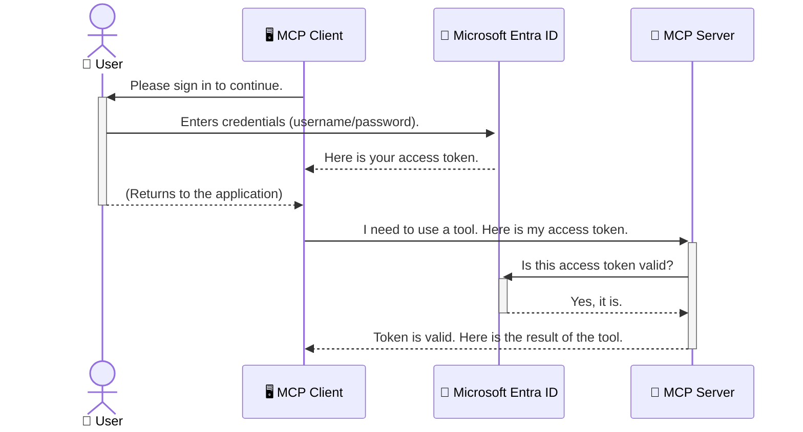

<!--
CO_OP_TRANSLATOR_METADATA:
{
  "original_hash": "6e562d7e5a77c8982da4aa8f762ad1d8",
  "translation_date": "2025-07-02T08:52:58+00:00",
  "source_file": "05-AdvancedTopics/mcp-security-entra/README.md",
  "language_code": "ru"
}
-->
# Защита AI-рабочих процессов: аутентификация Entra ID для серверов Model Context Protocol

## Введение  
Защита вашего сервера Model Context Protocol (MCP) так же важна, как и запирание входной двери вашего дома. Оставляя сервер MCP открытым, вы подвергаете свои инструменты и данные риску несанкционированного доступа, что может привести к нарушениям безопасности. Microsoft Entra ID предоставляет надежное облачное решение для управления идентификацией и доступом, помогая гарантировать, что только авторизованные пользователи и приложения могут взаимодействовать с вашим сервером MCP. В этом разделе вы узнаете, как защитить ваши AI-рабочие процессы с помощью аутентификации Entra ID.

## Цели обучения  
К концу этого раздела вы сможете:

- Понимать важность защиты серверов MCP.  
- Объяснять основы Microsoft Entra ID и аутентификации OAuth 2.0.  
- Различать публичных и конфиденциальных клиентов.  
- Реализовывать аутентификацию Entra ID как для локальных (публичный клиент), так и для удалённых (конфиденциальный клиент) серверов MCP.  
- Применять лучшие практики безопасности при разработке AI-рабочих процессов.

## Безопасность и MCP  

Так же, как вы не оставите входную дверь своего дома незапертой, не стоит оставлять сервер MCP открытым для любого. Защита AI-рабочих процессов необходима для создания надежных, заслуживающих доверия и безопасных приложений. В этой главе вы познакомитесь с использованием Microsoft Entra ID для защиты серверов MCP, чтобы гарантировать, что только авторизованные пользователи и приложения имеют доступ к вашим инструментам и данным.

## Почему безопасность важна для серверов MCP  

Представьте, что на вашем сервере MCP есть инструмент, который может отправлять электронные письма или получать доступ к базе данных клиентов. Незащищённый сервер позволит любому использовать этот инструмент, что приведет к несанкционированному доступу к данным, спаму или другим злонамеренным действиям.

Реализуя аутентификацию, вы обеспечиваете проверку каждого запроса к серверу, подтверждая личность пользователя или приложения, которые его отправляют. Это первый и самый важный шаг в обеспечении безопасности ваших AI-рабочих процессов.

## Введение в Microsoft Entra ID  

[**Microsoft Entra ID**](https://adoption.microsoft.com/microsoft-security/entra/) — это облачный сервис управления идентификацией и доступом. Представьте его как универсального охранника для ваших приложений. Он занимается сложным процессом проверки личности пользователей (аутентификация) и определением того, что им разрешено делать (авторизация).

Используя Entra ID, вы можете:

- Обеспечить безопасный вход пользователей.  
- Защитить API и сервисы.  
- Управлять политиками доступа из единого центра.

Для серверов MCP Entra ID предоставляет надежное и широко признанное решение для контроля того, кто может использовать возможности вашего сервера.

---

## Понимание магии: как работает аутентификация Entra ID  

Entra ID использует открытые стандарты, такие как **OAuth 2.0**, для управления аутентификацией. Хотя детали могут быть сложными, основная идея проста и легко объясняется на примере.

### Простое введение в OAuth 2.0: ключ для парковщика  

Подумайте об OAuth 2.0 как о сервисе парковщика для вашей машины. Когда вы приезжаете в ресторан, вы не отдаёте парковщику главный ключ. Вместо этого вы даёте ему **ключ парковщика**, который имеет ограниченные права — он может завести машину и закрыть двери, но не может открыть багажник или перчаточный ящик.

В этой аналогии:

- **Вы** — это **Пользователь**.  
- **Ваша машина** — это **сервер MCP** с его ценными инструментами и данными.  
- **Парковщик** — это **Microsoft Entra ID**.  
- **Служащий парковки** — это **MCP клиент** (приложение, пытающееся получить доступ к серверу).  
- **Ключ парковщика** — это **токен доступа**.

Токен доступа — это безопасная строка текста, которую MCP клиент получает от Entra ID после вашего входа. Клиент передаёт этот токен серверу MCP с каждым запросом. Сервер проверяет токен, чтобы убедиться, что запрос легитимен и клиент имеет необходимые права, при этом никогда не обрабатывая ваши реальные учетные данные (например, пароль).

### Процесс аутентификации  

Вот как это работает на практике:



### Знакомство с Microsoft Authentication Library (MSAL)  

Прежде чем перейти к коду, важно познакомиться с ключевым компонентом, который вы увидите в примерах: **Microsoft Authentication Library (MSAL)**.

MSAL — это библиотека от Microsoft, которая значительно упрощает разработчикам работу с аутентификацией. Вместо того, чтобы писать сложный код для обработки токенов безопасности, управления входами и обновления сессий, MSAL берет эти задачи на себя.

Использование библиотеки MSAL настоятельно рекомендуется, потому что:

- **Это безопасно:** реализует отраслевые стандарты и лучшие практики безопасности, снижая риск уязвимостей в вашем коде.  
- **Упрощает разработку:** скрывает сложность протоколов OAuth 2.0 и OpenID Connect, позволяя добавить надежную аутентификацию в приложение всего несколькими строками кода.  
- **Поддерживается:** Microsoft активно поддерживает и обновляет MSAL, чтобы учитывать новые угрозы безопасности и изменения платформ.

MSAL поддерживает множество языков и фреймворков, включая .NET, JavaScript/TypeScript, Python, Java, Go, а также мобильные платформы iOS и Android. Это позволяет использовать единые паттерны аутентификации во всём вашем технологическом стеке.

Подробнее о MSAL можно узнать в официальной [документации MSAL overview](https://learn.microsoft.com/entra/identity-platform/msal-overview).

---

## Защита вашего сервера MCP с помощью Entra ID: пошаговое руководство  

Теперь давайте рассмотрим, как защитить локальный сервер MCP (тот, что общается через `stdio`) using Entra ID. This example uses a **public client**, which is suitable for applications running on a user's machine, like a desktop app or a local development server.

### Scenario 1: Securing a Local MCP Server (with a Public Client)

In this scenario, we'll look at an MCP server that runs locally, communicates over `stdio`, and uses Entra ID to authenticate the user before allowing access to its tools. The server will have a single tool that fetches the user's profile information from the Microsoft Graph API.

#### 1. Setting Up the Application in Entra ID

Before writing any code, you need to register your application in Microsoft Entra ID. This tells Entra ID about your application and grants it permission to use the authentication service.

1. Navigate to the **[Microsoft Entra portal](https://entra.microsoft.com/)**.
2. Go to **App registrations** and click **New registration**.
3. Give your application a name (e.g., "My Local MCP Server").
4. For **Supported account types**, select **Accounts in this organizational directory only**.
5. You can leave the **Redirect URI** blank for this example.
6. Click **Register**.

Once registered, take note of the **Application (client) ID** and **Directory (tenant) ID**. You'll need these in your code.

#### 2. The Code: A Breakdown

Let's look at the key parts of the code that handle authentication. The full code for this example is available in the [Entra ID - Local - WAM](https://github.com/Azure-Samples/mcp-auth-servers/tree/main/src/entra-id-local-wam) folder of the [mcp-auth-servers GitHub repository](https://github.com/Azure-Samples/mcp-auth-servers).

**`AuthenticationService.cs`**

This class is responsible for handling the interaction with Entra ID.

- **`CreateAsync`**: This method initializes the `PublicClientApplication` from the MSAL (Microsoft Authentication Library). It's configured with your application's `clientId` and `tenantId`.
- **`WithBroker`**: This enables the use of a broker (like the Windows Web Account Manager), which provides a more secure and seamless single sign-on experience.
- **`AcquireTokenAsync`**: это основной метод. Он сначала пытается получить токен тихо (то есть пользователь не будет повторно входить, если у него уже есть действующая сессия). Если тихий токен получить не удаётся, будет запрошен интерактивный вход пользователя.

```csharp
// Simplified for clarity
public static async Task<AuthenticationService> CreateAsync(ILogger<AuthenticationService> logger)
{
    var msalClient = PublicClientApplicationBuilder
        .Create(_clientId) // Your Application (client) ID
        .WithAuthority(AadAuthorityAudience.AzureAdMyOrg)
        .WithTenantId(_tenantId) // Your Directory (tenant) ID
        .WithBroker(new BrokerOptions(BrokerOptions.OperatingSystems.Windows))
        .Build();

    // ... cache registration ...

    return new AuthenticationService(logger, msalClient);
}

public async Task<string> AcquireTokenAsync()
{
    try
    {
        // Try silent authentication first
        var accounts = await _msalClient.GetAccountsAsync();
        var account = accounts.FirstOrDefault();

        AuthenticationResult? result = null;

        if (account != null)
        {
            result = await _msalClient.AcquireTokenSilent(_scopes, account).ExecuteAsync();
        }
        else
        {
            // If no account, or silent fails, go interactive
            result = await _msalClient.AcquireTokenInteractive(_scopes).ExecuteAsync();
        }

        return result.AccessToken;
    }
    catch (Exception ex)
    {
        _logger.LogError(ex, "An error occurred while acquiring the token.");
        throw; // Optionally rethrow the exception for higher-level handling
    }
}
```

**`Program.cs`**

This is where the MCP server is set up and the authentication service is integrated.

- **`AddSingleton<AuthenticationService>`**: This registers the `AuthenticationService` with the dependency injection container, so it can be used by other parts of the application (like our tool).
- **`GetUserDetailsFromGraph` tool**: This tool requires an instance of `AuthenticationService`. Before it does anything, it calls `authService.AcquireTokenAsync()` получает действующий токен доступа. Если аутентификация успешна, с помощью токена вызывается Microsoft Graph API для получения данных пользователя.

```csharp
// Simplified for clarity
[McpServerTool(Name = "GetUserDetailsFromGraph")]
public static async Task<string> GetUserDetailsFromGraph(
    AuthenticationService authService)
{
    try
    {
        // This will trigger the authentication flow
        var accessToken = await authService.AcquireTokenAsync();

        // Use the token to create a GraphServiceClient
        var graphClient = new GraphServiceClient(
            new BaseBearerTokenAuthenticationProvider(new TokenProvider(authService)));

        var user = await graphClient.Me.GetAsync();

        return System.Text.Json.JsonSerializer.Serialize(user);
    }
    catch (Exception ex)
    {
        return $"Error: {ex.Message}";
    }
}
```

#### 3. Как всё работает вместе  

1. Когда MCP клиент вызывает `GetUserDetailsFromGraph` tool, the tool first calls `AcquireTokenAsync`.
2. `AcquireTokenAsync` triggers the MSAL library to check for a valid token.
3. If no token is found, MSAL, through the broker, will prompt the user to sign in with their Entra ID account.
4. Once the user signs in, Entra ID issues an access token.
5. The tool receives the token and uses it to make a secure call to the Microsoft Graph API.
6. The user's details are returned to the MCP client.

This process ensures that only authenticated users can use the tool, effectively securing your local MCP server.

### Scenario 2: Securing a Remote MCP Server (with a Confidential Client)

When your MCP server is running on a remote machine (like a cloud server) and communicates over a protocol like HTTP Streaming, the security requirements are different. In this case, you should use a **confidential client** and the **Authorization Code Flow**. This is a more secure method because the application's secrets are never exposed to the browser.

This example uses a TypeScript-based MCP server that uses Express.js to handle HTTP requests.

#### 1. Setting Up the Application in Entra ID

The setup in Entra ID is similar to the public client, but with one key difference: you need to create a **client secret**.

1. Navigate to the **[Microsoft Entra portal](https://entra.microsoft.com/)**.
2. In your app registration, go to the **Certificates & secrets** tab.
3. Click **New client secret**, give it a description, and click **Add**.
4. **Important:** Copy the secret value immediately. You will not be able to see it again.
5. You also need to configure a **Redirect URI**. Go to the **Authentication** tab, click **Add a platform**, select **Web**, and enter the redirect URI for your application (e.g., `http://localhost:3001/auth/callback`).

> **⚠️ Important Security Note:** For production applications, Microsoft strongly recommends using **secretless authentication** methods such as **Managed Identity** or **Workload Identity Federation** instead of client secrets. Client secrets pose security risks as they can be exposed or compromised. Managed identities provide a more secure approach by eliminating the need to store credentials in your code or configuration.
>
> For more information about managed identities and how to implement them, see the [Managed identities for Azure resources overview](https://learn.microsoft.com/entra/identity/managed-identities-azure-resources/overview).

#### 2. The Code: A Breakdown

This example uses a session-based approach. When the user authenticates, the server stores the access token and refresh token in a session and gives the user a session token. This session token is then used for subsequent requests. The full code for this example is available in the [Entra ID - Confidential client](https://github.com/Azure-Samples/mcp-auth-servers/tree/main/src/entra-id-cca-session) folder of the [mcp-auth-servers GitHub repository](https://github.com/Azure-Samples/mcp-auth-servers).

**`Server.ts`**

This file sets up the Express server and the MCP transport layer.

- **`requireBearerAuth`**: This is middleware that protects the `/sse` and `/message` endpoints. It checks for a valid bearer token in the `Authorization` header of the request.
- **`EntraIdServerAuthProvider`**: This is a custom class that implements the `McpServerAuthorizationProvider` interface. It's responsible for handling the OAuth 2.0 flow.
- **`/auth/callback`**: этот эндпоинт обрабатывает редирект от Entra ID после аутентификации пользователя. Он меняет код авторизации на токен доступа и токен обновления.

```typescript
// Simplified for clarity
const app = express();
const { server } = createServer();
const provider = new EntraIdServerAuthProvider();

// Protect the SSE endpoint
app.get("/sse", requireBearerAuth({
  provider,
  requiredScopes: ["User.Read"]
}), async (req, res) => {
  // ... connect to the transport ...
});

// Protect the message endpoint
app.post("/message", requireBearerAuth({
  provider,
  requiredScopes: ["User.Read"]
}), async (req, res) => {
  // ... handle the message ...
});

// Handle the OAuth 2.0 callback
app.get("/auth/callback", (req, res) => {
  provider.handleCallback(req.query.code, req.query.state)
    .then(result => {
      // ... handle success or failure ...
    });
});
```

**`Tools.ts`**

This file defines the tools that the MCP server provides. The `getUserDetails` — инструмент, аналогичный предыдущему примеру, но получает токен доступа из сессии.

```typescript
// Simplified for clarity
server.setRequestHandler(CallToolRequestSchema, async (request) => {
  const { name } = request.params;
  const context = request.params?.context as { token?: string } | undefined;
  const sessionToken = context?.token;

  if (name === ToolName.GET_USER_DETAILS) {
    if (!sessionToken) {
      throw new AuthenticationError("Authentication token is missing or invalid. Ensure the token is provided in the request context.");
    }

    // Get the Entra ID token from the session store
    const tokenData = tokenStore.getToken(sessionToken);
    const entraIdToken = tokenData.accessToken;

    const graphClient = Client.init({
      authProvider: (done) => {
        done(null, entraIdToken);
      }
    });

    const user = await graphClient.api('/me').get();

    // ... return user details ...
  }
});
```

**`auth/EntraIdServerAuthProvider.ts`**

This class handles the logic for:

- Redirecting the user to the Entra ID sign-in page.
- Exchanging the authorization code for an access token.
- Storing the tokens in the `tokenStore`.
- Refreshing the access token when it expires.

#### 3. How It All Works Together

1. When a user first tries to connect to the MCP server, the `requireBearerAuth` middleware will see that they don't have a valid session and will redirect them to the Entra ID sign-in page.
2. The user signs in with their Entra ID account.
3. Entra ID redirects the user back to the `/auth/callback` endpoint with an authorization code.
4. The server exchanges the code for an access token and a refresh token, stores them, and creates a session token which is sent to the client.
5. The client can now use this session token in the `Authorization` header for all future requests to the MCP server.
6. When the `getUserDetails` при вызове использует сессионный токен для поиска токена доступа Entra ID, а затем с его помощью вызывает Microsoft Graph API.

Этот поток сложнее, чем у публичного клиента, но необходим для интернет-доступных эндпоинтов. Поскольку удалённые серверы MCP доступны через публичный интернет, им требуются более строгие меры безопасности для защиты от несанкционированного доступа и возможных атак.

## Лучшие практики безопасности  

- **Всегда используйте HTTPS:** шифруйте связь между клиентом и сервером, чтобы защитить токены от перехвата.  
- **Реализуйте контроль доступа на основе ролей (RBAC):** проверяйте не только факт аутентификации пользователя, но и его права. В Entra ID можно определить роли и проверять их на сервере MCP.  
- **Мониторинг и аудит:** ведите журнал всех событий аутентификации для выявления и реагирования на подозрительную активность.  
- **Обработка ограничений по количеству запросов:** Microsoft Graph и другие API вводят лимиты, чтобы предотвратить злоупотребления. Реализуйте экспоненциальное ожидание и логику повторных попыток в вашем сервере MCP для корректной обработки ответов HTTP 429 (слишком много запросов). Рассмотрите возможность кеширования часто запрашиваемых данных для снижения количества вызовов API.  
- **Безопасное хранение токенов:** храните токены доступа и обновления надежно. Для локальных приложений используйте системные механизмы безопасного хранения. Для серверных приложений рассмотрите использование зашифрованного хранилища или сервисов управления ключами, например Azure Key Vault.  
- **Обработка истечения срока действия токенов:** токены доступа имеют ограниченный срок действия. Реализуйте автоматическое обновление токенов с помощью токенов обновления для бесшовного пользовательского опыта без необходимости повторной аутентификации.  
- **Рассмотрите использование Azure API Management:** хотя реализация безопасности непосредственно на сервере MCP даёт точный контроль, API-шлюзы, такие как Azure API Management, могут автоматически решать многие задачи безопасности — аутентификацию, авторизацию, ограничение количества запросов и мониторинг. Они обеспечивают централизованный уровень безопасности между клиентами и серверами MCP. Подробнее о использовании API-шлюзов с MCP смотрите в статье [Azure API Management Your Auth Gateway For MCP Servers](https://techcommunity.microsoft.com/blog/integrationsonazureblog/azure-api-management-your-auth-gateway-for-mcp-servers/4402690).

## Основные выводы  

- Защита сервера MCP критична для безопасности ваших данных и инструментов.  
- Microsoft Entra ID предлагает надежное и масштабируемое решение для аутентификации и авторизации.  
- Используйте **публичного клиента** для локальных приложений и **конфиденциального клиента** для удалённых серверов.  
- **Authorization Code Flow** — самый безопасный вариант для веб-приложений.

## Задание  

1. Подумайте о сервере MCP, который вы могли бы создать. Будет ли он локальным или удалённым?  
2. Исходя из ответа, какой тип клиента вы бы использовали — публичный или конфиденциальный?  
3. Какие разрешения ваш сервер MCP запросит для работы с Microsoft Graph?

## Практические упражнения  

### Упражнение 1: Регистрация приложения в Entra ID  
Перейдите в портал Microsoft Entra.  
Зарегистрируйте новое приложение для вашего сервера MCP.  
Запишите Application (client) ID и Directory (tenant) ID.

### Упражнение 2: Защита локального сервера MCP (публичный клиент)  
- Следуйте примеру кода для интеграции MSAL (Microsoft Authentication Library) для аутентификации пользователей.  
- Проверьте процесс аутентификации, вызвав инструмент MCP, который получает данные пользователя из Microsoft Graph.

### Упражнение 3: Защита удалённого сервера MCP (конфиденциальный клиент)  
- Зарегистрируйте конфиденциального клиента в Entra ID и создайте секрет клиента.  
- Настройте ваш Express.js сервер MCP для использования Authorization Code Flow.  
- Проверьте защищённые эндпоинты и подтвердите доступ по токену.

### Упражнение 4: Применение лучших практик безопасности  
- Включите HTTPS для вашего локального или удалённого сервера.  
- Реализуйте контроль доступа на основе ролей (RBAC) в логике сервера.  
- Добавьте обработку истечения срока действия токенов и безопасное хранение токенов.

## Ресурсы  

1. **Документация по MSAL**  
   Узнайте, как Microsoft Authentication Library (MSAL) обеспечивает безопасное получение токенов на разных платформах:  
   [MSAL Overview на Microsoft Learn](https://learn.microsoft.com/en-gb/entra/msal/overview)

2. **GitHub репозиторий Azure-Samples/mcp-auth-servers**  
   Примеры реализации серверов MCP с демонстрацией потоков аутентификации:  
   [Azure-Samples/mcp-auth-servers на GitHub](https://github.com/Azure-Samples/mcp-auth-servers)

3. **Обзор управляемых идентичностей для ресурсов Azure**  
   Поймите, как избавиться от секретов, используя системные или назначенные пользователем управляемые идентичности:  
   [Managed Identities Overview на Microsoft Learn](https://learn.microsoft.com/en-us/entra/identity/managed-identities-azure-resources/)

4. **Azure API Management: ваш шлюз аутентификации для серверов MCP**  
   Подробный разбор использования APIM как безопасного шлюза OAuth2 для серверов MCP:  
   [Azure API Management Your Auth Gateway For MCP Servers](https://techcommunity.microsoft.com/blog/integrationsonazureblog/azure-api-management-your-auth-gateway-for-mcp-servers/4402690)

5. **Справочник разрешений Microsoft Graph**  
   Полный список делегированных и прикладных разрешений для Microsoft Graph:  
   [Microsoft Graph Permissions Reference](https://learn.microsoft.com/zh-tw/graph/permissions-reference)

## Результаты обучения  
После прохождения этого раздела вы сможете:

- Объяснить, почему аутентификация критична для серверов MCP и AI-рабочих процессов.  
- Настроить и сконфигурировать аутентификацию Entra ID для локальных и удалённых серверов MCP.  
- Выбирать подходящий тип клиента (публичный или конфиденциальный) в зависимости от развертывания сервера.  
- Реализовывать безопасные методы программирования, включая хранение токенов и авторизацию на основе ролей.  
- Уверенно защищать сервер MCP и его инструменты от несанкционированного доступа.

## Что дальше  

- [5.13 Интеграция Model Context Protocol (MCP) с Azure AI Foundry](../mcp-foundry-agent-integration/README.md)

**Отказ от ответственности**:  
Этот документ был переведен с помощью сервиса автоматического перевода [Co-op Translator](https://github.com/Azure/co-op-translator). Несмотря на наши усилия по обеспечению точности, просим учитывать, что автоматический перевод может содержать ошибки или неточности. Оригинальный документ на его исходном языке следует считать авторитетным источником. Для получения критически важной информации рекомендуется профессиональный перевод человеком. Мы не несем ответственности за любые недоразумения или неправильные толкования, возникшие в результате использования данного перевода.