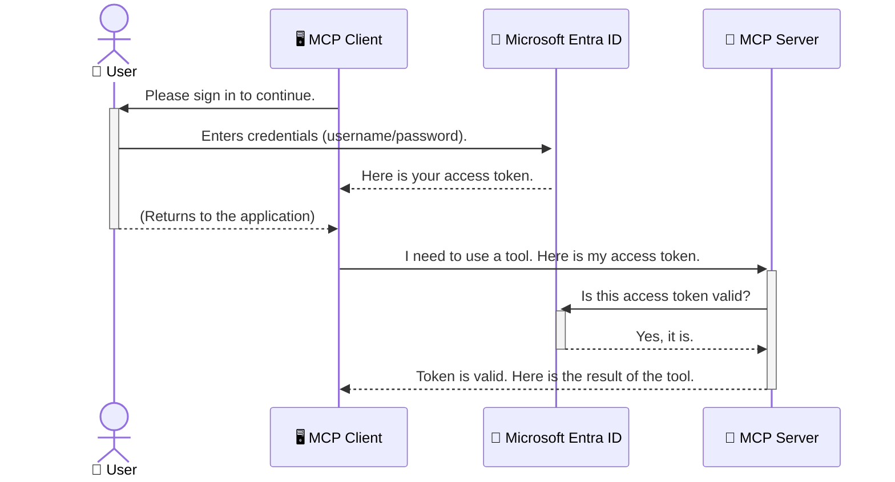

<!--
CO_OP_TRANSLATOR_METADATA:
{
  "original_hash": "6e562d7e5a77c8982da4aa8f762ad1d8",
  "translation_date": "2025-07-14T02:48:17+00:00",
  "source_file": "05-AdvancedTopics/mcp-security-entra/README.md",
  "language_code": "ru"
}
-->
# Защита AI-рабочих процессов: Аутентификация Entra ID для серверов Model Context Protocol

## Введение
Защита вашего сервера Model Context Protocol (MCP) так же важна, как и запирать входную дверь в доме. Оставляя сервер MCP открытым, вы подвергаете свои инструменты и данные риску несанкционированного доступа, что может привести к нарушениям безопасности. Microsoft Entra ID предлагает надежное облачное решение для управления идентификацией и доступом, обеспечивая взаимодействие с вашим сервером MCP только авторизованных пользователей и приложений. В этом разделе вы узнаете, как защитить свои AI-рабочие процессы с помощью аутентификации Entra ID.

## Цели обучения
К концу этого раздела вы сможете:

- Понимать важность защиты серверов MCP.
- Объяснять основы Microsoft Entra ID и аутентификации OAuth 2.0.
- Различать публичных и конфиденциальных клиентов.
- Реализовывать аутентификацию Entra ID как для локальных (публичный клиент), так и для удалённых (конфиденциальный клиент) серверов MCP.
- Применять лучшие практики безопасности при разработке AI-рабочих процессов.

## Безопасность и MCP

Так же, как вы не оставите входную дверь дома незапертой, нельзя оставлять сервер MCP открытым для всех. Защита AI-рабочих процессов необходима для создания надежных, заслуживающих доверия и безопасных приложений. В этой главе вы познакомитесь с использованием Microsoft Entra ID для защиты серверов MCP, чтобы только авторизованные пользователи и приложения могли взаимодействовать с вашими инструментами и данными.

## Почему безопасность важна для серверов MCP

Представьте, что ваш сервер MCP имеет инструмент, который может отправлять электронные письма или получать доступ к базе данных клиентов. Если сервер не защищён, любой сможет использовать этот инструмент, что приведёт к несанкционированному доступу к данным, спаму или другим вредоносным действиям.

Реализуя аутентификацию, вы гарантируете, что каждый запрос к серверу проверяется, подтверждая личность пользователя или приложения, делающего запрос. Это первый и самый важный шаг в обеспечении безопасности ваших AI-рабочих процессов.

## Введение в Microsoft Entra ID

[**Microsoft Entra ID**](https://adoption.microsoft.com/microsoft-security/entra/) — это облачный сервис управления идентификацией и доступом. Представьте его как универсального охранника для ваших приложений. Он обрабатывает сложный процесс проверки личности пользователя (аутентификация) и определяет, что ему разрешено делать (авторизация).

Используя Entra ID, вы можете:

- Обеспечить безопасный вход пользователей.
- Защитить API и сервисы.
- Управлять политиками доступа из единого центра.

Для серверов MCP Entra ID предоставляет надежное и широко признанное решение для управления доступом к возможностям вашего сервера.

---

## Понимание механизма: как работает аутентификация Entra ID

Entra ID использует открытые стандарты, такие как **OAuth 2.0**, для обработки аутентификации. Хотя детали могут быть сложными, основная идея проста и легко объясняется на примере.

### Простое введение в OAuth 2.0: ключ для парковщика

Представьте OAuth 2.0 как услугу парковщика для вашей машины. Когда вы приезжаете в ресторан, вы не отдаёте парковщику главный ключ. Вместо этого вы даёте ему **ключ парковщика** с ограниченными правами — он может завести машину и закрыть двери, но не может открыть багажник или бардачок.

В этой аналогии:

- **Вы** — это **Пользователь**.
- **Ваша машина** — это **сервер MCP** с ценными инструментами и данными.
- **Парковщик** — это **Microsoft Entra ID**.
- **Служащий парковки** — это **MCP клиент** (приложение, пытающееся получить доступ к серверу).
- **Ключ парковщика** — это **токен доступа**.

Токен доступа — это защищённая строка, которую MCP клиент получает от Entra ID после вашего входа в систему. Клиент передаёт этот токен серверу MCP с каждым запросом. Сервер проверяет токен, чтобы убедиться, что запрос легитимен и клиент имеет необходимые права, при этом не требуя ваших реальных учетных данных (например, пароля).

### Процесс аутентификации

Вот как это работает на практике:



### Знакомство с Microsoft Authentication Library (MSAL)

Прежде чем перейти к коду, важно познакомиться с ключевым компонентом, который вы увидите в примерах: **Microsoft Authentication Library (MSAL)**.

MSAL — это библиотека от Microsoft, которая значительно упрощает разработчикам работу с аутентификацией. Вместо того чтобы писать сложный код для обработки токенов безопасности, управления входами и обновления сессий, MSAL берет на себя всю основную работу.

Использование MSAL настоятельно рекомендуется, потому что:

- **Это безопасно:** библиотека реализует стандарты отрасли и лучшие практики безопасности, снижая риск уязвимостей в вашем коде.
- **Упрощает разработку:** скрывает сложность протоколов OAuth 2.0 и OpenID Connect, позволяя добавить надежную аутентификацию всего несколькими строками кода.
- **Поддерживается:** Microsoft активно обновляет MSAL, чтобы противостоять новым угрозам безопасности и изменениям платформ.

MSAL поддерживает множество языков и фреймворков, включая .NET, JavaScript/TypeScript, Python, Java, Go, а также мобильные платформы iOS и Android. Это позволяет использовать единые паттерны аутентификации во всём вашем технологическом стеке.

Подробнее о MSAL можно узнать в официальной [документации по MSAL](https://learn.microsoft.com/entra/identity-platform/msal-overview).

---

## Защита вашего MCP сервера с помощью Entra ID: пошаговое руководство

Теперь рассмотрим, как защитить локальный MCP сервер (который общается через `stdio`) с помощью Entra ID. В этом примере используется **публичный клиент**, подходящий для приложений, работающих на компьютере пользователя, например, настольных приложений или локальных серверов разработки.

### Сценарий 1: Защита локального MCP сервера (с публичным клиентом)

В этом сценарии мы рассмотрим MCP сервер, работающий локально, который общается через `stdio` и использует Entra ID для аутентификации пользователя перед предоставлением доступа к инструментам. Сервер будет иметь один инструмент, который получает информацию профиля пользователя из Microsoft Graph API.

#### 1. Регистрация приложения в Entra ID

Перед написанием кода необходимо зарегистрировать приложение в Microsoft Entra ID. Это сообщает Entra ID о вашем приложении и даёт ему разрешение использовать сервис аутентификации.

1. Перейдите в **[портал Microsoft Entra](https://entra.microsoft.com/)**.
2. Откройте раздел **App registrations** и нажмите **New registration**.
3. Укажите имя приложения (например, "My Local MCP Server").
4. В разделе **Supported account types** выберите **Accounts in this organizational directory only**.
5. Для этого примера поле **Redirect URI** можно оставить пустым.
6. Нажмите **Register**.

После регистрации запишите **Application (client) ID** и **Directory (tenant) ID** — они понадобятся в коде.

#### 2. Разбор кода

Рассмотрим ключевые части кода, отвечающие за аутентификацию. Полный код примера доступен в папке [Entra ID - Local - WAM](https://github.com/Azure-Samples/mcp-auth-servers/tree/main/src/entra-id-local-wam) репозитория [mcp-auth-servers GitHub](https://github.com/Azure-Samples/mcp-auth-servers).

**`AuthenticationService.cs`**

Этот класс отвечает за взаимодействие с Entra ID.

- **`CreateAsync`**: инициализирует `PublicClientApplication` из MSAL, настроенный с `clientId` и `tenantId` вашего приложения.
- **`WithBroker`**: включает использование брокера (например, Windows Web Account Manager), обеспечивающего более безопасный и удобный вход в систему.
- **`AcquireTokenAsync`**: основной метод. Сначала пытается получить токен без взаимодействия с пользователем (если сессия ещё действительна). Если это не удаётся, запрашивает интерактивный вход пользователя.

```csharp
// Simplified for clarity
public static async Task<AuthenticationService> CreateAsync(ILogger<AuthenticationService> logger)
{
    var msalClient = PublicClientApplicationBuilder
        .Create(_clientId) // Your Application (client) ID
        .WithAuthority(AadAuthorityAudience.AzureAdMyOrg)
        .WithTenantId(_tenantId) // Your Directory (tenant) ID
        .WithBroker(new BrokerOptions(BrokerOptions.OperatingSystems.Windows))
        .Build();

    // ... cache registration ...

    return new AuthenticationService(logger, msalClient);
}

public async Task<string> AcquireTokenAsync()
{
    try
    {
        // Try silent authentication first
        var accounts = await _msalClient.GetAccountsAsync();
        var account = accounts.FirstOrDefault();

        AuthenticationResult? result = null;

        if (account != null)
        {
            result = await _msalClient.AcquireTokenSilent(_scopes, account).ExecuteAsync();
        }
        else
        {
            // If no account, or silent fails, go interactive
            result = await _msalClient.AcquireTokenInteractive(_scopes).ExecuteAsync();
        }

        return result.AccessToken;
    }
    catch (Exception ex)
    {
        _logger.LogError(ex, "An error occurred while acquiring the token.");
        throw; // Optionally rethrow the exception for higher-level handling
    }
}
```

**`Program.cs`**

Здесь настраивается сервер MCP и интегрируется сервис аутентификации.

- **`AddSingleton<AuthenticationService>`**: регистрирует `AuthenticationService` в контейнере зависимостей, чтобы другие части приложения (например, инструмент) могли его использовать.
- Инструмент **`GetUserDetailsFromGraph`** требует экземпляр `AuthenticationService`. Перед выполнением он вызывает `authService.AcquireTokenAsync()`, чтобы получить действительный токен доступа. Если аутентификация успешна, токен используется для вызова Microsoft Graph API и получения данных пользователя.

```csharp
// Simplified for clarity
[McpServerTool(Name = "GetUserDetailsFromGraph")]
public static async Task<string> GetUserDetailsFromGraph(
    AuthenticationService authService)
{
    try
    {
        // This will trigger the authentication flow
        var accessToken = await authService.AcquireTokenAsync();

        // Use the token to create a GraphServiceClient
        var graphClient = new GraphServiceClient(
            new BaseBearerTokenAuthenticationProvider(new TokenProvider(authService)));

        var user = await graphClient.Me.GetAsync();

        return System.Text.Json.JsonSerializer.Serialize(user);
    }
    catch (Exception ex)
    {
        return $"Error: {ex.Message}";
    }
}
```

#### 3. Как всё работает вместе

1. Когда MCP клиент пытается использовать инструмент `GetUserDetailsFromGraph`, инструмент сначала вызывает `AcquireTokenAsync`.
2. `AcquireTokenAsync` инициирует проверку наличия действительного токена через библиотеку MSAL.
3. Если токен отсутствует, MSAL через брокер запрашивает у пользователя вход в систему с помощью аккаунта Entra ID.
4. После входа Entra ID выдаёт токен доступа.
5. Инструмент получает токен и использует его для безопасного вызова Microsoft Graph API.
6. Данные пользователя возвращаются MCP клиенту.

Этот процесс гарантирует, что только аутентифицированные пользователи могут использовать инструмент, эффективно защищая ваш локальный MCP сервер.

### Сценарий 2: Защита удалённого MCP сервера (с конфиденциальным клиентом)

Если ваш MCP сервер работает на удалённой машине (например, в облаке) и общается по протоколу HTTP Streaming, требования к безопасности отличаются. В этом случае следует использовать **конфиденциального клиента** и **Authorization Code Flow**. Этот метод более безопасен, так как секреты приложения никогда не передаются браузеру.

В этом примере используется MCP сервер на TypeScript с Express.js для обработки HTTP-запросов.

#### 1. Регистрация приложения в Entra ID

Настройка в Entra ID похожа на публичного клиента, но с одним важным отличием — необходимо создать **секрет клиента**.

1. Перейдите в **[портал Microsoft Entra](https://entra.microsoft.com/)**.
2. В регистрации вашего приложения откройте вкладку **Certificates & secrets**.
3. Нажмите **New client secret**, укажите описание и нажмите **Add**.
4. **Важно:** сразу скопируйте значение секрета. Позже его нельзя будет увидеть.
5. Также нужно настроить **Redirect URI**. Перейдите во вкладку **Authentication**, нажмите **Add a platform**, выберите **Web** и укажите redirect URI вашего приложения (например, `http://localhost:3001/auth/callback`).

> **⚠️ Важное замечание по безопасности:** Для производственных приложений Microsoft настоятельно рекомендует использовать методы аутентификации без секретов, такие как **Managed Identity** или **Workload Identity Federation**, вместо клиентских секретов. Секреты клиента могут быть скомпрометированы или раскрыты. Управляемые идентичности обеспечивают более безопасный подход, исключая необходимость хранить учетные данные в коде или конфигурации.
>
> Подробнее о управляемых идентичностях и их внедрении смотрите в разделе [Обзор управляемых идентичностей для ресурсов Azure](https://learn.microsoft.com/entra/identity/managed-identities-azure-resources/overview).

#### 2. Разбор кода

В этом примере используется сессионный подход. При аутентификации пользователя сервер сохраняет токен доступа и токен обновления в сессии и выдаёт пользователю токен сессии. Этот токен используется для последующих запросов. Полный код доступен в папке [Entra ID - Confidential client](https://github.com/Azure-Samples/mcp-auth-servers/tree/main/src/entra-id-cca-session) репозитория [mcp-auth-servers GitHub](https://github.com/Azure-Samples/mcp-auth-servers).

**`Server.ts`**

Этот файл настраивает сервер Express и транспортный слой MCP.

- **`requireBearerAuth`**: middleware, защищающий эндпоинты `/sse` и `/message`. Проверяет наличие действительного токена Bearer в заголовке `Authorization` запроса.
- **`EntraIdServerAuthProvider`**: кастомный класс, реализующий интерфейс `McpServerAuthorizationProvider`. Отвечает за обработку OAuth 2.0 потока.
- **`/auth/callback`**: эндпоинт, обрабатывающий редирект от Entra ID после аутентификации пользователя. Обменивает код авторизации на токен доступа и токен обновления.

```typescript
// Simplified for clarity
const app = express();
const { server } = createServer();
const provider = new EntraIdServerAuthProvider();

// Protect the SSE endpoint
app.get("/sse", requireBearerAuth({
  provider,
  requiredScopes: ["User.Read"]
}), async (req, res) => {
  // ... connect to the transport ...
});

// Protect the message endpoint
app.post("/message", requireBearerAuth({
  provider,
  requiredScopes: ["User.Read"]
}), async (req, res) => {
  // ... handle the message ...
});

// Handle the OAuth 2.0 callback
app.get("/auth/callback", (req, res) => {
  provider.handleCallback(req.query.code, req.query.state)
    .then(result => {
      // ... handle success or failure ...
    });
});
```

**`Tools.ts`**

В этом файле определены инструменты, предоставляемые сервером MCP. Инструмент `getUserDetails` похож на предыдущий, но получает токен доступа из сессии.

```typescript
// Simplified for clarity
server.setRequestHandler(CallToolRequestSchema, async (request) => {
  const { name } = request.params;
  const context = request.params?.context as { token?: string } | undefined;
  const sessionToken = context?.token;

  if (name === ToolName.GET_USER_DETAILS) {
    if (!sessionToken) {
      throw new AuthenticationError("Authentication token is missing or invalid. Ensure the token is provided in the request context.");
    }

    // Get the Entra ID token from the session store
    const tokenData = tokenStore.getToken(sessionToken);
    const entraIdToken = tokenData.accessToken;

    const graphClient = Client.init({
      authProvider: (done) => {
        done(null, entraIdToken);
      }
    });

    const user = await graphClient.api('/me').get();

    // ... return user details ...
  }
});
```

**`auth/EntraIdServerAuthProvider.ts`**

Этот класс отвечает за:

- Перенаправление пользователя на страницу входа Entra ID.
- Обмен кода авторизации на токен доступа.
- Сохранение токенов в `tokenStore`.
- Обновление токена доступа при его истечении.

#### 3. Как всё работает вместе

1. Когда пользователь впервые пытается подключиться к серверу MCP, middleware `requireBearerAuth` видит, что у него нет действительной сессии, и перенаправляет на страницу входа Entra ID.
2. Пользователь входит в систему с помощью своей учётной записи Entra ID.
3. Entra ID перенаправляет пользователя обратно на эндпоинт `/auth/callback` с кодом авторизации.
4. Сервер обменивает код на access token и refresh token, сохраняет их и создает session token, который отправляется клиенту.  
5. Клиент теперь может использовать этот session token в заголовке `Authorization` для всех последующих запросов к серверу MCP.  
6. При вызове инструмента `getUserDetails` используется session token для получения access token Entra ID, который затем применяется для вызова Microsoft Graph API.

Этот процесс сложнее, чем поток для публичного клиента, но необходим для конечных точек, доступных из интернета. Поскольку удалённые серверы MCP доступны через публичный интернет, им требуются более строгие меры безопасности для защиты от несанкционированного доступа и возможных атак.


## Лучшие практики безопасности

- **Всегда используйте HTTPS**: Шифруйте связь между клиентом и сервером, чтобы защитить токены от перехвата.  
- **Реализуйте контроль доступа на основе ролей (RBAC)**: Проверяйте не только *аутентификацию* пользователя, но и *его права*. Вы можете определить роли в Entra ID и проверять их на сервере MCP.  
- **Мониторинг и аудит**: Логируйте все события аутентификации, чтобы своевременно обнаруживать и реагировать на подозрительную активность.  
- **Обработка ограничения частоты запросов и троттлинга**: Microsoft Graph и другие API применяют ограничение частоты запросов для предотвращения злоупотреблений. Реализуйте экспоненциальное увеличение задержки и логику повторных попыток в вашем сервере MCP для корректной обработки ответов HTTP 429 (Too Many Requests). Рассмотрите возможность кэширования часто запрашиваемых данных для снижения количества вызовов API.  
- **Безопасное хранение токенов**: Храните access token и refresh token надежно. Для локальных приложений используйте встроенные механизмы безопасного хранения системы. Для серверных приложений рассмотрите использование зашифрованного хранилища или сервисов управления ключами, таких как Azure Key Vault.  
- **Обработка истечения срока действия токенов**: Access token имеют ограниченный срок действия. Реализуйте автоматическое обновление токенов с помощью refresh token, чтобы обеспечить бесшовный пользовательский опыт без необходимости повторной аутентификации.  
- **Рассмотрите использование Azure API Management**: Хотя реализация безопасности непосредственно в вашем сервере MCP дает тонкий контроль, API-шлюзы, такие как Azure API Management, могут автоматически решать многие задачи безопасности, включая аутентификацию, авторизацию, ограничение частоты запросов и мониторинг. Они обеспечивают централизованный уровень безопасности между клиентами и серверами MCP. Подробнее о работе с API-шлюзами для MCP смотрите в нашем [Azure API Management Your Auth Gateway For MCP Servers](https://techcommunity.microsoft.com/blog/integrationsonazureblog/azure-api-management-your-auth-gateway-for-mcp-servers/4402690).


## Основные выводы

- Защита вашего сервера MCP критически важна для безопасности данных и инструментов.  
- Microsoft Entra ID предоставляет надежное и масштабируемое решение для аутентификации и авторизации.  
- Используйте **публичного клиента** для локальных приложений и **конфиденциального клиента** для удалённых серверов.  
- **Authorization Code Flow** — самый безопасный вариант для веб-приложений.


## Упражнение

1. Подумайте о сервере MCP, который вы могли бы создать. Будет ли он локальным или удалённым?  
2. Исходя из ответа, какой тип клиента вы бы использовали — публичный или конфиденциальный?  
3. Какие разрешения ваш сервер MCP запросит для выполнения действий через Microsoft Graph?


## Практические упражнения

### Упражнение 1: Регистрация приложения в Entra ID  
Перейдите в портал Microsoft Entra.  
Зарегистрируйте новое приложение для вашего сервера MCP.  
Запишите Application (client) ID и Directory (tenant) ID.

### Упражнение 2: Защита локального сервера MCP (публичный клиент)  
- Следуйте примеру кода для интеграции MSAL (Microsoft Authentication Library) для аутентификации пользователя.  
- Проверьте поток аутентификации, вызвав инструмент MCP, который получает данные пользователя из Microsoft Graph.

### Упражнение 3: Защита удалённого сервера MCP (конфиденциальный клиент)  
- Зарегистрируйте конфиденциального клиента в Entra ID и создайте client secret.  
- Настройте ваш сервер MCP на Express.js для использования Authorization Code Flow.  
- Проверьте защищённые конечные точки и подтвердите доступ по токену.

### Упражнение 4: Применение лучших практик безопасности  
- Включите HTTPS для локального или удалённого сервера.  
- Реализуйте контроль доступа на основе ролей (RBAC) в логике сервера.  
- Добавьте обработку истечения срока действия токенов и безопасное хранение токенов.

## Ресурсы

1. **Документация по MSAL**  
   Узнайте, как Microsoft Authentication Library (MSAL) обеспечивает безопасное получение токенов на разных платформах:  
   [MSAL Overview on Microsoft Learn](https://learn.microsoft.com/en-gb/entra/msal/overview)

2. **GitHub репозиторий Azure-Samples/mcp-auth-servers**  
   Примеры реализации серверов MCP с демонстрацией потоков аутентификации:  
   [Azure-Samples/mcp-auth-servers on GitHub](https://github.com/Azure-Samples/mcp-auth-servers)

3. **Обзор управляемых идентичностей для ресурсов Azure**  
   Узнайте, как избавиться от секретов, используя системные или пользовательские управляемые идентичности:  
   [Managed Identities Overview on Microsoft Learn](https://learn.microsoft.com/en-us/entra/identity/managed-identities-azure-resources/)

4. **Azure API Management: ваш шлюз аутентификации для серверов MCP**  
   Подробный разбор использования APIM как безопасного шлюза OAuth2 для серверов MCP:  
   [Azure API Management Your Auth Gateway For MCP Servers](https://techcommunity.microsoft.com/blog/integrationsonazureblog/azure-api-management-your-auth-gateway-for-mcp-servers/4402690)

5. **Справочник разрешений Microsoft Graph**  
   Полный список делегированных и прикладных разрешений для Microsoft Graph:  
   [Microsoft Graph Permissions Reference](https://learn.microsoft.com/zh-tw/graph/permissions-reference)


## Результаты обучения  
После изучения этого раздела вы сможете:

- Объяснить, почему аутентификация важна для серверов MCP и AI-рабочих процессов.  
- Настроить и сконфигурировать аутентификацию Entra ID для локальных и удалённых серверов MCP.  
- Выбрать подходящий тип клиента (публичный или конфиденциальный) в зависимости от развертывания сервера.  
- Реализовать безопасные практики программирования, включая хранение токенов и авторизацию на основе ролей.  
- Надежно защитить ваш сервер MCP и его инструменты от несанкционированного доступа.

## Что дальше

- [5.13 Интеграция Model Context Protocol (MCP) с Azure AI Foundry](../mcp-foundry-agent-integration/README.md)

**Отказ от ответственности**:  
Этот документ был переведен с помощью сервиса автоматического перевода [Co-op Translator](https://github.com/Azure/co-op-translator). Несмотря на наши усилия по обеспечению точности, просим учитывать, что автоматический перевод может содержать ошибки или неточности. Оригинальный документ на его исходном языке следует считать авторитетным источником. Для получения критически важной информации рекомендуется обращаться к профессиональному переводу, выполненному человеком. Мы не несем ответственности за любые недоразумения или неправильные толкования, возникшие в результате использования данного перевода.