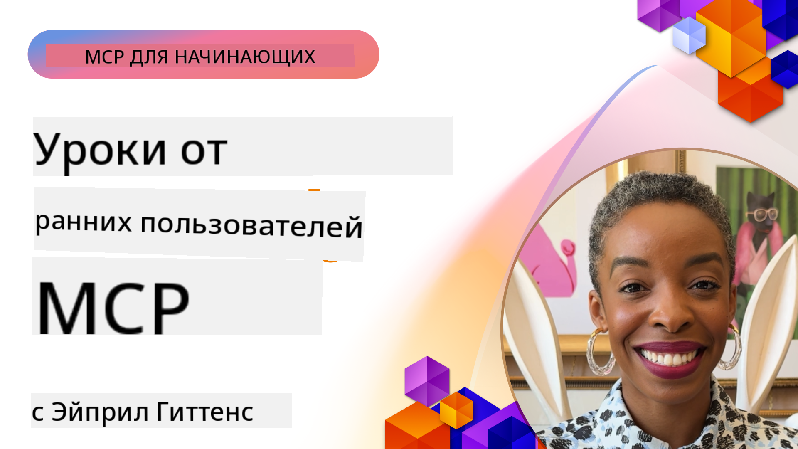

<!--
CO_OP_TRANSLATOR_METADATA:
{
  "original_hash": "41f16dac486d2086a53bc644a01cbe42",
  "translation_date": "2025-08-18T13:10:31+00:00",
  "source_file": "07-LessonsfromEarlyAdoption/README.md",
  "language_code": "ru"
}
-->
# 🌟 Уроки от ранних пользователей

[](https://youtu.be/jds7dSmNptE)

_(Нажмите на изображение выше, чтобы посмотреть видео этого урока)_

## 🎯 Что охватывает этот модуль

Этот модуль исследует, как реальные организации и разработчики используют Model Context Protocol (MCP) для решения актуальных задач и стимулирования инноваций. Через подробные кейс-стадии и практические проекты вы узнаете, как MCP обеспечивает безопасную и масштабируемую интеграцию ИИ, соединяя языковые модели, инструменты и корпоративные данные.

### 📚 MCP в действии

Хотите увидеть, как эти принципы применяются к готовым инструментам? Ознакомьтесь с нашим [**Руководством по 10 серверам Microsoft MCP, которые повышают продуктивность разработчиков**](microsoft-mcp-servers.md), где представлены реальные серверы MCP от Microsoft, доступные для использования уже сегодня.

## Обзор

Этот урок исследует, как ранние пользователи использовали Model Context Protocol (MCP) для решения реальных задач и стимулирования инноваций в различных отраслях. Через подробные кейс-стадии и практические проекты вы увидите, как MCP обеспечивает стандартизированную, безопасную и масштабируемую интеграцию ИИ, объединяя крупные языковые модели, инструменты и корпоративные данные в единую структуру. Вы получите практический опыт проектирования и создания решений на основе MCP, изучите проверенные шаблоны реализации и узнаете лучшие практики для развертывания MCP в производственных средах. Урок также освещает новые тенденции, перспективные направления и ресурсы с открытым исходным кодом, чтобы помочь вам оставаться на передовой технологии MCP и ее развивающейся экосистемы.

## Цели обучения

- Анализировать реальные реализации MCP в различных отраслях
- Проектировать и создавать полноценные приложения на основе MCP
- Исследовать новые тенденции и перспективные направления в технологии MCP
- Применять лучшие практики в реальных сценариях разработки

## Реальные реализации MCP

### Кейc-стадия 1: Автоматизация поддержки клиентов в корпорации

Международная корпорация внедрила решение на основе MCP для стандартизации взаимодействий ИИ в своих системах поддержки клиентов. Это позволило:

- Создать единый интерфейс для нескольких поставщиков LLM
- Поддерживать согласованное управление подсказками между отделами
- Реализовать надежные меры безопасности и контроля соответствия
- Легко переключаться между различными моделями ИИ в зависимости от конкретных потребностей

**Техническая реализация:**

```python
# Python MCP server implementation for customer support
import logging
import asyncio
from modelcontextprotocol import create_server, ServerConfig
from modelcontextprotocol.server import MCPServer
from modelcontextprotocol.transports import create_http_transport
from modelcontextprotocol.resources import ResourceDefinition
from modelcontextprotocol.prompts import PromptDefinition
from modelcontextprotocol.tool import ToolDefinition

# Configure logging
logging.basicConfig(level=logging.INFO)

async def main():
    # Create server configuration
    config = ServerConfig(
        name="Enterprise Customer Support Server",
        version="1.0.0",
        description="MCP server for handling customer support inquiries"
    )
    
    # Initialize MCP server
    server = create_server(config)
    
    # Register knowledge base resources
    server.resources.register(
        ResourceDefinition(
            name="customer_kb",
            description="Customer knowledge base documentation"
        ),
        lambda params: get_customer_documentation(params)
    )
    
    # Register prompt templates
    server.prompts.register(
        PromptDefinition(
            name="support_template",
            description="Templates for customer support responses"
        ),
        lambda params: get_support_templates(params)
    )
    
    # Register support tools
    server.tools.register(
        ToolDefinition(
            name="ticketing",
            description="Create and update support tickets"
        ),
        handle_ticketing_operations
    )
    
    # Start server with HTTP transport
    transport = create_http_transport(port=8080)
    await server.run(transport)

if __name__ == "__main__":
    asyncio.run(main())
```

**Результаты:** Снижение затрат на модели на 30%, улучшение согласованности ответов на 45% и повышение уровня соответствия требованиям в глобальных операциях.

### Кейc-стадия 2: Помощник по диагностике в здравоохранении

Поставщик медицинских услуг разработал инфраструктуру MCP для интеграции нескольких специализированных медицинских моделей ИИ, обеспечивая защиту конфиденциальных данных пациентов:

- Бесшовное переключение между универсальными и специализированными медицинскими моделями
- Строгий контроль конфиденциальности и аудит действий
- Интеграция с существующими системами электронных медицинских записей (EHR)
- Согласованное проектирование подсказок для медицинской терминологии

**Техническая реализация:**

```csharp
// C# MCP host application implementation in healthcare application
using Microsoft.Extensions.DependencyInjection;
using ModelContextProtocol.SDK.Client;
using ModelContextProtocol.SDK.Security;
using ModelContextProtocol.SDK.Resources;

public class DiagnosticAssistant
{
    private readonly MCPHostClient _mcpClient;
    private readonly PatientContext _patientContext;
    
    public DiagnosticAssistant(PatientContext patientContext)
    {
        _patientContext = patientContext;
        
        // Configure MCP client with healthcare-specific settings
        var clientOptions = new ClientOptions
        {
            Name = "Healthcare Diagnostic Assistant",
            Version = "1.0.0",
            Security = new SecurityOptions
            {
                Encryption = EncryptionLevel.Medical,
                AuditEnabled = true
            }
        };
        
        _mcpClient = new MCPHostClientBuilder()
            .WithOptions(clientOptions)
            .WithTransport(new HttpTransport("https://healthcare-mcp.example.org"))
            .WithAuthentication(new HIPAACompliantAuthProvider())
            .Build();
    }
    
    public async Task<DiagnosticSuggestion> GetDiagnosticAssistance(
        string symptoms, string patientHistory)
    {
        // Create request with appropriate resources and tool access
        var resourceRequest = new ResourceRequest
        {
            Name = "patient_records",
            Parameters = new Dictionary<string, object>
            {
                ["patientId"] = _patientContext.PatientId,
                ["requestingProvider"] = _patientContext.ProviderId
            }
        };
        
        // Request diagnostic assistance using appropriate prompt
        var response = await _mcpClient.SendPromptRequestAsync(
            promptName: "diagnostic_assistance",
            parameters: new Dictionary<string, object>
            {
                ["symptoms"] = symptoms,
                patientHistory = patientHistory,
                relevantGuidelines = _patientContext.GetRelevantGuidelines()
            });
            
        return DiagnosticSuggestion.FromMCPResponse(response);
    }
}
```

**Результаты:** Улучшенные диагностические рекомендации для врачей при полном соблюдении HIPAA и значительное сокращение переключений между системами.

### Кейc-стадия 3: Анализ рисков в финансовых услугах

Финансовая организация внедрила MCP для стандартизации процессов анализа рисков в различных отделах:

- Создан единый интерфейс для моделей анализа кредитных рисков, обнаружения мошенничества и инвестиционных рисков
- Реализованы строгие меры контроля доступа и версионирования моделей
- Обеспечена возможность аудита всех рекомендаций ИИ
- Поддерживался согласованный формат данных в различных системах

**Техническая реализация:**

```java
// Java MCP server for financial risk assessment
import org.mcp.server.*;
import org.mcp.security.*;

public class FinancialRiskMCPServer {
    public static void main(String[] args) {
        // Create MCP server with financial compliance features
        MCPServer server = new MCPServerBuilder()
            .withModelProviders(
                new ModelProvider("risk-assessment-primary", new AzureOpenAIProvider()),
                new ModelProvider("risk-assessment-audit", new LocalLlamaProvider())
            )
            .withPromptTemplateDirectory("./compliance/templates")
            .withAccessControls(new SOCCompliantAccessControl())
            .withDataEncryption(EncryptionStandard.FINANCIAL_GRADE)
            .withVersionControl(true)
            .withAuditLogging(new DatabaseAuditLogger())
            .build();
            
        server.addRequestValidator(new FinancialDataValidator());
        server.addResponseFilter(new PII_RedactionFilter());
        
        server.start(9000);
        
        System.out.println("Financial Risk MCP Server running on port 9000");
    }
}
```

**Результаты:** Повышение уровня соответствия нормативным требованиям, ускорение циклов развертывания моделей на 40% и улучшение согласованности оценки рисков между отделами.

### Кейc-стадия 4: Сервер Microsoft Playwright MCP для автоматизации браузера

Microsoft разработала [сервер Playwright MCP](https://github.com/microsoft/playwright-mcp), чтобы обеспечить безопасную и стандартизированную автоматизацию браузера через Model Context Protocol. Этот готовый к производству сервер позволяет агентам ИИ и LLM взаимодействовать с веб-браузерами в контролируемой, проверяемой и расширяемой среде, поддерживая такие сценарии, как автоматизированное тестирование веб-приложений, извлечение данных и выполнение рабочих процессов.

> **🎯 Готовый к производству инструмент**
> 
> Этот кейс-стадия демонстрирует реальный сервер MCP, который вы можете использовать уже сегодня! Узнайте больше о сервере Playwright MCP и 9 других готовых к производству серверах MCP от Microsoft в нашем [**Руководстве по серверам Microsoft MCP**](microsoft-mcp-servers.md#8--playwright-mcp-server).

**Ключевые особенности:**
- Предоставляет возможности автоматизации браузера (навигация, заполнение форм, создание скриншотов и т.д.) как инструменты MCP
- Реализует строгий контроль доступа и изоляцию для предотвращения несанкционированных действий
- Обеспечивает подробные журналы аудита всех взаимодействий с браузером
- Поддерживает интеграцию с Azure OpenAI и другими поставщиками LLM для автоматизации, управляемой агентами
- Используется для возможностей веб-браузинга GitHub Copilot

**Техническая реализация:**

```typescript
// TypeScript: Registering Playwright browser automation tools in an MCP server
import { createServer, ToolDefinition } from 'modelcontextprotocol';
import { launch } from 'playwright';

const server = createServer({
  name: 'Playwright MCP Server',
  version: '1.0.0',
  description: 'MCP server for browser automation using Playwright'
});

// Register a tool for navigating to a URL and capturing a screenshot
server.tools.register(
  new ToolDefinition({
    name: 'navigate_and_screenshot',
    description: 'Navigate to a URL and capture a screenshot',
    parameters: {
      url: { type: 'string', description: 'The URL to visit' }
    }
  }),
  async ({ url }) => {
    const browser = await launch();
    const page = await browser.newPage();
    await page.goto(url);
    const screenshot = await page.screenshot();
    await browser.close();
    return { screenshot };
  }
);

// Start the MCP server
server.listen(8080);
```

**Результаты:**

- Обеспечена безопасная программная автоматизация браузера для агентов ИИ и LLM
- Снижены затраты на ручное тестирование и улучшено покрытие тестов для веб-приложений
- Предоставлена повторно используемая и расширяемая структура для интеграции инструментов на основе браузера в корпоративных средах
- Поддерживает возможности веб-браузинга GitHub Copilot

**Ссылки:**

- [Репозиторий GitHub сервера Playwright MCP](https://github.com/microsoft/playwright-mcp)
- [Решения Microsoft AI и автоматизации](https://azure.microsoft.com/en-us/products/ai-services/)

### Кейc-стадия 5: Azure MCP – корпоративный протокол Model Context Protocol как услуга

Сервер Azure MCP ([https://aka.ms/azmcp](https://aka.ms/azmcp)) — это управляемая корпоративная реализация Model Context Protocol от Microsoft, предназначенная для предоставления масштабируемых, безопасных и соответствующих требованиям возможностей сервера MCP как облачной услуги. Azure MCP позволяет организациям быстро развертывать, управлять и интегрировать серверы MCP с сервисами Azure AI, данными и безопасностью, снижая операционные затраты и ускоряя внедрение ИИ.

> **🎯 Готовый к производству инструмент**
> 
> Это реальный сервер MCP, который вы можете использовать уже сегодня! Узнайте больше о сервере Azure AI Foundry MCP в нашем [**Руководстве по серверам Microsoft MCP**](microsoft-mcp-servers.md).

- Полностью управляемый хостинг серверов MCP с встроенным масштабированием, мониторингом и безопасностью
- Нативная интеграция с Azure OpenAI, Azure AI Search и другими сервисами Azure
- Корпоративная аутентификация и авторизация через Microsoft Entra ID
- Поддержка пользовательских инструментов, шаблонов подсказок и коннекторов ресурсов
- Соответствие требованиям безопасности и нормативным требованиям предприятий

**Техническая реализация:**

```yaml
# Example: Azure MCP server deployment configuration (YAML)
apiVersion: mcp.microsoft.com/v1
kind: McpServer
metadata:
  name: enterprise-mcp-server
spec:
  modelProviders:
    - name: azure-openai
      type: AzureOpenAI
      endpoint: https://<your-openai-resource>.openai.azure.com/
      apiKeySecret: <your-azure-keyvault-secret>
  tools:
    - name: document_search
      type: AzureAISearch
      endpoint: https://<your-search-resource>.search.windows.net/
      apiKeySecret: <your-azure-keyvault-secret>
  authentication:
    type: EntraID
    tenantId: <your-tenant-id>
  monitoring:
    enabled: true
    logAnalyticsWorkspace: <your-log-analytics-id>
```

**Результаты:**  
- Сокращение времени до получения ценности для корпоративных проектов ИИ благодаря готовой платформе сервера MCP
- Упрощенная интеграция LLM, инструментов и источников корпоративных данных
- Повышенная безопасность, наблюдаемость и операционная эффективность для рабочих нагрузок MCP
- Улучшение качества кода с использованием лучших практик Azure SDK и современных шаблонов аутентификации

**Ссылки:**  
- [Документация Azure MCP](https://aka.ms/azmcp)
- [Репозиторий GitHub сервера Azure MCP](https://github.com/Azure/azure-mcp)
- [Сервисы Azure AI](https://azure.microsoft.com/en-us/products/ai-services/)
- [Центр Microsoft MCP](https://mcp.azure.com)

### Кейc-стадия 6: NLWeb

MCP (Model Context Protocol) — это новый протокол для чат-ботов и ИИ-ассистентов, позволяющий взаимодействовать с инструментами. Каждый экземпляр NLWeb также является сервером MCP, который поддерживает один основной метод — ask, используемый для запроса к веб-сайту на естественном языке. Ответ возвращается с использованием schema.org, широко используемого словаря для описания веб-данных. Грубо говоря, MCP — это NLWeb, как Http — это HTML. NLWeb объединяет протоколы, форматы Schema.org и примеры кода, чтобы помочь сайтам быстро создавать эти конечные точки, принося пользу как людям через разговорные интерфейсы, так и машинам через естественное взаимодействие агент-агент.

NLWeb состоит из двух компонентов:
- Протокол, очень простой для начала, для взаимодействия с сайтом на естественном языке и формат, использующий json и schema.org для возвращаемого ответа. См. документацию по REST API для получения подробной информации.
- Простая реализация (1), использующая существующую разметку для сайтов, которые можно абстрагировать как списки элементов (товары, рецепты, достопримечательности, отзывы и т.д.). Вместе с набором виджетов пользовательского интерфейса сайты могут легко предоставлять разговорные интерфейсы к своему контенту. См. документацию о жизненном цикле запроса чата для получения подробной информации о том, как это работает.

**Ссылки:**  
- [Документация Azure MCP](https://aka.ms/azmcp)  
- [NLWeb](https://github.com/microsoft/NlWeb)

### Кейc-стадия 7: Сервер Azure AI Foundry MCP – интеграция корпоративных ИИ-агентов

Серверы Azure AI Foundry MCP демонстрируют, как MCP может использоваться для оркестрации и управления ИИ-агентами и рабочими процессами в корпоративных средах. Интегрируя MCP с Azure AI Foundry, организации могут стандартизировать взаимодействие агентов, использовать управление рабочими процессами Foundry и обеспечивать безопасное и масштабируемое развертывание.

> **🎯 Готовый к производству инструмент**
> 
> Это реальный сервер MCP, который вы можете использовать уже сегодня! Узнайте больше о сервере Azure AI Foundry MCP в нашем [**Руководстве по серверам Microsoft MCP**](microsoft-mcp-servers.md#9--azure-ai-foundry-mcp-server).

**Ключевые особенности:**
- Полный доступ к экосистеме ИИ Azure, включая каталоги моделей и управление развертыванием
- Индексация знаний с помощью Azure AI Search для приложений RAG
- Инструменты оценки производительности моделей ИИ и контроля качества
- Интеграция с каталогом и лабораториями Azure AI Foundry для передовых исследовательских моделей
- Возможности управления и оценки агентов для производственных сценариев

**Результаты:**
- Быстрое прототипирование и надежный мониторинг рабочих процессов ИИ-агентов
- Бесшовная интеграция с сервисами Azure AI для сложных сценариев
- Единый интерфейс для создания, развертывания и мониторинга конвейеров агентов
- Повышенная безопасность, соответствие требованиям и операционная эффективность для предприятий
- Ускоренное внедрение ИИ при сохранении контроля над сложными процессами, управляемыми агентами

**Ссылки:**
- [Репозиторий GitHub сервера Azure AI Foundry MCP](https://github.com/azure-ai-foundry/mcp-foundry)
- [Интеграция агентов Azure AI с MCP (блог Microsoft Foundry)](https://devblogs.microsoft.com/foundry/integrating-azure-ai-agents-mcp/)

### Кейc-стадия 8: Песочница Foundry MCP – эксперименты и прототипирование

Песочница Foundry MCP предоставляет готовую среду для экспериментов с серверами MCP и интеграциями Azure AI Foundry. Разработчики могут быстро прототипировать, тестировать и оценивать модели ИИ и рабочие процессы агентов, используя ресурсы из каталога и лабораторий Azure AI Foundry. Песочница упрощает настройку, предоставляет примерные проекты и поддерживает совместную разработку, что делает ее удобной для изучения лучших практик и новых сценариев с минимальными затратами. Она особенно полезна для команд, которые хотят проверять идеи, делиться экспериментами и ускорять обучение без необходимости сложной инфраструктуры. Снижая барьер для входа, песочница способствует инновациям и вкладу сообщества в экосистему MCP и Azure AI Foundry.

**Ссылки:**

- [Репозиторий GitHub песочницы Foundry MCP](https://github.com/azure-ai-foundry/foundry-mcp-playground)

### Кейc-стадия 9: Сервер Microsoft Learn Docs MCP – доступ к документации с помощью ИИ

Сервер Microsoft Learn Docs MCP — это облачный сервис, который предоставляет ИИ-ассистентам доступ в реальном времени к официальной документации Microsoft через Model Context Protocol. Этот готовый к производству сервер подключается к обширной экосистеме Microsoft Learn и позволяет выполнять семантический поиск по всем официальным источникам Microsoft.
> **🎯 Инструмент, готовый к использованию в производстве**  
>  
> Это настоящий MCP сервер, который вы можете использовать уже сегодня! Узнайте больше о сервере Microsoft Learn Docs MCP в нашем [**Руководстве по серверам Microsoft MCP**](microsoft-mcp-servers.md#1--microsoft-learn-docs-mcp-server).
**Ключевые особенности:**
- Доступ в реальном времени к официальной документации Microsoft, документации Azure и Microsoft 365
- Расширенные возможности семантического поиска, понимающие контекст и намерения
- Всегда актуальная информация благодаря публикации контента Microsoft Learn
- Всеобъемлющее покрытие источников Microsoft Learn, документации Azure и Microsoft 365
- Возвращает до 10 качественных фрагментов контента с заголовками статей и URL-адресами

**Почему это важно:**
- Решает проблему "устаревших знаний ИИ" для технологий Microsoft
- Обеспечивает доступ ИИ-ассистентов к последним функциям .NET, C#, Azure и Microsoft 365
- Предоставляет авторитетную, первоисточниковую информацию для точной генерации кода
- Необходимо для разработчиков, работающих с быстро развивающимися технологиями Microsoft

**Результаты:**
- Значительное улучшение точности кода, сгенерированного ИИ, для технологий Microsoft
- Сокращение времени, затрачиваемого на поиск актуальной документации и лучших практик
- Повышение производительности разработчиков благодаря контекстно-осведомленному поиску документации
- Бесшовная интеграция с рабочими процессами разработки без необходимости покидать IDE

**Ссылки:**
- [Репозиторий Microsoft Learn Docs MCP Server на GitHub](https://github.com/MicrosoftDocs/mcp)
- [Документация Microsoft Learn](https://learn.microsoft.com/)

## Практические проекты

### Проект 1: Создание MCP-сервера с поддержкой нескольких провайдеров

**Цель:** Создать MCP-сервер, который может направлять запросы к нескольким провайдерам моделей ИИ на основе определенных критериев.

**Требования:**

- Поддержка как минимум трех различных провайдеров моделей (например, OpenAI, Anthropic, локальные модели)
- Реализация механизма маршрутизации на основе метаданных запроса
- Создание системы конфигурации для управления учетными данными провайдеров
- Добавление кэширования для оптимизации производительности и затрат
- Построение простой панели мониторинга для отслеживания использования

**Шаги реализации:**

1. Настройка базовой инфраструктуры MCP-сервера
2. Реализация адаптеров провайдеров для каждой службы моделей ИИ
3. Создание логики маршрутизации на основе атрибутов запроса
4. Добавление механизмов кэширования для частых запросов
5. Разработка панели мониторинга
6. Тестирование с различными шаблонами запросов

**Технологии:** Выбор между Python (.NET/Java/Python в зависимости от предпочтений), Redis для кэширования и простой веб-фреймворк для панели мониторинга.

### Проект 2: Корпоративная система управления подсказками

**Цель:** Разработать систему на основе MCP для управления, версионирования и развертывания шаблонов подсказок в организации.

**Требования:**

- Создание централизованного репозитория для шаблонов подсказок
- Реализация системы версионирования и рабочих процессов утверждения
- Построение возможностей тестирования шаблонов с использованием примерных входных данных
- Разработка ролевого управления доступом
- Создание API для извлечения и развертывания шаблонов

**Шаги реализации:**

1. Проектирование схемы базы данных для хранения шаблонов
2. Создание основного API для операций CRUD с шаблонами
3. Реализация системы версионирования
4. Построение рабочего процесса утверждения
5. Разработка тестовой среды
6. Создание простого веб-интерфейса для управления
7. Интеграция с MCP-сервером

**Технологии:** Выбор серверного фреймворка, SQL или NoSQL базы данных и фронтенд-фреймворка для интерфейса управления.

### Проект 3: Платформа генерации контента на основе MCP

**Цель:** Создать платформу генерации контента, использующую MCP для обеспечения стабильных результатов для различных типов контента.

**Требования:**

- Поддержка нескольких форматов контента (блог-посты, социальные сети, маркетинговые тексты)
- Реализация генерации на основе шаблонов с возможностью настройки
- Создание системы рецензирования и обратной связи
- Отслеживание метрик производительности контента
- Поддержка версионирования и итерации контента

**Шаги реализации:**

1. Настройка клиентской инфраструктуры MCP
2. Создание шаблонов для различных типов контента
3. Построение конвейера генерации контента
4. Реализация системы рецензирования
5. Разработка системы отслеживания метрик
6. Создание пользовательского интерфейса для управления шаблонами и генерацией контента

**Технологии:** Предпочтительный язык программирования, веб-фреймворк и система баз данных.

## Будущие направления для технологии MCP

### Актуальные тренды

1. **Мультимодальный MCP**
   - Расширение MCP для стандартизации взаимодействий с моделями изображений, аудио и видео
   - Разработка возможностей кроссмодального рассуждения
   - Стандартизированные форматы подсказок для различных модальностей

2. **Федеративная инфраструктура MCP**
   - Распределенные сети MCP, которые могут делиться ресурсами между организациями
   - Стандартизированные протоколы для безопасного обмена моделями
   - Техники конфиденциальных вычислений

3. **Маркетплейсы MCP**
   - Экосистемы для обмена и монетизации шаблонов и плагинов MCP
   - Процессы обеспечения качества и сертификации
   - Интеграция с маркетплейсами моделей

4. **MCP для периферийных вычислений**
   - Адаптация стандартов MCP для устройств с ограниченными ресурсами
   - Оптимизированные протоколы для сред с низкой пропускной способностью
   - Специализированные реализации MCP для экосистем IoT

5. **Регуляторные рамки**
   - Разработка расширений MCP для соблюдения нормативных требований
   - Стандартизированные журналы аудита и интерфейсы объяснимости
   - Интеграция с новыми рамками управления ИИ

### Решения MCP от Microsoft

Microsoft и Azure разработали несколько репозиториев с открытым исходным кодом, чтобы помочь разработчикам внедрять MCP в различных сценариях:

#### Организация Microsoft

1. [playwright-mcp](https://github.com/microsoft/playwright-mcp) - MCP-сервер Playwright для автоматизации браузера и тестирования
2. [files-mcp-server](https://github.com/microsoft/files-mcp-server) - Реализация MCP-сервера OneDrive для локального тестирования и вклада сообщества
3. [NLWeb](https://github.com/microsoft/NlWeb) - Коллекция открытых протоколов и инструментов для создания базового слоя для AI Web

#### Организация Azure-Samples

1. [mcp](https://github.com/Azure-Samples/mcp) - Ссылки на примеры, инструменты и ресурсы для создания и интеграции MCP-серверов на Azure
2. [mcp-auth-servers](https://github.com/Azure-Samples/mcp-auth-servers) - Референсные MCP-серверы с демонстрацией аутентификации
3. [remote-mcp-functions](https://github.com/Azure-Samples/remote-mcp-functions) - Страница для удаленных MCP-серверов на Azure Functions
4. [remote-mcp-functions-python](https://github.com/Azure-Samples/remote-mcp-functions-python) - Шаблон для создания и развертывания MCP-серверов на Python
5. [remote-mcp-functions-dotnet](https://github.com/Azure-Samples/remote-mcp-functions-dotnet) - Шаблон для создания и развертывания MCP-серверов на .NET/C#
6. [remote-mcp-functions-typescript](https://github.com/Azure-Samples/remote-mcp-functions-typescript) - Шаблон для создания и развертывания MCP-серверов на TypeScript
7. [remote-mcp-apim-functions-python](https://github.com/Azure-Samples/remote-mcp-apim-functions-python) - Azure API Management как AI Gateway для MCP-серверов
8. [AI-Gateway](https://github.com/Azure-Samples/AI-Gateway) - Эксперименты с APIM и AI, включая возможности MCP

Эти репозитории предоставляют различные реализации, шаблоны и ресурсы для работы с MCP в разных языках программирования и сервисах Azure. Они охватывают широкий спектр сценариев от базовых реализаций серверов до аутентификации, облачного развертывания и корпоративной интеграции.

#### Каталог ресурсов MCP

[Каталог ресурсов MCP](https://github.com/microsoft/mcp/tree/main/Resources) в официальном репозитории Microsoft MCP предоставляет коллекцию примеров ресурсов, шаблонов подсказок и определений инструментов для использования с MCP-серверами. Этот каталог помогает разработчикам быстро начать работу с MCP, предлагая готовые строительные блоки и примеры лучших практик.

- **Шаблоны подсказок:** Готовые шаблоны для распространенных задач ИИ
- **Определения инструментов:** Примеры схем инструментов для стандартизации интеграции
- **Примеры ресурсов:** Определения для подключения к источникам данных и API
- **Референсные реализации:** Практические примеры для реальных проектов

Эти ресурсы ускоряют разработку, способствуют стандартизации и помогают внедрять лучшие практики.

#### Каталог ресурсов MCP

- [Ресурсы MCP (шаблоны, инструменты, определения)](https://github.com/microsoft/mcp/tree/main/Resources)

### Возможности для исследований

- Эффективные методы оптимизации подсказок в рамках MCP
- Модели безопасности для многопользовательских MCP-развертываний
- Бенчмаркинг производительности различных реализаций MCP
- Методы формальной верификации MCP-серверов

## Заключение

Протокол Model Context Protocol (MCP) активно формирует будущее стандартизированной, безопасной и совместимой интеграции ИИ в различных отраслях. Через кейсы и практические проекты в этом уроке вы увидели, как ранние пользователи, включая Microsoft и Azure, используют MCP для решения реальных задач, ускорения внедрения ИИ и обеспечения соответствия, безопасности и масштабируемости. Модульный подход MCP позволяет организациям объединять большие языковые модели, инструменты и корпоративные данные в единую, поддающуюся аудиту структуру. По мере развития MCP участие в сообществе, изучение ресурсов с открытым исходным кодом и применение лучших практик будут ключевыми для создания надежных, готовых к будущему ИИ-решений.

## Дополнительные ресурсы

- [Репозиторий MCP Foundry на GitHub](https://github.com/azure-ai-foundry/mcp-foundry)
- [Песочница Foundry MCP](https://github.com/azure-ai-foundry/foundry-mcp-playground)
- [Интеграция Azure AI Agents с MCP (блог Microsoft Foundry)](https://devblogs.microsoft.com/foundry/integrating-azure-ai-agents-mcp/)
- [Репозиторий MCP на GitHub (Microsoft)](https://github.com/microsoft/mcp)
- [Каталог ресурсов MCP (шаблоны, инструменты, определения)](https://github.com/microsoft/mcp/tree/main/Resources)
- [Сообщество и документация MCP](https://modelcontextprotocol.io/introduction)
- [Документация Azure MCP](https://aka.ms/azmcp)
- [Репозиторий Playwright MCP Server](https://github.com/microsoft/playwright-mcp)
- [Сервер MCP для файлов (OneDrive)](https://github.com/microsoft/files-mcp-server)
- [Примеры MCP от Azure-Samples](https://github.com/Azure-Samples/mcp)
- [Серверы аутентификации MCP (Azure-Samples)](https://github.com/Azure-Samples/mcp-auth-servers)
- [Удаленные функции MCP (Azure-Samples)](https://github.com/Azure-Samples/remote-mcp-functions)
- [Удаленные функции MCP на Python (Azure-Samples)](https://github.com/Azure-Samples/remote-mcp-functions-python)
- [Удаленные функции MCP на .NET (Azure-Samples)](https://github.com/Azure-Samples/remote-mcp-functions-dotnet)
- [Удаленные функции MCP на TypeScript (Azure-Samples)](https://github.com/Azure-Samples/remote-mcp-functions-typescript)
- [Удаленные функции MCP APIM на Python (Azure-Samples)](https://github.com/Azure-Samples/remote-mcp-apim-functions-python)
- [AI-Gateway (Azure-Samples)](https://github.com/Azure-Samples/AI-Gateway)
- [Решения Microsoft AI и автоматизации](https://azure.microsoft.com/en-us/products/ai-services/)

## Упражнения

1. Проанализируйте один из кейсов и предложите альтернативный подход к реализации.
2. Выберите одну из идей проектов и создайте детальную техническую спецификацию.
3. Исследуйте отрасль, не охваченную кейсами, и опишите, как MCP может решить ее специфические задачи.
4. Изучите одно из направлений будущего и создайте концепцию нового расширения MCP для его поддержки.

Далее: [Microsoft MCP Server](../07-LessonsfromEarlyAdoption/microsoft-mcp-servers.md)

**Отказ от ответственности**:  
Этот документ был переведен с использованием сервиса автоматического перевода [Co-op Translator](https://github.com/Azure/co-op-translator). Хотя мы стремимся к точности, пожалуйста, имейте в виду, что автоматические переводы могут содержать ошибки или неточности. Оригинальный документ на его исходном языке следует считать авторитетным источником. Для получения критически важной информации рекомендуется профессиональный перевод человеком. Мы не несем ответственности за любые недоразумения или неправильные интерпретации, возникшие в результате использования данного перевода.