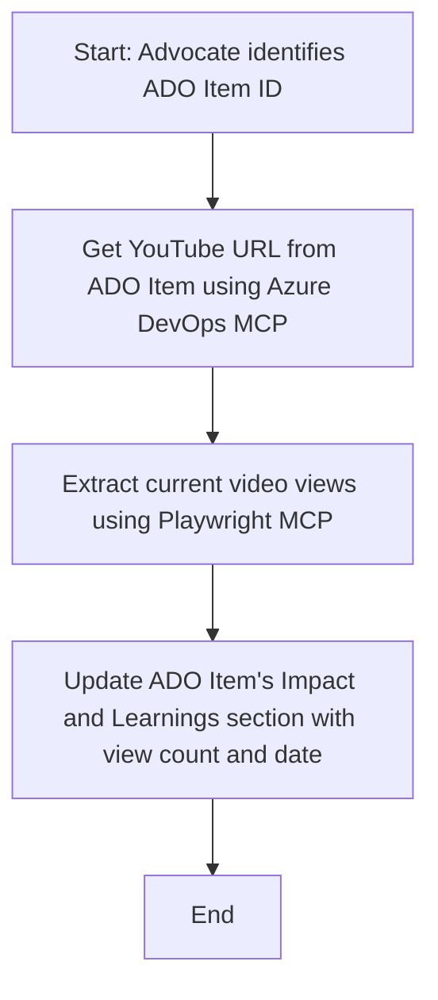

<!--
CO_OP_TRANSLATOR_METADATA:
{
  "original_hash": "14a2dfbea55ef735660a06bd6bdfe5f3",
  "translation_date": "2025-07-14T06:08:43+00:00",
  "source_file": "09-CaseStudy/UpdateADOItemsFromYT.md",
  "language_code": "ru"
}
-->
# Кейс: Обновление элементов Azure DevOps с данными с YouTube с помощью MCP

> **Отказ от ответственности:** Существуют онлайн-инструменты и отчёты, которые могут автоматизировать процесс обновления элементов Azure DevOps данными с таких платформ, как YouTube. Следующий сценарий приведён исключительно в качестве примера использования, чтобы показать, как инструменты MCP могут применяться для автоматизации и интеграции.

## Обзор

В этом кейсе показан один из примеров использования Model Context Protocol (MCP) и его инструментов для автоматизации обновления рабочих элементов Azure DevOps (ADO) информацией, полученной с онлайн-платформ, таких как YouTube. Описанный сценарий — лишь одна из иллюстраций широких возможностей этих инструментов, которые можно адаптировать под множество похожих задач автоматизации.

В данном примере Advocate отслеживает онлайн-сессии с помощью элементов ADO, где каждый элемент содержит URL видео с YouTube. Используя инструменты MCP, Advocate может автоматически и повторяемо обновлять элементы ADO с актуальными метриками видео, такими как количество просмотров. Такой подход можно обобщить и применить к другим случаям, когда данные из онлайн-источников нужно интегрировать в ADO или другие системы.

## Сценарий

Advocate отвечает за отслеживание влияния онлайн-сессий и взаимодействия с сообществом. Каждая сессия фиксируется как рабочий элемент ADO в проекте «DevRel», и в элементе есть поле с URL видео YouTube. Чтобы точно отчитаться о охвате сессии, Advocate должен обновить элемент ADO с текущим количеством просмотров видео и датой получения этой информации.

## Используемые инструменты

- [Azure DevOps MCP](https://github.com/microsoft/azure-devops-mcp): Позволяет программно получать доступ и обновлять рабочие элементы ADO через MCP.
- [Playwright MCP](https://github.com/microsoft/playwright-mcp): Автоматизирует действия в браузере для извлечения актуальных данных с веб-страниц, например статистики видео на YouTube.

## Пошаговый рабочий процесс

1. **Определить элемент ADO**: Начать с ID рабочего элемента ADO (например, 1234) в проекте «DevRel».
2. **Получить URL YouTube**: С помощью Azure DevOps MCP получить URL видео YouTube из рабочего элемента.
3. **Извлечь количество просмотров**: Использовать Playwright MCP для перехода по URL и получения текущего количества просмотров.
4. **Обновить элемент ADO**: Записать актуальное количество просмотров и дату получения в раздел «Impact and Learnings» рабочего элемента ADO с помощью Azure DevOps MCP.

## Пример запроса

```bash
- Work with the ADO Item ID: 1234
- The project is '2025-Awesome'
- Get the YouTube URL for the ADO item
- Use Playwright to get the current views from the YouTube video
- Update the ADO item with the current video views and the updated date of the information
```

## Диаграмма Mermaid



## Техническая реализация

- **Оркестрация MCP**: Рабочий процесс управляется MCP-сервером, который координирует использование инструментов Azure DevOps MCP и Playwright MCP.
- **Автоматизация**: Процесс можно запускать вручную или настроить на регулярное выполнение для поддержания актуальности элементов ADO.
- **Расширяемость**: Тот же подход можно использовать для обновления элементов ADO другими онлайн-метриками (например, лайками, комментариями) или с других платформ.

## Результаты и влияние

- **Эффективность**: Снижает ручную работу Advocate, автоматизируя получение и обновление метрик видео.
- **Точность**: Гарантирует, что элементы ADO содержат самые свежие данные из онлайн-источников.
- **Повторяемость**: Обеспечивает повторяемый рабочий процесс для похожих сценариев с другими источниками данных или метриками.

## Ссылки

- [Azure DevOps MCP](https://github.com/microsoft/azure-devops-mcp)
- [Playwright MCP](https://github.com/microsoft/playwright-mcp)
- [Model Context Protocol (MCP)](https://modelcontextprotocol.io/)

**Отказ от ответственности**:  
Этот документ был переведен с помощью сервиса автоматического перевода [Co-op Translator](https://github.com/Azure/co-op-translator). Несмотря на наши усилия по обеспечению точности, просим учитывать, что автоматические переводы могут содержать ошибки или неточности. Оригинальный документ на его исходном языке следует считать авторитетным источником. Для получения критически важной информации рекомендуется обращаться к профессиональному человеческому переводу. Мы не несем ответственности за любые недоразумения или неправильные толкования, возникшие в результате использования данного перевода.