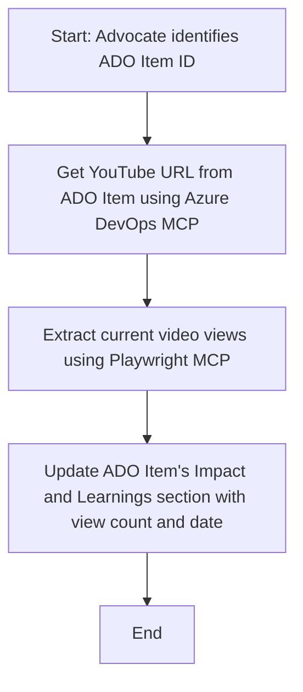

<!--
CO_OP_TRANSLATOR_METADATA:
{
  "original_hash": "14a2dfbea55ef735660a06bd6bdfe5f3",
  "translation_date": "2025-06-13T21:30:57+00:00",
  "source_file": "09-CaseStudy/UpdateADOItemsFromYT.md",
  "language_code": "ru"
}
-->
# Кейc: Обновление элементов Azure DevOps с данными YouTube с помощью MCP

> **Отказ от ответственности:** Существуют готовые онлайн-инструменты и отчёты, которые могут автоматически обновлять элементы Azure DevOps данными с платформ вроде YouTube. Следующий сценарий приведён исключительно в качестве примера, чтобы показать, как инструменты MCP можно использовать для автоматизации и интеграции.

## Обзор

В этом кейсе показан пример того, как протокол Model Context Protocol (MCP) и его инструменты могут автоматизировать обновление рабочих элементов Azure DevOps (ADO) информацией с онлайн-платформ, таких как YouTube. Описанный сценарий — лишь один из примеров широких возможностей этих инструментов, которые можно адаптировать под множество похожих задач автоматизации.

В данном примере Advocate отслеживает онлайн-сессии с помощью элементов ADO, каждый из которых содержит URL видео на YouTube. Используя инструменты MCP, Advocate может автоматически и регулярно обновлять элементы ADO с актуальными метриками видео, например, количеством просмотров. Такой подход можно применить и в других случаях, когда необходимо интегрировать данные из онлайн-источников в ADO или другие системы.

## Сценарий

Advocate отвечает за отслеживание влияния онлайн-сессий и взаимодействий с сообществом. Каждая сессия фиксируется в виде рабочего элемента ADO в проекте «DevRel», где есть поле для URL видео на YouTube. Чтобы точно отчитаться о охвате сессии, Advocate должен обновлять элемент ADO с текущим количеством просмотров видео и датой получения этой информации.

## Используемые инструменты

- [Azure DevOps MCP](https://github.com/microsoft/azure-devops-mcp): Позволяет программно получать доступ и обновлять рабочие элементы ADO через MCP.
- [Playwright MCP](https://github.com/microsoft/playwright-mcp): Автоматизирует действия в браузере для извлечения актуальных данных со страниц, например статистики видео на YouTube.

## Пошаговый процесс

1. **Определить элемент ADO**: Начать с ID рабочего элемента ADO (например, 1234) в проекте «DevRel».
2. **Получить URL YouTube**: С помощью Azure DevOps MCP получить URL видео из рабочего элемента.
3. **Извлечь количество просмотров**: С помощью Playwright MCP перейти по URL и получить текущее число просмотров.
4. **Обновить элемент ADO**: Записать актуальное количество просмотров и дату получения в раздел «Impact and Learnings» рабочего элемента ADO с помощью Azure DevOps MCP.

## Пример запроса

```bash
- Work with the ADO Item ID: 1234
- The project is '2025-Awesome'
- Get the YouTube URL for the ADO item
- Use Playwright to get the current views from the YouTube video
- Update the ADO item with the current video views and the updated date of the information
```

## Диаграмма Mermaid



## Техническая реализация

- **Оркестрация MCP**: Процесс управляется MCP-сервером, который координирует работу Azure DevOps MCP и Playwright MCP.
- **Автоматизация**: Процесс можно запускать вручную или настроить на регулярное выполнение для поддержания актуальности данных в ADO.
- **Расширяемость**: Аналогичный подход можно применить для обновления элементов ADO другими метриками (например, лайками, комментариями) или с других платформ.

## Результаты и влияние

- **Эффективность**: Снижает ручную работу Advocates за счёт автоматического получения и обновления метрик видео.
- **Точность**: Обеспечивает актуальность данных в элементах ADO на основе последних доступных онлайн-источников.
- **Повторяемость**: Предоставляет повторяемый рабочий процесс для похожих сценариев с другими источниками данных или метриками.

## Ссылки

- [Azure DevOps MCP](https://github.com/microsoft/azure-devops-mcp)
- [Playwright MCP](https://github.com/microsoft/playwright-mcp)
- [Model Context Protocol (MCP)](https://modelcontextprotocol.io/)

**Отказ от ответственности**:  
Этот документ был переведен с использованием сервиса автоматического перевода [Co-op Translator](https://github.com/Azure/co-op-translator). Несмотря на наши усилия обеспечить точность, пожалуйста, имейте в виду, что автоматические переводы могут содержать ошибки или неточности. Оригинальный документ на исходном языке следует считать авторитетным источником. Для критически важной информации рекомендуется использовать профессиональный перевод, выполненный человеком. Мы не несем ответственности за любые недоразумения или неверные толкования, возникшие в результате использования данного перевода.