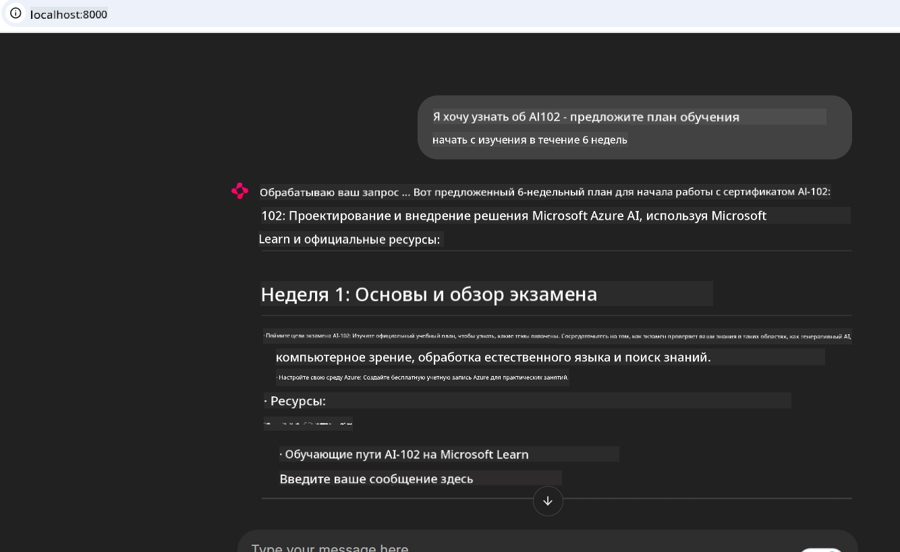

<!--
CO_OP_TRANSLATOR_METADATA:
{
  "original_hash": "4319d291c9d124ecafea52b3d04bfa0e",
  "translation_date": "2025-07-14T06:17:57+00:00",
  "source_file": "09-CaseStudy/docs-mcp/README.md",
  "language_code": "ru"
}
-->
# Кейс: Подключение к серверу Microsoft Learn Docs MCP с клиента

Вы когда-нибудь ловили себя на том, что постоянно переключаетесь между сайтами с документацией, Stack Overflow и бесконечным количеством вкладок в поисковике, пытаясь решить проблему в коде? Может быть, у вас даже есть второй монитор только для документации, или вы постоянно переключаетесь между IDE и браузером с помощью Alt+Tab. А что если бы документация была прямо в вашем рабочем процессе — интегрирована в ваши приложения, IDE или даже собственные инструменты? В этом кейсе мы покажем, как сделать именно это, подключившись напрямую к серверу Microsoft Learn Docs MCP из вашего клиентского приложения.

## Обзор

Современная разработка — это не просто написание кода, а умение быстро находить нужную информацию в нужный момент. Документация есть повсюду, но редко там, где она нужна больше всего — внутри ваших инструментов и рабочих процессов. Интегрируя получение документации прямо в приложения, вы экономите время, снижаете количество переключений контекста и повышаете продуктивность. В этом разделе мы расскажем, как подключить клиент к серверу Microsoft Learn Docs MCP, чтобы получать актуальную, контекстно-зависимую документацию, не покидая приложение.

Мы пройдем весь процесс: установку соединения, отправку запроса и эффективную обработку потоковых ответов. Такой подход не только упрощает рабочий процесс, но и открывает возможности для создания более умных и полезных инструментов для разработчиков.

## Цели обучения

Зачем это нужно? Потому что лучший опыт для разработчика — это когда все работает без лишних препятствий. Представьте, что ваш редактор кода, чат-бот или веб-приложение могут мгновенно отвечать на вопросы по документации, используя самые свежие данные с Microsoft Learn. К концу этой главы вы научитесь:

- Понимать основы коммуникации клиент-сервер MCP для работы с документацией
- Реализовывать консольное или веб-приложение для подключения к серверу Microsoft Learn Docs MCP
- Использовать потоковые HTTP-клиенты для получения документации в реальном времени
- Логировать и интерпретировать ответы с документацией в вашем приложении

Вы увидите, как эти навыки помогут создавать инструменты, которые не просто реагируют, а действительно интерактивны и учитывают контекст.

## Сценарий 1 — Получение документации в реальном времени с MCP

В этом сценарии мы покажем, как подключить клиент к серверу Microsoft Learn Docs MCP, чтобы получать актуальную, контекстно-зависимую документацию, не покидая приложение.

Давайте перейдем к практике. Ваша задача — написать приложение, которое подключается к серверу Microsoft Learn Docs MCP, вызывает инструмент `microsoft_docs_search` и выводит потоковый ответ в консоль.

### Почему именно такой подход?
Потому что это основа для создания более сложных интеграций — будь то чат-бот, расширение для IDE или веб-панель.

Код и инструкции для этого сценария находятся в папке [`solution`](./solution/README.md) этого кейса. Шаги помогут вам настроить подключение:
- Использовать официальный MCP SDK и потоковый HTTP-клиент для соединения
- Вызвать инструмент `microsoft_docs_search` с параметром запроса для получения документации
- Реализовать корректное логирование и обработку ошибок
- Создать интерактивный консольный интерфейс для ввода нескольких поисковых запросов

Этот сценарий демонстрирует, как:
- Подключиться к серверу Docs MCP
- Отправить запрос
- Разобрать и вывести результаты

Вот как может выглядеть запуск решения:

```
Prompt> What is Azure Key Vault?
Answer> Azure Key Vault is a cloud service for securely storing and accessing secrets. ...
```

Ниже приведен минимальный пример решения. Полный код и подробности доступны в папке решения.

<details>
<summary>Python</summary>

```python
import asyncio
from mcp.client.streamable_http import streamablehttp_client
from mcp import ClientSession

async def main():
    async with streamablehttp_client("https://learn.microsoft.com/api/mcp") as (read_stream, write_stream, _):
        async with ClientSession(read_stream, write_stream) as session:
            await session.initialize()
            result = await session.call_tool("microsoft_docs_search", {"query": "Azure Functions best practices"})
            print(result.content)

if __name__ == "__main__":
    asyncio.run(main())
```

- Полная реализация и логирование — в файле [`scenario1.py`](../../../../09-CaseStudy/docs-mcp/solution/python/scenario1.py).
- Инструкции по установке и использованию — в файле [`README.md`](./solution/python/README.md) в той же папке.
</details>

## Сценарий 2 — Веб-приложение для интерактивного генератора учебных планов с MCP

В этом сценарии вы научитесь интегрировать Docs MCP в веб-проект. Цель — дать пользователям возможность искать документацию Microsoft Learn прямо из веб-интерфейса, делая документацию мгновенно доступной внутри вашего приложения или сайта.

Вы увидите, как:
- Настроить веб-приложение
- Подключиться к серверу Docs MCP
- Обрабатывать ввод пользователя и отображать результаты

Вот как может выглядеть запуск решения:

```
User> I want to learn about AI102 - so suggest the roadmap to get it started from learn for 6 weeks

Assistant> Here’s a detailed 6-week roadmap to start your preparation for the AI-102: Designing and Implementing a Microsoft Azure AI Solution certification, using official Microsoft resources and focusing on exam skills areas:

---
## Week 1: Introduction & Fundamentals
- **Understand the Exam**: Review the [AI-102 exam skills outline](https://learn.microsoft.com/en-us/credentials/certifications/exams/ai-102/).
- **Set up Azure**: Sign up for a free Azure account if you don't have one.
- **Learning Path**: [Introduction to Azure AI services](https://learn.microsoft.com/en-us/training/modules/intro-to-azure-ai/)
- **Focus**: Get familiar with Azure portal, AI capabilities, and necessary tools.

....more weeks of the roadmap...

Let me know if you want module-specific recommendations or need more customized weekly tasks!
```

Ниже приведен минимальный пример решения. Полный код и подробности доступны в папке решения.



<details>
<summary>Python (Chainlit)</summary>

Chainlit — это фреймворк для создания веб-приложений с разговорным ИИ. Он упрощает создание интерактивных чат-ботов и ассистентов, которые могут вызывать инструменты MCP и отображать результаты в реальном времени. Идеально подходит для быстрой прототипизации и удобных интерфейсов.

```python
import chainlit as cl
import requests

MCP_URL = "https://learn.microsoft.com/api/mcp"

@cl.on_message
def handle_message(message):
    query = {"question": message}
    response = requests.post(MCP_URL, json=query)
    if response.ok:
        result = response.json()
        cl.Message(content=result.get("answer", "No answer found.")).send()
    else:
        cl.Message(content="Error: " + response.text).send()
```

- Полная реализация — в файле [`scenario2.py`](../../../../09-CaseStudy/docs-mcp/solution/python/scenario2.py).
- Инструкции по установке и запуску — в файле [`README.md`](./solution/python/README.md).
</details>

## Сценарий 3: Документация в редакторе с MCP сервером в VS Code

Если вы хотите получать Microsoft Learn Docs прямо в VS Code (вместо постоянного переключения между вкладками браузера), вы можете использовать MCP сервер в вашем редакторе. Это позволяет:
- Искать и читать документацию в VS Code, не покидая среды разработки.
- Ссылаться на документацию и вставлять ссылки прямо в README или учебные материалы.
- Использовать GitHub Copilot и MCP вместе для бесшовного рабочего процесса с документацией на базе ИИ.

**Вы узнаете, как:**
- Добавить валидный файл `.vscode/mcp.json` в корень рабочего пространства (пример ниже).
- Открыть панель MCP или использовать палитру команд VS Code для поиска и вставки документации.
- Ссылаться на документацию прямо в markdown-файлах во время работы.
- Совмещать этот процесс с GitHub Copilot для еще большей продуктивности.

Вот пример настройки MCP сервера в VS Code:

```json
{
  "servers": {
    "LearnDocsMCP": {
      "url": "https://learn.microsoft.com/api/mcp"
    }
  }
}
```

</details>

> Для подробного пошагового руководства с скриншотами смотрите [`README.md`](./solution/scenario3/README.md).


Этот подход отлично подходит для тех, кто создает технические курсы, пишет документацию или разрабатывает код с частыми ссылками на справочные материалы.

## Основные выводы

Интеграция документации прямо в ваши инструменты — это не просто удобство, а настоящий прорыв в продуктивности. Подключаясь к серверу Microsoft Learn Docs MCP с клиента, вы можете:

- Избавиться от постоянного переключения между кодом и документацией
- Получать актуальную, контекстно-зависимую документацию в реальном времени
- Создавать более умные, интерактивные инструменты для разработчиков

Эти навыки помогут создавать решения, которые не только эффективны, но и приятны в использовании.

## Дополнительные ресурсы

Чтобы углубить знания, изучите официальные ресурсы:

- [Microsoft Learn Docs MCP Server (GitHub)](https://github.com/MicrosoftDocs/mcp)
- [Начало работы с Azure MCP Server (mcp-python)](https://learn.microsoft.com/en-us/azure/developer/azure-mcp-server/get-started#create-the-python-app)
- [Что такое Azure MCP Server?](https://learn.microsoft.com/en-us/azure/developer/azure-mcp-server/)
- [Введение в Model Context Protocol (MCP)](https://modelcontextprotocol.io/introduction)
- [Добавление плагинов с MCP Server (Python)](https://learn.microsoft.com/en-us/semantic-kernel/concepts/plugins/adding-mcp-plugins)

**Отказ от ответственности**:  
Этот документ был переведен с помощью сервиса автоматического перевода [Co-op Translator](https://github.com/Azure/co-op-translator). Несмотря на наши усилия по обеспечению точности, просим учитывать, что автоматический перевод может содержать ошибки или неточности. Оригинальный документ на его исходном языке следует считать авторитетным источником. Для получения критически важной информации рекомендуется обращаться к профессиональному человеческому переводу. Мы не несем ответственности за любые недоразумения или неправильные толкования, возникшие в результате использования данного перевода.