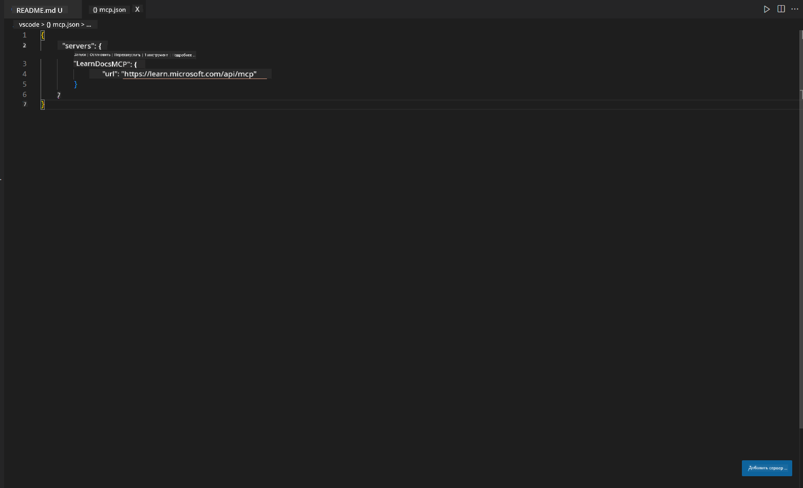
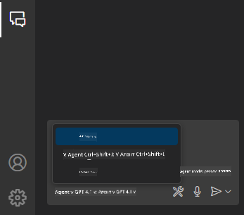
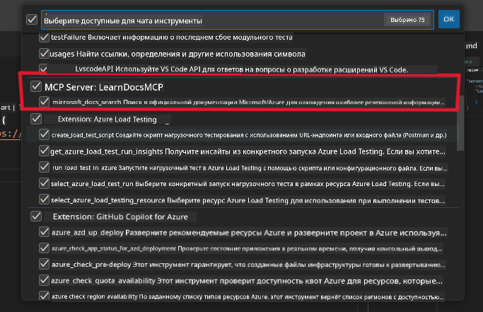
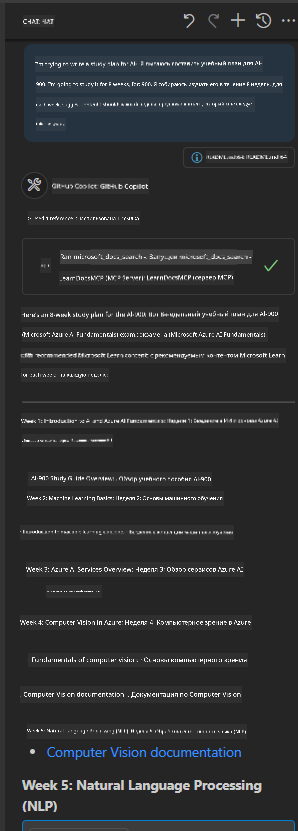
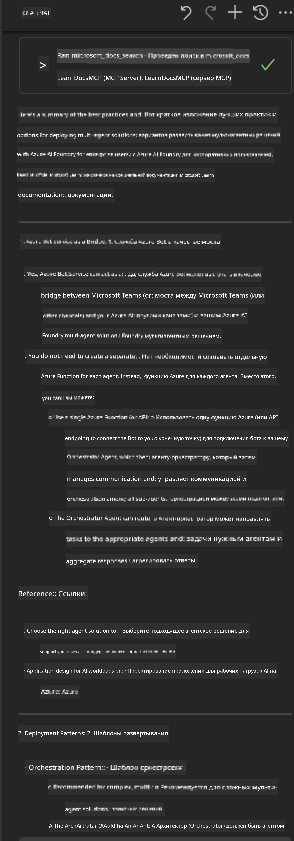

<!--
CO_OP_TRANSLATOR_METADATA:
{
  "original_hash": "db532b1ec386c9ce38c791653dc3c881",
  "translation_date": "2025-07-14T06:46:32+00:00",
  "source_file": "09-CaseStudy/docs-mcp/solution/scenario3/README.md",
  "language_code": "ru"
}
-->
# Сценарий 3: Документация в редакторе с MCP сервером в VS Code

## Обзор

В этом сценарии вы узнаете, как интегрировать Microsoft Learn Docs прямо в вашу среду Visual Studio Code с помощью MCP сервера. Вместо постоянного переключения между вкладками браузера для поиска документации, вы сможете получать доступ, искать и ссылаться на официальные материалы прямо в редакторе. Такой подход упрощает рабочий процесс, помогает сосредоточиться и обеспечивает бесшовную интеграцию с такими инструментами, как GitHub Copilot.

- Ищите и читайте документацию внутри VS Code, не покидая среды разработки.
- Вставляйте ссылки на документацию прямо в README или файлы курса.
- Используйте GitHub Copilot и MCP вместе для удобного и эффективного рабочего процесса с поддержкой ИИ.

## Цели обучения

К концу этой главы вы научитесь настраивать и использовать MCP сервер в VS Code для улучшения работы с документацией и разработки. Вы сможете:

- Настроить рабочее пространство для использования MCP сервера при поиске документации.
- Искать и вставлять документацию прямо из VS Code.
- Совмещать возможности GitHub Copilot и MCP для более продуктивной работы с поддержкой ИИ.

Эти навыки помогут вам оставаться сосредоточенным, улучшать качество документации и повышать продуктивность как разработчика или технического писателя.

## Решение

Для доступа к документации прямо в редакторе вам предстоит выполнить ряд шагов по интеграции MCP сервера с VS Code и GitHub Copilot. Это решение идеально подходит для авторов курсов, технических писателей и разработчиков, которые хотят оставаться в редакторе, работая с документацией и Copilot.

- Быстро добавляйте ссылки на документацию в README при написании курсов или проектной документации.
- Используйте Copilot для генерации кода и MCP для мгновенного поиска и цитирования релевантных материалов.
- Оставайтесь сосредоточенными в редакторе и повышайте продуктивность.

### Пошаговое руководство

Для начала выполните следующие шаги. Для каждого шага можно добавить скриншот из папки assets для наглядности.

1. **Добавьте конфигурацию MCP:**
   В корне проекта создайте файл `.vscode/mcp.json` и добавьте в него следующую конфигурацию:
   ```json
   {
     "servers": {
       "LearnDocsMCP": {
         "url": "https://learn.microsoft.com/api/mcp"
       }
     }
   }
   ```
   Эта конфигурация указывает VS Code, как подключиться к [`Microsoft Learn Docs MCP server`](https://github.com/MicrosoftDocs/mcp).
   
   
    
2. **Откройте панель GitHub Copilot Chat:**
   Если у вас ещё не установлен расширение GitHub Copilot, перейдите в раздел Extensions в VS Code и установите его. Скачать можно напрямую из [Visual Studio Code Marketplace](https://marketplace.visualstudio.com/items?itemName=GitHub.copilot-chat). Затем откройте панель Copilot Chat в боковой панели.

   

3. **Включите режим агента и проверьте инструменты:**
   В панели Copilot Chat включите режим агента.

   

   После включения режима агента убедитесь, что MCP сервер отображается в списке доступных инструментов. Это гарантирует, что агент Copilot сможет обращаться к серверу документации для получения нужной информации.
   
   
4. **Начните новый чат и задайте запрос агенту:**
   Откройте новый чат в панели Copilot Chat. Теперь вы можете задавать агенту вопросы по документации. Агент будет использовать MCP сервер для поиска и отображения релевантной документации Microsoft Learn прямо в редакторе.

   - *«Я хочу составить учебный план по теме X. Планирую изучать её 8 недель, предложи, какой контент стоит изучать каждую неделю.»*

   

5. **Живой запрос:**

   > Рассмотрим живой запрос из раздела [#get-help](https://discord.gg/D6cRhjHWSC) в Discord Azure AI Foundry ([оригинальное сообщение](https://discord.com/channels/1113626258182504448/1385498306720829572)):
   
   *«Я ищу ответы по развертыванию мультиагентного решения с AI агентами, разработанными на Azure AI Foundry. Похоже, нет прямого способа развертывания, например, через каналы Copilot Studio. Какие существуют варианты развертывания для корпоративных пользователей, чтобы они могли взаимодействовать и выполнять задачи? Есть много статей и блогов, где говорится, что можно использовать Azure Bot service как мост между MS Teams и агентами Azure AI Foundry. Сработает ли это, если я настрою Azure bot, который будет подключаться к Orchestrator Agent на Azure AI Foundry через Azure function для оркестрации, или нужно создавать Azure function для каждого AI агента в мультиагентном решении, чтобы выполнять оркестрацию на уровне Bot framework? Буду рад любым другим предложениям.»*

   

   Агент ответит с релевантными ссылками на документацию и краткими обзорами, которые вы сможете вставлять прямо в markdown-файлы или использовать как ссылки в коде.
   
### Примеры запросов

Вот несколько примеров запросов, которые вы можете попробовать. Они покажут, как MCP сервер и Copilot работают вместе, чтобы мгновенно предоставлять контекстно-зависимую документацию и ссылки, не покидая VS Code:

- «Покажи, как использовать триггеры Azure Functions.»
- «Вставь ссылку на официальную документацию по Azure Key Vault.»
- «Какие лучшие практики по обеспечению безопасности ресурсов Azure?»
- «Найди quickstart для Azure AI сервисов.»

Эти запросы демонстрируют, как MCP сервер и Copilot совместно обеспечивают быстрый доступ к документации и ссылкам без выхода из VS Code.

---

**Отказ от ответственности**:  
Этот документ был переведен с помощью сервиса автоматического перевода [Co-op Translator](https://github.com/Azure/co-op-translator). Несмотря на наши усилия по обеспечению точности, просим учитывать, что автоматический перевод может содержать ошибки или неточности. Оригинальный документ на его исходном языке следует считать авторитетным источником. Для получения критически важной информации рекомендуется обращаться к профессиональному переводу, выполненному человеком. Мы не несем ответственности за любые недоразумения или неправильные толкования, возникшие в результате использования данного перевода.