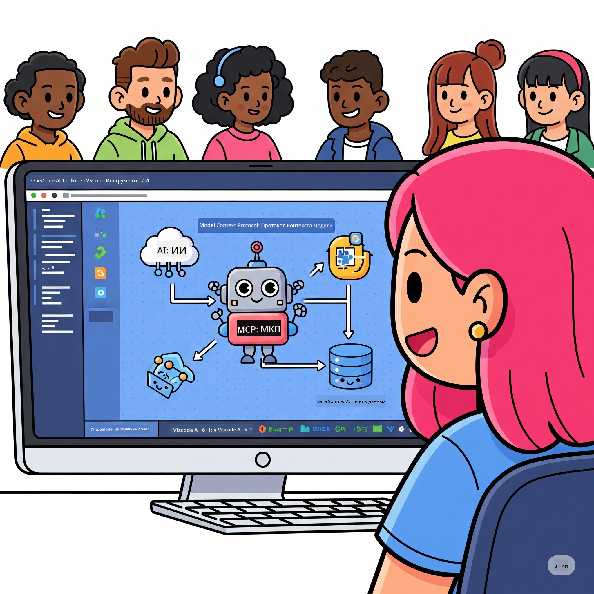
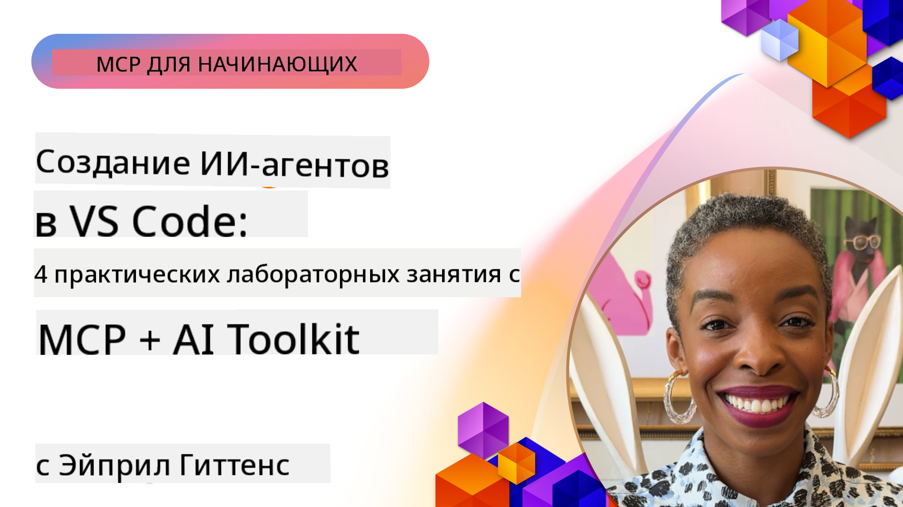

<!--
CO_OP_TRANSLATOR_METADATA:
{
  "original_hash": "1b000fd6e1b04c047578bfc5d07d54eb",
  "translation_date": "2025-08-18T13:27:21+00:00",
  "source_file": "10-StreamliningAIWorkflowsBuildingAnMCPServerWithAIToolkit/README.md",
  "language_code": "ru"
}
-->
# Оптимизация AI-рабочих процессов: создание MCP-сервера с помощью AI Toolkit

## 🎯 Обзор

_(Нажмите на изображение выше, чтобы посмотреть видео этого урока)_

Добро пожаловать на **Workshop по Model Context Protocol (MCP)**! Этот практический воркшоп объединяет две передовые технологии, чтобы преобразовать разработку AI-приложений:

- **🔗 Model Context Protocol (MCP)**: Открытый стандарт для бесшовной интеграции AI-инструментов  
- **🛠️ AI Toolkit для Visual Studio Code (AITK)**: Мощное расширение Microsoft для разработки AI

### 🎓 Чему вы научитесь

К концу этого воркшопа вы освоите искусство создания интеллектуальных приложений, которые соединяют AI-модели с реальными инструментами и сервисами. От автоматизированного тестирования до интеграции пользовательских API — вы получите практические навыки для решения сложных бизнес-задач.

## 🏗️ Технологический стек

### 🔌 Model Context Protocol (MCP)

MCP — это **"USB-C для AI"**, универсальный стандарт, который соединяет AI-модели с внешними инструментами и источниками данных.

**✨ Основные особенности:**

- 🔄 **Стандартизированная интеграция**: Универсальный интерфейс для подключения AI-инструментов  
- 🏛️ **Гибкая архитектура**: Локальные и удаленные серверы через stdio/SSE транспорт  
- 🧰 **Богатая экосистема**: Инструменты, подсказки и ресурсы в одном протоколе  
- 🔒 **Готовность к корпоративному использованию**: Встроенная безопасность и надежность  

**🎯 Почему MCP важен:**
Как USB-C устранил хаос с кабелями, MCP устраняет сложность интеграции AI. Один протокол — бесконечные возможности.

### 🤖 AI Toolkit для Visual Studio Code (AITK)

Флагманское расширение Microsoft для разработки AI, которое превращает VS Code в мощный инструмент для работы с AI.

**🚀 Основные возможности:**

- 📦 **Каталог моделей**: Доступ к моделям из Azure AI, GitHub, Hugging Face, Ollama  
- ⚡ **Локальное выполнение**: Оптимизированное выполнение ONNX на CPU/GPU/NPU  
- 🏗️ **Конструктор агентов**: Визуальная разработка AI-агентов с интеграцией MCP  
- 🎭 **Мультимодальность**: Поддержка текста, изображений и структурированных данных  

**💡 Преимущества разработки:**

- Развертывание моделей без настройки  
- Визуальная инженерия подсказок  
- Песочница для тестирования в реальном времени  
- Бесшовная интеграция MCP-серверов  

## 📚 Учебный путь

### [🚀 Модуль 1: Основы AI Toolkit](./lab1/README.md)

**Длительность**: 15 минут  

- 🛠️ Установите и настройте AI Toolkit для VS Code  
- 🗂️ Изучите Каталог моделей (100+ моделей из GitHub, ONNX, OpenAI, Anthropic, Google)  
- 🎮 Освойте Интерактивную песочницу для тестирования моделей в реальном времени  
- 🤖 Создайте своего первого AI-агента с помощью Конструктора агентов  
- 📊 Оцените производительность моделей с помощью встроенных метрик (F1, релевантность, схожесть, связность)  
- ⚡ Изучите возможности пакетной обработки и мультимодальной поддержки  

**🎯 Результат обучения**: Создание функционального AI-агента с полным пониманием возможностей AITK  

### [🌐 Модуль 2: Основы MCP с AI Toolkit](./lab2/README.md)

**Длительность**: 20 минут  

- 🧠 Освойте архитектуру и концепции Model Context Protocol (MCP)  
- 🌐 Изучите экосистему MCP-серверов от Microsoft  
- 🤖 Создайте агента для автоматизации браузера с использованием Playwright MCP-сервера  
- 🔧 Интегрируйте MCP-серверы с Конструктором агентов AI Toolkit  
- 📊 Настройте и протестируйте MCP-инструменты в своих агентах  
- 🚀 Экспортируйте и разверните агентов с поддержкой MCP для использования в продакшене  

**🎯 Результат обучения**: Развертывание AI-агента, усиленного внешними инструментами через MCP  

### [🔧 Модуль 3: Продвинутая разработка MCP с AI Toolkit](./lab3/README.md)

**Длительность**: 20 минут  

- 💻 Создайте пользовательские MCP-серверы с помощью AI Toolkit  
- 🐍 Настройте и используйте последнюю версию MCP Python SDK (v1.9.3)  
- 🔍 Настройте и используйте MCP Inspector для отладки  
- 🛠️ Создайте Weather MCP Server с профессиональными рабочими процессами отладки  
- 🧪 Отлаживайте MCP-серверы в средах Конструктора агентов и MCP Inspector  

**🎯 Результат обучения**: Разработка и отладка пользовательских MCP-серверов с использованием современных инструментов  

### [🐙 Модуль 4: Практическая разработка MCP - пользовательский сервер GitHub Clone](./lab4/README.md)

**Длительность**: 30 минут  

- 🏗️ Создайте реальный MCP-сервер GitHub Clone для рабочих процессов разработки  
- 🔄 Реализуйте интеллектуальное клонирование репозиториев с проверкой и обработкой ошибок  
- 📁 Создайте интеллектуальное управление директориями и интеграцию с VS Code  
- 🤖 Используйте режим агента GitHub Copilot с пользовательскими MCP-инструментами  
- 🛡️ Примените надежность уровня продакшена и кроссплатформенную совместимость  

**🎯 Результат обучения**: Развертывание готового к продакшену MCP-сервера, оптимизирующего реальные рабочие процессы разработки  

## 💡 Применение в реальном мире и влияние

### 🏢 Корпоративные сценарии использования

#### 🔄 Автоматизация DevOps

Преобразуйте рабочие процессы разработки с помощью интеллектуальной автоматизации:

- **Управление репозиториями**: AI-управляемый обзор кода и принятие решений о слиянии  
- **Интеллектуальный CI/CD**: Автоматическая оптимизация пайплайнов на основе изменений в коде  
- **Классификация задач**: Автоматическая классификация и назначение багов  

#### 🧪 Революция в обеспечении качества

Повышайте уровень тестирования с помощью AI-автоматизации:

- **Интеллектуальная генерация тестов**: Автоматическое создание комплексных тестовых наборов  
- **Визуальное регрессионное тестирование**: Обнаружение изменений в UI с помощью AI  
- **Мониторинг производительности**: Прогнозирование и устранение проблем  

#### 📊 Интеллектуальные данные

Создавайте более умные рабочие процессы обработки данных:

- **Адаптивные ETL-процессы**: Самооптимизирующиеся преобразования данных  
- **Обнаружение аномалий**: Мониторинг качества данных в реальном времени  
- **Интеллектуальная маршрутизация**: Управление потоками данных  

#### 🎧 Улучшение клиентского опыта

Создавайте исключительные взаимодействия с клиентами:

- **Контекстно-осведомленная поддержка**: AI-агенты с доступом к истории клиента  
- **Прогнозирующее решение проблем**: Предиктивное обслуживание клиентов  
- **Мультиканальная интеграция**: Единый AI-опыт на всех платформах  

## 🛠️ Требования и настройка

### 💻 Системные требования

| Компонент | Требование | Примечания |
|-----------|------------|------------|
| **Операционная система** | Windows 10+, macOS 10.15+, Linux | Любая современная ОС |
| **Visual Studio Code** | Последняя стабильная версия | Требуется для AITK |
| **Node.js** | v18.0+ и npm | Для разработки MCP-серверов |
| **Python** | 3.10+ | Опционально для MCP-серверов на Python |
| **Память** | Минимум 8 ГБ ОЗУ | Рекомендуется 16 ГБ для локальных моделей |

### 🔧 Среда разработки

#### Рекомендуемые расширения для VS Code

- **AI Toolkit** (ms-windows-ai-studio.windows-ai-studio)  
- **Python** (ms-python.python)  
- **Python Debugger** (ms-python.debugpy)  
- **GitHub Copilot** (GitHub.copilot) - Опционально, но полезно  

#### Опциональные инструменты

- **uv**: Современный менеджер пакетов для Python  
- **MCP Inspector**: Визуальный инструмент для отладки MCP-серверов  
- **Playwright**: Для примеров веб-автоматизации  

## 🎖️ Результаты обучения и сертификация

### 🏆 Чек-лист навыков

Завершив этот воркшоп, вы освоите:

#### 🎯 Основные компетенции

- [ ] **Мастерство MCP**: Глубокое понимание архитектуры и шаблонов реализации  
- [ ] **Профессионализм в AITK**: Экспертное использование AI Toolkit для быстрой разработки  
- [ ] **Разработка серверов**: Создание, развертывание и поддержка MCP-серверов  
- [ ] **Интеграция инструментов**: Бесшовное подключение AI к существующим рабочим процессам  
- [ ] **Решение задач**: Применение навыков для решения реальных бизнес-проблем  

#### 🔧 Технические навыки

- [ ] Настройка и конфигурация AI Toolkit в VS Code  
- [ ] Проектирование и реализация пользовательских MCP-серверов  
- [ ] Интеграция моделей GitHub с архитектурой MCP  
- [ ] Создание автоматизированных тестовых рабочих процессов с Playwright  
- [ ] Развертывание AI-агентов для продакшена  
- [ ] Отладка и оптимизация производительности MCP-серверов  

#### 🚀 Продвинутые возможности

- [ ] Архитектура AI-интеграций корпоративного уровня  
- [ ] Реализация лучших практик безопасности для AI-приложений  
- [ ] Проектирование масштабируемых архитектур MCP-серверов  
- [ ] Создание пользовательских цепочек инструментов для конкретных доменов  
- [ ] Наставничество в области разработки AI  

## 📖 Дополнительные ресурсы

- [Спецификация MCP](https://modelcontextprotocol.io/docs)  
- [Репозиторий AI Toolkit на GitHub](https://github.com/microsoft/vscode-ai-toolkit)  
- [Коллекция примеров MCP-серверов](https://github.com/modelcontextprotocol/servers)  
- [Руководство по лучшим практикам](https://modelcontextprotocol.io/docs/best-practices)  

---

**🚀 Готовы преобразовать ваш рабочий процесс разработки AI?**

Давайте вместе строить будущее интеллектуальных приложений с MCP и AI Toolkit!

**Отказ от ответственности**:  
Этот документ был переведен с использованием сервиса автоматического перевода [Co-op Translator](https://github.com/Azure/co-op-translator). Несмотря на наши усилия обеспечить точность, автоматические переводы могут содержать ошибки или неточности. Оригинальный документ на его родном языке следует считать авторитетным источником. Для получения критически важной информации рекомендуется профессиональный перевод человеком. Мы не несем ответственности за любые недоразумения или неправильные интерпретации, возникающие в результате использования данного перевода.