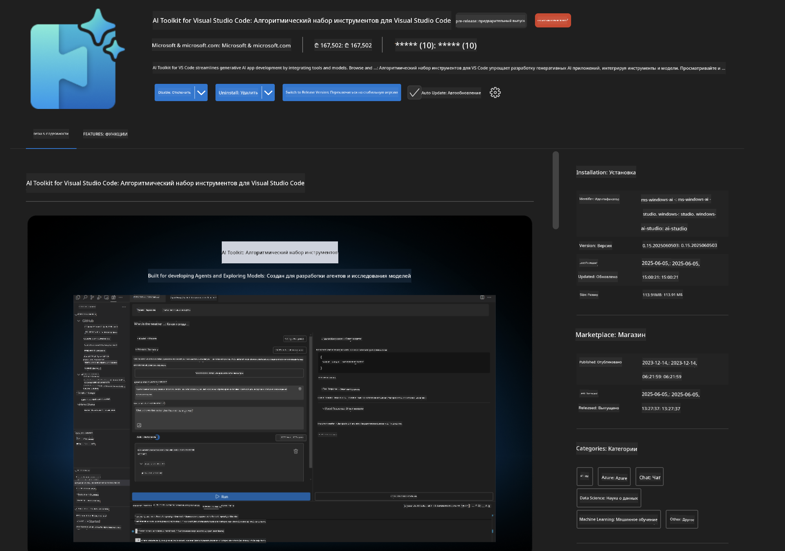
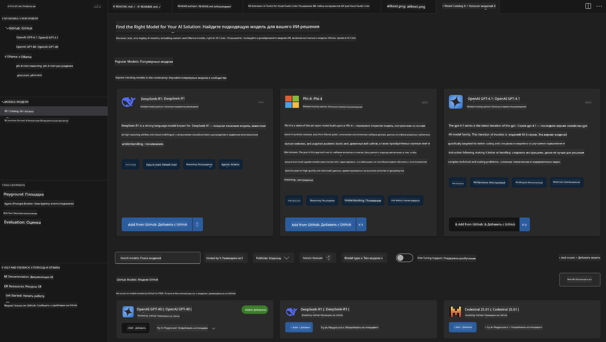
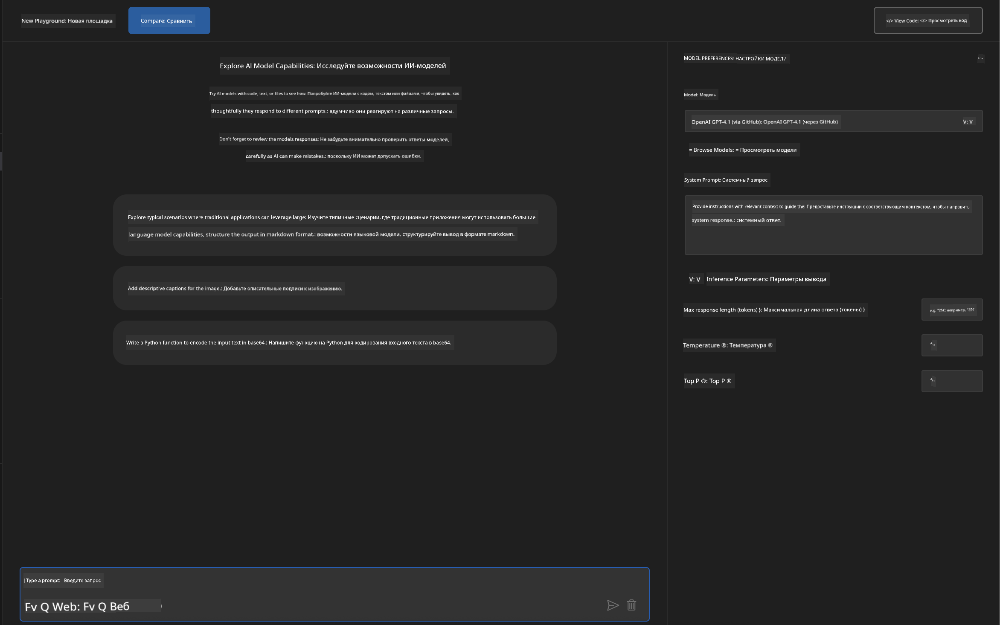
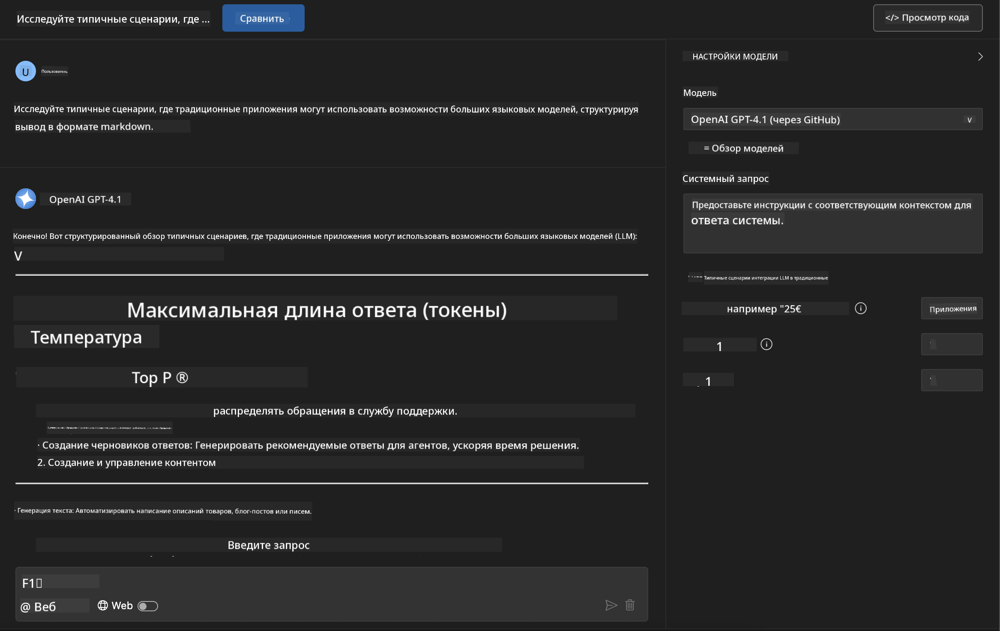
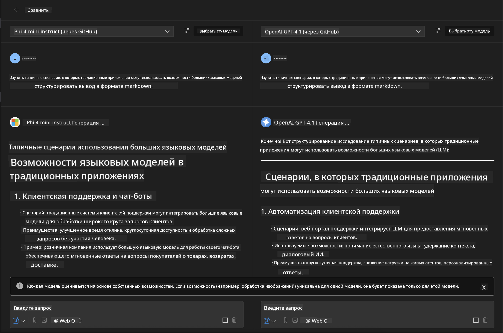
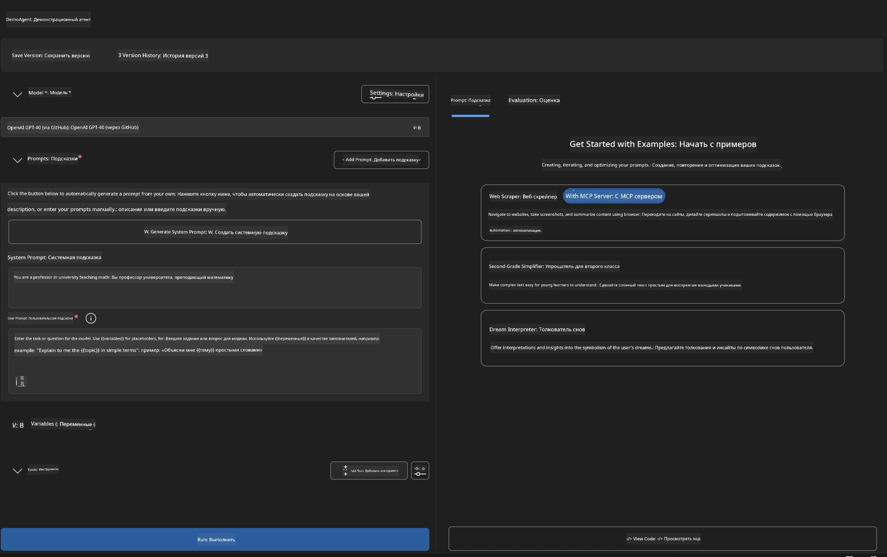
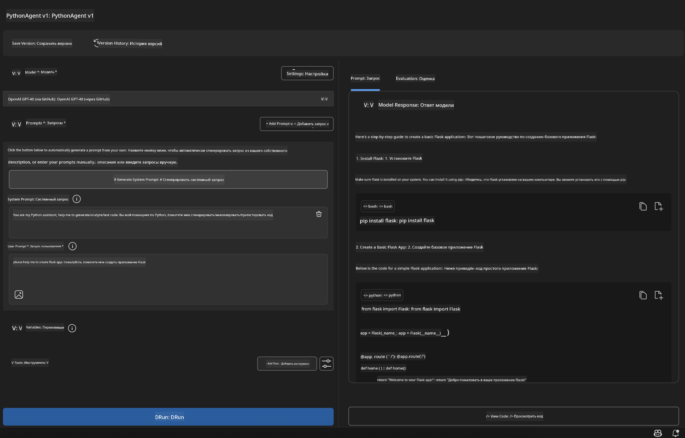

<!--
CO_OP_TRANSLATOR_METADATA:
{
  "original_hash": "2aa9dbc165e104764fa57e8a0d3f1c73",
  "translation_date": "2025-07-14T07:18:36+00:00",
  "source_file": "10-StreamliningAIWorkflowsBuildingAnMCPServerWithAIToolkit/lab1/README.md",
  "language_code": "ru"
}
-->
# 🚀 Модуль 1: Основы AI Toolkit

[]()
[]()
[]()

## 📋 Цели обучения

К концу этого модуля вы сможете:
- ✅ Установить и настроить AI Toolkit для Visual Studio Code
- ✅ Ориентироваться в Каталоге моделей и понимать разные источники моделей
- ✅ Использовать Playground для тестирования и экспериментов с моделями
- ✅ Создавать кастомных AI-агентов с помощью Agent Builder
- ✅ Сравнивать производительность моделей от разных провайдеров
- ✅ Применять лучшие практики в prompt-инжиниринге

## 🧠 Введение в AI Toolkit (AITK)

**AI Toolkit для Visual Studio Code** — это флагманское расширение Microsoft, которое превращает VS Code в полноценную среду для разработки AI. Оно соединяет исследования в области ИИ с практической разработкой, делая генеративный ИИ доступным для разработчиков любого уровня.

### 🌟 Ключевые возможности

| Функция | Описание | Пример использования |
|---------|-------------|----------|
| **🗂️ Каталог моделей** | Доступ к более чем 100 моделям с GitHub, ONNX, OpenAI, Anthropic, Google | Поиск и выбор моделей |
| **🔌 Поддержка BYOM** | Интеграция собственных моделей (локальных или удалённых) | Развёртывание кастомных моделей |
| **🎮 Интерактивный Playground** | Тестирование моделей в реальном времени с чат-интерфейсом | Быстрое прототипирование и тестирование |
| **📎 Мультимодальная поддержка** | Работа с текстом, изображениями и вложениями | Сложные AI-приложения |
| **⚡ Пакетная обработка** | Запуск нескольких запросов одновременно | Эффективные рабочие процессы тестирования |
| **📊 Оценка моделей** | Встроенные метрики (F1, релевантность, сходство, когерентность) | Оценка производительности |

### 🎯 Почему AI Toolkit важен

- **🚀 Ускоренная разработка**: от идеи до прототипа за считанные минуты
- **🔄 Унифицированный рабочий процесс**: один интерфейс для разных AI-провайдеров
- **🧪 Простые эксперименты**: сравнивайте модели без сложной настройки
- **📈 Готовность к продакшену**: плавный переход от прототипа к развертыванию

## 🛠️ Требования и установка

### 📦 Установка расширения AI Toolkit

**Шаг 1: Откройте Marketplace расширений**
1. Запустите Visual Studio Code
2. Перейдите в раздел расширений (`Ctrl+Shift+X` или `Cmd+Shift+X`)
3. Введите в поиск "AI Toolkit"

**Шаг 2: Выберите версию**
- **🟢 Релиз**: рекомендуется для использования в продакшене
- **🔶 Предрелиз**: ранний доступ к новым функциям

**Шаг 3: Установите и активируйте**



### ✅ Контрольный список проверки
- [ ] Иконка AI Toolkit отображается в боковой панели VS Code
- [ ] Расширение включено и активировано
- [ ] В панели вывода нет ошибок установки

## 🧪 Практическое задание 1: Изучение моделей GitHub

**🎯 Цель**: Освоить Каталог моделей и протестировать первую AI-модель

### 📊 Шаг 1: Ориентируемся в Каталоге моделей

Каталог моделей — ваш вход в экосистему AI. Он собирает модели от разных провайдеров, упрощая поиск и сравнение.

**🔍 Как навигировать:**

Нажмите на **MODELS - Catalog** в боковой панели AI Toolkit



**💡 Совет**: Ищите модели с нужными возможностями, которые подходят под вашу задачу (например, генерация кода, креативное письмо, анализ).

**⚠️ Важно**: Модели, размещённые на GitHub (GitHub Models), бесплатны, но имеют ограничения по количеству запросов и токенов. Для доступа к внешним моделям (например, через Azure AI или другие сервисы) потребуется соответствующий API-ключ или аутентификация.

### 🚀 Шаг 2: Добавляем и настраиваем первую модель

**Стратегия выбора модели:**
- **GPT-4.1**: лучше всего подходит для сложного анализа и рассуждений
- **Phi-4-mini**: лёгкая и быстрая модель для простых задач

**🔧 Процесс настройки:**
1. Выберите **OpenAI GPT-4.1** в каталоге
2. Нажмите **Add to My Models** — модель будет зарегистрирована для использования
3. Выберите **Try in Playground** для запуска тестовой среды
4. Подождите инициализации модели (первый запуск может занять время)



**⚙️ Параметры модели:**
- **Temperature**: регулирует креативность (0 = детерминированный ответ, 1 = творческий)
- **Max Tokens**: максимальная длина ответа
- **Top-p**: ядро сэмплирования для разнообразия ответов

### 🎯 Шаг 3: Осваиваем интерфейс Playground

Playground — ваша лаборатория для экспериментов с AI. Вот как использовать её максимально эффективно:

**🎨 Лучшие практики prompt-инжиниринга:**
1. **Будьте конкретны**: чёткие и подробные инструкции дают лучшие результаты
2. **Добавляйте контекст**: включайте релевантную информацию
3. **Используйте примеры**: показывайте модели, что именно вы хотите
4. **Итерации**: улучшайте запросы на основе первых ответов

**🧪 Сценарии тестирования:**
```markdown
# Example 1: Code Generation
"Write a Python function that calculates the factorial of a number using recursion. Include error handling and docstrings."

# Example 2: Creative Writing
"Write a professional email to a client explaining a project delay, maintaining a positive tone while being transparent about challenges."

# Example 3: Data Analysis
"Analyze this sales data and provide insights: [paste your data]. Focus on trends, anomalies, and actionable recommendations."
```



### 🏆 Задание-челлендж: Сравнение производительности моделей

**🎯 Цель**: Сравнить разные модели на одинаковых запросах, чтобы понять их сильные стороны

**📋 Инструкция:**
1. Добавьте **Phi-4-mini** в рабочее пространство
2. Используйте одинаковый запрос для GPT-4.1 и Phi-4-mini


3. Сравните качество ответов, скорость и точность
4. Запишите результаты в соответствующем разделе



**💡 Важные выводы:**
- Когда лучше использовать LLM, а когда SLM
- Баланс между стоимостью и производительностью
- Специализированные возможности разных моделей

## 🤖 Практическое задание 2: Создание кастомных агентов с Agent Builder

**🎯 Цель**: Создать специализированных AI-агентов для конкретных задач и рабочих процессов

### 🏗️ Шаг 1: Понимание Agent Builder

Agent Builder — это ключевая функция AI Toolkit. Она позволяет создавать целевых AI-ассистентов, объединяющих мощь больших языковых моделей с кастомными инструкциями, параметрами и специализированными знаниями.

**🧠 Компоненты архитектуры агента:**
- **Core Model**: базовая LLM (GPT-4, Groks, Phi и др.)
- **System Prompt**: задаёт личность и поведение агента
- **Параметры**: тонкая настройка для оптимальной работы
- **Интеграция инструментов**: подключение к внешним API и MCP-сервисам
- **Память**: контекст диалога и сохранение сессии



### ⚙️ Шаг 2: Глубокое погружение в настройку агента

**🎨 Создание эффективных системных prompt-ов:**
```markdown
# Template Structure:
## Role Definition
You are a [specific role] with expertise in [domain].

## Capabilities
- List specific abilities
- Define scope of knowledge
- Clarify limitations

## Behavior Guidelines
- Response style (formal, casual, technical)
- Output format preferences
- Error handling approach

## Examples
Provide 2-3 examples of ideal interactions
```

*Конечно, вы также можете использовать Generate System Prompt, чтобы AI помог сгенерировать и оптимизировать промпты*

**🔧 Оптимизация параметров:**
| Параметр | Рекомендуемый диапазон | Пример использования |
|-----------|------------------|----------|
| **Temperature** | 0.1-0.3 | Технические и фактические ответы |
| **Temperature** | 0.7-0.9 | Креативные и мозговые штурмы |
| **Max Tokens** | 500-1000 | Краткие ответы |
| **Max Tokens** | 2000-4000 | Подробные объяснения |

### 🐍 Шаг 3: Практическое задание — агент для программирования на Python

**🎯 Задача**: Создать специализированного помощника по Python

**📋 Шаги настройки:**

1. **Выбор модели**: выберите **Claude 3.5 Sonnet** (отлично подходит для кода)

2. **Дизайн системного prompt-а**:
```markdown
# Python Programming Expert Agent

## Role
You are a senior Python developer with 10+ years of experience. You excel at writing clean, efficient, and well-documented Python code.

## Capabilities
- Write production-ready Python code
- Debug complex issues
- Explain code concepts clearly
- Suggest best practices and optimizations
- Provide complete working examples

## Response Format
- Always include docstrings
- Add inline comments for complex logic
- Suggest testing approaches
- Mention relevant libraries when applicable

## Code Quality Standards
- Follow PEP 8 style guidelines
- Use type hints where appropriate
- Handle exceptions gracefully
- Write readable, maintainable code
```

3. **Настройка параметров**:
   - Temperature: 0.2 (для стабильного и надёжного кода)
   - Max Tokens: 2000 (подробные объяснения)
   - Top-p: 0.9 (сбалансированная креативность)



### 🧪 Шаг 4: Тестирование вашего Python-агента

**Сценарии тестирования:**
1. **Базовая функция**: "Создать функцию для поиска простых чисел"
2. **Сложный алгоритм**: "Реализовать бинарное дерево поиска с методами вставки, удаления и поиска"
3. **Реальная задача**: "Написать веб-скрейпер с обработкой ограничения по количеству запросов и повторными попытками"
4. **Отладка**: "Исправить этот код [вставьте проблемный код]"

**🏆 Критерии успеха:**
- ✅ Код работает без ошибок
- ✅ Включена документация
- ✅ Соблюдены лучшие практики Python
- ✅ Даны понятные объяснения
- ✅ Предложены улучшения

## 🎓 Итоги модуля 1 и дальнейшие шаги

### 📊 Проверка знаний

Проверьте себя:
- [ ] Можете объяснить различия между моделями в каталоге?
- [ ] Удалось ли создать и протестировать кастомного агента?
- [ ] Понимаете, как оптимизировать параметры под разные задачи?
- [ ] Умеете создавать эффективные системные prompt-ы?

### 📚 Дополнительные ресурсы

- **Документация AI Toolkit**: [Официальные документы Microsoft](https://github.com/microsoft/vscode-ai-toolkit)
- **Руководство по prompt-инжинирингу**: [Лучшие практики](https://platform.openai.com/docs/guides/prompt-engineering)
- **Модели в AI Toolkit**: [Модели в разработке](https://github.com/microsoft/vscode-ai-toolkit/blob/main/doc/models.md)

**🎉 Поздравляем!** Вы освоили основы AI Toolkit и готовы создавать более сложные AI-приложения!

### 🔜 Переход к следующему модулю

Готовы к новым возможностям? Продолжайте с **[Модуль 2: Основы MCP с AI Toolkit](../lab2/README.md)**, где вы научитесь:
- Подключать агентов к внешним инструментам через Model Context Protocol (MCP)
- Создавать агентов для автоматизации браузера с Playwright
- Интегрировать MCP-серверы с вашими AI Toolkit агентами
- Усиливать агентов внешними данными и возможностями

**Отказ от ответственности**:  
Этот документ был переведен с помощью сервиса автоматического перевода [Co-op Translator](https://github.com/Azure/co-op-translator). Несмотря на наши усилия по обеспечению точности, просим учитывать, что автоматический перевод может содержать ошибки или неточности. Оригинальный документ на его исходном языке следует считать авторитетным источником. Для получения критически важной информации рекомендуется обращаться к профессиональному переводу, выполненному человеком. Мы не несем ответственности за любые недоразумения или неправильные толкования, возникшие в результате использования данного перевода.