<!--
CO_OP_TRANSLATOR_METADATA:
{
  "original_hash": "a22b7dd11cd7690f99f9195877cafdc3",
  "translation_date": "2025-07-14T07:40:27+00:00",
  "source_file": "10-StreamliningAIWorkflowsBuildingAnMCPServerWithAIToolkit/lab2/README.md",
  "language_code": "ru"
}
-->
# 🌐 Модуль 2: Основы MCP с AI Toolkit

[]()
[]()
[]()

## 📋 Цели обучения

К концу этого модуля вы сможете:
- ✅ Понять архитектуру и преимущества Model Context Protocol (MCP)
- ✅ Ознакомиться с экосистемой MCP серверов Microsoft
- ✅ Интегрировать MCP серверы с AI Toolkit Agent Builder
- ✅ Создать функционального агента для автоматизации браузера с помощью Playwright MCP
- ✅ Настроить и протестировать MCP инструменты в ваших агентах
- ✅ Экспортировать и развертывать агентов с поддержкой MCP для использования в продакшене

## 🎯 Продолжение после Модуля 1

В Модуле 1 мы освоили основы AI Toolkit и создали нашего первого Python агента. Теперь мы **прокачаем** ваших агентов, подключив их к внешним инструментам и сервисам через революционный **Model Context Protocol (MCP)**.

Представьте, что вы переходите от простого калькулятора к полноценному компьютеру — ваши AI агенты получат возможность:
- 🌐 Просматривать и взаимодействовать с веб-сайтами
- 📁 Получать доступ и управлять файлами
- 🔧 Интегрироваться с корпоративными системами
- 📊 Обрабатывать данные в реальном времени через API

## 🧠 Понимание Model Context Protocol (MCP)

### 🔍 Что такое MCP?

Model Context Protocol (MCP) — это **«USB-C для AI-приложений»** — революционный открытый стандарт, который связывает большие языковые модели (LLM) с внешними инструментами, источниками данных и сервисами. Так же, как USB-C избавил от путаницы с кабелями, предоставив универсальный разъём, MCP упрощает интеграцию AI с помощью единого стандартизированного протокола.

### 🎯 Проблемы, которые решает MCP

**До MCP:**
- 🔧 Индивидуальные интеграции для каждого инструмента
- 🔄 Зависимость от поставщиков с проприетарными решениями
- 🔒 Уязвимости безопасности из-за разрозненных подключений
- ⏱️ Месяцы разработки для базовых интеграций

**С MCP:**
- ⚡ Интеграция инструментов по принципу plug-and-play
- 🔄 Независимая от поставщиков архитектура
- 🛡️ Встроенные лучшие практики безопасности
- 🚀 Добавление новых возможностей за считанные минуты

### 🏗️ Глубокое погружение в архитектуру MCP

MCP использует **клиент-серверную архитектуру**, создавая безопасную и масштабируемую экосистему:

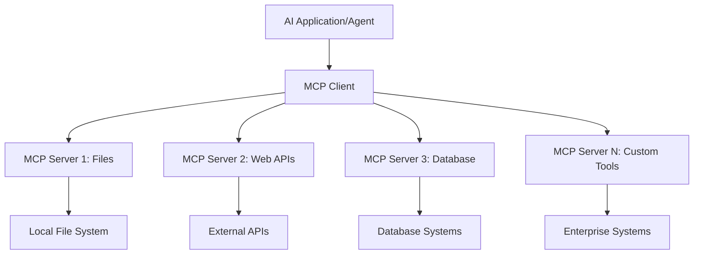

**🔧 Основные компоненты:**

| Компонент | Роль | Примеры |
|-----------|------|---------|
| **MCP Hosts** | Приложения, использующие MCP сервисы | Claude Desktop, VS Code, AI Toolkit |
| **MCP Clients** | Обработчики протокола (1:1 с серверами) | Встроены в хост-приложения |
| **MCP Servers** | Предоставляют возможности через стандартный протокол | Playwright, Files, Azure, GitHub |
| **Транспортный уровень** | Методы связи | stdio, HTTP, WebSockets |


## 🏢 Экосистема MCP серверов Microsoft

Microsoft возглавляет экосистему MCP, предлагая полный набор корпоративных серверов, решающих реальные бизнес-задачи.

### 🌟 Основные MCP серверы Microsoft

#### 1. ☁️ Azure MCP Server  
**🔗 Репозиторий**: [azure/azure-mcp](https://github.com/azure/azure-mcp)  
**🎯 Назначение**: Комплексное управление ресурсами Azure с AI интеграцией

**✨ Ключевые возможности:**
- Декларативное развертывание инфраструктуры
- Мониторинг ресурсов в реальном времени
- Рекомендации по оптимизации затрат
- Проверка соответствия требованиям безопасности

**🚀 Сценарии использования:**
- Infrastructure-as-Code с AI поддержкой
- Автоматическое масштабирование ресурсов
- Оптимизация затрат в облаке
- Автоматизация DevOps процессов

#### 2. 📊 Microsoft Dataverse MCP  
**📚 Документация**: [Microsoft Dataverse Integration](https://go.microsoft.com/fwlink/?linkid=2320176)  
**🎯 Назначение**: Интерфейс на естественном языке для бизнес-данных

**✨ Ключевые возможности:**
- Запросы к базе данных на естественном языке
- Понимание бизнес-контекста
- Пользовательские шаблоны подсказок
- Управление корпоративными данными

**🚀 Сценарии использования:**
- Отчёты бизнес-аналитики
- Анализ данных клиентов
- Инсайты по воронке продаж
- Запросы данных для соответствия требованиям

#### 3. 🌐 Playwright MCP Server  
**🔗 Репозиторий**: [microsoft/playwright-mcp](https://github.com/microsoft/playwright-mcp)  
**🎯 Назначение**: Автоматизация браузера и взаимодействие с веб

**✨ Ключевые возможности:**
- Кросс-браузерная автоматизация (Chrome, Firefox, Safari)
- Интеллектуальное обнаружение элементов
- Создание скриншотов и PDF
- Мониторинг сетевого трафика

**🚀 Сценарии использования:**
- Автоматизация тестирования
- Веб-скрейпинг и извлечение данных
- Мониторинг UI/UX
- Автоматизация конкурентного анализа

#### 4. 📁 Files MCP Server  
**🔗 Репозиторий**: [microsoft/files-mcp-server](https://github.com/microsoft/files-mcp-server)  
**🎯 Назначение**: Интеллектуальные операции с файловой системой

**✨ Ключевые возможности:**
- Декларативное управление файлами
- Синхронизация содержимого
- Интеграция с системами контроля версий
- Извлечение метаданных

**🚀 Сценарии использования:**
- Управление документацией
- Организация репозиториев кода
- Рабочие процессы публикации контента
- Обработка файлов в дата-пайплайнах

#### 5. 📝 MarkItDown MCP Server  
**🔗 Репозиторий**: [microsoft/markitdown](https://github.com/microsoft/markitdown)  
**🎯 Назначение**: Продвинутая обработка и манипуляция Markdown

**✨ Ключевые возможности:**
- Глубокий парсинг Markdown
- Конвертация форматов (MD ↔ HTML ↔ PDF)
- Анализ структуры контента
- Обработка шаблонов

**🚀 Сценарии использования:**
- Рабочие процессы технической документации
- Системы управления контентом
- Генерация отчётов
- Автоматизация базы знаний

#### 6. 📈 Clarity MCP Server  
**📦 Пакет**: [@microsoft/clarity-mcp-server](https://www.npmjs.com/package/@microsoft/clarity-mcp-server)  
**🎯 Назначение**: Веб-аналитика и анализ поведения пользователей

**✨ Ключевые возможности:**
- Анализ тепловых карт
- Записи сессий пользователей
- Метрики производительности
- Анализ воронки конверсий

**🚀 Сценарии использования:**
- Оптимизация сайта
- Исследование пользовательского опыта
- Анализ A/B тестов
- Дашборды бизнес-аналитики

### 🌍 Сообщество и экосистема

Помимо серверов Microsoft, экосистема MCP включает:
- **🐙 GitHub MCP**: управление репозиториями и анализ кода
- **🗄️ MCP для баз данных**: интеграции с PostgreSQL, MySQL, MongoDB
- **☁️ MCP облачных провайдеров**: инструменты AWS, GCP, Digital Ocean
- **📧 MCP для коммуникаций**: интеграции Slack, Teams, Email

## 🛠️ Практическая лаборатория: Создание агента для автоматизации браузера

**🎯 Цель проекта**: Создать интеллектуального агента для автоматизации браузера с помощью Playwright MCP, который сможет навигировать по сайтам, извлекать информацию и выполнять сложные веб-взаимодействия.

### 🚀 Фаза 1: Настройка основы агента

#### Шаг 1: Инициализация агента
1. **Откройте AI Toolkit Agent Builder**  
2. **Создайте нового агента** с такими параметрами:  
   - **Имя**: `BrowserAgent`  
   - **Модель**: Выберите GPT-4o  

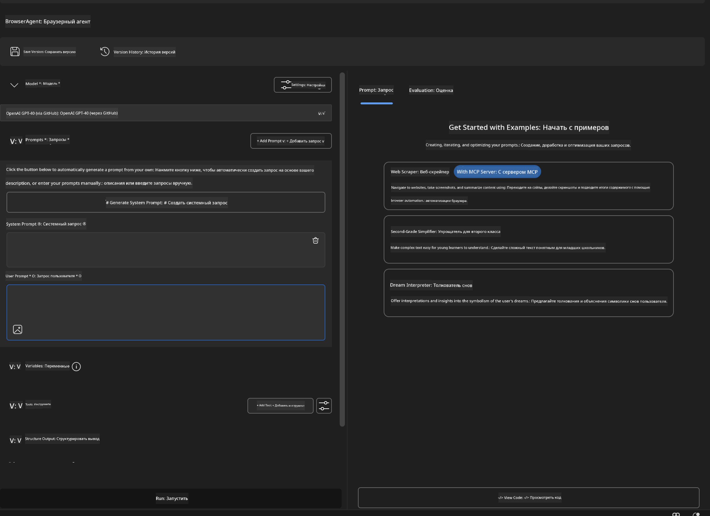


### 🔧 Фаза 2: Интеграция MCP

#### Шаг 3: Добавление MCP сервера
1. **Перейдите в раздел Tools** в Agent Builder  
2. **Нажмите "Add Tool"** для открытия меню интеграций  
3. **Выберите "MCP Server"** из доступных опций  

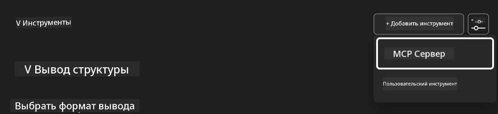

**🔍 Понимание типов инструментов:**  
- **Встроенные инструменты**: преднастроенные функции AI Toolkit  
- **MCP серверы**: интеграции с внешними сервисами  
- **Пользовательские API**: ваши собственные сервисные эндпоинты  
- **Вызов функций**: прямой доступ к функциям модели  

#### Шаг 4: Выбор MCP сервера
1. **Выберите опцию "MCP Server"** для продолжения  
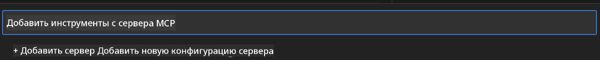

2. **Просмотрите каталог MCP** для изучения доступных интеграций  
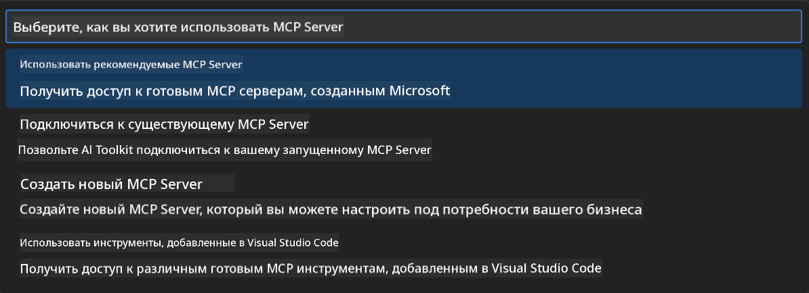


### 🎮 Фаза 3: Конфигурация Playwright MCP

#### Шаг 5: Выбор и настройка Playwright
1. **Нажмите "Use Featured MCP Servers"** для доступа к проверенным серверам Microsoft  
2. **Выберите "Playwright"** из списка  
3. **Примите стандартный MCP ID** или настройте под свою среду  

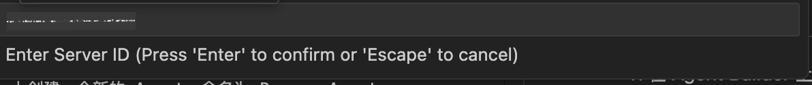

#### Шаг 6: Включение возможностей Playwright
**🔑 Важный шаг**: Выберите **ВСЕ** доступные методы Playwright для максимальной функциональности  

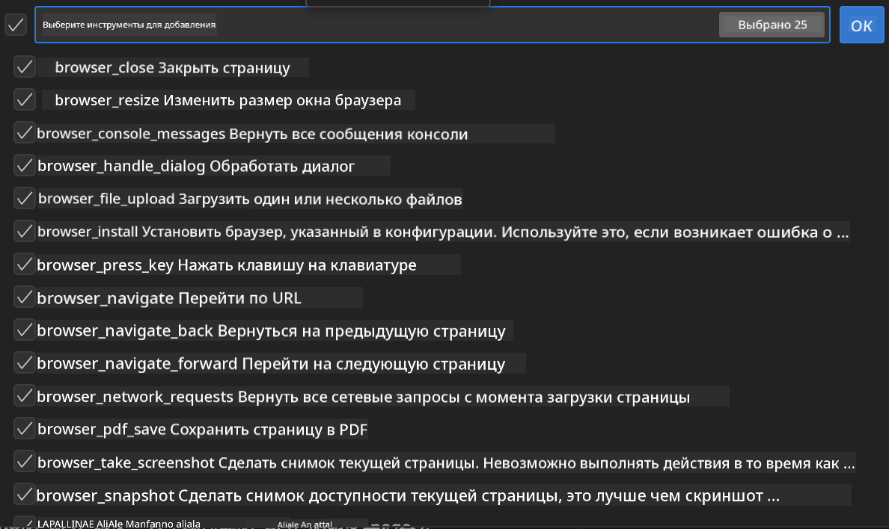

**🛠️ Основные инструменты Playwright:**  
- **Навигация**: `goto`, `goBack`, `goForward`, `reload`  
- **Взаимодействие**: `click`, `fill`, `press`, `hover`, `drag`  
- **Извлечение**: `textContent`, `innerHTML`, `getAttribute`  
- **Проверка**: `isVisible`, `isEnabled`, `waitForSelector`  
- **Захват**: `screenshot`, `pdf`, `video`  
- **Сеть**: `setExtraHTTPHeaders`, `route`, `waitForResponse`  

#### Шаг 7: Проверка успешной интеграции
**✅ Признаки успеха:**  
- Все инструменты отображаются в интерфейсе Agent Builder  
- Нет сообщений об ошибках в панели интеграции  
- Статус Playwright сервера показывает "Connected"  

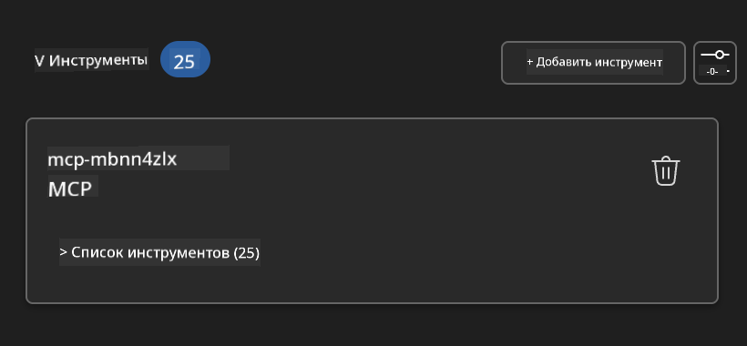

**🔧 Решение распространённых проблем:**  
- **Ошибка подключения**: проверьте интернет и настройки брандмауэра  
- **Отсутствие инструментов**: убедитесь, что выбрали все возможности при настройке  
- **Ошибки разрешений**: проверьте, что VS Code имеет необходимые системные права  

### 🎯 Фаза 4: Продвинутое проектирование подсказок

#### Шаг 8: Создание интеллектуальных системных подсказок  
Создайте сложные подсказки, использующие весь потенциал Playwright:  

```markdown
# Web Automation Expert System Prompt

## Core Identity
You are an advanced web automation specialist with deep expertise in browser automation, web scraping, and user experience analysis. You have access to Playwright tools for comprehensive browser control.

## Capabilities & Approach
### Navigation Strategy
- Always start with screenshots to understand page layout
- Use semantic selectors (text content, labels) when possible
- Implement wait strategies for dynamic content
- Handle single-page applications (SPAs) effectively

### Error Handling
- Retry failed operations with exponential backoff
- Provide clear error descriptions and solutions
- Suggest alternative approaches when primary methods fail
- Always capture diagnostic screenshots on errors

### Data Extraction
- Extract structured data in JSON format when possible
- Provide confidence scores for extracted information
- Validate data completeness and accuracy
- Handle pagination and infinite scroll scenarios

### Reporting
- Include step-by-step execution logs
- Provide before/after screenshots for verification
- Suggest optimizations and alternative approaches
- Document any limitations or edge cases encountered

## Ethical Guidelines
- Respect robots.txt and rate limiting
- Avoid overloading target servers
- Only extract publicly available information
- Follow website terms of service
```

#### Шаг 9: Создание динамических пользовательских подсказок  
Разработайте подсказки, демонстрирующие различные возможности:  

**🌐 Пример веб-анализа:**  
```markdown
Navigate to github.com/kinfey and provide a comprehensive analysis including:
1. Repository structure and organization
2. Recent activity and contribution patterns  
3. Documentation quality assessment
4. Technology stack identification
5. Community engagement metrics
6. Notable projects and their purposes

Include screenshots at key steps and provide actionable insights.
```

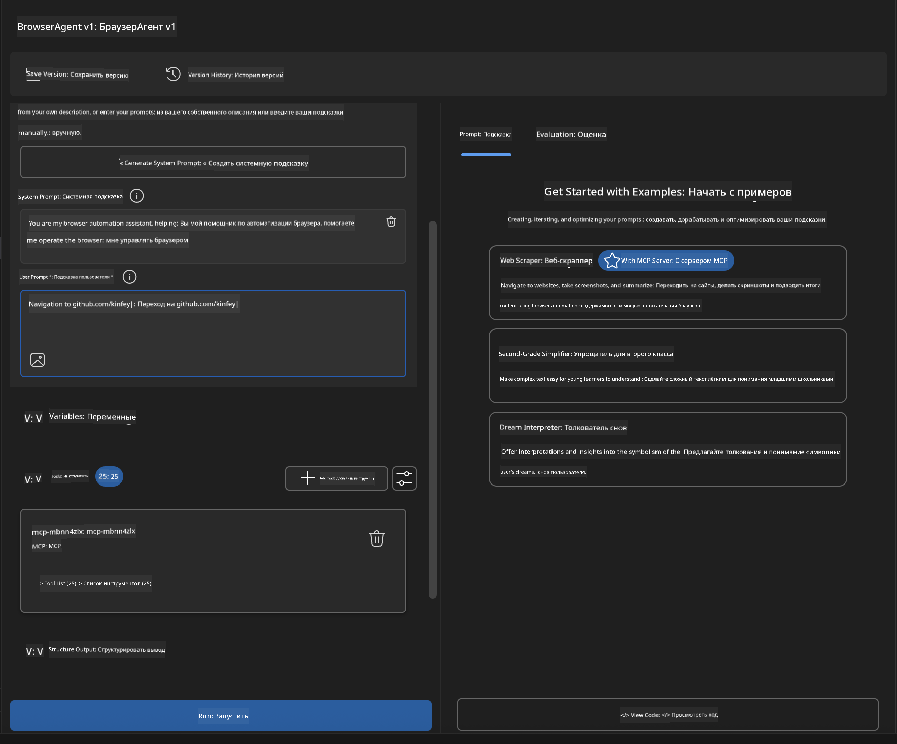

### 🚀 Фаза 5: Запуск и тестирование

#### Шаг 10: Запустите первую автоматизацию
1. **Нажмите "Run"** для запуска последовательности автоматизации  
2. **Отслеживайте выполнение в реальном времени**:  
   - Автоматически запускается браузер Chrome  
   - Агент переходит на целевой сайт  
   - Скриншоты фиксируют каждый важный шаг  
   - Результаты анализа выводятся в реальном времени  

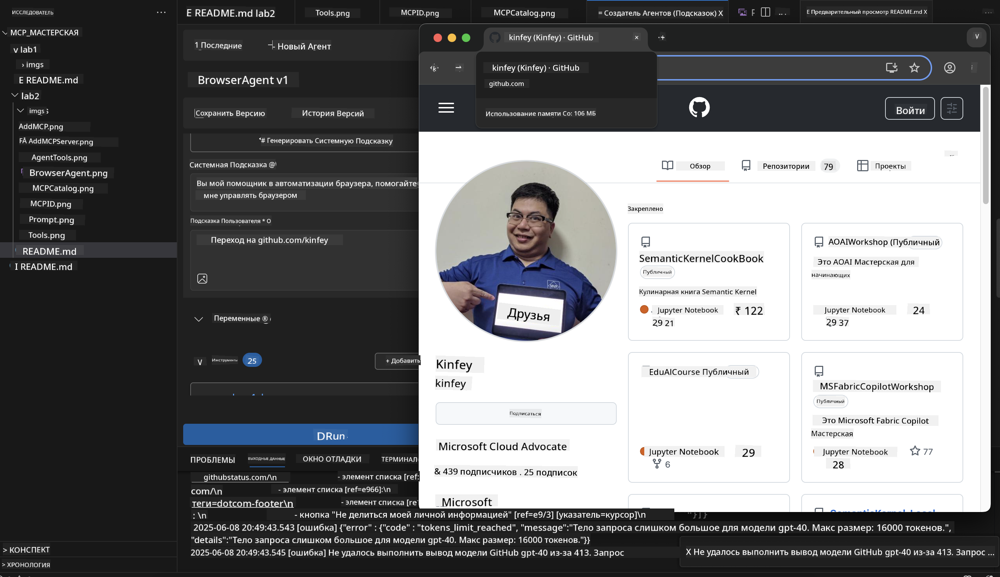

#### Шаг 11: Анализ результатов и выводы  
Просмотрите подробный анализ в интерфейсе Agent Builder:  

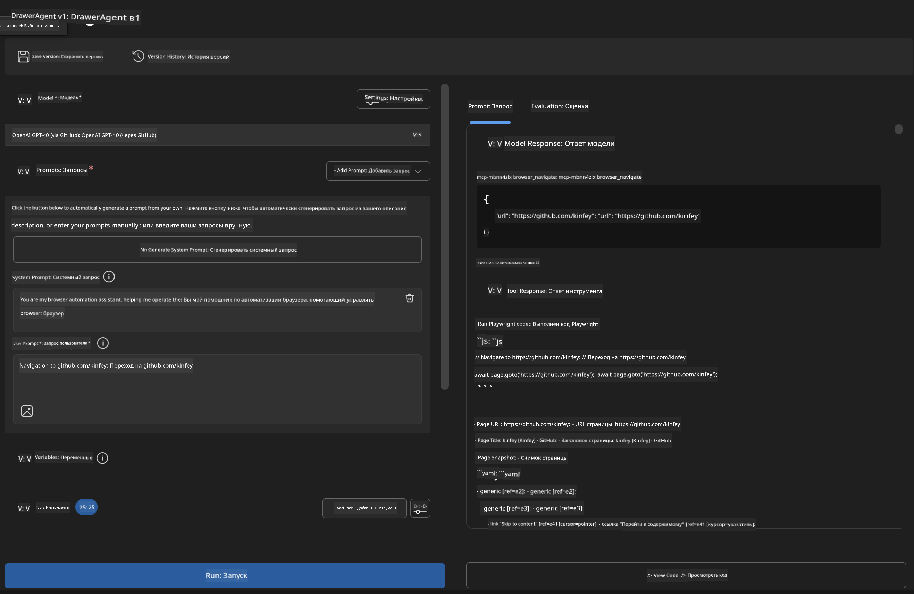

### 🌟 Фаза 6: Расширенные возможности и развертывание

#### Шаг 12: Экспорт и развертывание в продакшен  
Agent Builder поддерживает несколько вариантов развертывания:  

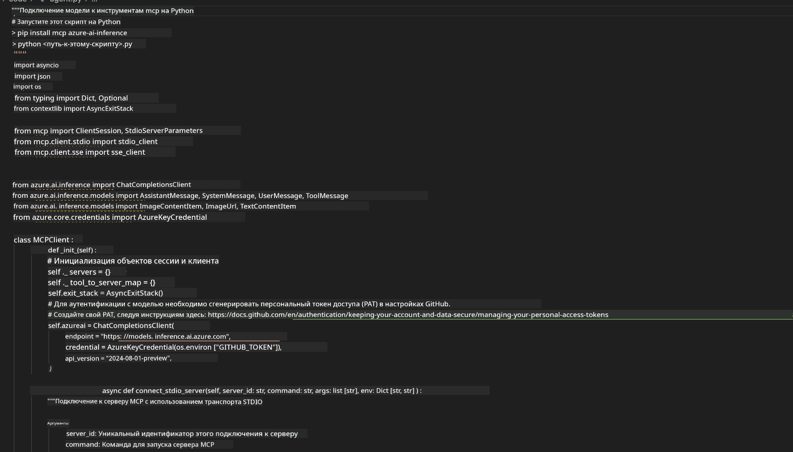

## 🎓 Итоги Модуля 2 и дальнейшие шаги

### 🏆 Достижение: Мастер интеграции MCP

**✅ Освоенные навыки:**  
- [ ] Понимание архитектуры и преимуществ MCP  
- [ ] Ориентация в экосистеме MCP серверов Microsoft  
- [ ] Интеграция Playwright MCP с AI Toolkit  
- [ ] Создание сложных агентов для автоматизации браузера  
- [ ] Продвинутое проектирование подсказок для веб-автоматизации  

### 📚 Дополнительные ресурсы

- **🔗 Спецификация MCP**: [Официальная документация протокола](https://modelcontextprotocol.io/)  
- **🛠️ Playwright API**: [Полный справочник методов](https://playwright.dev/docs/api/class-playwright)  
- **🏢 MCP серверы Microsoft**: [Руководство по корпоративной интеграции](https://github.com/microsoft/mcp-servers)  
- **🌍 Примеры сообщества**: [Галерея MCP серверов](https://github.com/modelcontextprotocol/servers)  

**🎉 Поздравляем!** Вы успешно освоили интеграцию MCP и теперь можете создавать AI агентов с поддержкой внешних инструментов для продакшен-использования!


### 🔜 Продолжайте к следующему модулю

Готовы поднять свои навыки MCP на новый уровень? Перейдите к **[Модулю 3: Продвинутая разработка MCP с AI Toolkit](../lab3/README.md)**, где вы научитесь:  
- Создавать собственные кастомные MCP серверы  
- Настраивать и использовать последний MCP Python SDK  
- Работать с MCP Inspector для отладки  
- Осваивать продвинутые рабочие процессы разработки MCP серверов
- Создание сервера Weather MCP с нуля

**Отказ от ответственности**:  
Этот документ был переведен с помощью сервиса автоматического перевода [Co-op Translator](https://github.com/Azure/co-op-translator). Несмотря на наши усилия по обеспечению точности, просим учитывать, что автоматические переводы могут содержать ошибки или неточности. Оригинальный документ на его исходном языке следует считать авторитетным источником. Для получения критически важной информации рекомендуется обращаться к профессиональному человеческому переводу. Мы не несем ответственности за любые недоразумения или неправильные толкования, возникшие в результате использования данного перевода.