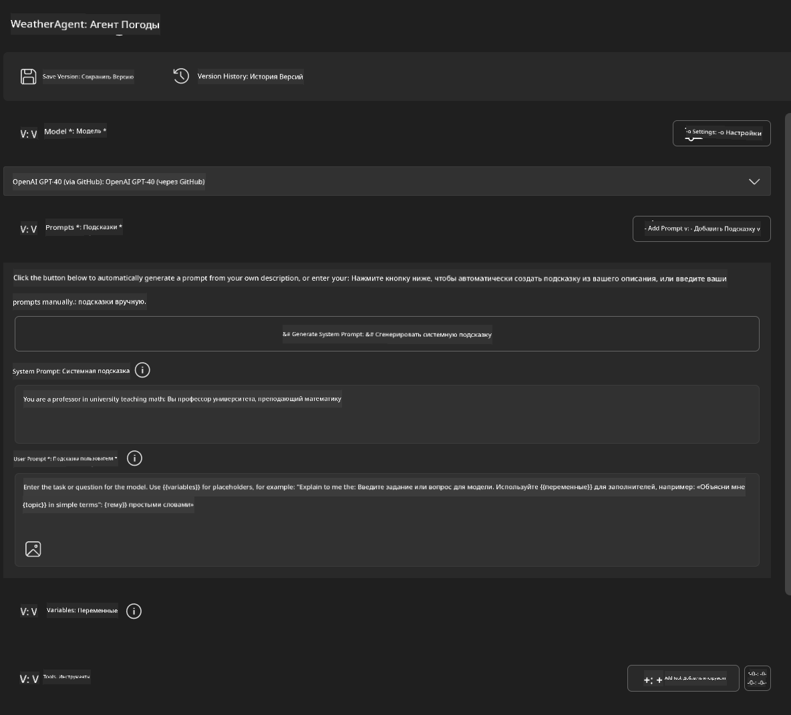
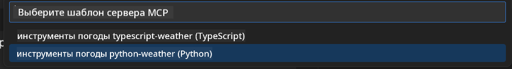
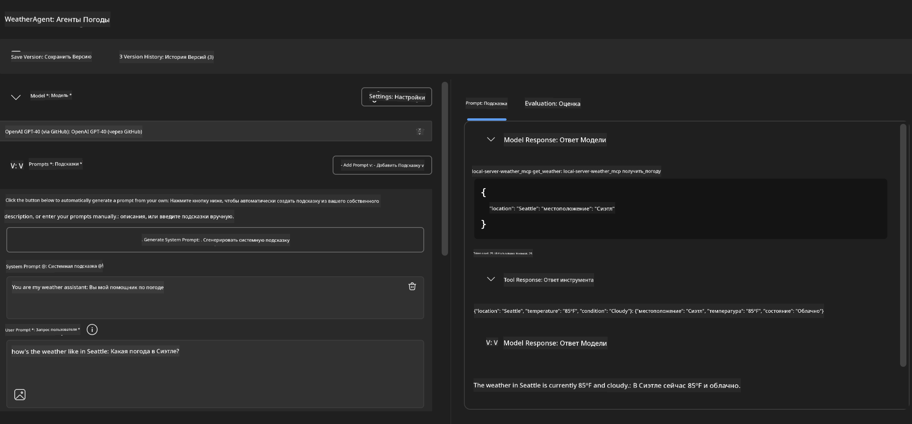
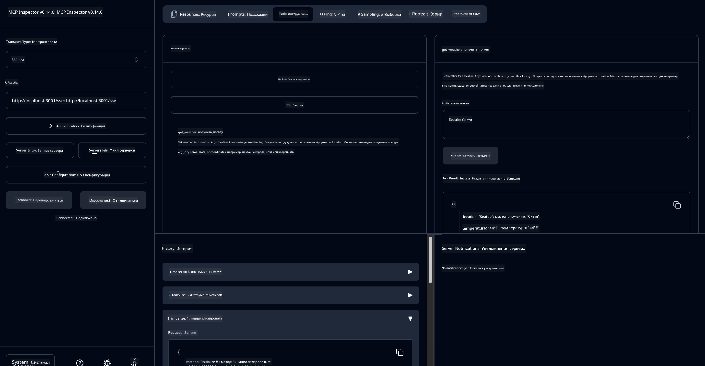

<!--
CO_OP_TRANSLATOR_METADATA:
{
  "original_hash": "dd8da3f75addcef453fe11f02a270217",
  "translation_date": "2025-07-14T08:07:08+00:00",
  "source_file": "10-StreamliningAIWorkflowsBuildingAnMCPServerWithAIToolkit/lab3/README.md",
  "language_code": "ru"
}
-->
# 🔧 Модуль 3: Продвинутая разработка MCP с AI Toolkit


## 🎯 Цели обучения

К концу этой лабораторной работы вы сможете:

- ✅ Создавать кастомные MCP-серверы с помощью AI Toolkit
- ✅ Настраивать и использовать последнюю версию MCP Python SDK (v1.9.3)
- ✅ Устанавливать и использовать MCP Inspector для отладки
- ✅ Отлаживать MCP-серверы как в Agent Builder, так и в Inspector
- ✅ Понимать продвинутые рабочие процессы разработки MCP-серверов

## 📋 Требования

- Завершение Лабораторной работы 2 (Основы MCP)
- VS Code с установленным расширением AI Toolkit
- Среда Python 3.10+
- Node.js и npm для настройки Inspector

## 🏗️ Что вы создадите

В этой лабораторной работе вы создадите **Weather MCP Server**, который демонстрирует:
- Реализацию кастомного MCP-сервера
- Интеграцию с AI Toolkit Agent Builder
- Профессиональные рабочие процессы отладки
- Современные паттерны использования MCP SDK

---

## 🔧 Обзор основных компонентов

### 🐍 MCP Python SDK
Python SDK для Model Context Protocol — основа для создания кастомных MCP-серверов. Вы будете использовать версию 1.9.3 с расширенными возможностями отладки.

### 🔍 MCP Inspector
Мощный инструмент для отладки, который предоставляет:
- Мониторинг сервера в реальном времени
- Визуализацию выполнения инструментов
- Просмотр сетевых запросов и ответов
- Интерактивную среду для тестирования

---

## 📖 Пошаговая реализация

### Шаг 1: Создайте WeatherAgent в Agent Builder

1. **Запустите Agent Builder** в VS Code через расширение AI Toolkit
2. **Создайте нового агента** с такими параметрами:
   - Имя агента: `WeatherAgent`



### Шаг 2: Инициализируйте проект MCP Server

1. **Перейдите в Tools** → **Add Tool** в Agent Builder
2. **Выберите "MCP Server"** из доступных опций
3. **Выберите "Create A new MCP Server"**
4. **Выберите шаблон `python-weather`**
5. **Назовите сервер:** `weather_mcp`



### Шаг 3: Откройте и изучите проект

1. **Откройте сгенерированный проект** в VS Code
2. **Изучите структуру проекта:**
   ```
   weather_mcp/
   ├── src/
   │   ├── __init__.py
   │   └── server.py
   ├── inspector/
   │   ├── package.json
   │   └── package-lock.json
   ├── .vscode/
   │   ├── launch.json
   │   └── tasks.json
   ├── pyproject.toml
   └── README.md
   ```

### Шаг 4: Обновите MCP SDK до последней версии

> **🔍 Зачем обновлять?** Мы хотим использовать последнюю версию MCP SDK (v1.9.3) и сервис Inspector (0.14.0) для расширенных возможностей и улучшенной отладки.

#### 4a. Обновите зависимости Python

**Отредактируйте `pyproject.toml`:** обновите [./code/weather_mcp/pyproject.toml](../../../../10-StreamliningAIWorkflowsBuildingAnMCPServerWithAIToolkit/lab3/code/weather_mcp/pyproject.toml)

#### 4b. Обновите конфигурацию Inspector

**Отредактируйте `inspector/package.json`:** обновите [./code/weather_mcp/inspector/package.json](../../../../10-StreamliningAIWorkflowsBuildingAnMCPServerWithAIToolkit/lab3/code/weather_mcp/inspector/package.json)

#### 4c. Обновите зависимости Inspector

**Отредактируйте `inspector/package-lock.json`:** обновите [./code/weather_mcp/inspector/package-lock.json](../../../../10-StreamliningAIWorkflowsBuildingAnMCPServerWithAIToolkit/lab3/code/weather_mcp/inspector/package-lock.json)

> **📝 Примечание:** Этот файл содержит обширные определения зависимостей. Ниже показана основная структура — полный файл обеспечивает корректное разрешение зависимостей.

> **⚡ Полный package-lock:** Полный файл package-lock.json содержит около 3000 строк описания зависимостей. Здесь показана ключевая структура — используйте предоставленный файл для полного разрешения зависимостей.

### Шаг 5: Настройте отладку в VS Code

*Примечание: Пожалуйста, скопируйте файл по указанному пути, чтобы заменить соответствующий локальный файл*

#### 5a. Обновите конфигурацию запуска

**Отредактируйте `.vscode/launch.json`:**

```json
{
  "version": "0.2.0",
  "configurations": [
    {
      "name": "Attach to Local MCP",
      "type": "debugpy",
      "request": "attach",
      "connect": {
        "host": "localhost",
        "port": 5678
      },
      "presentation": {
        "hidden": true
      },
      "internalConsoleOptions": "neverOpen",
      "postDebugTask": "Terminate All Tasks"
    },
    {
      "name": "Launch Inspector (Edge)",
      "type": "msedge",
      "request": "launch",
      "url": "http://localhost:6274?timeout=60000&serverUrl=http://localhost:3001/sse#tools",
      "cascadeTerminateToConfigurations": [
        "Attach to Local MCP"
      ],
      "presentation": {
        "hidden": true
      },
      "internalConsoleOptions": "neverOpen"
    },
    {
      "name": "Launch Inspector (Chrome)",
      "type": "chrome",
      "request": "launch",
      "url": "http://localhost:6274?timeout=60000&serverUrl=http://localhost:3001/sse#tools",
      "cascadeTerminateToConfigurations": [
        "Attach to Local MCP"
      ],
      "presentation": {
        "hidden": true
      },
      "internalConsoleOptions": "neverOpen"
    }
  ],
  "compounds": [
    {
      "name": "Debug in Agent Builder",
      "configurations": [
        "Attach to Local MCP"
      ],
      "preLaunchTask": "Open Agent Builder",
    },
    {
      "name": "Debug in Inspector (Edge)",
      "configurations": [
        "Launch Inspector (Edge)",
        "Attach to Local MCP"
      ],
      "preLaunchTask": "Start MCP Inspector",
      "stopAll": true
    },
    {
      "name": "Debug in Inspector (Chrome)",
      "configurations": [
        "Launch Inspector (Chrome)",
        "Attach to Local MCP"
      ],
      "preLaunchTask": "Start MCP Inspector",
      "stopAll": true
    }
  ]
}
```

**Отредактируйте `.vscode/tasks.json`:**

```
{
  "version": "2.0.0",
  "tasks": [
    {
      "label": "Start MCP Server",
      "type": "shell",
      "command": "python -m debugpy --listen 127.0.0.1:5678 src/__init__.py sse",
      "isBackground": true,
      "options": {
        "cwd": "${workspaceFolder}",
        "env": {
          "PORT": "3001"
        }
      },
      "problemMatcher": {
        "pattern": [
          {
            "regexp": "^.*$",
            "file": 0,
            "location": 1,
            "message": 2
          }
        ],
        "background": {
          "activeOnStart": true,
          "beginsPattern": ".*",
          "endsPattern": "Application startup complete|running"
        }
      }
    },
    {
      "label": "Start MCP Inspector",
      "type": "shell",
      "command": "npm run dev:inspector",
      "isBackground": true,
      "options": {
        "cwd": "${workspaceFolder}/inspector",
        "env": {
          "CLIENT_PORT": "6274",
          "SERVER_PORT": "6277",
        }
      },
      "problemMatcher": {
        "pattern": [
          {
            "regexp": "^.*$",
            "file": 0,
            "location": 1,
            "message": 2
          }
        ],
        "background": {
          "activeOnStart": true,
          "beginsPattern": "Starting MCP inspector",
          "endsPattern": "Proxy server listening on port"
        }
      },
      "dependsOn": [
        "Start MCP Server"
      ]
    },
    {
      "label": "Open Agent Builder",
      "type": "shell",
      "command": "echo ${input:openAgentBuilder}",
      "presentation": {
        "reveal": "never"
      },
      "dependsOn": [
        "Start MCP Server"
      ],
    },
    {
      "label": "Terminate All Tasks",
      "command": "echo ${input:terminate}",
      "type": "shell",
      "problemMatcher": []
    }
  ],
  "inputs": [
    {
      "id": "openAgentBuilder",
      "type": "command",
      "command": "ai-mlstudio.agentBuilder",
      "args": {
        "initialMCPs": [ "local-server-weather_mcp" ],
        "triggeredFrom": "vsc-tasks"
      }
    },
    {
      "id": "terminate",
      "type": "command",
      "command": "workbench.action.tasks.terminate",
      "args": "terminateAll"
    }
  ]
}
```

---

## 🚀 Запуск и тестирование MCP-сервера

### Шаг 6: Установите зависимости

После внесения изменений выполните следующие команды:

**Установка зависимостей Python:**
```bash
uv sync
```

**Установка зависимостей Inspector:**
```bash
cd inspector
npm install
```

### Шаг 7: Отладка с помощью Agent Builder

1. **Нажмите F5** или выберите конфигурацию **"Debug in Agent Builder"**
2. **Выберите compound-конфигурацию** в панели отладки
3. **Дождитесь запуска сервера** и открытия Agent Builder
4. **Проверьте работу вашего weather MCP сервера** с помощью запросов на естественном языке

Введите запрос, например:

SYSTEM_PROMPT

```
You are my weather assistant
```

USER_PROMPT

```
How's the weather like in Seattle
```



### Шаг 8: Отладка с помощью MCP Inspector

1. **Используйте конфигурацию "Debug in Inspector"** (Edge или Chrome)
2. **Откройте интерфейс Inspector** по адресу `http://localhost:6274`
3. **Изучите интерактивную среду тестирования:**
   - Просмотр доступных инструментов
   - Тестирование выполнения инструментов
   - Мониторинг сетевых запросов
   - Отладка ответов сервера



---

## 🎯 Ключевые результаты обучения

Выполнив эту лабораторную работу, вы:

- [x] **Создали кастомный MCP-сервер** с использованием шаблонов AI Toolkit
- [x] **Обновились до последней версии MCP SDK** (v1.9.3) для расширенной функциональности
- [x] **Настроили профессиональные рабочие процессы отладки** для Agent Builder и Inspector
- [x] **Установили MCP Inspector** для интерактивного тестирования сервера
- [x] **Освоили конфигурации отладки VS Code** для разработки MCP

## 🔧 Изученные продвинутые возможности

| Функция | Описание | Сценарий использования |
|---------|-------------|----------|
| **MCP Python SDK v1.9.3** | Последняя реализация протокола | Современная разработка серверов |
| **MCP Inspector 0.14.0** | Интерактивный инструмент отладки | Тестирование сервера в реальном времени |
| **Отладка в VS Code** | Интегрированная среда разработки | Профессиональный рабочий процесс отладки |
| **Интеграция с Agent Builder** | Прямое подключение к AI Toolkit | Полное тестирование агента |

## 📚 Дополнительные ресурсы

- [Документация MCP Python SDK](https://modelcontextprotocol.io/docs/sdk/python)
- [Руководство по расширению AI Toolkit](https://code.visualstudio.com/docs/ai/ai-toolkit)
- [Документация по отладке в VS Code](https://code.visualstudio.com/docs/editor/debugging)
- [Спецификация Model Context Protocol](https://modelcontextprotocol.io/docs/concepts/architecture)

---

**🎉 Поздравляем!** Вы успешно завершили Лабораторную работу 3 и теперь можете создавать, отлаживать и развёртывать кастомные MCP-серверы с использованием профессиональных рабочих процессов разработки.

### 🔜 Продолжайте к следующему модулю

Готовы применить навыки MCP в реальном рабочем процессе? Перейдите к **[Модулю 4: Практическая разработка MCP — Кастомный сервер клонирования GitHub](../lab4/README.md)**, где вы:
- Создадите готовый к продакшену MCP-сервер для автоматизации операций с репозиториями GitHub
- Реализуете функционал клонирования репозиториев GitHub через MCP
- Интегрируете кастомные MCP-серверы с VS Code и режимом GitHub Copilot Agent
- Проведёте тестирование и развёртывание MCP-серверов в продакшен-средах
- Изучите практическую автоматизацию рабочих процессов для разработчиков

**Отказ от ответственности**:  
Этот документ был переведен с помощью сервиса автоматического перевода [Co-op Translator](https://github.com/Azure/co-op-translator). Несмотря на наши усилия по обеспечению точности, просим учитывать, что автоматический перевод может содержать ошибки или неточности. Оригинальный документ на его исходном языке следует считать авторитетным источником. Для получения критически важной информации рекомендуется обращаться к профессиональному переводу, выполненному человеком. Мы не несем ответственности за любые недоразумения или неправильные толкования, возникшие в результате использования данного перевода.