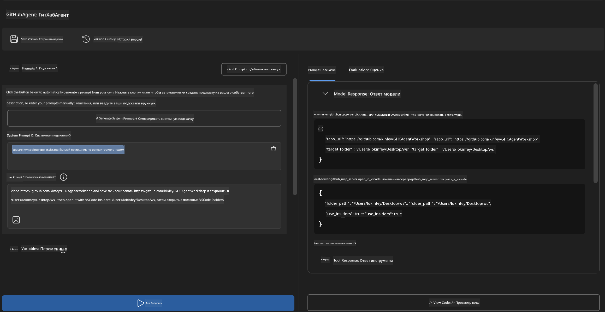
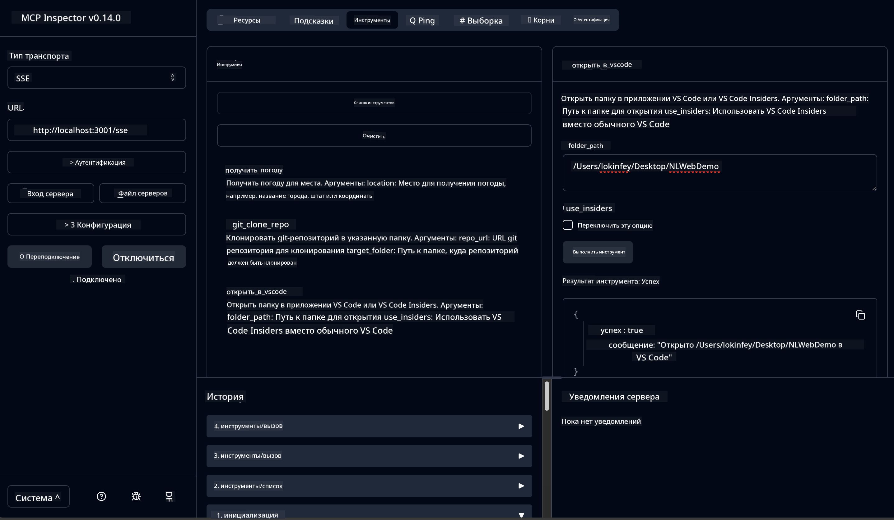

<!--
CO_OP_TRANSLATOR_METADATA:
{
  "original_hash": "f83bc722dc758efffd68667d6a1db470",
  "translation_date": "2025-07-14T08:35:47+00:00",
  "source_file": "10-StreamliningAIWorkflowsBuildingAnMCPServerWithAIToolkit/lab4/README.md",
  "language_code": "ru"
}
-->
# 🐙 Модуль 4: Практическая разработка MCP — Пользовательский сервер клонирования GitHub


> **⚡ Быстрый старт:** Создайте готовый к продакшену MCP сервер, который автоматизирует клонирование репозиториев GitHub и интеграцию с VS Code всего за 30 минут!

## 🎯 Цели обучения

К концу этой лабораторной работы вы сможете:

- ✅ Создавать пользовательский MCP сервер для реальных рабочих процессов разработки
- ✅ Реализовать функционал клонирования репозиториев GitHub через MCP
- ✅ Интегрировать пользовательские MCP серверы с VS Code и Agent Builder
- ✅ Использовать режим агента GitHub Copilot с пользовательскими MCP инструментами
- ✅ Тестировать и развёртывать пользовательские MCP серверы в продакшен-средах

## 📋 Требования

- Завершение лабораторных работ 1-3 (основы MCP и продвинутая разработка)
- Подписка на GitHub Copilot ([доступна бесплатная регистрация](https://github.com/github-copilot/signup))
- VS Code с расширениями AI Toolkit и GitHub Copilot
- Установленный и настроенный Git CLI

## 🏗️ Обзор проекта

### **Реальная задача разработки**
Разработчики часто используют GitHub для клонирования репозиториев и открытия их в VS Code или VS Code Insiders. Этот ручной процесс включает:
1. Открытие терминала/командной строки
2. Переход в нужную директорию
3. Выполнение команды `git clone`
4. Открытие VS Code в склонированной папке

**Наше MCP решение упрощает это до одной интеллектуальной команды!**

### **Что вы создадите**
**GitHub Clone MCP Server** (`git_mcp_server`), который предоставляет:

| Функция | Описание | Преимущество |
|---------|----------|--------------|
| 🔄 **Умное клонирование репозиториев** | Клонирование GitHub репозиториев с проверкой | Автоматическая проверка ошибок |
| 📁 **Интеллектуальное управление директориями** | Безопасная проверка и создание папок | Предотвращает перезапись |
| 🚀 **Кроссплатформенная интеграция с VS Code** | Открытие проектов в VS Code/Insiders | Плавный переход в рабочий процесс |
| 🛡️ **Надёжная обработка ошибок** | Обработка сетевых, прав доступа и путей | Надёжность для продакшена |

---

## 📖 Пошаговая реализация

### Шаг 1: Создайте агента GitHub в Agent Builder

1. **Запустите Agent Builder** через расширение AI Toolkit
2. **Создайте нового агента** с такой конфигурацией:
   ```
   Agent Name: GitHubAgent
   ```

3. **Инициализируйте пользовательский MCP сервер:**
   - Перейдите в **Инструменты** → **Добавить инструмент** → **MCP Server**
   - Выберите **"Создать новый MCP сервер"**
   - Выберите **шаблон Python** для максимальной гибкости
   - **Имя сервера:** `git_mcp_server`

### Шаг 2: Настройте режим агента GitHub Copilot

1. **Откройте GitHub Copilot** в VS Code (Ctrl/Cmd + Shift + P → "GitHub Copilot: Open")
2. **Выберите модель агента** в интерфейсе Copilot
3. **Выберите модель Claude 3.7** для улучшенного понимания и рассуждений
4. **Включите интеграцию MCP** для доступа к инструментам

> **💡 Полезный совет:** Claude 3.7 обеспечивает лучшее понимание рабочих процессов разработки и шаблонов обработки ошибок.

### Шаг 3: Реализуйте основную функциональность MCP сервера

**Используйте следующий подробный запрос с режимом агента GitHub Copilot:**

```
Create two MCP tools with the following comprehensive requirements:

🔧 TOOL A: clone_repository
Requirements:
- Clone any GitHub repository to a specified local folder
- Return the absolute path of the successfully cloned project
- Implement comprehensive validation:
  ✓ Check if target directory already exists (return error if exists)
  ✓ Validate GitHub URL format (https://github.com/user/repo)
  ✓ Verify git command availability (prompt installation if missing)
  ✓ Handle network connectivity issues
  ✓ Provide clear error messages for all failure scenarios

🚀 TOOL B: open_in_vscode
Requirements:
- Open specified folder in VS Code or VS Code Insiders
- Cross-platform compatibility (Windows/Linux/macOS)
- Use direct application launch (not terminal commands)
- Auto-detect available VS Code installations
- Handle cases where VS Code is not installed
- Provide user-friendly error messages

Additional Requirements:
- Follow MCP 1.9.3 best practices
- Include proper type hints and documentation
- Implement logging for debugging purposes
- Add input validation for all parameters
- Include comprehensive error handling
```

### Шаг 4: Протестируйте ваш MCP сервер

#### 4a. Тестирование в Agent Builder

1. **Запустите конфигурацию отладки** в Agent Builder
2. **Настройте вашего агента с этим системным запросом:**

```
SYSTEM_PROMPT:
You are my intelligent coding repository assistant. You help developers efficiently clone GitHub repositories and set up their development environment. Always provide clear feedback about operations and handle errors gracefully.
```

3. **Проверьте на реалистичных сценариях пользователя:**

```
USER_PROMPT EXAMPLES:

Scenario : Basic Clone and Open
"Clone {Your GitHub Repo link such as https://github.com/kinfey/GHCAgentWorkshop
 } and save to {The global path you specify}, then open it with VS Code Insiders"
```



**Ожидаемые результаты:**
- ✅ Успешное клонирование с подтверждением пути
- ✅ Автоматический запуск VS Code
- ✅ Чёткие сообщения об ошибках при некорректных сценариях
- ✅ Корректная обработка крайних случаев

#### 4b. Тестирование в MCP Inspector



---

**🎉 Поздравляем!** Вы успешно создали практический, готовый к продакшену MCP сервер, который решает реальные задачи рабочего процесса разработки. Ваш пользовательский сервер клонирования GitHub демонстрирует возможности MCP для автоматизации и повышения продуктивности разработчиков.

### 🏆 Достижения:
- ✅ **MCP Developer** — Создан пользовательский MCP сервер
- ✅ **Workflow Automator** — Оптимизированы процессы разработки  
- ✅ **Integration Expert** — Связаны несколько инструментов разработки
- ✅ **Production Ready** — Созданы решения, готовые к развёртыванию

---

## 🎓 Завершение воркшопа: Ваш путь с Model Context Protocol

**Уважаемый участник воркшопа,**

Поздравляем с успешным завершением всех четырёх модулей воркшопа Model Context Protocol! Вы прошли путь от изучения основ AI Toolkit до создания готовых к продакшену MCP серверов, решающих реальные задачи разработки.

### 🚀 Краткий обзор вашего пути обучения:

**[Модуль 1](../lab1/README.md)**: Вы познакомились с основами AI Toolkit, тестированием моделей и создали своего первого AI агента.

**[Модуль 2](../lab2/README.md)**: Изучили архитектуру MCP, интегрировали Playwright MCP и создали первого агента для автоматизации браузера.

**[Модуль 3](../lab3/README.md)**: Перешли к разработке пользовательских MCP серверов на примере Weather MCP и освоили инструменты отладки.

**[Модуль 4](../lab4/README.md)**: Применили всё на практике, создав инструмент автоматизации рабочего процесса с репозиториями GitHub.

### 🌟 Что вы освоили:

- ✅ **Экосистема AI Toolkit**: модели, агенты и схемы интеграции
- ✅ **Архитектура MCP**: клиент-серверный дизайн, транспортные протоколы и безопасность
- ✅ **Инструменты разработчика**: от Playground до Inspector и продакшен-развёртывания
- ✅ **Пользовательская разработка**: создание, тестирование и развёртывание MCP серверов
- ✅ **Практические применения**: решение реальных задач рабочих процессов с помощью ИИ

### 🔮 Ваши следующие шаги:

1. **Создайте собственный MCP сервер**: применяйте навыки для автоматизации уникальных рабочих процессов
2. **Присоединяйтесь к сообществу MCP**: делитесь своими разработками и учитесь у других
3. **Изучайте продвинутую интеграцию**: подключайте MCP серверы к корпоративным системам
4. **Вносите вклад в open source**: помогайте улучшать инструменты и документацию MCP

Помните, что этот воркшоп — только начало. Экосистема Model Context Protocol быстро развивается, и теперь вы готовы быть в авангарде инструментов разработки с поддержкой ИИ.

**Спасибо за участие и стремление к обучению!**

Надеемся, что этот воркшоп вдохновил вас на новые идеи, которые изменят ваш подход к созданию и взаимодействию с ИИ-инструментами в процессе разработки.

**Удачного кодинга!**

---

**Отказ от ответственности**:  
Этот документ был переведен с помощью сервиса автоматического перевода [Co-op Translator](https://github.com/Azure/co-op-translator). Несмотря на наши усилия по обеспечению точности, просим учитывать, что автоматический перевод может содержать ошибки или неточности. Оригинальный документ на его исходном языке следует считать авторитетным источником. Для получения критически важной информации рекомендуется обращаться к профессиональному переводу, выполненному человеком. Мы не несем ответственности за любые недоразумения или неправильные толкования, возникшие в результате использования данного перевода.