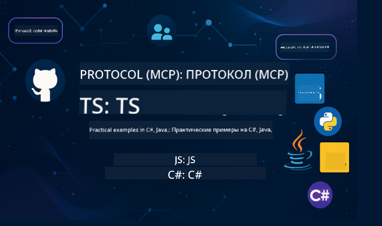

<!--
CO_OP_TRANSLATOR_METADATA:
{
  "original_hash": "866c8877136cb03e1efb9ad633a2f0a6",
  "translation_date": "2025-08-26T17:05:41+00:00",
  "source_file": "README.md",
  "language_code": "ru"
}
-->
 

Следуйте этим шагам, чтобы начать использовать данные ресурсы:
1. **Сделайте форк репозитория**: Нажмите 
2. **Клонируйте репозиторий**:   `git clone https://github.com/microsoft/mcp-for-beginners.git`
3. [**Присоединяйтесь к Discord Azure AI Foundry, чтобы встретиться с экспертами и разработчиками**](https://discord.com/invite/ByRwuEEgH4)

### 🌐 Поддержка нескольких языков

#### Поддерживается через GitHub Action (автоматически и всегда актуально)

 [Арабский](../ar/README.md) | [Бенгальский](../bn/README.md) | [Болгарский](../bg/README.md) | [Бирманский (Мьянма)](../my/README.md) | [Китайский (упрощенный)](../zh/README.md) | [Китайский (традиционный, Гонконг)](../hk/README.md) | [Китайский (традиционный, Макао)](../mo/README.md) | [Китайский (традиционный, Тайвань)](../tw/README.md) | [Хорватский](../hr/README.md) | [Чешский](../cs/README.md) | [Датский](../da/README.md) | [Голландский](../nl/README.md) | [Финский](../fi/README.md) | [Французский](../fr/README.md) | [Немецкий](../de/README.md) | [Греческий](../el/README.md) | [Иврит](../he/README.md) | [Хинди](../hi/README.md) | [Венгерский](../hu/README.md) | [Индонезийский](../id/README.md) | [Итальянский](../it/README.md) | [Японский](../ja/README.md) | [Корейский](../ko/README.md) | [Малайский](../ms/README.md) | [Маратхи](../mr/README.md) | [Непальский](../ne/README.md) | [Норвежский](../no/README.md) | [Персидский (фарси)](../fa/README.md) | [Польский](../pl/README.md) | [Португальский (Бразилия)](../br/README.md) | [Португальский (Португалия)](../pt/README.md) | [Панджаби (Гурмукхи)](../pa/README.md) | [Румынский](../ro/README.md) | [Русский](./README.md) | [Сербский (кириллица)](../sr/README.md) | [Словацкий](../sk/README.md) | [Словенский](../sl/README.md) | [Испанский](../es/README.md) | [Суахили](../sw/README.md) | [Шведский](../sv/README.md) | [Тагальский (Филиппины)](../tl/README.md) | [Тайский](../th/README.md) | [Турецкий](../tr/README.md) | [Украинский](../uk/README.md) | [Урду](../ur/README.md) | [Вьетнамский](../vi/README.md)

# 🚀 Учебный курс по протоколу контекста модели (MCP) для начинающих

## **Изучите MCP с практическими примерами кода на C#, Java, JavaScript, Rust, Python и TypeScript**

## 🧠 Обзор учебного курса по протоколу контекста модели

**Протокол контекста модели (MCP)** — это передовая структура, разработанная для стандартизации взаимодействий между AI-моделями и клиентскими приложениями. Этот открытый учебный курс предлагает структурированный путь обучения, включающий практические примеры кода и реальные случаи использования, на популярных языках программирования, таких как C#, Java, JavaScript, TypeScript и Python.

Независимо от того, являетесь ли вы разработчиком AI, системным архитектором или инженером-программистом, это руководство станет вашим всесторонним ресурсом для освоения основ MCP и стратегий его реализации.

## 🔗 Официальные ресурсы MCP

- 📘 [Документация MCP](https://modelcontextprotocol.io/) – Подробные учебные материалы и руководства  
- 📜 [Спецификация MCP](https://modelcontextprotocol.io/docs/) – Архитектура протокола и технические ссылки  
- 📜 [Оригинальная спецификация MCP](https://spec.modelcontextprotocol.io/) – Устаревшие технические ссылки (могут содержать дополнительные детали)  
- 🧑‍💻 [Репозиторий MCP на GitHub](https://github.com/modelcontextprotocol) – Открытые SDK, инструменты и примеры кода
- 🌐 [Сообщество MCP](https://github.com/orgs/modelcontextprotocol/discussions) – Присоединяйтесь к обсуждениям и вносите свой вклад в сообщество

## 🧭 Обзор учебного курса MCP

### 📚 Полная структура курса

| Модуль | Тема | Описание | Ссылка |
|--------|-------|-------------|------|
| **Модули 1-3: Основы** | | | |
| 00 | Введение в MCP | Обзор протокола контекста модели и его значимости в AI-пайплайнах | [Подробнее](./00-Introduction/README.md) |
| 01 | Основные концепции | Подробное изучение ключевых концепций MCP | [Подробнее](./01-CoreConcepts/README.md) |
| 02 | Безопасность в MCP | Угрозы безопасности и лучшие практики | [Подробнее](./02-Security/README.md) |
| 03 | Начало работы с MCP | Настройка окружения, базовые серверы/клиенты, интеграция | [Подробнее](./03-GettingStarted/README.md) |
| **Модуль 3: Создание первого сервера и клиента** | | | |
| 3.1 | Первый сервер | Создайте свой первый сервер MCP | [Руководство](./03-GettingStarted/01-first-server/README.md) |
| 3.2 | Первый клиент | Разработайте базовый клиент MCP | [Руководство](./03-GettingStarted/02-client/README.md) |
| 3.3 | Клиент с LLM | Интеграция больших языковых моделей | [Руководство](./03-GettingStarted/03-llm-client/README.md) |
| 3.4 | Интеграция с VS Code | Использование серверов MCP в VS Code | [Руководство](./03-GettingStarted/04-vscode/README.md) |
| 3.5 | Сервер stdio | Создание серверов с использованием транспорта stdio | [Руководство](./03-GettingStarted/05-stdio-server/README.md) |
| 3.6 | HTTP-стриминг | Реализация HTTP-стриминга в MCP | [Руководство](./03-GettingStarted/06-http-streaming/README.md) |
| 3.7 | AI Toolkit | Использование AI Toolkit с MCP | [Руководство](./03-GettingStarted/07-aitk/README.md) |
| 3.8 | Тестирование | Тестирование реализации вашего сервера MCP | [Руководство](./03-GettingStarted/08-testing/README.md) |
| 3.9 | Развертывание | Развертывание серверов MCP в продакшн | [Руководство](./03-GettingStarted/09-deployment/README.md) |
| **Модули 4-5: Практика и продвинутые темы** | | | |
| 04 | Практическая реализация | SDK, отладка, тестирование, шаблоны запросов | [Подробнее](./04-PracticalImplementation/README.md) |
| 05 | Продвинутые темы MCP | Мультимодальные AI, масштабирование, корпоративное использование | [Подробнее](./05-AdvancedTopics/README.md) |
| 5.1 | Интеграция с Azure | MCP и Azure | [Руководство](./05-AdvancedTopics/mcp-integration/README.md) |
| 5.2 | Мультимодальность | Работа с несколькими модальностями | [Руководство](./05-AdvancedTopics/mcp-multi-modality/README.md) |
| 5.3 | Демонстрация OAuth2 | Реализация аутентификации OAuth2 | [Руководство](./05-AdvancedTopics/mcp-oauth2-demo/README.md) |
| 5.4 | Корневые контексты | Понимание и реализация корневых контекстов | [Руководство](./05-AdvancedTopics/mcp-root-contexts/README.md) |
| 5.5 | Маршрутизация | Стратегии маршрутизации MCP | [Руководство](./05-AdvancedTopics/mcp-routing/README.md) |
| 5.6 | Семплирование | Техники семплирования в MCP | [Руководство](./05-AdvancedTopics/mcp-sampling/README.md) |
| 5.7 | Масштабирование | Масштабирование реализации MCP | [Руководство](./05-AdvancedTopics/mcp-scaling/README.md) |
| 5.8 | Безопасность | Продвинутые аспекты безопасности | [Руководство](./05-AdvancedTopics/mcp-security/README.md) |
| 5.9 | Веб-поиск | Реализация возможностей веб-поиска | [Руководство](./05-AdvancedTopics/web-search-mcp/README.md) |
| 5.10 | Потоковая передача в реальном времени | Создание функционала потоковой передачи | [Руководство](./05-AdvancedTopics/mcp-realtimestreaming/README.md) |
| 5.11 | Поиск в реальном времени | Реализация поиска в реальном времени | [Руководство](./05-AdvancedTopics/mcp-realtimesearch/README.md) |
| 5.12 | Аутентификация Entra ID | Аутентификация с Microsoft Entra ID | [Руководство](./05-AdvancedTopics/mcp-security-entra/README.md) |
| 5.13 | Интеграция Foundry | Интеграция с Azure AI Foundry | [Руководство](./05-AdvancedTopics/mcp-foundry-agent-integration/README.md) |
| 5.14 | Инженерия контекста | Техники эффективной инженерии контекста | [Руководство](./05-AdvancedTopics/mcp-contextengineering/README.md) |
| **Модули 6-10: Сообщество и лучшие практики** | | | |
| 06 | Вклад сообщества | Как внести вклад в экосистему MCP | [Руководство](./06-CommunityContributions/README.md) |
| 07 | Уроки раннего внедрения | Реальные истории реализации | [Руководство](./07-LessonsFromEarlyAdoption/README.md) |
| 08 | Лучшие практики MCP | Производительность, отказоустойчивость, устойчивость | [Руководство](./08-BestPractices/README.md) |
| 09 | Кейсы MCP | Примеры практической реализации | [Руководство](./09-CaseStudy/README.md) |
| 10 | Практическая мастерская | Создание сервера MCP с AI Toolkit | [Лаборатория](./10-StreamliningAIWorkflowsBuildingAnMCPServerWithAIToolkit/README.md) |

### 💻 Примеры проектов кода

#### Примеры простых калькуляторов MCP

| Язык | Описание | Ссылка |
|----------|-------------|------|
| C# | Пример сервера MCP | [Посмотреть код](./03-GettingStarted/samples/csharp/README.md) |
| Java | Калькулятор MCP | [Посмотреть код](./03-GettingStarted/samples/java/calculator/README.md) |
| JavaScript | Демонстрация MCP | [Посмотреть код](./03-GettingStarted/samples/javascript/README.md) |
| Python | Сервер MCP | [Посмотреть код](../../03-GettingStarted/samples/python/mcp_calculator_server.py) |
| TypeScript | Пример MCP | [Посмотреть код](./03-GettingStarted/samples/typescript/README.md) |
| Rust | Пример MCP | [Посмотреть код](./03-GettingStarted/samples/rust/README.md) |

#### Продвинутые реализации MCP

| Язык | Описание | Ссылка |
|----------|-------------|------|
| C# | Продвинутый пример | [View Code](./04-PracticalImplementation/samples/csharp/README.md) |
| Java с Spring | Пример приложения-контейнера | [View Code](./04-PracticalImplementation/samples/java/containerapp/README.md) |
| JavaScript | Продвинутый пример | [View Code](./04-PracticalImplementation/samples/javascript/README.md) |
| Python | Сложная реализация | [View Code](../../04-PracticalImplementation/samples/python/READMEmd) |
| TypeScript | Пример контейнера | [View Code](./04-PracticalImplementation/samples/typescript/README.md) |

## 🎯 Предварительные требования для изучения MCP

Чтобы максимально эффективно изучить этот курс, вам потребуется:

- Базовые знания программирования хотя бы на одном из следующих языков: C#, Java, JavaScript, Python или TypeScript
- Понимание клиент-серверной модели и API
- Знакомство с концепциями REST и HTTP
- (Опционально) Основы концепций AI/ML

- Участие в обсуждениях сообщества для получения поддержки

## 📚 Руководство по обучению и ресурсы

Этот репозиторий содержит множество ресурсов, которые помогут вам эффективно изучать материал:

### Руководство по обучению

Детальное [Руководство по обучению](./study_guide.md) доступно для того, чтобы помочь вам эффективно ориентироваться в этом репозитории. В руководстве содержится:

- Визуальная карта учебной программы с перечислением всех тем
- Подробное описание каждой секции репозитория
- Рекомендации по использованию примеров проектов
- Рекомендуемые пути обучения для разных уровней навыков
- Дополнительные ресурсы для углубленного изучения

### История изменений

Мы ведем подробную [Историю изменений](./changelog.md), где фиксируем все значительные обновления учебных материалов, включая:

- Добавление нового контента
- Структурные изменения
- Улучшения функционала
- Обновления документации

## 🛠️ Как эффективно использовать этот курс

Каждый урок в этом руководстве включает:

1. Понятные объяснения концепций MCP  
2. Примеры кода в реальном времени на нескольких языках  
3. Упражнения для создания реальных приложений MCP  
4. Дополнительные ресурсы для продвинутых пользователей  

## События 

### [MCP Dev Days Июль 2025](https://developer.microsoft.com/en-us/reactor/series/S-1563/)
#### [➡️Смотреть по запросу - MCP Dev Days](https://developer.microsoft.com/en-us/reactor/series/S-1563/)
Приготовьтесь к двум дням глубокого технического погружения, общения с сообществом и практического обучения на MCP Dev Days — виртуальном мероприятии, посвященном Model Context Protocol (MCP), новому стандарту, который объединяет AI-модели и инструменты, на которых они основаны.  
Вы можете посмотреть MCP Dev Days, зарегистрировавшись на странице мероприятия: https://aka.ms/mcpdevdays.  

#### [День 1: MCP продуктивность, инструменты разработчика и сообщество:](https://developer.microsoft.com/en-us/reactor/series/S-1563/)

Посвящен тому, чтобы помочь разработчикам использовать MCP в их рабочем процессе и отметить достижения сообщества MCP. Мы будем работать с участниками сообщества и партнерами, такими как Arcade, Block, Okta и Neon, чтобы увидеть, как они сотрудничают с Microsoft для создания открытой и расширяемой экосистемы MCP.  
Реальные демонстрации с использованием VS Code, Visual Studio, GitHub Copilot и популярных инструментов сообщества  
Практические, контекстно-ориентированные рабочие процессы разработчиков  
Сессии и инсайты, проводимые сообществом  
Независимо от того, только ли вы начинаете работать с MCP или уже создаете проекты с его использованием, День 1 вдохновит вас и предоставит полезные рекомендации.

#### [День 2: Создание MCP серверов с уверенностью](https://developer.microsoft.com/en-us/reactor/series/S-1563/)

Посвящен разработчикам MCP. Мы углубимся в стратегии реализации и лучшие практики для создания MCP серверов и интеграции MCP в ваши AI рабочие процессы.

#### Темы включают:

- Создание MCP серверов и их интеграция в агентные сценарии
- Разработка, основанная на запросах
- Лучшие практики безопасности
- Использование строительных блоков, таких как Functions, ACA и API Management
- Согласование реестра и инструменты (1P + 3P)

Если вы разработчик, создатель инструментов или стратег AI-продуктов, этот день наполнен инсайтами, которые помогут вам создавать масштабируемые, безопасные и готовые к будущему решения MCP.

### MCP Boot Camp Август 2025
Узнайте на интенсивных видеосессиях, как создавать MCP серверы, интегрировать их с VS Code и профессионально развертывать на Azure, основываясь на материалах курса MCP для начинающих. Получите практические навыки в технологии, которую уже используют крупные компании.

#### [➡️Смотреть по запросу MCP Bootcamp | English](https://developer.microsoft.com/en-us/reactor/series/s-1568/)
#### [➡️Смотреть по запросу MCP Bootcamp | Brasil](https://developer.microsoft.com/en-us/reactor/series/S-1566/)
#### [➡️Смотреть по запросу MCP Bootcamp | Spanish](https://developer.microsoft.com/en-us/reactor/series/S-1567/)

## 🌟 Благодарности сообществу

Благодарим Microsoft Valued Professional [Shivam Goyal](https://www.linkedin.com/in/shivam2003/) за важный вклад в примеры кода.

## 📜 Информация о лицензии

Этот контент лицензирован под **MIT License**. Условия и положения смотрите в [LICENSE](../../LICENSE).

## 🤝 Руководство по внесению изменений

Этот проект приветствует вклад и предложения. Большинство изменений требуют, чтобы вы согласились с
Contributor License Agreement (CLA), подтверждающим, что у вас есть право и вы действительно предоставляете нам
права на использование вашего вклада. Подробнее смотрите 
<https://cla.opensource.microsoft.com>.

Когда вы отправляете pull request, бот CLA автоматически определит, нужно ли вам предоставить
CLA, и добавит соответствующую информацию к PR (например, проверку статуса, комментарий). Просто следуйте инструкциям,
предоставленным ботом. Вам нужно будет сделать это только один раз для всех репозиториев, использующих наш CLA.

Этот проект принял [Microsoft Open Source Code of Conduct](https://opensource.microsoft.com/codeofconduct/).
Для получения дополнительной информации смотрите [Code of Conduct FAQ](https://opensource.microsoft.com/codeofconduct/faq/) или
свяжитесь с [opencode@microsoft.com](mailto:opencode@microsoft.com) с любыми дополнительными вопросами или комментариями.

## 📂 Структура репозитория

Репозиторий организован следующим образом:

- **Основной курс (00-10)**: Основной контент, организованный в десяти последовательных модулях
- **images/**: Диаграммы и иллюстрации, используемые в курсе
- **translations/**: Поддержка нескольких языков с автоматическими переводами
- **translated_images/**: Локализованные версии диаграмм и иллюстраций
- **study_guide.md**: Полное руководство по навигации в репозитории
- **changelog.md**: Запись всех значительных изменений учебных материалов
- **mcp.json**: Конфигурационный файл для спецификации MCP
- **CODE_OF_CONDUCT.md, LICENSE, SECURITY.md, SUPPORT.md**: Документы управления проектом

## 🎒 Другие курсы
Наша команда создает и другие курсы! Ознакомьтесь:

- [AI Agents For Beginners](https://github.com/microsoft/ai-agents-for-beginners?WT.mc_id=academic-105485-koreyst)
- [Generative AI for Beginners using .NET](https://github.com/microsoft/Generative-AI-for-beginners-dotnet?WT.mc_id=academic-105485-koreyst)
- [Generative AI for Beginners using JavaScript](https://github.com/microsoft/generative-ai-with-javascript?WT.mc_id=academic-105485-koreyst)
- [Generative AI for Beginners](https://github.com/microsoft/generative-ai-for-beginners?WT.mc_id=academic-105485-koreyst)
- [Generative AI for Beginners using Java](https://github.com/microsoft/generative-ai-for-beginners-java?WT.mc_id=academic-105485-koreyst)
- [ML for Beginners](https://aka.ms/ml-beginners?WT.mc_id=academic-105485-koreyst)
- [Data Science for Beginners](https://aka.ms/datascience-beginners?WT.mc_id=academic-105485-koreyst)
- [AI for Beginners](https://aka.ms/ai-beginners?WT.mc_id=academic-105485-koreyst)
- [Cybersecurity for Beginners](https://github.com/microsoft/Security-101?WT.mc_id=academic-96948-sayoung)
- [Web Dev for Beginners](https://aka.ms/webdev-beginners?WT.mc_id=academic-105485-koreyst)
- [IoT for Beginners](https://aka.ms/iot-beginners?WT.mc_id=academic-105485-koreyst)
- [XR Development for Beginners](https://github.com/microsoft/xr-development-for-beginners?WT.mc_id=academic-105485-koreyst)
- [Mastering GitHub Copilot for AI Paired Programming](https://aka.ms/GitHubCopilotAI?WT.mc_id=academic-105485-koreyst)
- [Mastering GitHub Copilot for C#/.NET Developers](https://github.com/microsoft/mastering-github-copilot-for-dotnet-csharp-developers?WT.mc_id=academic-105485-koreyst)
- [Choose Your Own Copilot Adventure](https://github.com/microsoft/CopilotAdventures?WT.mc_id=academic-105485-koreyst)

## ™️ Уведомление о товарных знаках

Этот проект может содержать товарные знаки или логотипы для проектов, продуктов или услуг. Разрешенное использование товарных знаков или логотипов Microsoft должно соответствовать и следовать
[Руководству по товарным знакам и брендам Microsoft](https://www.microsoft.com/legal/intellectualproperty/trademarks/usage/general).
Использование товарных знаков или логотипов Microsoft в модифицированных версиях этого проекта не должно вызывать путаницу или подразумевать спонсорство Microsoft.
Любое использование товарных знаков или логотипов третьих сторон должно соответствовать политике этих третьих сторон.

---

**Отказ от ответственности**:  
Этот документ был переведен с помощью сервиса автоматического перевода [Co-op Translator](https://github.com/Azure/co-op-translator). Несмотря на наши усилия обеспечить точность, автоматические переводы могут содержать ошибки или неточности. Оригинальный документ на его родном языке следует считать авторитетным источником. Для получения критически важной информации рекомендуется профессиональный перевод человеком. Мы не несем ответственности за любые недоразумения или неправильные интерпретации, возникшие в результате использования данного перевода.