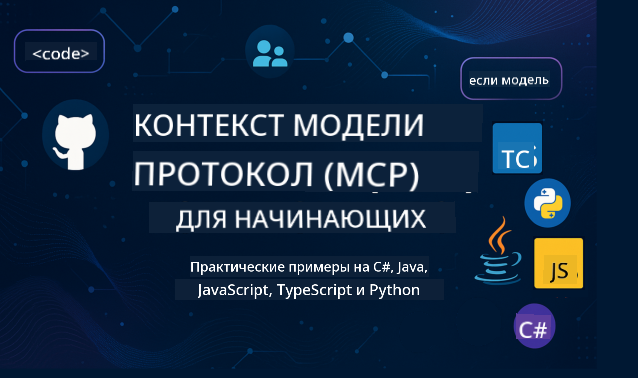

<!--
CO_OP_TRANSLATOR_METADATA:
{
  "original_hash": "2a21391378c12ecfef50f866329dfde0",
  "translation_date": "2025-05-17T05:16:51+00:00",
  "source_file": "README.md",
  "language_code": "ru"
}
-->

Следуйте этим шагам, чтобы начать использовать эти ресурсы:
1. **Сделайте форк репозитория**: Нажмите 
2. **Клонируйте репозиторий**: `git clone https://github.com/microsoft/mcp-for-beginners.git`
3. [**Присоединитесь к Discord Microsoft Azure AI Foundry и познакомьтесь с экспертами и другими разработчиками**](https://discord.com/invite/ByRwuEEgH4)

### 🌐 Поддержка нескольких языков

#### Поддерживается через GitHub Action (Автоматически и всегда актуально)
[Французский](../fr/README.md) | [Испанский](../es/README.md) | [Немецкий](../de/README.md) | [Русский](./README.md) | [Арабский](../ar/README.md) | [Персидский (Фарси)](../fa/README.md) | [Урду](../ur/README.md) | [Китайский (Упрощенный)](../zh/README.md) | [Китайский (Традиционный, Макао)](../mo/README.md) | [Китайский (Традиционный, Гонконг)](../hk/README.md) | [Китайский (Традиционный, Тайвань)](../tw/README.md) | [Японский](../ja/README.md) | [Корейский](../ko/README.md) | [Хинди](../hi/README.md) | [Бенгальский](../bn/README.md) | [Маратхи](../mr/README.md) | [Непальский](../ne/README.md) | [Панджаби (Гурмукхи)](../pa/README.md) | [Португальский (Португалия)](../pt/README.md) | [Португальский (Бразилия)](../br/README.md) | [Итальянский](../it/README.md) | [Польский](../pl/README.md) | [Турецкий](../tr/README.md) | [Греческий](../el/README.md) | [Тайский](../th/README.md) | [Шведский](../sv/README.md) | [Датский](../da/README.md) | [Норвежский](../no/README.md) | [Финский](../fi/README.md) | [Голландский](../nl/README.md) | [Иврит](../he/README.md) | [Вьетнамский](../vi/README.md) | [Индонезийский](../id/README.md) | [Малайский](../ms/README.md) | [Тагальский (Филиппинский)](../tl/README.md) | [Суахили](../sw/README.md) | [Венгерский](../hu/README.md) | [Чешский](../cs/README.md) | [Словацкий](../sk/README.md) | [Румынский](../ro/README.md) | [Болгарский](../bg/README.md) | [Сербский (Кириллица)](../sr/README.md) | [Хорватский](../hr/README.md) | [Словенский](../sl/README.md)
# 🚀 Ультимативное руководство по учебной программе Model Context Protocol (MCP) для начинающих

## **Изучайте MCP с практическими примерами кода на C#, Java, JavaScript, Python и TypeScript**

## 🧠 Обзор учебной программы Model Context Protocol

**Model Context Protocol (MCP)** — это передовая структура, разработанная для стандартизации взаимодействий между моделями ИИ и клиентскими приложениями. Эта учебная программа с открытым исходным кодом предлагает структурированный путь обучения, включая практические примеры кода и реальные примеры использования, на популярных языках программирования, таких как C#, Java, JavaScript, TypeScript и Python.

Будь вы разработчик ИИ, системный архитектор или инженер-программист, это руководство является вашим всеобъемлющим ресурсом для освоения основ MCP и стратегий внедрения.

## 🔗 Официальные ресурсы MCP

- 📘 [Документация MCP](https://modelcontextprotocol.io/) – Подробные учебные пособия и руководства пользователя  
- 📜 [Спецификация MCP](https://spec.modelcontextprotocol.io/) – Архитектура протокола и технические ссылки  
- 🧑‍💻 [Репозиторий MCP на GitHub](https://github.com/modelcontextprotocol) – SDK с открытым исходным кодом, инструменты и примеры кода  

## 🧭 Полная структура учебной программы MCP

### 📌 [Введение в MCP](./00-Introduction/README.md)

- Что такое Model Context Protocol?
- Почему стандартизация важна в конвейерах ИИ
- Практические примеры использования и преимущества MCP

### 🧩 [Объяснение основных концепций](./01-CoreConcepts/README.md)

- Понимание клиент-серверной архитектуры в MCP
- Ключевые компоненты протокола: запросы, ответы и схемы
- Сообщения MCP и шаблоны обмена данными

### 🔐 [Безопасность в MCP](./02-Security/readme.md)

- Определение угроз безопасности в системах на основе MCP
- Методы и лучшие практики для обеспечения безопасности внедрений

### 🚀 [Начало работы с MCP](./03-GettingStarted/README.md)

- Настройка среды и конфигурация
- Создание базовых серверов и клиентов MCP
- Интеграция MCP с существующими приложениями

#### 🧮 Примерные проекты MCP калькуляторов:

  
<strong>Исследуйте реализации кода по языкам</strong>

  - [Пример сервера MCP на C#](./03-GettingStarted/samples/csharp/README.md)
  - [Java MCP калькулятор](./03-GettingStarted/samples/java/calculator/README.md)
  - [Демо MCP на JavaScript](./03-GettingStarted/samples/javascript/README.md)
  - [Сервер MCP на Python](../../03-GettingStarted/samples/python/mcp_calculator_server.py)
  - [Пример MCP на TypeScript](./03-GettingStarted/samples/typescript/README.md)

### 🛠️ [Практическая реализация](./04-PracticalImplementation/README.md)

- Использование SDK на разных языках
- Отладка, тестирование и проверка
- Создание повторно используемых шаблонов и рабочих процессов

#### 💡 Проекты продвинутых калькуляторов MCP:

  
<strong>Исследуйте продвинутые примеры</strong>

  - [Продвинутый пример на C#](./04-PracticalImplementation/samples/csharp/README.md)
  - [Пример контейнерного приложения на Java](./04-PracticalImplementation/samples/java/containerapp/README.md)
  - [Продвинутый пример на JavaScript](./04-PracticalImplementation/samples/javascript/README.md)
  - [Сложная реализация на Python](../../04-PracticalImplementation/samples/python/mcp_sample.py)
  - [Пример контейнера на TypeScript](./04-PracticalImplementation/samples/typescript/README.md)

### 🎓 [Продвинутые темы в MCP](./05-AdvancedTopics/README.md)

- Мультимодальные рабочие процессы ИИ и расширяемость
- Стратегии безопасного масштабирования
- MCP в корпоративных экосистемах

### 🌍 [Вклад сообщества](./06-CommunityContributions/README.md)

- Как внести вклад в код и документацию
- Сотрудничество через GitHub
- Улучшения и обратная связь, управляемые сообществом

### 📈 [Инсайты от раннего внедрения](./07-CaseStudies/README.md)

- Реальные внедрения и что сработало
- Создание и развертывание решений на основе MCP
- Тенденции и дорожная карта на будущее

### 📏 [Лучшие практики для MCP](./08-BestPractices/README.md)

- Настройка производительности и оптимизация
- Проектирование отказоустойчивых систем MCP
- Стратегии тестирования и устойчивости

### 📊 [Кейсы MCP](./09-CaseStudy/Readme.md)

- Глубокий анализ архитектуры решений MCP
- Чертежи развертывания и советы по интеграции
- Аннотированные диаграммы и пошаговые проекты

## 🎯 Предварительные требования для изучения MCP

Чтобы извлечь максимальную пользу из этой учебной программы, вам следует иметь:

- Базовые знания C#, Java или Python
- Понимание клиент-серверной модели и API
- (Опционально) Знакомство с концепциями машинного обучения

## 🛠️ Как эффективно использовать эту учебную программу

Каждый урок в этом руководстве включает:

1. Четкие объяснения концепций MCP  
2. Примеры кода в реальном времени на нескольких языках  
3. Упражнения для создания реальных приложений MCP  
4. Дополнительные ресурсы для продвинутых учеников  

## 📜 Информация о лицензии

Этот контент лицензирован под **MIT License**. Для условий и положений, смотрите [LICENSE](../../LICENSE).

## 🤝 Руководство по внесению вклада

Этот проект приветствует вклады и предложения. Большинство вкладов требует от вас согласия с Соглашением о лицензии участника (CLA), подтверждающим, что у вас есть право и вы действительно предоставляете нам права на использование вашего вклада. Для подробностей, посетите <https://cla.opensource.microsoft.com>.

Когда вы отправляете запрос на внесение изменений, бот CLA автоматически определит, нужно ли вам предоставить CLA, и оформит PR соответствующим образом (например, проверка статуса, комментарий). Просто следуйте инструкциям, предоставленным ботом. Вам нужно будет сделать это только один раз для всех репозиториев, использующих наш CLA.

Этот проект принял [Кодекс поведения Microsoft Open Source](https://opensource.microsoft.com/codeofconduct/).
Для получения дополнительной информации, смотрите [Часто задаваемые вопросы о Кодексе поведения](https://opensource.microsoft.com/codeofconduct/faq/) или
свяжитесь с [opencode@microsoft.com](mailto:opencode@microsoft.com) с любыми дополнительными вопросами или комментариями.

## ™️ Уведомление о товарных знаках

Этот проект может содержать товарные знаки или логотипы для проектов, продуктов или услуг. Использование товарных знаков или логотипов Microsoft должно быть согласовано и соответствовать
[Руководству по использованию товарных знаков и брендов Microsoft](https://www.microsoft.com/legal/intellectualproperty/trademarks/usage/general).
Использование товарных знаков или логотипов Microsoft в измененных версиях этого проекта не должно вызывать путаницу или подразумевать спонсорство Microsoft.
Любое использование товарных знаков или логотипов третьих сторон должно соответствовать политикам этих третьих сторон.

**Отказ от ответственности**:  
Этот документ был переведен с использованием AI-сервиса перевода [Co-op Translator](https://github.com/Azure/co-op-translator). Хотя мы стремимся к точности, пожалуйста, имейте в виду, что автоматические переводы могут содержать ошибки или неточности. Оригинальный документ на его родном языке следует считать авторитетным источником. Для критической информации рекомендуется профессиональный перевод человеком. Мы не несём ответственности за любые недоразумения или неправильные толкования, возникающие в результате использования этого перевода.