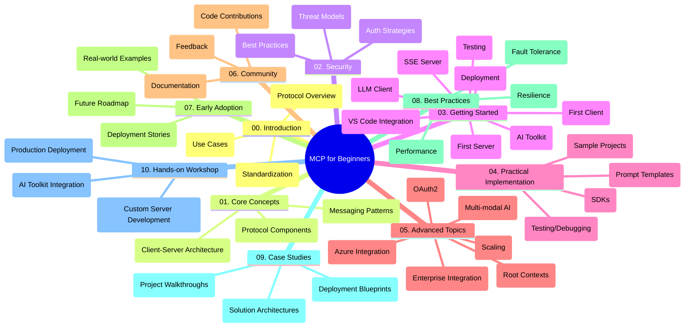

<!--
CO_OP_TRANSLATOR_METADATA:
{
  "original_hash": "a607d4febc94caee9a12b77795f7fc9a",
  "translation_date": "2025-06-11T16:36:07+00:00",
  "source_file": "study_guide.md",
  "language_code": "ru"
}
-->
# Model Context Protocol (MCP) для начинающих — учебное пособие

Это учебное пособие дает обзор структуры и содержимого репозитория для курса «Model Context Protocol (MCP) для начинающих». Используйте его для эффективной навигации по репозиторию и максимального использования доступных ресурсов.

## Обзор репозитория

Model Context Protocol (MCP) — это стандартизированная платформа для взаимодействия между ИИ-моделями и клиентскими приложениями. В этом репозитории представлен полный учебный курс с практическими примерами кода на C#, Java, JavaScript, Python и TypeScript, предназначенный для разработчиков ИИ, системных архитекторов и инженеров-программистов.

## Визуальная карта курса

## Структура репозитория

Репозиторий разделён на десять основных разделов, каждый из которых посвящён разным аспектам MCP:

1. **Введение (00-Introduction/)**
   - Обзор Model Context Protocol
   - Почему стандартизация важна в ИИ-пайплайнах
   - Практические примеры использования и преимущества

2. **Основные концепции (01-CoreConcepts/)**
   - Клиент-серверная архитектура
   - Ключевые компоненты протокола
   - Шаблоны обмена сообщениями в MCP

3. **Безопасность (02-Security/)**
   - Угрозы безопасности в системах на базе MCP
   - Лучшие практики по обеспечению безопасности
   - Стратегии аутентификации и авторизации

4. **Начало работы (03-GettingStarted/)**
   - Настройка и конфигурация окружения
   - Создание базовых серверов и клиентов MCP
   - Интеграция с существующими приложениями
   - Подразделы для первого сервера, первого клиента, LLM-клиента, интеграции с VS Code, SSE-сервера, AI Toolkit, тестирования и деплоя

5. **Практическая реализация (04-PracticalImplementation/)**
   - Использование SDK на разных языках программирования
   - Отладка, тестирование и валидация
   - Создание переиспользуемых шаблонов запросов и рабочих процессов
   - Примеры проектов с реализацией

6. **Продвинутые темы (05-AdvancedTopics/)**
   - Мультимодальные AI-рабочие процессы и расширяемость
   - Стратегии безопасного масштабирования
   - MCP в корпоративных экосистемах
   - Специализированные темы: интеграция с Azure, мультимодальность, OAuth2, корневые контексты, маршрутизация, семплирование, масштабирование, безопасность, интеграция веб-поиска и стриминг.

7. **Вклад сообщества (06-CommunityContributions/)**
   - Как вносить изменения в код и документацию
   - Совместная работа через GitHub
   - Улучшения и обратная связь от сообщества

8. **Уроки раннего внедрения (07-LessonsfromEarlyAdoption/)**
   - Реальные внедрения и успешные кейсы
   - Создание и развертывание решений на базе MCP
   - Тенденции и планы на будущее

9. **Лучшие практики (08-BestPractices/)**
   - Оптимизация производительности
   - Проектирование отказоустойчивых MCP-систем
   - Стратегии тестирования и устойчивости

10. **Кейсы (09-CaseStudy/)**
    - Глубокий разбор архитектур решений на MCP
    - Шаблоны развертывания и советы по интеграции
    - Аннотированные диаграммы и пошаговые обзоры проектов

11. **Практический воркшоп (10-StreamliningAIWorkflowsBuildingAnMCPServerWithAIToolkit/)**
    - Комплексный практический воркшоп по объединению MCP с AI Toolkit от Microsoft для VS Code
    - Создание интеллектуальных приложений, связывающих ИИ-модели с реальными инструментами
    - Практические модули по основам, разработке кастомного сервера и стратегиям продакшен-развертывания

## Примеры проектов

В репозитории представлены несколько примеров проектов, демонстрирующих реализацию MCP на разных языках программирования:

### Простые примеры MCP калькулятора
- Пример MCP сервера на C#
- MCP калькулятор на Java
- Демонстрация MCP на JavaScript
- MCP сервер на Python
- Пример MCP на TypeScript

### Продвинутые проекты MCP калькулятора
- Продвинутый пример на C#
- Пример контейнерного приложения на Java
- Продвинутый пример на JavaScript
- Сложная реализация на Python
- Пример контейнера на TypeScript

## Дополнительные ресурсы

В репозитории также есть вспомогательные материалы:

- **Папка с изображениями**: содержит диаграммы и иллюстрации, используемые в курсе
- **Переводы**: поддержка нескольких языков с автоматическим переводом документации
- **Официальные ресурсы MCP**:
  - [MCP Documentation](https://modelcontextprotocol.io/)
  - [MCP Specification](https://spec.modelcontextprotocol.io/)
  - [MCP GitHub Repository](https://github.com/modelcontextprotocol)

## Как использовать этот репозиторий

1. **Последовательное изучение**: проходите главы по порядку (с 00 по 10) для структурированного обучения.
2. **Фокус на языке программирования**: если вас интересует конкретный язык, изучайте каталоги с примерами для выбранного языка.
3. **Практическая реализация**: начните с раздела «Начало работы», чтобы настроить окружение и создать первый сервер и клиент MCP.
4. **Продвинутый уровень**: освоив базу, переходите к продвинутым темам для расширения знаний.
5. **Вовлечение в сообщество**: присоединяйтесь к [Azure AI Foundry Discord](https://discord.com/invite/ByRwuEEgH4), чтобы общаться с экспертами и другими разработчиками.

## Вклад в проект

Этот репозиторий приветствует вклад сообщества. Ознакомьтесь с разделом «Вклад сообщества» для инструкций по участию.

---

*Это учебное пособие создано 11 июня 2025 года и отражает состояние репозитория на эту дату. Содержимое репозитория могло обновляться с тех пор.*

**Отказ от ответственности**:  
Этот документ был переведен с помощью сервиса автоматического перевода [Co-op Translator](https://github.com/Azure/co-op-translator). Несмотря на наши усилия обеспечить точность, имейте в виду, что автоматические переводы могут содержать ошибки или неточности. Оригинальный документ на его исходном языке следует считать авторитетным источником. Для критически важной информации рекомендуется использовать профессиональный перевод, выполненный человеком. Мы не несем ответственности за любые недоразумения или неправильные толкования, возникшие в результате использования данного перевода.