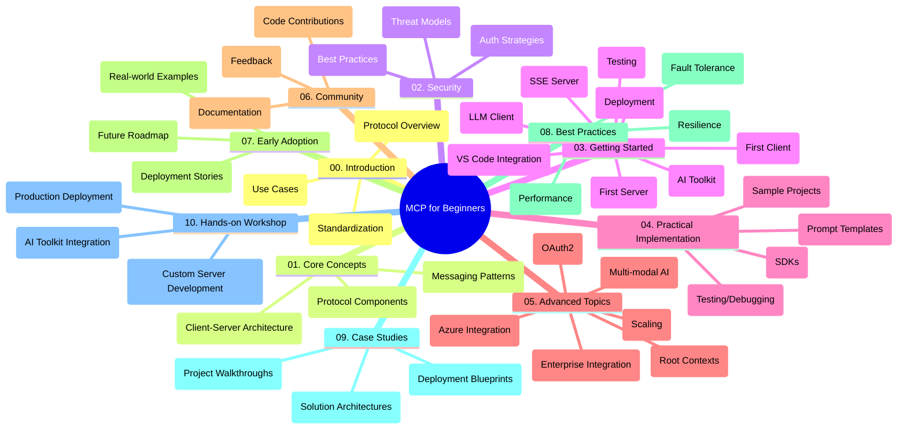

<!--
CO_OP_TRANSLATOR_METADATA:
{
  "original_hash": "a607d4febc94caee9a12b77795f7fc9a",
  "translation_date": "2025-07-13T15:09:50+00:00",
  "source_file": "study_guide.md",
  "language_code": "ru"
}
-->
# Протокол Контекста Модели (MCP) для начинающих — Руководство по изучению

Это руководство по изучению предоставляет обзор структуры и содержимого репозитория для учебной программы «Протокол Контекста Модели (MCP) для начинающих». Используйте это руководство, чтобы эффективно ориентироваться в репозитории и максимально использовать доступные ресурсы.

## Обзор репозитория

Протокол Контекста Модели (MCP) — это стандартизированная платформа для взаимодействия между AI-моделями и клиентскими приложениями. Этот репозиторий содержит комплексную учебную программу с практическими примерами кода на C#, Java, JavaScript, Python и TypeScript, предназначенную для разработчиков AI, системных архитекторов и инженеров-программистов.

## Визуальная карта учебной программы

## Структура репозитория

Репозиторий организован в десять основных разделов, каждый из которых посвящён разным аспектам MCP:

1. **Введение (00-Introduction/)**
   - Обзор Протокола Контекста Модели
   - Почему стандартизация важна в AI-пайплайнах
   - Практические примеры использования и преимущества

2. **Основные концепции (01-CoreConcepts/)**
   - Клиент-серверная архитектура
   - Ключевые компоненты протокола
   - Паттерны обмена сообщениями в MCP

3. **Безопасность (02-Security/)**
   - Угрозы безопасности в системах на базе MCP
   - Лучшие практики по обеспечению безопасности реализации
   - Стратегии аутентификации и авторизации

4. **Начало работы (03-GettingStarted/)**
   - Настройка и конфигурация окружения
   - Создание базовых MCP-серверов и клиентов
   - Интеграция с существующими приложениями
   - Подразделы: первый сервер, первый клиент, LLM-клиент, интеграция с VS Code, SSE-сервер, AI Toolkit, тестирование и деплоймент

5. **Практическая реализация (04-PracticalImplementation/)**
   - Использование SDK на разных языках программирования
   - Отладка, тестирование и методы валидации
   - Создание переиспользуемых шаблонов запросов и рабочих процессов
   - Примеры проектов с реализацией

6. **Продвинутые темы (05-AdvancedTopics/)**
   - Мультимодальные AI-воркфлоу и расширяемость
   - Безопасные стратегии масштабирования
   - MCP в корпоративных экосистемах
   - Специализированные темы: интеграция с Azure, мультимодальность, OAuth2, корневые контексты, маршрутизация, сэмплирование, масштабирование, безопасность, интеграция веб-поиска и стриминг

7. **Вклад сообщества (06-CommunityContributions/)**
   - Как вносить код и документацию
   - Совместная работа через GitHub
   - Улучшения и обратная связь от сообщества

8. **Уроки раннего внедрения (07-LessonsfromEarlyAdoption/)**
   - Реальные реализации и истории успеха
   - Создание и развертывание решений на базе MCP
   - Тенденции и планы на будущее

9. **Лучшие практики (08-BestPractices/)**
   - Оптимизация производительности и настройка
   - Проектирование отказоустойчивых MCP-систем
   - Стратегии тестирования и устойчивости

10. **Кейсы (09-CaseStudy/)**
    - Глубокий разбор архитектур решений MCP
    - Шаблоны развертывания и советы по интеграции
    - Аннотированные диаграммы и пошаговые обзоры проектов

11. **Практический воркшоп (10-StreamliningAIWorkflowsBuildingAnMCPServerWithAIToolkit/)**
    - Всеобъемлющий практический воркшоп, объединяющий MCP с AI Toolkit от Microsoft для VS Code
    - Создание интеллектуальных приложений, связывающих AI-модели с реальными инструментами
    - Практические модули, охватывающие основы, разработку кастомных серверов и стратегии продакшн-деплоймента

## Примеры проектов

В репозитории представлены несколько примеров проектов, демонстрирующих реализацию MCP на разных языках программирования:

### Базовые примеры калькулятора MCP
- Пример MCP-сервера на C#
- Калькулятор MCP на Java
- Демонстрация MCP на JavaScript
- MCP-сервер на Python
- Пример MCP на TypeScript

### Продвинутые проекты калькулятора MCP
- Продвинутый пример на C#
- Пример контейнерного приложения на Java
- Продвинутый пример на JavaScript
- Сложная реализация на Python
- Пример контейнера на TypeScript

## Дополнительные ресурсы

В репозитории также есть вспомогательные материалы:

- **Папка Images**: содержит диаграммы и иллюстрации, используемые в учебной программе
- **Переводы**: поддержка нескольких языков с автоматическим переводом документации
- **Официальные ресурсы MCP**:
  - [MCP Documentation](https://modelcontextprotocol.io/)
  - [MCP Specification](https://spec.modelcontextprotocol.io/)
  - [MCP GitHub Repository](https://github.com/modelcontextprotocol)

## Как использовать этот репозиторий

1. **Последовательное обучение**: изучайте главы по порядку (с 00 по 10) для структурированного освоения материала.
2. **Фокус на конкретном языке**: если вас интересует определённый язык программирования, изучайте каталоги с примерами на выбранном языке.
3. **Практическая реализация**: начните с раздела «Начало работы», чтобы настроить окружение и создать первый MCP-сервер и клиент.
4. **Продвинутое изучение**: освоив основы, переходите к продвинутым темам для расширения знаний.
5. **Взаимодействие с сообществом**: присоединяйтесь к [Azure AI Foundry Discord](https://discord.com/invite/ByRwuEEgH4), чтобы общаться с экспертами и другими разработчиками.

## Вклад в проект

Этот репозиторий приветствует вклад сообщества. Ознакомьтесь с разделом «Вклад сообщества» для инструкций по участию.

---

*Это руководство по изучению было создано 11 июня 2025 года и отражает состояние репозитория на эту дату. Содержимое репозитория могло обновляться с тех пор.*

**Отказ от ответственности**:  
Этот документ был переведен с помощью сервиса автоматического перевода [Co-op Translator](https://github.com/Azure/co-op-translator). Несмотря на наши усилия по обеспечению точности, просим учитывать, что автоматический перевод может содержать ошибки или неточности. Оригинальный документ на его исходном языке следует считать авторитетным источником. Для получения критически важной информации рекомендуется обращаться к профессиональному переводу, выполненному человеком. Мы не несем ответственности за любые недоразумения или неправильные толкования, возникшие в результате использования данного перевода.