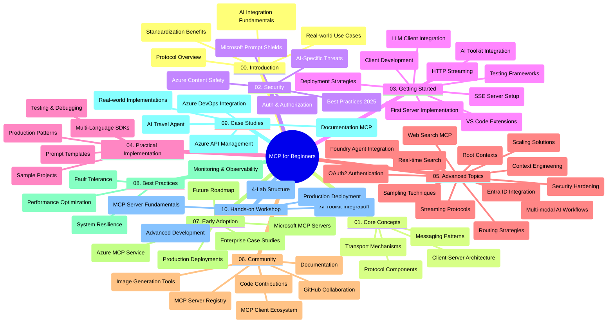

<!--
CO_OP_TRANSLATOR_METADATA:
{
  "original_hash": "e2c6ed897fa98fa08e0146101776c7ff",
  "translation_date": "2025-07-18T09:11:23+00:00",
  "source_file": "study_guide.md",
  "language_code": "ru"
}
-->
# Протокол Контекста Модели (MCP) для начинающих — Руководство по изучению

Это руководство по изучению предоставляет обзор структуры и содержимого репозитория для учебной программы «Протокол Контекста Модели (MCP) для начинающих». Используйте это руководство, чтобы эффективно ориентироваться в репозитории и максимально использовать доступные ресурсы.

## Обзор репозитория

Протокол Контекста Модели (MCP) — это стандартизированная платформа для взаимодействия между ИИ-моделями и клиентскими приложениями. Изначально созданный компанией Anthropic, MCP теперь поддерживается более широкой сообществом MCP через официальную организацию на GitHub. Этот репозиторий содержит комплексную учебную программу с практическими примерами кода на C#, Java, JavaScript, Python и TypeScript, предназначенную для разработчиков ИИ, системных архитекторов и инженеров-программистов.

## Визуальная карта учебной программы

## Структура репозитория

Репозиторий организован в десять основных разделов, каждый из которых посвящён разным аспектам MCP:

1. **Введение (00-Introduction/)**
   - Обзор Протокола Контекста Модели
   - Почему стандартизация важна в ИИ-пайплайнах
   - Практические примеры использования и преимущества

2. **Основные концепции (01-CoreConcepts/)**
   - Клиент-серверная архитектура
   - Ключевые компоненты протокола
   - Паттерны обмена сообщениями в MCP

3. **Безопасность (02-Security/)**
   - Угрозы безопасности в системах на базе MCP
   - Лучшие практики по обеспечению безопасности реализации
   - Стратегии аутентификации и авторизации
   - **Полная документация по безопасности**:
     - Лучшие практики безопасности MCP 2025
     - Руководство по реализации Azure Content Safety
     - Контроль и методы безопасности MCP
     - Быстрая справка по лучшим практикам MCP
   - **Ключевые темы безопасности**:
     - Атаки с внедрением подсказок и отравлением инструментов
     - Перехват сессий и проблемы «запутавшегося заместителя»
     - Уязвимости при передаче токенов
     - Чрезмерные права и контроль доступа
     - Безопасность цепочки поставок компонентов ИИ
     - Интеграция Microsoft Prompt Shields

4. **Начало работы (03-GettingStarted/)**
   - Настройка и конфигурация окружения
   - Создание базовых MCP-серверов и клиентов
   - Интеграция с существующими приложениями
   - Включает разделы:
     - Первая реализация сервера
     - Разработка клиента
     - Интеграция LLM клиента
     - Интеграция с VS Code
     - Сервер с Server-Sent Events (SSE)
     - HTTP-стриминг
     - Интеграция AI Toolkit
     - Стратегии тестирования
     - Руководство по развертыванию

5. **Практическая реализация (04-PracticalImplementation/)**
   - Использование SDK на разных языках программирования
   - Отладка, тестирование и методы валидации
   - Создание повторно используемых шаблонов подсказок и рабочих процессов
   - Примеры проектов с реализациями

6. **Продвинутые темы (05-AdvancedTopics/)**
   - Техники инженерии контекста
   - Интеграция агента Foundry
   - Мультимодальные AI-рабочие процессы
   - Демонстрации аутентификации OAuth2
   - Возможности поиска в реальном времени
   - Потоковая передача данных в реальном времени
   - Реализация корневых контекстов
   - Стратегии маршрутизации
   - Методы сэмплирования
   - Подходы к масштабированию
   - Вопросы безопасности
   - Интеграция безопасности Entra ID
   - Интеграция веб-поиска

7. **Вклад сообщества (06-CommunityContributions/)**
   - Как вносить код и документацию
   - Совместная работа через GitHub
   - Улучшения и обратная связь от сообщества
   - Использование различных MCP клиентов (Claude Desktop, Cline, VSCode)
   - Работа с популярными MCP серверами, включая генерацию изображений

8. **Уроки раннего внедрения (07-LessonsfromEarlyAdoption/)**
   - Реальные реализации и истории успеха
   - Создание и развертывание решений на базе MCP
   - Тенденции и дорожная карта развития
   - **Руководство по Microsoft MCP серверам**: Полное руководство по 10 готовым к производству Microsoft MCP серверам, включая:
     - Microsoft Learn Docs MCP Server
     - Azure MCP Server (более 15 специализированных коннекторов)
     - GitHub MCP Server
     - Azure DevOps MCP Server
     - MarkItDown MCP Server
     - SQL Server MCP Server
     - Playwright MCP Server
     - Dev Box MCP Server
     - Azure AI Foundry MCP Server
     - Microsoft 365 Agents Toolkit MCP Server

9. **Лучшие практики (08-BestPractices/)**
   - Настройка производительности и оптимизация
   - Проектирование отказоустойчивых MCP систем
   - Стратегии тестирования и устойчивости

10. **Кейсы (09-CaseStudy/)**
    - Пример интеграции с Azure API Management
    - Пример реализации для туристического агента
    - Интеграция Azure DevOps с обновлениями YouTube
    - Примеры реализации MCP для документации
    - Примеры с подробной документацией

11. **Практический семинар (10-StreamliningAIWorkflowsBuildingAnMCPServerWithAIToolkit/)**
    - Комплексный практический семинар по объединению MCP с AI Toolkit
    - Создание интеллектуальных приложений, связывающих ИИ-модели с реальными инструментами
    - Практические модули, охватывающие основы, разработку кастомных серверов и стратегии развертывания в продакшн
    - **Структура лабораторий**:
      - Лаборатория 1: Основы MCP сервера
      - Лаборатория 2: Продвинутая разработка MCP сервера
      - Лаборатория 3: Интеграция AI Toolkit
      - Лаборатория 4: Развертывание и масштабирование в продакшн
    - Обучение на основе лабораторий с пошаговыми инструкциями

## Дополнительные ресурсы

Репозиторий включает вспомогательные материалы:

- **Папка Images**: Содержит диаграммы и иллюстрации, используемые в учебной программе
- **Переводы**: Многоязычная поддержка с автоматическими переводами документации
- **Официальные ресурсы MCP**:
  - [MCP Documentation](https://modelcontextprotocol.io/)
  - [MCP Specification](https://spec.modelcontextprotocol.io/)
  - [MCP GitHub Repository](https://github.com/modelcontextprotocol)

## Как использовать этот репозиторий

1. **Последовательное обучение**: Изучайте главы по порядку (с 00 по 10) для структурированного освоения материала.
2. **Фокус на конкретном языке**: Если вас интересует определённый язык программирования, изучайте каталоги с примерами на предпочитаемом языке.
3. **Практическая реализация**: Начните с раздела «Начало работы», чтобы настроить окружение и создать первый MCP сервер и клиента.
4. **Продвинутое изучение**: После освоения основ переходите к продвинутым темам для расширения знаний.
5. **Вовлечение в сообщество**: Присоединяйтесь к сообществу MCP через обсуждения на GitHub и каналы Discord, чтобы общаться с экспертами и другими разработчиками.

## MCP клиенты и инструменты

Учебная программа охватывает различные MCP клиенты и инструменты:

1. **Официальные клиенты**:
   - Visual Studio Code
   - MCP в Visual Studio Code
   - Claude Desktop
   - Claude в VSCode
   - Claude API

2. **Клиенты сообщества**:
   - Cline (терминальный клиент)
   - Cursor (редактор кода)
   - ChatMCP
   - Windsurf

3. **Инструменты управления MCP**:
   - MCP CLI
   - MCP Manager
   - MCP Linker
   - MCP Router

## Популярные MCP серверы

В репозитории представлены различные MCP серверы, включая:

1. **Официальные Microsoft MCP серверы**:
   - Microsoft Learn Docs MCP Server
   - Azure MCP Server (более 15 специализированных коннекторов)
   - GitHub MCP Server
   - Azure DevOps MCP Server
   - MarkItDown MCP Server
   - SQL Server MCP Server
   - Playwright MCP Server
   - Dev Box MCP Server
   - Azure AI Foundry MCP Server
   - Microsoft 365 Agents Toolkit MCP Server

2. **Официальные референсные серверы**:
   - Filesystem
   - Fetch
   - Memory
   - Sequential Thinking

3. **Генерация изображений**:
   - Azure OpenAI DALL-E 3
   - Stable Diffusion WebUI
   - Replicate

4. **Инструменты разработки**:
   - Git MCP
   - Terminal Control
   - Code Assistant

5. **Специализированные серверы**:
   - Salesforce
   - Microsoft Teams
   - Jira & Confluence

## Вклад в проект

Этот репозиторий приветствует вклад сообщества. См. раздел «Вклад сообщества» для рекомендаций по эффективному участию в экосистеме MCP.

## Журнал изменений

| Дата | Изменения |
|------|-----------|
| 18 июля 2025 | - Обновлена структура репозитория с добавлением Руководства по Microsoft MCP серверам - Добавлен полный список из 10 готовых к производству Microsoft MCP серверов - Расширен раздел Популярные MCP серверы с официальными Microsoft MCP серверами - Обновлен раздел Кейсы с реальными примерами файлов - Добавлены детали структуры лабораторий для Практического семинара |
| 16 июля 2025 | - Обновлена структура репозитория в соответствии с текущим содержимым - Добавлен раздел MCP клиенты и инструменты - Добавлен раздел Популярные MCP серверы - Обновлена визуальная карта учебной программы со всеми текущими темами - Расширен раздел Продвинутые темы со всеми специализированными областями - Обновлен раздел Кейсы с реальными примерами - Уточнено происхождение MCP как созданного Anthropic |
| 11 июня 2025 | - Первоначальное создание руководства по изучению - Добавлена визуальная карта учебной программы - Описана структура репозитория - Включены примеры проектов и дополнительные ресурсы |

---

*Это руководство по изучению обновлено 18 июля 2025 года и отражает состояние репозитория на эту дату. Содержимое репозитория может обновляться после этой даты.*

**Отказ от ответственности**:  
Этот документ был переведен с помощью сервиса автоматического перевода [Co-op Translator](https://github.com/Azure/co-op-translator). Несмотря на наши усилия по обеспечению точности, просим учитывать, что автоматический перевод может содержать ошибки или неточности. Оригинальный документ на его исходном языке следует считать авторитетным источником. Для получения критически важной информации рекомендуется обращаться к профессиональному человеческому переводу. Мы не несем ответственности за любые недоразумения или неправильные толкования, возникшие в результате использования данного перевода.