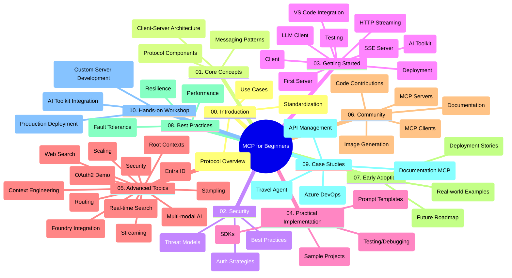

<!--
CO_OP_TRANSLATOR_METADATA:
{
  "original_hash": "77bfab7090f987a5b9fe078f50dbda13",
  "translation_date": "2025-07-16T23:20:05+00:00",
  "source_file": "study_guide.md",
  "language_code": "ru"
}
-->
# Протокол Контекста Модели (MCP) для начинающих — Руководство по изучению

Это руководство по изучению предоставляет обзор структуры и содержимого репозитория для учебной программы «Протокол Контекста Модели (MCP) для начинающих». Используйте это руководство, чтобы эффективно ориентироваться в репозитории и максимально использовать доступные ресурсы.

## Обзор репозитория

Протокол Контекста Модели (MCP) — это стандартизированная платформа для взаимодействия между ИИ-моделями и клиентскими приложениями. Изначально созданный компанией Anthropic, MCP теперь поддерживается более широкой сообществом MCP через официальную организацию на GitHub. Этот репозиторий содержит комплексную учебную программу с практическими примерами кода на C#, Java, JavaScript, Python и TypeScript, предназначенную для разработчиков ИИ, системных архитекторов и инженеров-программистов.

## Визуальная карта учебной программы

## Структура репозитория

Репозиторий организован в десять основных разделов, каждый из которых посвящён разным аспектам MCP:

1. **Введение (00-Introduction/)**
   - Обзор Протокола Контекста Модели
   - Почему стандартизация важна в ИИ-пайплайнах
   - Практические примеры использования и преимущества

2. **Основные концепции (01-CoreConcepts/)**
   - Клиент-серверная архитектура
   - Ключевые компоненты протокола
   - Паттерны обмена сообщениями в MCP

3. **Безопасность (02-Security/)**
   - Угрозы безопасности в системах на базе MCP
   - Лучшие практики по обеспечению безопасности реализации
   - Стратегии аутентификации и авторизации

4. **Начало работы (03-GettingStarted/)**
   - Настройка и конфигурация окружения
   - Создание базовых MCP-серверов и клиентов
   - Интеграция с существующими приложениями
   - Включает разделы:
     - Первая реализация сервера
     - Разработка клиента
     - Интеграция LLM клиента
     - Интеграция с VS Code
     - Сервер Server-Sent Events (SSE)
     - HTTP-стриминг
     - Интеграция AI Toolkit
     - Стратегии тестирования
     - Руководство по развертыванию

5. **Практическая реализация (04-PracticalImplementation/)**
   - Использование SDK на разных языках программирования
   - Отладка, тестирование и методы валидации
   - Создание переиспользуемых шаблонов запросов и рабочих процессов
   - Примеры проектов с реализациями

6. **Продвинутые темы (05-AdvancedTopics/)**
   - Техники инженерии контекста
   - Интеграция агента Foundry
   - Мультимодальные ИИ-рабочие процессы
   - Демонстрации аутентификации OAuth2
   - Возможности поиска в реальном времени
   - Потоковая передача данных в реальном времени
   - Реализация корневых контекстов
   - Стратегии маршрутизации
   - Методы сэмплирования
   - Подходы к масштабированию
   - Вопросы безопасности
   - Интеграция безопасности Entra ID
   - Интеграция веб-поиска

7. **Вклад сообщества (06-CommunityContributions/)**
   - Как вносить код и документацию
   - Совместная работа через GitHub
   - Улучшения и обратная связь от сообщества
   - Использование различных MCP клиентов (Claude Desktop, Cline, VSCode)
   - Работа с популярными MCP серверами, включая генерацию изображений

8. **Уроки раннего внедрения (07-LessonsfromEarlyAdoption/)**
   - Реальные реализации и истории успеха
   - Создание и развертывание решений на базе MCP
   - Тенденции и планы на будущее

9. **Лучшие практики (08-BestPractices/)**
   - Оптимизация производительности и настройка
   - Проектирование отказоустойчивых MCP-систем
   - Стратегии тестирования и устойчивости

10. **Кейсы (09-CaseStudy/)**
    - Кейсы: интеграция с Azure API Management
    - Кейсы: реализация для туристического агента
    - Кейсы: интеграция Azure DevOps с YouTube
    - Примеры реализации с подробной документацией

11. **Практический семинар (10-StreamliningAIWorkflowsBuildingAnMCPServerWithAIToolkit/)**
    - Всеобъемлющий практический семинар, объединяющий MCP с AI Toolkit
    - Создание интеллектуальных приложений, связывающих ИИ-модели с реальными инструментами
    - Практические модули, охватывающие основы, разработку кастомных серверов и стратегии продакшн-развертывания
    - Обучение в лабораторном формате с пошаговыми инструкциями

## Дополнительные ресурсы

Репозиторий включает вспомогательные материалы:

- **Папка Images**: содержит диаграммы и иллюстрации, используемые в учебной программе
- **Переводы**: поддержка нескольких языков с автоматическим переводом документации
- **Официальные ресурсы MCP**:
  - [MCP Documentation](https://modelcontextprotocol.io/)
  - [MCP Specification](https://spec.modelcontextprotocol.io/)
  - [MCP GitHub Repository](https://github.com/modelcontextprotocol)

## Как использовать этот репозиторий

1. **Последовательное обучение**: изучайте главы по порядку (с 00 по 10) для структурированного освоения материала.
2. **Фокус на конкретном языке**: если вас интересует определённый язык программирования, изучайте каталоги с примерами на выбранном языке.
3. **Практическая реализация**: начните с раздела «Начало работы», чтобы настроить окружение и создать первый MCP-сервер и клиента.
4. **Продвинутое изучение**: освоив основы, переходите к продвинутым темам для расширения знаний.
5. **Вовлечение сообщества**: присоединяйтесь к сообществу MCP через обсуждения на GitHub и каналы Discord, чтобы общаться с экспертами и коллегами-разработчиками.

## Клиенты и инструменты MCP

Учебная программа охватывает различные MCP клиенты и инструменты:

1. **Официальные клиенты**:
   - Claude Desktop
   - Claude в VSCode
   - Claude API

2. **Клиенты сообщества**:
   - Cline (терминальный клиент)
   - Cursor (редактор кода)
   - ChatMCP
   - Windsurf

3. **Инструменты управления MCP**:
   - MCP CLI
   - MCP Manager
   - MCP Linker
   - MCP Router

## Популярные MCP серверы

В репозитории представлены различные MCP серверы, включая:

1. **Официальные эталонные серверы**:
   - Filesystem
   - Fetch
   - Memory
   - Sequential Thinking

2. **Генерация изображений**:
   - Azure OpenAI DALL-E 3
   - Stable Diffusion WebUI
   - Replicate

3. **Инструменты разработки**:
   - Git MCP
   - Terminal Control
   - Code Assistant

4. **Специализированные серверы**:
   - Salesforce
   - Microsoft Teams
   - Jira & Confluence

## Вклад в проект

Этот репозиторий приветствует вклад сообщества. См. раздел «Вклад сообщества» для рекомендаций по эффективному участию в экосистеме MCP.

## Журнал изменений

| Дата | Изменения |
|------|-----------|
| 16 июля 2025 | - Обновлена структура репозитория в соответствии с текущим содержимым - Добавлен раздел Клиенты и инструменты MCP - Добавлен раздел Популярные MCP серверы - Обновлена визуальная карта учебной программы с актуальными темами - Расширен раздел Продвинутые темы всеми специализированными направлениями - Обновлены кейсы с реальными примерами - Уточнено происхождение MCP как проекта Anthropic |
| 11 июня 2025 | - Первоначальное создание руководства по изучению - Добавлена визуальная карта учебной программы - Описана структура репозитория - Включены примеры проектов и дополнительные ресурсы |

---

*Это руководство по изучению обновлено 16 июля 2025 года и отражает состояние репозитория на эту дату. Содержимое репозитория может обновляться после этой даты.*

**Отказ от ответственности**:  
Этот документ был переведен с помощью сервиса автоматического перевода [Co-op Translator](https://github.com/Azure/co-op-translator). Несмотря на наши усилия по обеспечению точности, просим учитывать, что автоматический перевод может содержать ошибки или неточности. Оригинальный документ на его исходном языке следует считать авторитетным источником. Для получения критически важной информации рекомендуется обращаться к профессиональному переводу, выполненному человеком. Мы не несем ответственности за любые недоразумения или неправильные толкования, возникшие в результате использования данного перевода.