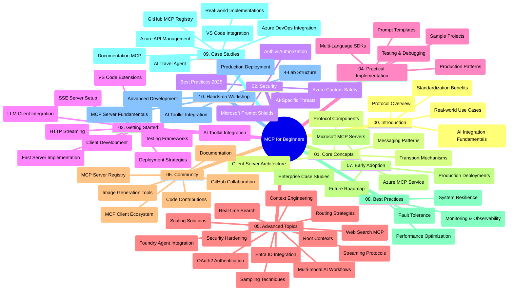

<!--
CO_OP_TRANSLATOR_METADATA:
{
  "original_hash": "719117a0a5f34ade7b5dfb61ee06fb13",
  "translation_date": "2025-09-26T17:39:16+00:00",
  "source_file": "study_guide.md",
  "language_code": "ru"
}
-->
# Протокол контекста модели (MCP) для начинающих - учебное пособие

Это учебное пособие предоставляет обзор структуры репозитория и содержания учебной программы "Протокол контекста модели (MCP) для начинающих". Используйте это руководство, чтобы эффективно ориентироваться в репозитории и максимально использовать доступные ресурсы.

## Обзор репозитория

Протокол контекста модели (MCP) — это стандартизированная структура для взаимодействия между AI-моделями и клиентскими приложениями. Изначально созданный компанией Anthropic, MCP теперь поддерживается более широкой MCP-сообществом через официальную организацию на GitHub. Этот репозиторий предлагает комплексную учебную программу с практическими примерами кода на C#, Java, JavaScript, Python и TypeScript, предназначенную для разработчиков AI, системных архитекторов и инженеров-программистов.

## Визуальная карта учебной программы

## Структура репозитория

Репозиторий организован в десять основных разделов, каждый из которых посвящен различным аспектам MCP:

1. **Введение (00-Introduction/)**
   - Обзор протокола контекста модели
   - Почему стандартизация важна в AI-пайплайнах
   - Практические примеры использования и преимущества

2. **Основные концепции (01-CoreConcepts/)**
   - Архитектура клиент-сервер
   - Основные компоненты протокола
   - Шаблоны обмена сообщениями в MCP

3. **Безопасность (02-Security/)**
   - Угрозы безопасности в системах на основе MCP
   - Лучшие практики для защиты реализации
   - Стратегии аутентификации и авторизации
   - **Полная документация по безопасности**:
     - Лучшие практики безопасности MCP 2025
     - Руководство по реализации Azure Content Safety
     - Контроль и методы безопасности MCP
     - Краткий справочник лучших практик MCP
   - **Ключевые темы безопасности**:
     - Атаки с внедрением подсказок и отравлением инструментов
     - Угон сессий и проблемы "запутанного заместителя"
     - Уязвимости передачи токенов
     - Чрезмерные разрешения и контроль доступа
     - Безопасность цепочки поставок для AI-компонентов
     - Интеграция Microsoft Prompt Shields

4. **Начало работы (03-GettingStarted/)**
   - Настройка и конфигурация среды
   - Создание базовых серверов и клиентов MCP
   - Интеграция с существующими приложениями
   - Включает разделы:
     - Первая реализация сервера
     - Разработка клиента
     - Интеграция клиента LLM
     - Интеграция с VS Code
     - Сервер событий (SSE)
     - HTTP-стриминг
     - Интеграция AI Toolkit
     - Стратегии тестирования
     - Руководство по развертыванию

5. **Практическая реализация (04-PracticalImplementation/)**
   - Использование SDK для различных языков программирования
   - Отладка, тестирование и методы проверки
   - Создание шаблонов подсказок и рабочих процессов
   - Примеры проектов с реализацией

6. **Продвинутые темы (05-AdvancedTopics/)**
   - Техники инженерии контекста
   - Интеграция агентов Foundry
   - Мультимодальные AI-рабочие процессы
   - Демонстрации аутентификации OAuth2
   - Возможности поиска в реальном времени
   - Стриминг в реальном времени
   - Реализация корневых контекстов
   - Стратегии маршрутизации
   - Методы выборки
   - Подходы к масштабированию
   - Вопросы безопасности
   - Интеграция безопасности Entra ID
   - Интеграция веб-поиска

7. **Вклад сообщества (06-CommunityContributions/)**
   - Как вносить код и документацию
   - Сотрудничество через GitHub
   - Улучшения и обратная связь от сообщества
   - Использование различных клиентов MCP (Claude Desktop, Cline, VSCode)
   - Работа с популярными серверами MCP, включая генерацию изображений

8. **Уроки раннего внедрения (07-LessonsfromEarlyAdoption/)**
   - Реальные примеры реализации и истории успеха
   - Создание и развертывание решений на основе MCP
   - Тренды и дорожная карта на будущее
   - **Руководство по серверам Microsoft MCP**: Полное руководство по 10 готовым к производству серверам Microsoft MCP, включая:
     - Microsoft Learn Docs MCP Server
     - Azure MCP Server (15+ специализированных коннекторов)
     - GitHub MCP Server
     - Azure DevOps MCP Server
     - MarkItDown MCP Server
     - SQL Server MCP Server
     - Playwright MCP Server
     - Dev Box MCP Server
     - Azure AI Foundry MCP Server
     - Microsoft 365 Agents Toolkit MCP Server

9. **Лучшие практики (08-BestPractices/)**
   - Настройка производительности и оптимизация
   - Проектирование отказоустойчивых систем MCP
   - Стратегии тестирования и устойчивости

10. **Кейсы (09-CaseStudy/)**
    - **Семь подробных кейсов**, демонстрирующих универсальность MCP в различных сценариях:
    - **Azure AI Travel Agents**: Оркестрация нескольких агентов с Azure OpenAI и AI Search
    - **Интеграция Azure DevOps**: Автоматизация рабочих процессов с обновлениями данных YouTube
    - **Извлечение документации в реальном времени**: Консольный клиент Python с HTTP-стримингом
    - **Интерактивный генератор учебных планов**: Веб-приложение Chainlit с разговорным AI
    - **Документация в редакторе**: Интеграция VS Code с рабочими процессами GitHub Copilot
    - **Управление API Azure**: Интеграция корпоративных API с созданием сервера MCP
    - **Реестр MCP GitHub**: Развитие экосистемы и платформы интеграции агентов
    - Примеры реализации, охватывающие корпоративную интеграцию, продуктивность разработчиков и развитие экосистемы

11. **Практический семинар (10-StreamliningAIWorkflowsBuildingAnMCPServerWithAIToolkit/)**
    - Комплексный практический семинар, объединяющий MCP с AI Toolkit
    - Создание интеллектуальных приложений, связывающих AI-модели с реальными инструментами
    - Практические модули, охватывающие основы, разработку пользовательских серверов и стратегии развертывания в производстве
    - **Структура лаборатории**:
      - Лаборатория 1: Основы сервера MCP
      - Лаборатория 2: Продвинутая разработка сервера MCP
      - Лаборатория 3: Интеграция AI Toolkit
      - Лаборатория 4: Развертывание и масштабирование в производстве
    - Подход к обучению на основе лабораторных работ с пошаговыми инструкциями

## Дополнительные ресурсы

Репозиторий включает вспомогательные ресурсы:

- **Папка с изображениями**: Содержит диаграммы и иллюстрации, используемые в учебной программе
- **Переводы**: Поддержка нескольких языков с автоматическими переводами документации
- **Официальные ресурсы MCP**:
  - [Документация MCP](https://modelcontextprotocol.io/)
  - [Спецификация MCP](https://spec.modelcontextprotocol.io/)
  - [Репозиторий MCP на GitHub](https://github.com/modelcontextprotocol)

## Как использовать этот репозиторий

1. **Последовательное обучение**: Следуйте главам по порядку (00–10) для структурированного обучения.
2. **Фокус на языке программирования**: Если вас интересует определенный язык программирования, изучите директории с примерами для реализации на вашем предпочтительном языке.
3. **Практическая реализация**: Начните с раздела "Начало работы", чтобы настроить среду и создать свой первый сервер и клиент MCP.
4. **Продвинутое изучение**: После освоения основ переходите к продвинутым темам для расширения знаний.
5. **Взаимодействие с сообществом**: Присоединяйтесь к MCP-сообществу через обсуждения на GitHub и каналы Discord, чтобы общаться с экспертами и другими разработчиками.

## Клиенты и инструменты MCP

Учебная программа охватывает различные клиенты и инструменты MCP:

1. **Официальные клиенты**:
   - Visual Studio Code 
   - MCP в Visual Studio Code
   - Claude Desktop
   - Claude в VSCode 
   - Claude API

2. **Клиенты сообщества**:
   - Cline (на основе терминала)
   - Cursor (редактор кода)
   - ChatMCP
   - Windsurf

3. **Инструменты управления MCP**:
   - MCP CLI
   - MCP Manager
   - MCP Linker
   - MCP Router

## Популярные серверы MCP

Репозиторий представляет различные серверы MCP, включая:

1. **Официальные серверы Microsoft MCP**:
   - Microsoft Learn Docs MCP Server
   - Azure MCP Server (15+ специализированных коннекторов)
   - GitHub MCP Server
   - Azure DevOps MCP Server
   - MarkItDown MCP Server
   - SQL Server MCP Server
   - Playwright MCP Server
   - Dev Box MCP Server
   - Azure AI Foundry MCP Server
   - Microsoft 365 Agents Toolkit MCP Server

2. **Официальные эталонные серверы**:
   - Filesystem
   - Fetch
   - Memory
   - Sequential Thinking

3. **Генерация изображений**:
   - Azure OpenAI DALL-E 3
   - Stable Diffusion WebUI
   - Replicate

4. **Инструменты разработки**:
   - Git MCP
   - Terminal Control
   - Code Assistant

5. **Специализированные серверы**:
   - Salesforce
   - Microsoft Teams
   - Jira & Confluence

## Вклад

Этот репозиторий приветствует вклад сообщества. См. раздел "Вклад сообщества" для получения рекомендаций о том, как эффективно внести свой вклад в экосистему MCP.

## История изменений

| Дата | Изменения |
|------|---------|
| 26 сентября 2025 | - Добавлен кейс GitHub MCP Registry в раздел 09-CaseStudy - Обновлены кейсы для отражения семи подробных примеров - Улучшены описания кейсов с конкретными деталями реализации - Обновлена визуальная карта учебной программы для включения GitHub MCP Registry - Пересмотрена структура учебного пособия с акцентом на развитие экосистемы |
| 18 июля 2025 | - Обновлена структура репозитория для включения руководства по серверам Microsoft MCP - Добавлен полный список из 10 готовых к производству серверов Microsoft MCP - Расширен раздел "Популярные серверы MCP" с официальными серверами Microsoft MCP - Обновлен раздел кейсов с реальными примерами файлов - Добавлены детали структуры лаборатории для практического семинара |
| 16 июля 2025 | - Обновлена структура репозитория для отражения текущего содержания - Добавлен раздел "Клиенты и инструменты MCP" - Добавлен раздел "Популярные серверы MCP" - Обновлена визуальная карта учебной программы с текущими темами - Расширен раздел "Продвинутые темы" с учетом всех специализированных областей - Обновлены кейсы для отражения реальных примеров - Уточнено происхождение MCP как созданного компанией Anthropic |
| 11 июня 2025 | - Первоначальное создание учебного пособия - Добавлена визуальная карта учебной программы - Описана структура репозитория - Включены примеры проектов и дополнительные ресурсы |

---

*Это учебное пособие было обновлено 26 сентября 2025 года и предоставляет обзор репозитория на эту дату. Содержание репозитория может быть обновлено после этой даты.*

---

