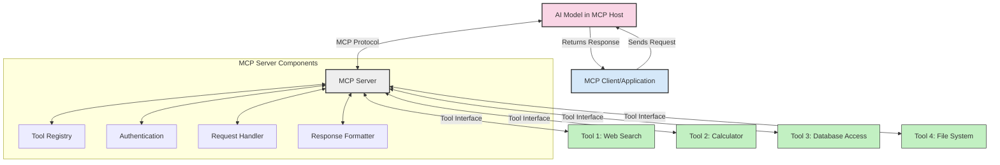
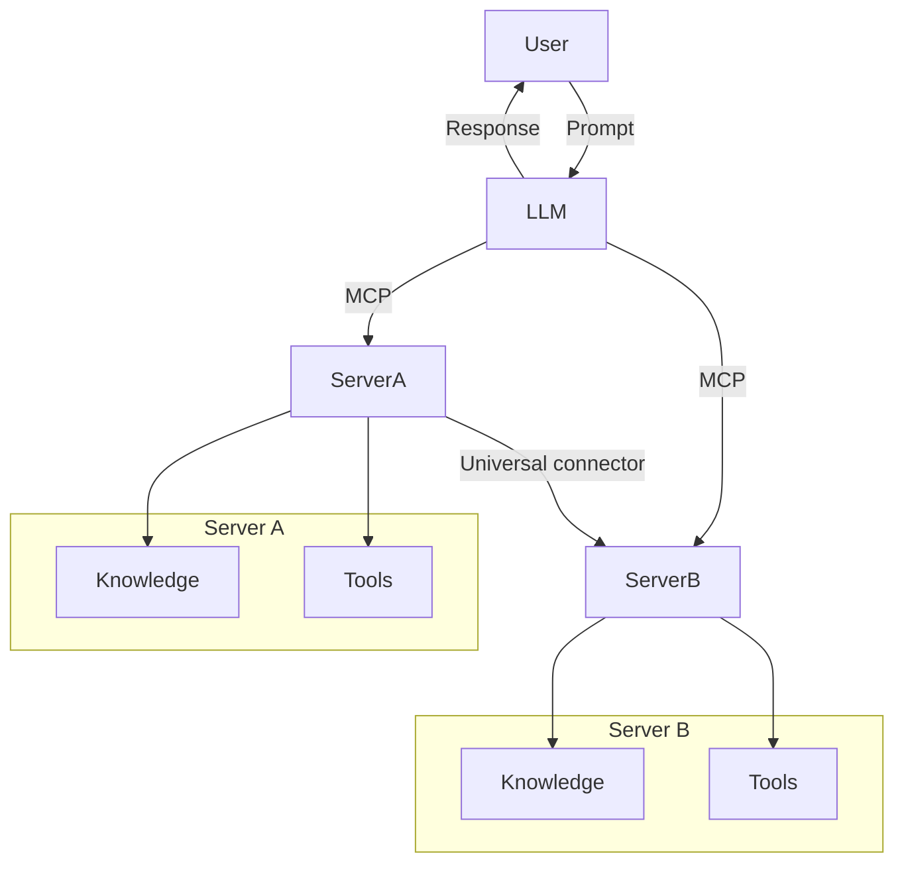

<!--
CO_OP_TRANSLATOR_METADATA:
{
  "original_hash": "cf84f987e1b771d2201408e110dfd2db",
  "translation_date": "2025-05-20T18:03:35+00:00",
  "source_file": "00-Introduction/README.md",
  "language_code": "sk"
}
-->
# Úvod do Model Context Protocol (MCP): Prečo je dôležitý pre škálovateľné AI aplikácie

Generatívne AI aplikácie predstavujú veľký krok vpred, pretože často umožňujú používateľovi komunikovať s aplikáciou pomocou prirodzených jazykových podnetov. Avšak, ako sa do týchto aplikácií investuje viac času a zdrojov, je dôležité zabezpečiť, aby bolo jednoduché integrovať funkcie a zdroje tak, aby bolo jednoduché ich rozširovať, aby aplikácia zvládala používanie viacerých modelov a ich zložitosti. Stručne povedané, vytváranie generatívnych AI aplikácií je na začiatku jednoduché, no s rastom a zvyšujúcou sa zložitosťou je potrebné definovať architektúru a pravdepodobne sa spoľahnúť na štandard, ktorý zabezpečí konzistentnú výstavbu aplikácií. Práve tu prichádza MCP, ktoré všetko organizuje a poskytuje štandard.

---

## **🔍 Čo je Model Context Protocol (MCP)?**

**Model Context Protocol (MCP)** je **otvorený, štandardizovaný rozhranie**, ktoré umožňuje veľkým jazykovým modelom (LLM) plynulo komunikovať s externými nástrojmi, API a dátovými zdrojmi. Poskytuje konzistentnú architektúru na rozšírenie funkčnosti AI modelov nad rámec ich tréningových dát, čo umožňuje inteligentnejšie, škálovateľné a citlivejšie AI systémy.

---

## **🎯 Prečo je štandardizácia v AI dôležitá**

S rastúcou zložitosťou generatívnych AI aplikácií je nevyhnutné prijímať štandardy, ktoré zabezpečujú **škálovateľnosť, rozšíriteľnosť** a **udržateľnosť**. MCP rieši tieto potreby tým, že:

- Zjednocuje integrácie modelov a nástrojov  
- Znižuje krehké, jednorazové vlastné riešenia  
- Umožňuje koexistenciu viacerých modelov v jednom ekosystéme  

---

## **📚 Ciele učenia**

Na konci tohto článku budete vedieť:

- Definovať **Model Context Protocol (MCP)** a jeho použitia  
- Pochopiť, ako MCP štandardizuje komunikáciu medzi modelmi a nástrojmi  
- Identifikovať základné komponenty architektúry MCP  
- Preskúmať reálne použitia MCP v podnikových a vývojových kontextoch  

---

## **💡 Prečo je Model Context Protocol (MCP) prelomový**

### **🔗 MCP rieši fragmentáciu v AI interakciách**

Pred MCP vyžadovalo prepojenie modelov s nástrojmi:

- Vlastný kód pre každý pár nástroj-model  
- Nestandardné API pre každého dodávateľa  
- Časté prerušenia kvôli aktualizáciám  
- Slabú škálovateľnosť pri väčšom počte nástrojov  

### **✅ Výhody štandardizácie MCP**

| **Výhoda**               | **Popis**                                                                     |
|--------------------------|-------------------------------------------------------------------------------|
| Interoperabilita         | LLM plynulo spolupracujú s nástrojmi od rôznych dodávateľov                   |
| Konzistentnosť           | Jednotné správanie naprieč platformami a nástrojmi                            |
| Znovupoužiteľnosť        | Nástroje vytvorené raz môžu byť použité v rôznych projektoch a systémoch     |
| Rýchlejší vývoj          | Skrátenie času vývoja vďaka štandardizovaným, plug-and-play rozhraniam       |

---

## **🧱 Prehľad architektúry MCP na vysokej úrovni**

MCP používa **klient-server model**, kde:

- **MCP Hosts** prevádzkujú AI modely  
- **MCP Clients** iniciujú požiadavky  
- **MCP Servers** poskytujú kontext, nástroje a schopnosti  

### **Kľúčové komponenty:**

- **Zdroje** – statické alebo dynamické dáta pre modely  
- **Podnety** – preddefinované pracovné postupy pre riadenú generáciu  
- **Nástroje** – spustiteľné funkcie ako vyhľadávanie, výpočty  
- **Vzorkovanie** – agentické správanie cez rekurzívne interakcie  

---

## Ako fungujú MCP servery

MCP servery fungujú nasledovne:

- **Priebeh požiadavky**:  
    1. MCP klient odošle požiadavku AI modelu bežiacemu na MCP hostovi.  
    2. AI model rozpozná potrebu externých nástrojov alebo dát.  
    3. Model komunikuje s MCP serverom pomocou štandardizovaného protokolu.  

- **Funkcie MCP servera**:  
    - Registr nástrojov: Udržiava katalóg dostupných nástrojov a ich schopností.  
    - Autentifikácia: Overuje povolenia na prístup k nástrojom.  
    - Spracovanie požiadaviek: Rieši prichádzajúce požiadavky na nástroje od modelu.  
    - Formátovanie odpovedí: Štruktúruje výstupy nástrojov do formátu zrozumiteľného modelu.  

- **Vykonávanie nástrojov**:  
    - Server smeruje požiadavky na príslušné externé nástroje  
    - Nástroje vykonávajú svoje špecializované funkcie (vyhľadávanie, výpočty, dotazy do databázy, atď.)  
    - Výsledky sú v konzistentnom formáte vrátené modelu  

- **Dokončenie odpovede**:  
    - AI model zapracuje výstupy nástrojov do svojej odpovede.  
    - Konečná odpoveď je odoslaná späť klientskej aplikácii.  

## 👨‍💻 Ako vytvoriť MCP server (s príkladmi)

MCP servery umožňujú rozšíriť schopnosti LLM tým, že poskytujú dáta a funkcionalitu.

Chcete to vyskúšať? Tu sú príklady, ako vytvoriť jednoduchý MCP server v rôznych jazykoch:

- **Python príklad**: https://github.com/modelcontextprotocol/python-sdk

- **TypeScript príklad**: https://github.com/modelcontextprotocol/typescript-sdk

- **Java príklad**: https://github.com/modelcontextprotocol/java-sdk

- **C#/.NET príklad**: https://github.com/modelcontextprotocol/csharp-sdk

## 🌍 Reálne použitia MCP

MCP umožňuje široké spektrum aplikácií rozširovaním AI schopností:

| **Aplikácia**               | **Popis**                                                                    |
|----------------------------|------------------------------------------------------------------------------|
| Integrácia podnikových dát | Prepojenie LLM s databázami, CRM alebo internými nástrojmi                   |
| Agentické AI systémy       | Umožnenie autonómnych agentov s prístupom k nástrojom a rozhodovacími postupmi|
| Multimodálne aplikácie     | Kombinácia textových, obrazových a audio nástrojov v jednej AI aplikácii     |
| Integrácia dát v reálnom čase | Zapojenie živých dát do AI interakcií pre presnejšie a aktuálne výstupy   |

### 🧠 MCP = Univerzálny štandard pre AI interakcie

Model Context Protocol (MCP) funguje ako univerzálny štandard pre AI interakcie, podobne ako USB-C štandardizoval fyzické pripojenia zariadení. Vo svete AI MCP poskytuje konzistentné rozhranie, ktoré umožňuje modelom (klientom) plynulo sa integrovať s externými nástrojmi a poskytovateľmi dát (servermi). Tým sa eliminuje potreba rôznych, vlastných protokolov pre každé API alebo dátový zdroj.

Pod MCP nástroj kompatibilný s MCP (tzv. MCP server) dodržiava jednotný štandard. Tieto servery môžu uvádzať nástroje alebo akcie, ktoré ponúkajú, a vykonávať ich na požiadanie AI agenta. Platformy AI agentov podporujúce MCP dokážu objaviť dostupné nástroje na serveroch a vyvolať ich prostredníctvom tohto štandardizovaného protokolu.

### 💡 Uľahčuje prístup k poznatkom

Okrem poskytovania nástrojov MCP tiež uľahčuje prístup k poznatkom. Umožňuje aplikáciám poskytovať kontext veľkým jazykovým modelom (LLM) tým, že ich prepája s rôznymi dátovými zdrojmi. Napríklad MCP server môže predstavovať dokumentové úložisko spoločnosti, ktoré umožňuje agentom vyhľadávať relevantné informácie na požiadanie. Iný server môže spracovávať špecifické akcie, ako je odosielanie emailov alebo aktualizácia záznamov. Z pohľadu agenta sú to jednoducho nástroje, ktoré môže používať – niektoré vracajú dáta (poznatkový kontext), iné vykonávajú akcie. MCP efektívne spravuje oboje.

Agent, ktorý sa pripája k MCP serveru, sa automaticky naučí dostupné schopnosti a prístupné dáta servera cez štandardný formát. Táto štandardizácia umožňuje dynamickú dostupnosť nástrojov. Napríklad pridaním nového MCP servera do systému agenta sa jeho funkcie okamžite stanú použiteľnými bez potreby ďalšej úpravy inštrukcií agenta.

Táto zjednodušená integrácia korešponduje s tokom znázorneným v diagrame mermaid, kde servery poskytujú nástroje aj poznatky, čím zabezpečujú plynulú spoluprácu medzi systémami.

### 👉 Príklad: škálovateľné riešenie agenta

## 🔐 Praktické výhody MCP

Tu sú praktické výhody používania MCP:

- **Aktuálnosť**: Modely môžu pristupovať k najnovším informáciám nad rámec svojich tréningových dát  
- **Rozšírenie schopností**: Modely môžu využiť špecializované nástroje pre úlohy, na ktoré neboli trénované  
- **Zníženie halucinácií**: Externé dátové zdroje poskytujú faktické základy  
- **Súkromie**: Citlivé dáta môžu zostať v zabezpečených prostrediach namiesto vkladania do podnetov  

## 📌 Kľúčové závery

Tu sú hlavné závery pre používanie MCP:

- **MCP** štandardizuje spôsob, akým AI modely komunikujú s nástrojmi a dátami  
- Podporuje **rozšíriteľnosť, konzistentnosť a interoperabilitu**  
- MCP pomáha **skrátiť čas vývoja, zlepšiť spoľahlivosť a rozšíriť schopnosti modelov**  
- Klient-server architektúra **umožňuje flexibilné a rozšíriteľné AI aplikácie**  

## 🧠 Cvičenie

Premyslite si AI aplikáciu, ktorú by ste chceli vytvoriť.

- Ktoré **externé nástroje alebo dáta** by mohli zvýšiť jej schopnosti?  
- Ako by MCP mohlo spraviť integráciu **jednoduchšou a spoľahlivejšou?**  

## Ďalšie zdroje

- [MCP GitHub Repository](https://github.com/modelcontextprotocol)

## Čo bude ďalej

Ďalej: [Kapitola 1: Základné koncepty](/01-CoreConcepts/README.md)

**Vyhlásenie o zodpovednosti**:  
Tento dokument bol preložený pomocou AI prekladateľskej služby [Co-op Translator](https://github.com/Azure/co-op-translator). Hoci sa snažíme o presnosť, prosím, majte na pamäti, že automatické preklady môžu obsahovať chyby alebo nepresnosti. Originálny dokument v jeho pôvodnom jazyku by mal byť považovaný za autoritatívny zdroj. Pre kritické informácie sa odporúča profesionálny ľudský preklad. Nie sme zodpovední za akékoľvek nedorozumenia alebo nesprávne interpretácie vyplývajúce z použitia tohto prekladu.