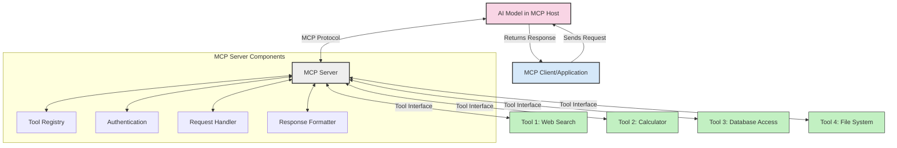
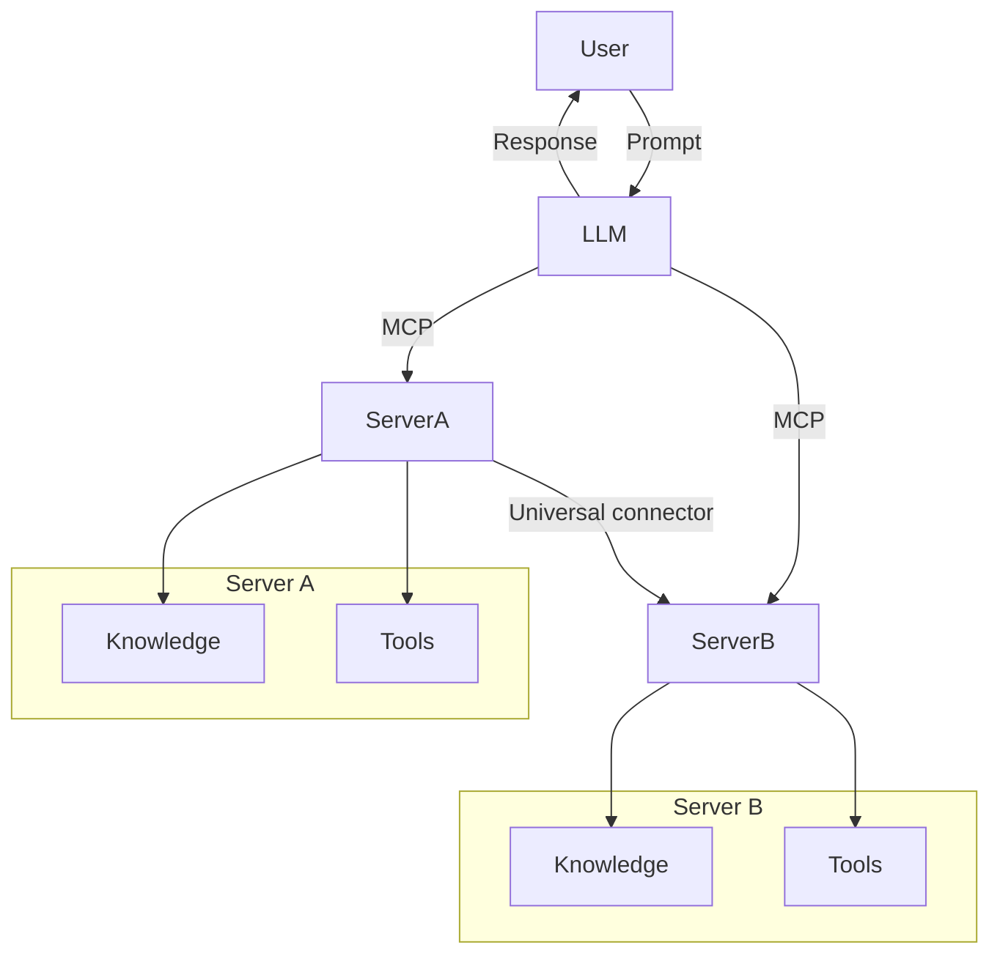

<!--
CO_OP_TRANSLATOR_METADATA:
{
  "original_hash": "02301140adbd807ecf0f17720fa307bc",
  "translation_date": "2025-05-17T06:08:58+00:00",
  "source_file": "00-Introduction/README.md",
  "language_code": "sk"
}
-->
# Úvod do Protokolu kontextu modelu (MCP): Prečo je dôležitý pre škálovateľné AI aplikácie

Generatívne AI aplikácie predstavujú veľký krok vpred, pretože často umožňujú používateľom interakciu s aplikáciou pomocou prirodzeného jazyka. Avšak, keď do takýchto aplikácií investujete viac času a zdrojov, chcete sa uistiť, že môžete ľahko integrovať funkcie a zdroje tak, aby bolo jednoduché rozširovať ich a aby vaša aplikácia mohla podporovať viac ako jeden model a jeho zložitosť. Skrátka, vytváranie Gen AI aplikácií je na začiatku jednoduché, ale ako rastú a stávajú sa zložitejšími, je potrebné začať definovať architektúru a pravdepodobne sa oprieť o štandard, aby ste sa uistili, že vaše aplikácie sú postavené konzistentným spôsobom. Tu prichádza MCP, aby usporiadal veci a poskytol štandard.

---

## **🔍 Čo je Protokol kontextu modelu (MCP)?**

**Protokol kontextu modelu (MCP)** je **otvorené, štandardizované rozhranie**, ktoré umožňuje veľkým jazykovým modelom (LLMs) bezproblémovú interakciu s externými nástrojmi, API a dátovými zdrojmi. Poskytuje konzistentnú architektúru na zvýšenie funkčnosti AI modelov nad rámec ich tréningových dát, čo umožňuje inteligentnejšie, škálovateľnejšie a pohotovejšie AI systémy.

---

## **🎯 Prečo je štandardizácia v AI dôležitá**

Ako sa generatívne AI aplikácie stávajú zložitejšími, je nevyhnutné prijať štandardy, ktoré zabezpečia **škálovateľnosť, rozšíriteľnosť** a **udržateľnosť**. MCP rieši tieto potreby tým, že:

- Zjednocuje integrácie modelov a nástrojov
- Znižuje krehké, jednorazové vlastné riešenia
- Umožňuje koexistenciu viacerých modelov v jednom ekosystéme

---

## **📚 Ciele učenia**

Na konci tohto článku budete schopní:

- Definovať **Protokol kontextu modelu (MCP)** a jeho použitie
- Pochopiť, ako MCP štandardizuje komunikáciu medzi modelmi a nástrojmi
- Identifikovať základné komponenty MCP architektúry
- Preskúmať reálne aplikácie MCP v podnikových a vývojových kontextoch

---

## **💡 Prečo je Protokol kontextu modelu (MCP) prelomový**

### **🔗 MCP rieši fragmentáciu v AI interakciách**

Pred MCP integrácia modelov s nástrojmi vyžadovala:

- Vlastný kód pre každý pár nástroj-model
- Neštandardné API pre každého dodávateľa
- Časté poruchy v dôsledku aktualizácií
- Slabú škálovateľnosť s viacerými nástrojmi

### **✅ Výhody štandardizácie MCP**

| **Výhoda**               | **Popis**                                                                        |
|--------------------------|----------------------------------------------------------------------------------|
| Interoperabilita         | LLMs pracujú bezproblémovo s nástrojmi od rôznych dodávateľov                    |
| Konzistentnosť           | Jednotné správanie naprieč platformami a nástrojmi                               |
| Znovupoužiteľnosť        | Nástroje vytvorené raz môžu byť použité naprieč projektmi a systémami            |
| Zrýchlený vývoj          | Zníženie času vývoja použitím štandardizovaných, plug-and-play rozhraní          |

---

## **🧱 Prehľad vysokej úrovne MCP architektúry**

MCP nasleduje **klient-server model**, kde:

- **MCP Hostitelia** spúšťajú AI modely
- **MCP Klienti** iniciujú požiadavky
- **MCP Servery** poskytujú kontext, nástroje a schopnosti

### **Kľúčové komponenty:**

- **Zdroje** – Statické alebo dynamické dáta pre modely  
- **Výzvy** – Preddefinované pracovné postupy pre riadenú generáciu  
- **Nástroje** – Spustiteľné funkcie ako vyhľadávanie, výpočty  
- **Odber** – Agentické správanie prostredníctvom rekurzívnych interakcií

---

## Ako fungujú MCP servery

MCP servery fungujú nasledujúcim spôsobom:

- **Tok požiadaviek**: 
    1. MCP Klient pošle požiadavku AI modelu bežiacemu v MCP Hostiteľovi.
    2. AI model identifikuje, kedy potrebuje externé nástroje alebo dáta.
    3. Model komunikuje s MCP Serverom pomocou štandardizovaného protokolu.

- **Funkčnosť MCP Servera**:
    - Register nástrojov: Udržiava katalóg dostupných nástrojov a ich schopností.
    - Autentifikácia: Overuje povolenia pre prístup k nástrojom.
    - Spracovateľ požiadaviek: Spracováva prichádzajúce požiadavky na nástroje od modelu.
    - Formátovač odpovedí: Štruktúruje výstupy nástrojov vo formáte, ktorý model dokáže pochopiť.

- **Vykonávanie nástrojov**: 
    - Server smeruje požiadavky na príslušné externé nástroje
    - Nástroje vykonávajú svoje špecializované funkcie (vyhľadávanie, výpočet, databázové dotazy, atď.)
    - Výsledky sú vrátené modelu v konzistentnom formáte.

- **Dokončenie odpovede**: 
    - AI model integruje výstupy nástrojov do svojej odpovede.
    - Konečná odpoveď je odoslaná späť klientovi.

## 👨‍💻 Ako vytvoriť MCP server (s príkladmi)

MCP servery vám umožňujú rozšíriť schopnosti LLM poskytovaním dát a funkčnosti.

Pripravení si to vyskúšať? Tu sú príklady vytvorenia jednoduchého MCP servera v rôznych jazykoch:

- **Príklad v Pythone**: https://github.com/modelcontextprotocol/python-sdk

- **Príklad v TypeScripte**: https://github.com/modelcontextprotocol/typescript-sdk

- **Príklad v Jave**: https://github.com/modelcontextprotocol/java-sdk

- **Príklad v C#/.NET**: https://github.com/modelcontextprotocol/csharp-sdk

## 🌍 Reálne použitia MCP

MCP umožňuje širokú škálu aplikácií rozšírením schopností AI:

| **Aplikácia**              | **Popis**                                                                        |
|----------------------------|----------------------------------------------------------------------------------|
| Integrácia podnikových dát | Prepojenie LLMs s databázami, CRM alebo internými nástrojmi                      |
| Agentické AI systémy       | Umožnenie autonómnych agentov s prístupom k nástrojom a pracovnými postupmi rozhodovania |
| Multimodálne aplikácie     | Kombinovanie textových, obrazových a zvukových nástrojov v jednej AI aplikácii   |
| Integrácia v reálnom čase  | Vnášanie živých dát do AI interakcií pre presnejšie, aktuálne výstupy            |

### 🧠 MCP = Univerzálny štandard pre AI interakcie

Protokol kontextu modelu (MCP) funguje ako univerzálny štandard pre AI interakcie, podobne ako USB-C štandardizoval fyzické pripojenia pre zariadenia. Vo svete AI poskytuje MCP konzistentné rozhranie, umožňujúce modelom (klientom) bezproblémovú integráciu s externými nástrojmi a poskytovateľmi dát (servermi). To eliminuje potrebu rôznorodých, vlastných protokolov pre každé API alebo dátový zdroj.

Pod MCP, MCP-kompatibilný nástroj (označovaný ako MCP server) nasleduje jednotný štandard. Tieto servery môžu uvádzať nástroje alebo akcie, ktoré ponúkajú, a vykonávať tieto akcie, keď sú požiadané AI agentom. Platformy AI agentov, ktoré podporujú MCP, sú schopné objaviť dostupné nástroje zo serverov a vyvolať ich prostredníctvom tohto štandardného protokolu.

### 💡 Uľahčený prístup k znalostiam

Okrem ponuky nástrojov MCP tiež uľahčuje prístup k znalostiam. Umožňuje aplikáciám poskytovať kontext veľkým jazykovým modelom (LLMs) tým, že ich prepája s rôznymi dátovými zdrojmi. Napríklad, MCP server môže predstavovať dokumentový úložisko spoločnosti, umožňujúc agentom na požiadanie získať relevantné informácie. Ďalší server môže spracovávať konkrétne akcie ako odosielanie emailov alebo aktualizovanie záznamov. Z pohľadu agenta sú to jednoducho nástroje, ktoré môže použiť – niektoré nástroje vracajú dáta (kontext znalostí), zatiaľ čo iné vykonávajú akcie. MCP efektívne riadi oboje.

Agent pripojený k MCP serveru automaticky zisťuje dostupné schopnosti servera a prístupné dáta prostredníctvom štandardného formátu. Táto štandardizácia umožňuje dynamickú dostupnosť nástrojov. Napríklad, pridanie nového MCP servera do systému agenta robí jeho funkcie okamžite použiteľnými bez potreby ďalšej prispôsobenia pokynov agenta.

Toto zjednodušené integrovanie je v súlade s tokovým diagramom, kde servery poskytujú nástroje aj znalosti, zabezpečujúc bezproblémovú spoluprácu medzi systémami.

### 👉 Príklad: Škálovateľné riešenie agenta

## 🔐 Praktické výhody MCP

Tu sú niektoré praktické výhody použitia MCP:

- **Aktualizovanosť**: Modely môžu pristupovať k aktuálnym informáciám nad rámec ich tréningových dát
- **Rozšírenie schopností**: Modely môžu využívať špecializované nástroje na úlohy, na ktoré neboli trénované
- **Zníženie halucinácií**: Externé dátové zdroje poskytujú faktické zakotvenie
- **Súkromie**: Citlivé dáta môžu zostať v bezpečných prostrediach namiesto toho, aby boli vložené do výziev

## 📌 Kľúčové body

Nasledujúce sú kľúčové body pre použitie MCP:

- **MCP** štandardizuje, ako AI modely interagujú s nástrojmi a dátami
- Podporuje **rozšíriteľnosť, konzistentnosť a interoperabilitu**
- MCP pomáha **znížiť čas vývoja, zlepšiť spoľahlivosť a rozšíriť schopnosti modelov**
- Architektúra klient-server **umožňuje flexibilné, rozšíriteľné AI aplikácie**

## 🧠 Cvičenie

Zamyslite sa nad AI aplikáciou, ktorú by ste chceli vytvoriť.

- Ktoré **externé nástroje alebo dáta** by mohli zlepšiť jej schopnosti?
- Ako by mohol MCP urobiť integráciu **jednoduchšou a spoľahlivejšou?**

## Ďalšie zdroje

- [MCP GitHub úložisko](https://github.com/modelcontextprotocol)

## Čo ďalej

Ďalej: [Kapitola 1: Základné koncepty](/01-CoreConcepts/README.md)

**Zrieknutie sa zodpovednosti**:  
Tento dokument bol preložený pomocou služby AI prekladu [Co-op Translator](https://github.com/Azure/co-op-translator). Aj keď sa snažíme o presnosť, berte prosím na vedomie, že automatizované preklady môžu obsahovať chyby alebo nepresnosti. Pôvodný dokument v jeho rodnom jazyku by mal byť považovaný za autoritatívny zdroj. Pre kritické informácie sa odporúča profesionálny ľudský preklad. Nezodpovedáme za žiadne nedorozumenia alebo nesprávne interpretácie vyplývajúce z použitia tohto prekladu.