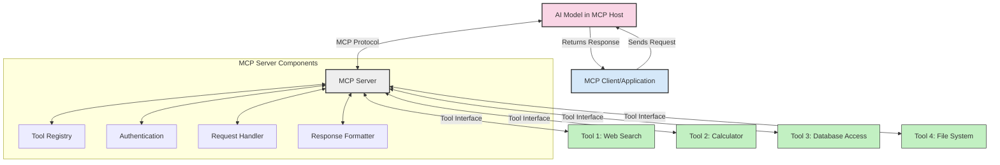
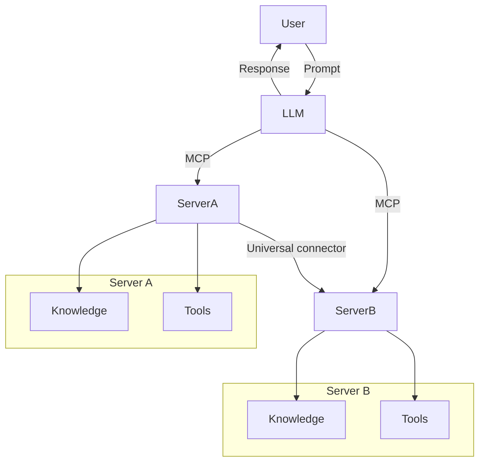

<!--
CO_OP_TRANSLATOR_METADATA:
{
  "original_hash": "1d88dee994dcbb3fa52c271d0c0817b5",
  "translation_date": "2025-05-20T22:24:18+00:00",
  "source_file": "00-Introduction/README.md",
  "language_code": "sk"
}
-->
# Úvod do Model Context Protocol (MCP): Prečo je dôležitý pre škálovateľné AI aplikácie

Generatívne AI aplikácie predstavujú veľký pokrok, pretože často umožňujú používateľovi komunikovať s aplikáciou pomocou prirodzeného jazyka. Avšak, keď sa do takýchto aplikácií investuje viac času a zdrojov, chcete mať istotu, že ich funkcie a zdroje možno jednoducho integrovať tak, aby bolo jednoduché ich rozširovať, aby aplikácia zvládala používanie viacerých modelov a riešila rôzne špecifiká modelov. Skrátka, tvorba Gen AI aplikácií je na začiatku jednoduchá, no s rastúcou zložitosťou je potrebné definovať architektúru a pravdepodobne sa spoľahnúť na štandard, ktorý zabezpečí konzistentnú stavbu aplikácií. Práve tu prichádza MCP, ktorý veci organizuje a poskytuje štandard.

---

## **🔍 Čo je Model Context Protocol (MCP)?**

**Model Context Protocol (MCP)** je **otvorený, štandardizovaný rozhranie**, ktoré umožňuje veľkým jazykovým modelom (LLM) plynulo komunikovať s externými nástrojmi, API a zdrojmi dát. Poskytuje konzistentnú architektúru na rozšírenie funkčnosti AI modelov za hranice ich tréningových dát, čím umožňuje inteligentnejšie, škálovateľnejšie a citlivejšie AI systémy.

---

## **🎯 Prečo je štandardizácia v AI dôležitá**

S rastúcou zložitosťou generatívnych AI aplikácií je nevyhnutné prijať štandardy, ktoré zabezpečia **škálovateľnosť, rozšíriteľnosť** a **udržateľnosť**. MCP rieši tieto potreby tým, že:

- zjednocuje integrácie model-nástroj
- znižuje krehké, jednorazové riešenia na mieru
- umožňuje súbežné používanie viacerých modelov v jednom ekosystéme

---

## **📚 Ciele učenia**

Na konci tohto článku budete vedieť:

- Definovať **Model Context Protocol (MCP)** a jeho použitia
- Pochopiť, ako MCP štandardizuje komunikáciu model-nástroj
- Identifikovať kľúčové komponenty MCP architektúry
- Preskúmať reálne aplikácie MCP v podnikových a vývojových kontextoch

---

## **💡 Prečo je Model Context Protocol (MCP) prelomový**

### **🔗 MCP rieši fragmentáciu v AI interakciách**

Pred MCP integrácia modelov s nástrojmi vyžadovala:

- vlastný kód pre každú kombináciu nástroj-model
- nestandardné API pre každého dodávateľa
- časté prerušenia kvôli aktualizáciám
- slabú škálovateľnosť s rastúcim počtom nástrojov

### **✅ Výhody štandardizácie MCP**

| **Výhoda**               | **Popis**                                                                     |
|--------------------------|-------------------------------------------------------------------------------|
| Interoperabilita         | LLM plynulo pracujú s nástrojmi od rôznych dodávateľov                        |
| Konzistentnosť           | Jednotné správanie naprieč platformami a nástrojmi                            |
| Znovupoužiteľnosť        | Nástroje vytvorené raz možno použiť v rôznych projektoch a systémoch          |
| Urýchlený vývoj          | Skrátenie času vývoja vďaka štandardizovaným, plug-and-play rozhraniam        |

---

## **🧱 Prehľad architektúry MCP na vysokej úrovni**

MCP používa **klient-server model**, kde:

- **MCP Hosts** spúšťajú AI modely
- **MCP Clients** iniciujú požiadavky
- **MCP Servers** poskytujú kontext, nástroje a schopnosti

### **Kľúčové komponenty:**

- **Resources** – statické alebo dynamické dáta pre modely  
- **Prompts** – preddefinované pracovné postupy pre riadenú generáciu  
- **Tools** – vykonateľné funkcie ako vyhľadávanie, výpočty  
- **Sampling** – agentické správanie cez rekurzívne interakcie

---

## Ako fungujú MCP servery

MCP servery fungujú nasledovne:

- **Priebeh požiadavky**:  
    1. MCP Client odošle požiadavku AI modelu bežiacemu na MCP Hostovi.  
    2. AI model rozpozná, kedy potrebuje externé nástroje alebo dáta.  
    3. Model komunikuje s MCP Serverom pomocou štandardizovaného protokolu.

- **Funkcie MCP Servera**:  
    - Registrácia nástrojov: Udržiava katalóg dostupných nástrojov a ich schopností.  
    - Autentifikácia: Overuje oprávnenia na prístup k nástrojom.  
    - Spracovanie požiadaviek: Rieši prichádzajúce požiadavky na nástroje od modelu.  
    - Formátovanie odpovedí: Štrukturuje výstupy nástrojov do formátu, ktorý model rozumie.

- **Vykonávanie nástrojov**:  
    - Server smeruje požiadavky na príslušné externé nástroje  
    - Nástroje vykonávajú svoje špecializované funkcie (vyhľadávanie, výpočty, dotazy do databázy atď.)  
    - Výsledky sa vracajú modelu v konzistentnom formáte.

- **Dokončenie odpovede**:  
    - AI model zahrnie výstupy nástrojov do svojej odpovede.  
    - Finálna odpoveď sa odošle späť klientskej aplikácii.

## 👨‍💻 Ako postaviť MCP server (s príkladmi)

MCP servery umožňujú rozšíriť schopnosti LLM poskytovaním dát a funkcionality.

Chcete to vyskúšať? Tu sú príklady, ako vytvoriť jednoduchý MCP server v rôznych jazykoch:

- **Python príklad**: https://github.com/modelcontextprotocol/python-sdk

- **TypeScript príklad**: https://github.com/modelcontextprotocol/typescript-sdk

- **Java príklad**: https://github.com/modelcontextprotocol/java-sdk

- **C#/.NET príklad**: https://github.com/modelcontextprotocol/csharp-sdk

## 🌍 Reálne použitia MCP

MCP umožňuje široké spektrum aplikácií rozširovaním AI schopností:

| **Aplikácia**               | **Popis**                                                                     |
|----------------------------|-------------------------------------------------------------------------------|
| Integrácia podnikových dát | Prepojenie LLM s databázami, CRM systémami alebo internými nástrojmi          |
| Agentické AI systémy       | Umožnenie autonómnych agentov s prístupom k nástrojom a rozhodovacími procesmi |
| Multi-modálne aplikácie    | Kombinácia textových, obrazových a audio nástrojov v jednej AI aplikácii      |
| Integrácia dát v reálnom čase | Vnášanie aktuálnych dát do AI interakcií pre presnejšie a aktuálne výstupy   |

### 🧠 MCP = Univerzálny štandard pre AI interakcie

Model Context Protocol (MCP) funguje ako univerzálny štandard pre AI interakcie, podobne ako USB-C štandardizoval fyzické pripojenia zariadení. Vo svete AI MCP poskytuje konzistentné rozhranie, ktoré umožňuje modelom (klientom) plynulo integrovať sa s externými nástrojmi a poskytovateľmi dát (servermi). Tým sa eliminuje potreba rôznych vlastných protokolov pre každé API alebo dátový zdroj.

Pod MCP dodržiava nástroj kompatibilný s MCP (tzv. MCP server) jednotný štandard. Tieto servery môžu uviesť nástroje alebo akcie, ktoré ponúkajú, a vykonať ich na požiadanie AI agenta. Platformy AI agentov podporujúce MCP dokážu nájsť dostupné nástroje na serveroch a vyvolať ich cez tento štandardný protokol.

### 💡 Uľahčuje prístup k vedomostiam

Okrem poskytovania nástrojov MCP uľahčuje prístup k vedomostiam. Umožňuje aplikáciám poskytnúť kontext veľkým jazykovým modelom (LLM) prepojením na rôzne zdroje dát. Napríklad MCP server môže reprezentovať firemný dokumentový archív, ktorý agentom umožňuje na požiadanie vyhľadávať relevantné informácie. Iný server môže zvládať konkrétne akcie, ako je odosielanie emailov alebo aktualizácia záznamov. Z pohľadu agenta sú to jednoducho nástroje, ktoré môže použiť – niektoré vracajú dáta (kontext vedomostí), iné vykonávajú akcie. MCP efektívne spravuje obe.

Agent, ktorý sa pripája k MCP serveru, automaticky zistí dostupné schopnosti a prístupné dáta servera cez štandardný formát. Táto štandardizácia umožňuje dynamickú dostupnosť nástrojov. Napríklad pridanie nového MCP servera do systému agenta sprístupní jeho funkcie okamžite bez potreby ďalšej úpravy inštrukcií agenta.

Táto zjednodušená integrácia korešponduje s prúdom znázorneným v mermaid diagrame, kde servery poskytujú nástroje aj vedomosti, čím zabezpečujú bezproblémovú spoluprácu medzi systémami.

### 👉 Príklad: škálovateľné riešenie agenta

## 🔐 Praktické výhody MCP

Tu sú praktické výhody použitia MCP:

- **Aktuálnosť**: Modely môžu pristupovať k najnovším informáciám mimo svojich tréningových dát  
- **Rozšírenie schopností**: Modely môžu využiť špecializované nástroje na úlohy, na ktoré neboli trénované  
- **Zníženie halucinácií**: Externé zdroje dát poskytujú faktické základy  
- **Súkromie**: Citlivé dáta môžu zostať v bezpečnom prostredí namiesto vkladania do promptov

## 📌 Kľúčové poznatky

Nasledujúce body sú kľúčové pre používanie MCP:

- **MCP** štandardizuje spôsob, akým AI modely komunikujú s nástrojmi a dátami  
- Podporuje **rozšíriteľnosť, konzistentnosť a interoperabilitu**  
- MCP pomáha **skrátiť čas vývoja, zvýšiť spoľahlivosť a rozšíriť schopnosti modelov**  
- Klient-server architektúra **umožňuje flexibilné a rozšíriteľné AI aplikácie**

## 🧠 Cvičenie

Premyslite si AI aplikáciu, ktorú by ste chceli vytvoriť.

- Aké **externé nástroje alebo dáta** by mohli rozšíriť jej schopnosti?  
- Ako by MCP mohol uľahčiť integráciu a zvýšiť jej spoľahlivosť?

## Ďalšie zdroje

- [MCP GitHub Repository](https://github.com/modelcontextprotocol)

## Čo bude ďalej

Ďalej: [Chapter 1: Core Concepts](/01-CoreConcepts/README.md)

**Zrieknutie sa zodpovednosti**:  
Tento dokument bol preložený pomocou AI prekladateľskej služby [Co-op Translator](https://github.com/Azure/co-op-translator). Aj keď sa snažíme o presnosť, majte prosím na pamäti, že automatizované preklady môžu obsahovať chyby alebo nepresnosti. Pôvodný dokument v jeho rodnom jazyku by mal byť považovaný za autoritatívny zdroj. Pre kritické informácie sa odporúča profesionálny ľudský preklad. Nie sme zodpovední za žiadne nedorozumenia alebo nesprávne interpretácie vyplývajúce z použitia tohto prekladu.