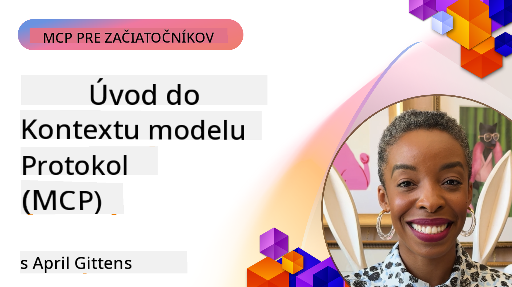
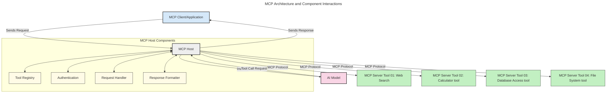
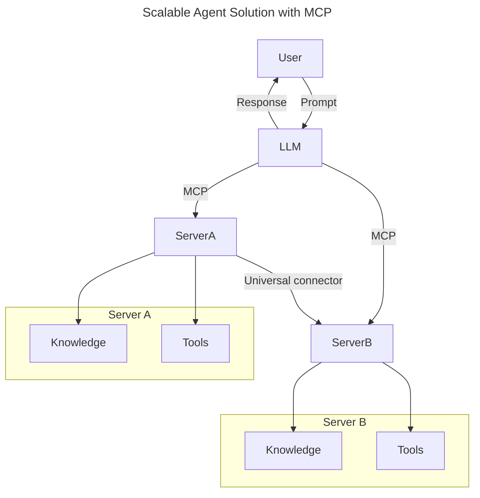
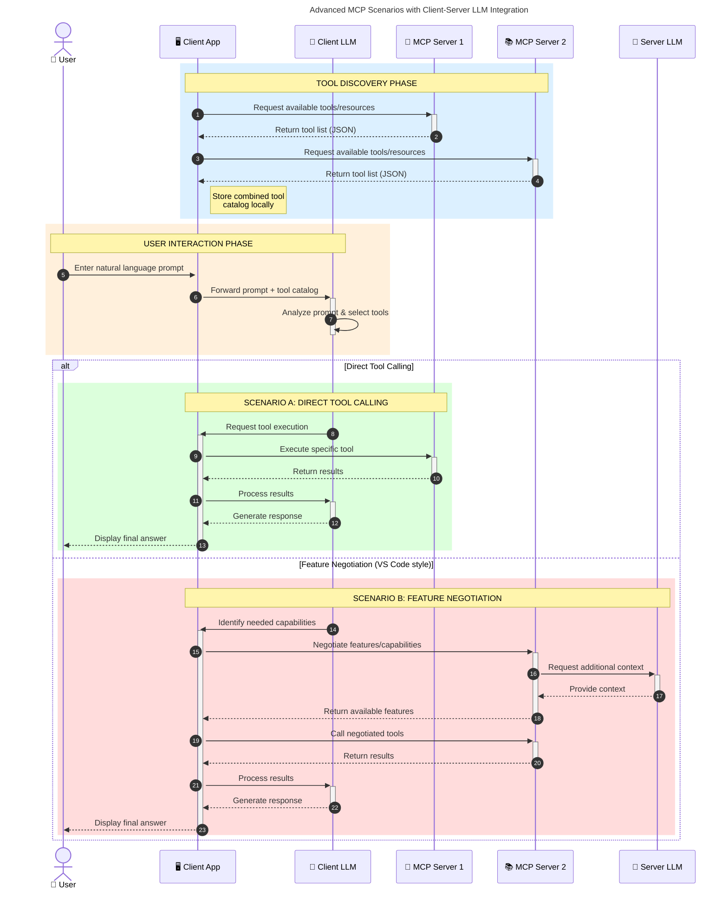

<!--
CO_OP_TRANSLATOR_METADATA:
{
  "original_hash": "0df1ee78a6dd8300f3a040ca5b411c2e",
  "translation_date": "2025-08-18T20:31:18+00:00",
  "source_file": "00-Introduction/README.md",
  "language_code": "sk"
}
-->
# Úvod do Model Context Protocol (MCP): Prečo je dôležitý pre škálovateľné AI aplikácie

_(Kliknite na obrázok vyššie pre zobrazenie videa k tejto lekcii)_

Generatívne AI aplikácie predstavujú veľký krok vpred, pretože často umožňujú používateľom interagovať s aplikáciou pomocou prirodzených jazykových príkazov. Avšak, čím viac času a zdrojov sa investuje do takýchto aplikácií, tým viac chcete zabezpečiť, aby ste mohli jednoducho integrovať funkcie a zdroje tak, aby bolo jednoduché ich rozširovať, aby vaša aplikácia podporovala viacero modelov a zvládala rôzne špecifiká modelov. Skrátka, vytváranie generatívnych AI aplikácií je na začiatku jednoduché, ale ako rastú a stávajú sa zložitejšími, je potrebné začať definovať architektúru a pravdepodobne sa budete musieť spoľahnúť na štandard, ktorý zabezpečí konzistentnú výstavbu vašich aplikácií. Tu prichádza MCP, aby veci zorganizoval a poskytol štandard.

---

## **🔍 Čo je Model Context Protocol (MCP)?**

**Model Context Protocol (MCP)** je **otvorené, štandardizované rozhranie**, ktoré umožňuje veľkým jazykovým modelom (LLM) bezproblémovo interagovať s externými nástrojmi, API a zdrojmi dát. Poskytuje konzistentnú architektúru na rozšírenie funkčnosti AI modelov nad rámec ich tréningových dát, čím umožňuje inteligentnejšie, škálovateľné a responzívne AI systémy.

---

## **🎯 Prečo je štandardizácia v AI dôležitá**

Ako sa generatívne AI aplikácie stávajú zložitejšími, je nevyhnutné prijať štandardy, ktoré zabezpečia **škálovateľnosť, rozšíriteľnosť, udržiavateľnosť** a **vyhnutie sa závislosti na jednom dodávateľovi**. MCP rieši tieto potreby tým, že:

- Zjednocuje integrácie medzi modelmi a nástrojmi
- Znižuje potrebu krehkých, jednorazových riešení
- Umožňuje koexistenciu viacerých modelov od rôznych dodávateľov v jednom ekosystéme

**Poznámka:** Hoci sa MCP prezentuje ako otvorený štandard, neexistujú plány na jeho štandardizáciu prostredníctvom existujúcich štandardizačných organizácií, ako sú IEEE, IETF, W3C, ISO alebo iné.

---

## **📚 Ciele učenia**

Na konci tohto článku budete schopní:

- Definovať **Model Context Protocol (MCP)** a jeho prípady použitia
- Pochopiť, ako MCP štandardizuje komunikáciu medzi modelmi a nástrojmi
- Identifikovať hlavné komponenty architektúry MCP
- Preskúmať reálne aplikácie MCP v podnikových a vývojových kontextoch

---

## **💡 Prečo je Model Context Protocol (MCP) prelomový**

### **🔗 MCP rieši fragmentáciu v AI interakciách**

Pred MCP integrácia modelov s nástrojmi vyžadovala:

- Vlastný kód pre každý pár nástroj-model
- Neštandardné API pre každého dodávateľa
- Časté chyby spôsobené aktualizáciami
- Slabú škálovateľnosť s rastúcim počtom nástrojov

### **✅ Výhody štandardizácie MCP**

| **Výhoda**              | **Popis**                                                                        |
|--------------------------|----------------------------------------------------------------------------------|
| Interoperabilita         | LLM bezproblémovo spolupracujú s nástrojmi od rôznych dodávateľov                |
| Konzistentnosť          | Jednotné správanie naprieč platformami a nástrojmi                               |
| Znovupoužiteľnosť        | Nástroje vytvorené raz môžu byť použité v rôznych projektoch a systémoch         |
| Rýchlejší vývoj          | Skrátenie času vývoja vďaka štandardizovaným, plug-and-play rozhraniam          |

---

## **🧱 Prehľad architektúry MCP na vysokej úrovni**

MCP nasleduje **klient-server model**, kde:

- **MCP Hostitelia** prevádzkujú AI modely
- **MCP Klienti** iniciujú požiadavky
- **MCP Servery** poskytujú kontext, nástroje a schopnosti

### **Kľúčové komponenty:**

- **Zdroje** – Statické alebo dynamické dáta pre modely  
- **Príkazy** – Preddefinované pracovné postupy pre riadenú generáciu  
- **Nástroje** – Vykonateľné funkcie ako vyhľadávanie, výpočty  
- **Sampling** – Agentické správanie prostredníctvom rekurzívnych interakcií  

---

## Ako fungujú MCP servery

MCP servery fungujú nasledovne:

- **Tok požiadaviek**:
    1. Požiadavka je iniciovaná koncovým používateľom alebo softvérom, ktorý koná v jeho mene.
    2. **MCP Klient** odošle požiadavku **MCP Hostiteľovi**, ktorý spravuje runtime AI modelu.
    3. **AI Model** prijme používateľský príkaz a môže požiadať o prístup k externým nástrojom alebo dátam prostredníctvom jedného alebo viacerých volaní nástrojov.
    4. **MCP Hostiteľ**, nie model priamo, komunikuje s príslušnými **MCP Servermi** pomocou štandardizovaného protokolu.
- **Funkcionalita MCP Hostiteľa**:
    - **Registrácia nástrojov**: Udržiava katalóg dostupných nástrojov a ich schopností.
    - **Autentifikácia**: Overuje povolenia na prístup k nástrojom.
    - **Spracovanie požiadaviek**: Spracováva prichádzajúce požiadavky na nástroje od modelu.
    - **Formátovanie odpovedí**: Štruktúruje výstupy nástrojov do formátu, ktorému model rozumie.
- **Vykonávanie MCP Servera**:
    - **MCP Hostiteľ** smeruje volania nástrojov na jeden alebo viac **MCP Serverov**, z ktorých každý poskytuje špecializované funkcie (napr. vyhľadávanie, výpočty, dotazy do databázy).
    - **MCP Servery** vykonávajú svoje príslušné operácie a vracajú výsledky **MCP Hostiteľovi** v konzistentnom formáte.
    - **MCP Hostiteľ** formátuje a odosiela tieto výsledky späť **AI Modelu**.
- **Dokončenie odpovede**:
    - **AI Model** začlení výstupy nástrojov do finálnej odpovede.
    - **MCP Hostiteľ** odošle túto odpoveď späť **MCP Klientovi**, ktorý ju doručí koncovému používateľovi alebo volajúcemu softvéru.

## 👨‍💻 Ako vytvoriť MCP server (s príkladmi)

MCP servery umožňujú rozšíriť schopnosti LLM poskytovaním dát a funkcií.

Chcete si to vyskúšať? Tu sú SDK špecifické pre jazyk alebo stack s príkladmi vytvárania jednoduchých MCP serverov v rôznych jazykoch/stackoch:

- **Python SDK**: https://github.com/modelcontextprotocol/python-sdk

- **TypeScript SDK**: https://github.com/modelcontextprotocol/typescript-sdk

- **Java SDK**: https://github.com/modelcontextprotocol/java-sdk

- **C#/.NET SDK**: https://github.com/modelcontextprotocol/csharp-sdk

---

## 🌍 Reálne prípady použitia MCP

MCP umožňuje širokú škálu aplikácií rozšírením schopností AI:

| **Aplikácia**               | **Popis**                                                                      |
|-----------------------------|--------------------------------------------------------------------------------|
| Integrácia podnikových dát  | Prepojenie LLM s databázami, CRM alebo internými nástrojmi                     |
| Agentické AI systémy        | Umožnenie autonómnych agentov s prístupom k nástrojom a pracovným postupom     |
| Multimodálne aplikácie      | Kombinácia textových, obrazových a zvukových nástrojov v jednej AI aplikácii   |
| Integrácia reálnych dát     | Prinesenie aktuálnych dát do AI interakcií pre presnejšie a aktuálne výstupy   |

### 🧠 MCP = Univerzálny štandard pre AI interakcie

Model Context Protocol (MCP) funguje ako univerzálny štandard pre AI interakcie, podobne ako USB-C štandardizoval fyzické pripojenia pre zariadenia. Vo svete AI poskytuje MCP konzistentné rozhranie, ktoré umožňuje modelom (klientom) bezproblémovo integrovať externé nástroje a poskytovateľov dát (servery). Tým eliminuje potrebu rôznorodých, vlastných protokolov pre každé API alebo zdroj dát.

Pod MCP kompatibilný nástroj (označovaný ako MCP server) nasleduje jednotný štandard. Tieto servery môžu uvádzať nástroje alebo akcie, ktoré ponúkajú, a vykonávať tieto akcie na požiadanie AI agenta. Platformy AI agentov, ktoré podporujú MCP, sú schopné objaviť dostupné nástroje zo serverov a vyvolať ich prostredníctvom tohto štandardného protokolu.

### 💡 Uľahčuje prístup k znalostiam

Okrem ponúkania nástrojov MCP tiež uľahčuje prístup k znalostiam. Umožňuje aplikáciám poskytovať kontext veľkým jazykovým modelom (LLM) prepojením s rôznymi zdrojmi dát. Napríklad MCP server môže reprezentovať firemné úložisko dokumentov, čo umožňuje agentom na požiadanie získať relevantné informácie. Iný server môže spracovávať špecifické akcie, ako je odosielanie e-mailov alebo aktualizácia záznamov. Z pohľadu agenta sú to jednoducho nástroje, ktoré môže použiť—niektoré nástroje vracajú dáta (kontext znalostí), zatiaľ čo iné vykonávajú akcie. MCP efektívne spravuje oboje.

Agent pripojený k MCP serveru sa automaticky dozvie o dostupných schopnostiach a prístupných dátach servera prostredníctvom štandardného formátu. Táto štandardizácia umožňuje dynamickú dostupnosť nástrojov. Napríklad pridanie nového MCP servera do systému agenta okamžite sprístupní jeho funkcie bez potreby ďalšej úpravy inštrukcií agenta.

Tento zjednodušený proces integrácie zodpovedá toku znázornenému v nasledujúcom diagrame, kde servery poskytujú nástroje aj znalosti, čím zabezpečujú bezproblémovú spoluprácu medzi systémami.

### 👉 Príklad: Škálovateľné riešenie pre agentov

### 🔄 Pokročilé scenáre MCP s integráciou LLM na strane klienta

Okrem základnej architektúry MCP existujú pokročilé scenáre, kde klient aj server obsahujú LLM, čo umožňuje sofistikovanejšie interakcie. V nasledujúcom diagrame môže byť **Klientská aplikácia** IDE s množstvom MCP nástrojov dostupných pre používateľa LLM:

---

## 🔐 Praktické výhody MCP

Tu sú praktické výhody používania MCP:

- **Aktuálnosť**: Modely môžu pristupovať k aktuálnym informáciám nad rámec svojich tréningových dát
- **Rozšírenie schopností**: Modely môžu využívať špecializované nástroje na úlohy, na ktoré neboli trénované
- **Zníženie halucinácií**: Externé zdroje dát poskytujú faktické základy
- **Ochrana súkromia**: Citlivé dáta môžu zostať v bezpečnom prostredí namiesto ich vloženia do príkazov

---

## 📌 Kľúčové poznatky

Nasledujú kľúčové poznatky o používaní MCP:

- **MCP** štandardizuje, ako AI modely interagujú s nástrojmi a dátami
- Podporuje **rozšíriteľnosť, konzistentnosť a interoperabilitu**
- MCP pomáha **skrátiť čas vývoja, zlepšiť spoľahlivosť a rozšíriť schopnosti modelov**
- Architektúra klient-server **umožňuje flexibilné, rozšíriteľné AI aplikácie**

---

## 🧠 Cvičenie

Premýšľajte o AI aplikácii, ktorú by ste chceli vytvoriť.

- Ktoré **externé nástroje alebo dáta** by mohli zlepšiť jej schopnosti?
- Ako by MCP mohol urobiť integráciu **jednoduchšou a spoľahlivejšou?**

---

## Ďalšie zdroje

- [MCP GitHub Repository](https://github.com/modelcontextprotocol)

---

## Čo ďalej

Ďalej: [Kapitola 1: Základné koncepty](../01-CoreConcepts/README.md)

**Zrieknutie sa zodpovednosti**:  
Tento dokument bol preložený pomocou služby AI prekladu [Co-op Translator](https://github.com/Azure/co-op-translator). Aj keď sa snažíme o presnosť, prosím, berte na vedomie, že automatizované preklady môžu obsahovať chyby alebo nepresnosti. Pôvodný dokument v jeho rodnom jazyku by mal byť považovaný za autoritatívny zdroj. Pre kritické informácie sa odporúča profesionálny ľudský preklad. Nenesieme zodpovednosť za akékoľvek nedorozumenia alebo nesprávne interpretácie vyplývajúce z použitia tohto prekladu.