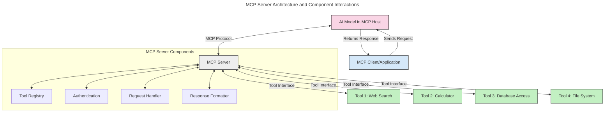
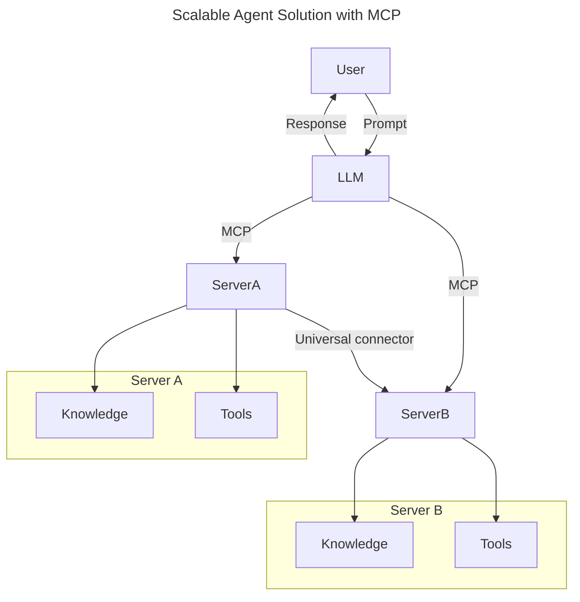
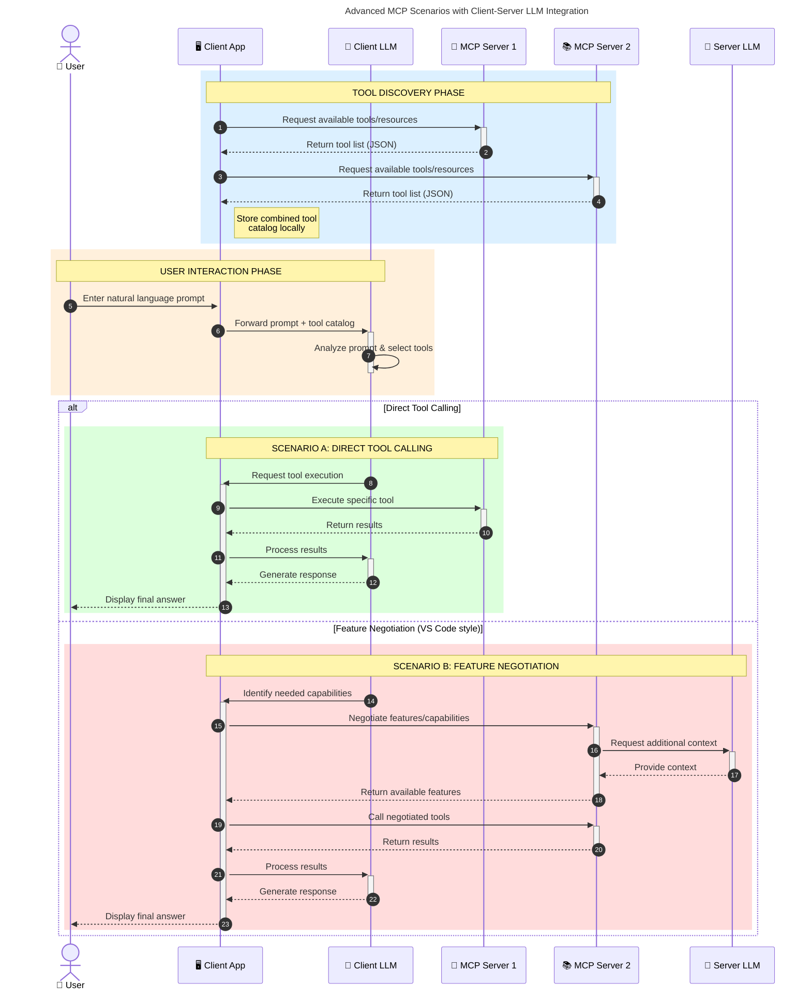

<!--
CO_OP_TRANSLATOR_METADATA:
{
  "original_hash": "105c2ddbb77bc38f7e9df009e1b06e45",
  "translation_date": "2025-07-13T15:38:34+00:00",
  "source_file": "00-Introduction/README.md",
  "language_code": "sk"
}
-->
# Úvod do Model Context Protocol (MCP): Prečo je dôležitý pre škálovateľné AI aplikácie

Generatívne AI aplikácie predstavujú veľký krok vpred, pretože často umožňujú používateľovi komunikovať s aplikáciou pomocou prirodzených jazykových príkazov. Avšak, keď do takýchto aplikácií investujete viac času a zdrojov, chcete mať istotu, že funkcie a zdroje môžete jednoducho integrovať tak, aby bolo jednoduché ich rozširovať, aby vaša aplikácia zvládala používanie viacerých modelov a dokázala riešiť rôzne špecifiká modelov. Stručne povedané, budovanie generatívnych AI aplikácií je na začiatku jednoduché, no s rastom a zložitosťou je potrebné definovať architektúru a pravdepodobne sa spoľahnúť na štandard, ktorý zabezpečí konzistentnú výstavbu aplikácií. Práve tu prichádza MCP, ktorý veci organizuje a poskytuje štandard.

---

## **🔍 Čo je Model Context Protocol (MCP)?**

**Model Context Protocol (MCP)** je **otvorený, štandardizovaný rozhranie**, ktoré umožňuje veľkým jazykovým modelom (LLM) bezproblémovo komunikovať s externými nástrojmi, API a zdrojmi dát. Poskytuje konzistentnú architektúru na rozšírenie funkčnosti AI modelov nad rámec ich tréningových dát, čím umožňuje inteligentnejšie, škálovateľnejšie a citlivejšie AI systémy.

---

## **🎯 Prečo je štandardizácia v AI dôležitá**

S rastúcou zložitosťou generatívnych AI aplikácií je nevyhnutné prijať štandardy, ktoré zabezpečia **škálovateľnosť, rozšíriteľnosť** a **udržateľnosť**. MCP rieši tieto potreby tým, že:

- Zjednocuje integrácie modelov s nástrojmi
- Znižuje krehké, jednorazové riešenia na mieru
- Umožňuje koexistenciu viacerých modelov v jednom ekosystéme

---

## **📚 Ciele učenia**

Na konci tohto článku budete vedieť:

- Definovať **Model Context Protocol (MCP)** a jeho použitia
- Pochopiť, ako MCP štandardizuje komunikáciu medzi modelom a nástrojmi
- Identifikovať základné komponenty architektúry MCP
- Preskúmať reálne použitia MCP v podnikových a vývojárskych kontextoch

---

## **💡 Prečo je Model Context Protocol (MCP) prelomový**

### **🔗 MCP rieši fragmentáciu v AI interakciách**

Pred MCP vyžadovala integrácia modelov s nástrojmi:

- Vlastný kód pre každý pár nástroj-model
- Nestandardné API pre každého dodávateľa
- Časté prerušenia kvôli aktualizáciám
- Slabú škálovateľnosť pri väčšom počte nástrojov

### **✅ Výhody štandardizácie MCP**

| **Výhoda**               | **Popis**                                                                     |
|--------------------------|-------------------------------------------------------------------------------|
| Interoperabilita         | LLM pracujú bezproblémovo s nástrojmi od rôznych dodávateľov                  |
| Konzistentnosť           | Jednotné správanie naprieč platformami a nástrojmi                            |
| Opätovné použitie       | Nástroje vytvorené raz možno použiť v rôznych projektoch a systémoch          |
| Urýchlený vývoj          | Skrátenie času vývoja vďaka štandardizovaným, plug-and-play rozhraniam        |

---

## **🧱 Prehľad architektúry MCP na vysokej úrovni**

MCP nasleduje **klient-server model**, kde:

- **MCP Hosts** prevádzkujú AI modely
- **MCP Clients** iniciujú požiadavky
- **MCP Servers** poskytujú kontext, nástroje a schopnosti

### **Kľúčové komponenty:**

- **Resources** – statické alebo dynamické dáta pre modely  
- **Prompts** – preddefinované pracovné postupy pre riadenú generáciu  
- **Tools** – vykonateľné funkcie ako vyhľadávanie, výpočty  
- **Sampling** – agentné správanie cez rekurzívne interakcie

---

## Ako fungujú MCP servery

MCP servery fungujú nasledovne:

- **Priebeh požiadavky**:  
    1. MCP klient odošle požiadavku AI modelu bežiacemu v MCP Hostovi.  
    2. AI model rozpozná, kedy potrebuje externé nástroje alebo dáta.  
    3. Model komunikuje s MCP serverom pomocou štandardizovaného protokolu.

- **Funkcie MCP servera**:  
    - Registr nástrojov: Udržiava katalóg dostupných nástrojov a ich schopností.  
    - Autentifikácia: Overuje oprávnenia na prístup k nástrojom.  
    - Spracovanie požiadaviek: Rieši prichádzajúce požiadavky na nástroje od modelu.  
    - Formátovanie odpovedí: Štruktúruje výstupy nástrojov do formátu, ktorý model rozumie.

- **Vykonávanie nástrojov**:  
    - Server smeruje požiadavky na príslušné externé nástroje  
    - Nástroje vykonávajú svoje špecializované funkcie (vyhľadávanie, výpočty, dotazy do databázy atď.)  
    - Výsledky sa vracajú modelu v konzistentnom formáte.

- **Dokončenie odpovede**:  
    - AI model začleňuje výstupy nástrojov do svojej odpovede.  
    - Konečná odpoveď sa odosiela späť klientskej aplikácii.

## 👨‍💻 Ako vytvoriť MCP server (s príkladmi)

MCP servery vám umožňujú rozšíriť schopnosti LLM tým, že poskytujú dáta a funkcie.

Chcete to vyskúšať? Tu sú príklady vytvorenia jednoduchého MCP servera v rôznych jazykoch:

- **Python príklad**: https://github.com/modelcontextprotocol/python-sdk

- **TypeScript príklad**: https://github.com/modelcontextprotocol/typescript-sdk

- **Java príklad**: https://github.com/modelcontextprotocol/java-sdk

- **C#/.NET príklad**: https://github.com/modelcontextprotocol/csharp-sdk

## 🌍 Reálne použitia MCP

MCP umožňuje širokú škálu aplikácií rozširujúcich schopnosti AI:

| **Aplikácia**              | **Popis**                                                                    |
|----------------------------|------------------------------------------------------------------------------|
| Integrácia podnikových dát | Prepojenie LLM s databázami, CRM alebo internými nástrojmi                   |
| Agentné AI systémy         | Umožnenie autonómnych agentov s prístupom k nástrojom a rozhodovacími procesmi |
| Multimodálne aplikácie     | Kombinácia textových, obrazových a zvukových nástrojov v jednej AI aplikácii |
| Integrácia dát v reálnom čase | Zahrnutie živých dát do AI interakcií pre presnejšie a aktuálne výstupy     |

### 🧠 MCP = Univerzálny štandard pre AI interakcie

Model Context Protocol (MCP) funguje ako univerzálny štandard pre AI interakcie, podobne ako USB-C štandardizoval fyzické pripojenia zariadení. V AI svete MCP poskytuje konzistentné rozhranie, ktoré umožňuje modelom (klientom) bezproblémovo sa integrovať s externými nástrojmi a poskytovateľmi dát (servermi). Tým sa eliminuje potreba rôznych, vlastných protokolov pre každé API alebo zdroj dát.

Pod MCP je MCP-kompatibilný nástroj (nazývaný MCP server) založený na jednotnom štandarde. Tieto servery môžu uvádzať nástroje alebo akcie, ktoré ponúkajú, a vykonávať ich na požiadanie AI agenta. Platformy AI agentov podporujúce MCP dokážu objavovať dostupné nástroje zo serverov a vyvolávať ich cez tento štandardný protokol.

### 💡 Uľahčuje prístup k poznatkom

Okrem poskytovania nástrojov MCP tiež uľahčuje prístup k poznatkom. Umožňuje aplikáciám poskytovať kontext veľkým jazykovým modelom (LLM) prepojením na rôzne zdroje dát. Napríklad MCP server môže predstavovať firemnú dokumentačnú databázu, ktorá agentom umožňuje na požiadanie získať relevantné informácie. Iný server môže spravovať špecifické akcie, ako je odosielanie e-mailov alebo aktualizácia záznamov. Z pohľadu agenta sú to jednoducho nástroje, ktoré môže používať – niektoré vracajú dáta (poznatkový kontext), iné vykonávajú akcie. MCP efektívne spravuje oboje.

Agent, ktorý sa pripája k MCP serveru, automaticky získa informácie o dostupných schopnostiach a prístupných dátach cez štandardný formát. Táto štandardizácia umožňuje dynamickú dostupnosť nástrojov. Napríklad pridaním nového MCP servera do systému agenta sa jeho funkcie okamžite stanú použiteľné bez potreby ďalšej úpravy inštrukcií agenta.

Táto zjednodušená integrácia korešponduje s tokom znázorneným v diagrame mermaid, kde servery poskytujú nástroje aj poznatky, čím zabezpečujú bezproblémovú spoluprácu medzi systémami.

### 👉 Príklad: škálovateľné riešenie agenta

### 🔄 Pokročilé scenáre MCP s integráciou LLM na strane klienta

Okrem základnej architektúry MCP existujú pokročilé scenáre, kde klient aj server obsahujú LLM, čo umožňuje sofistikovanejšie interakcie:

## 🔐 Praktické výhody MCP

Tu sú praktické výhody používania MCP:

- **Aktuálnosť**: Modely majú prístup k najnovším informáciám nad rámec tréningových dát  
- **Rozšírenie schopností**: Modely môžu využiť špecializované nástroje na úlohy, na ktoré neboli trénované  
- **Zníženie halucinácií**: Externé zdroje dát poskytujú faktické základy  
- **Súkromie**: Citlivé dáta môžu zostať v bezpečnom prostredí namiesto vloženia do promptov

## 📌 Kľúčové zhrnutie

Nasledujúce body sú kľúčové pre používanie MCP:

- **MCP** štandardizuje spôsob, akým AI modely komunikujú s nástrojmi a dátami  
- Podporuje **rozšíriteľnosť, konzistentnosť a interoperabilitu**  
- MCP pomáha **skrátiť čas vývoja, zlepšiť spoľahlivosť a rozšíriť schopnosti modelov**  
- Klient-server architektúra **umožňuje flexibilné, rozšíriteľné AI aplikácie**

## 🧠 Cvičenie

Premyslite si AI aplikáciu, ktorú by ste chceli vytvoriť.

- Aké **externé nástroje alebo dáta** by mohli zlepšiť jej schopnosti?  
- Ako by MCP mohol uľahčiť integráciu a spraviť ju spoľahlivejšou?

## Dodatočné zdroje

- [MCP GitHub Repository](https://github.com/modelcontextprotocol)

## Čo ďalej

Ďalej: [Kapitola 1: Základné koncepty](../01-CoreConcepts/README.md)

**Vyhlásenie o zodpovednosti**:  
Tento dokument bol preložený pomocou AI prekladateľskej služby [Co-op Translator](https://github.com/Azure/co-op-translator). Aj keď sa snažíme o presnosť, prosím, majte na pamäti, že automatizované preklady môžu obsahovať chyby alebo nepresnosti. Originálny dokument v jeho pôvodnom jazyku by mal byť považovaný za autoritatívny zdroj. Pre kritické informácie sa odporúča profesionálny ľudský preklad. Nie sme zodpovední za akékoľvek nedorozumenia alebo nesprávne interpretácie vyplývajúce z použitia tohto prekladu.