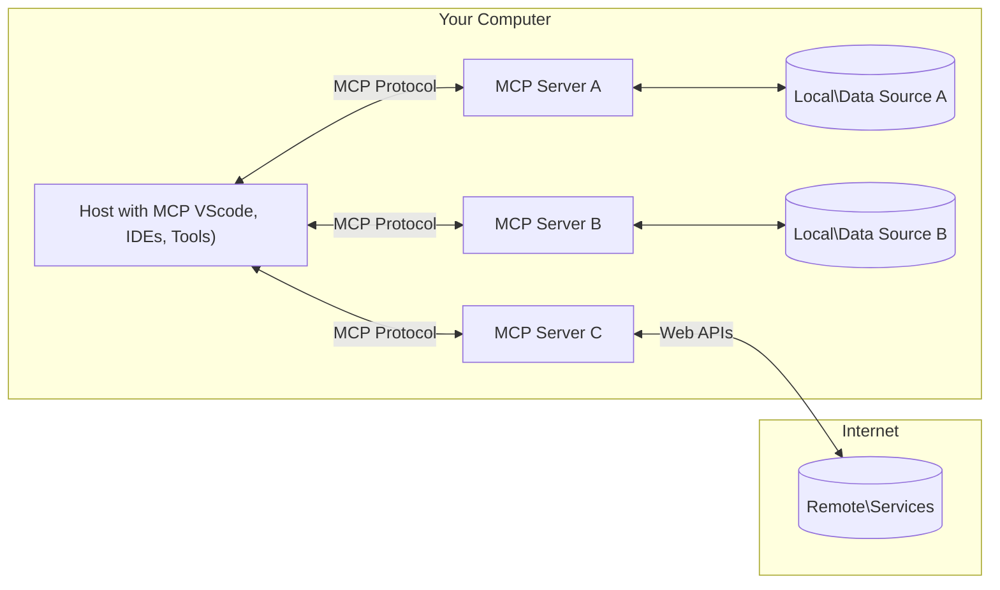

<!--
CO_OP_TRANSLATOR_METADATA:
{
  "original_hash": "b3b4a6ad10c3c0edbf7fa7cfa0ec496b",
  "translation_date": "2025-07-02T07:32:03+00:00",
  "source_file": "01-CoreConcepts/README.md",
  "language_code": "sk"
}
-->
# 📖 MCP Základné koncepty: Ovládnutie Model Context Protocol pre integráciu AI

[Model Context Protocol (MCP)](https://github.com/modelcontextprotocol) je výkonný, štandardizovaný rámec, ktorý optimalizuje komunikáciu medzi veľkými jazykovými modelmi (LLM) a externými nástrojmi, aplikáciami a dátovými zdrojmi. Tento SEO-optimalizovaný sprievodca vás prevedie základnými konceptmi MCP, aby ste pochopili jeho klient-server architektúru, kľúčové komponenty, mechanizmy komunikácie a osvedčené postupy implementácie.

## Prehľad

Táto lekcia skúma základnú architektúru a komponenty, ktoré tvoria ekosystém Model Context Protocol (MCP). Naučíte sa o klient-server architektúre, hlavných komponentoch a mechanizmoch komunikácie, ktoré umožňujú interakcie MCP.

## 👩‍🎓 Hlavné ciele učenia

Na konci tejto lekcie budete:

- Rozumieť klient-server architektúre MCP.
- Identifikovať úlohy a zodpovednosti Hosts, Clients a Servers.
- Analyzovať základné vlastnosti, ktoré robia MCP flexibilnou integračnou vrstvou.
- Naučiť sa, ako prebieha tok informácií v rámci ekosystému MCP.
- Získať praktické poznatky prostredníctvom príkladov kódu v .NET, Java, Python a JavaScript.

## 🔎 Architektúra MCP: Hlbší pohľad

Ekosystém MCP je postavený na modeli klient-server. Táto modulárna štruktúra umožňuje AI aplikáciám efektívne komunikovať s nástrojmi, databázami, API a kontextuálnymi zdrojmi. Rozoberme si túto architektúru na jej základné komponenty.

V jadre MCP nasleduje klient-server architektúru, kde hostiteľská aplikácia sa môže pripojiť k viacerým serverom:



- **MCP Hosts**: Programy ako VSCode, Claude Desktop, IDE alebo AI nástroje, ktoré chcú pristupovať k dátam cez MCP
- **MCP Clients**: Protokoloví klienti, ktorí udržiavajú 1:1 spojenia so servermi
- **MCP Servers**: Ľahké programy, ktoré vystavujú špecifické schopnosti cez štandardizovaný Model Context Protocol
- **Lokálne dátové zdroje**: Súbory, databázy a služby vo vašom počítači, ku ktorým môžu MCP servery bezpečne pristupovať
- **Vzdialené služby**: Externé systémy dostupné cez internet, ku ktorým sa MCP servery môžu pripojiť cez API.

MCP protokol je vyvíjajúci sa štandard, najnovšie aktualizácie nájdete v [špecifikácii protokolu](https://modelcontextprotocol.io/specification/2025-06-18/)

### 1. Hosts

V Model Context Protocol (MCP) zohrávajú Hosts kľúčovú úlohu ako primárne rozhranie, cez ktoré používatelia komunikujú s protokolom. Hosts sú aplikácie alebo prostredia, ktoré iniciujú spojenia so servermi MCP, aby získali prístup k dátam, nástrojom a promptom. Príkladmi Hosts sú integrované vývojové prostredia (IDE) ako Visual Studio Code, AI nástroje ako Claude Desktop alebo na mieru vytvorení agenti pre špecifické úlohy.

**Hosts** sú LLM aplikácie, ktoré iniciujú spojenia. Ich úlohy sú:

- Spúšťať alebo komunikovať s AI modelmi na generovanie odpovedí.
- Iniciovať spojenia so servermi MCP.
- Riadiť tok konverzácie a používateľské rozhranie.
- Kontrolovať povolenia a bezpečnostné obmedzenia.
- Spravovať súhlas používateľa so zdieľaním dát a vykonávaním nástrojov.

### 2. Clients

Clients sú nevyhnutné komponenty, ktoré uľahčujú interakciu medzi Hosts a MCP servermi. Klienti pôsobia ako sprostredkovatelia, umožňujú Hosts pristupovať a využívať funkcie poskytované MCP servermi. Zohrávajú kľúčovú úlohu v zabezpečení plynulej komunikácie a efektívnej výmeny dát v rámci architektúry MCP.

**Clients** sú konektory v rámci hostiteľskej aplikácie. Ich úlohy sú:

- Posielať požiadavky na servery s promptmi/inštrukciami.
- Rokovať o schopnostiach so servermi.
- Spravovať požiadavky na spustenie nástrojov od modelov.
- Spracovávať a zobrazovať odpovede používateľom.

### 3. Servers

Servery sú zodpovedné za spracovanie požiadaviek od MCP klientov a poskytovanie príslušných odpovedí. Riadia rôzne operácie, ako získavanie dát, vykonávanie nástrojov a generovanie promptov. Servery zabezpečujú efektívnu a spoľahlivú komunikáciu medzi klientmi a Hosts, pričom udržiavajú integritu celého procesu interakcie.

**Servers** sú služby, ktoré poskytujú kontext a schopnosti. Ich úlohy sú:

- Registrovať dostupné funkcie (zdroje, prompty, nástroje)
- Prijímať a vykonávať volania nástrojov od klienta
- Poskytovať kontextové informácie na zlepšenie odpovedí modelu
- Vracať výstupy späť klientovi
- Udržiavať stav počas interakcií, ak je to potrebné

Servery môže vyvíjať ktokoľvek, aby rozšíril schopnosti modelu špecializovanou funkcionalitou.

### 4. Funkcie serverov

Servery v Model Context Protocol (MCP) poskytujú základné stavebné bloky, ktoré umožňujú bohaté interakcie medzi klientmi, hostiteľmi a jazykovými modelmi. Tieto funkcie sú navrhnuté tak, aby rozšírili schopnosti MCP ponúkaním štruktúrovaného kontextu, nástrojov a promptov.

MCP servery môžu ponúkať niektorú z nasledujúcich funkcií:

#### 📑 Zdroje

Zdroje v Model Context Protocol (MCP) zahŕňajú rôzne typy kontextu a dát, ktoré môžu používatelia alebo AI modely využiť. Patria sem:

- **Kontextové dáta**: Informácie a kontext, ktoré môžu používatelia alebo AI modely využiť pri rozhodovaní a vykonávaní úloh.
- **Znalostné bázy a dokumentové repozitáre**: Zbierky štruktúrovaných a neštruktúrovaných dát, ako sú články, manuály a výskumné práce, ktoré poskytujú cenné informácie a poznatky.
- **Lokálne súbory a databázy**: Dáta uložené lokálne na zariadeniach alebo v databázach, dostupné na spracovanie a analýzu.
- **API a webové služby**: Externé rozhrania a služby, ktoré ponúkajú ďalšie dáta a funkcie, umožňujúce integráciu s rôznymi online zdrojmi a nástrojmi.

Príkladom zdroja môže byť databázové schéma alebo súbor, ku ktorému sa pristupuje takto:

```text
file://log.txt
database://schema
```

### 🤖 Prompty

Prompty v Model Context Protocol (MCP) zahŕňajú rôzne preddefinované šablóny a vzory interakcií navrhnuté na zjednodušenie pracovných tokov používateľov a zlepšenie komunikácie. Patria sem:

- **Šablónové správy a pracovné toky**: Predštruktúrované správy a procesy, ktoré vedú používateľov cez špecifické úlohy a interakcie.
- **Preddefinované vzory interakcií**: Štandardizované sekvencie akcií a odpovedí, ktoré uľahčujú konzistentnú a efektívnu komunikáciu.
- **Špecializované šablóny konverzácií**: Prispôsobiteľné šablóny určené pre konkrétne typy rozhovorov, zabezpečujúce relevantné a kontextovo vhodné interakcie.

Šablóna promptu môže vyzerať napríklad takto:

```markdown
Generate a product slogan based on the following {{product}} with the following {{keywords}}
```

#### ⛏️ Nástroje

Nástroje v Model Context Protocol (MCP) sú funkcie, ktoré môže AI model spustiť na vykonanie konkrétnych úloh. Tieto nástroje sú navrhnuté na rozšírenie schopností AI modelu poskytnutím štruktúrovaných a spoľahlivých operácií. Kľúčové aspekty zahŕňajú:

- **Funkcie, ktoré môže AI model vykonať**: Nástroje sú spustiteľné funkcie, ktoré AI model môže vyvolať na vykonanie rôznych úloh.
- **Jedinečný názov a popis**: Každý nástroj má svoj vlastný názov a podrobný popis, ktorý vysvetľuje jeho účel a funkcionalitu.
- **Parametre a výstupy**: Nástroje prijímajú špecifické parametre a vracajú štruktúrované výstupy, čo zaručuje konzistentné a predvídateľné výsledky.
- **Diskrétne funkcie**: Nástroje vykonávajú samostatné funkcie, ako sú webové vyhľadávania, výpočty alebo databázové dotazy.

Príklad nástroja môže vyzerať takto:

```typescript
server.tool(
  "GetProducts",
  {
    pageSize: z.string().optional(),
    pageCount: z.string().optional()
  }, () => {
    // return results from API
  }
)
```

## Funkcie klientov

V Model Context Protocol (MCP) klienti ponúkajú serverom niekoľko kľúčových funkcií, ktoré zlepšujú celkovú funkcionalitu a interakciu v rámci protokolu. Jednou z pozoruhodných funkcií je Sampling.

### 👉 Sampling

- **Agentné správanie iniciované serverom**: Klienti umožňujú serverom autonómne iniciovať konkrétne akcie alebo správanie, čím sa zvyšujú dynamické schopnosti systému.
- **Rekurzívne interakcie s LLM**: Táto funkcia umožňuje rekurzívne interakcie s veľkými jazykovými modelmi (LLM), čo umožňuje zložitejšie a iteratívne spracovanie úloh.
- **Žiadosť o ďalšie dokončenia modelu**: Servery môžu žiadať model o ďalšie dokončenia, čím zabezpečujú, že odpovede sú dôkladné a kontextovo relevantné.

## Tok informácií v MCP

Model Context Protocol (MCP) definuje štruktúrovaný tok informácií medzi hostiteľmi, klientmi, servermi a modelmi. Pochopenie tohto toku pomáha objasniť, ako sa spracúvajú požiadavky používateľov a ako sa externé nástroje a dáta integrujú do odpovedí modelu.

- **Hostiteľ iniciuje spojenie**  
  Hostiteľská aplikácia (napríklad IDE alebo chatové rozhranie) nadviaže spojenie so serverom MCP, typicky cez STDIO, WebSocket alebo iný podporovaný transport.

- **Rokovanie o schopnostiach**  
  Klient (vložený v hostiteľovi) a server si vymieňajú informácie o podporovaných funkciách, nástrojoch, zdrojoch a verziách protokolu. Tým sa zabezpečí, že obe strany rozumejú dostupným možnostiam pre danú reláciu.

- **Požiadavka používateľa**  
  Používateľ komunikuje s hostiteľom (napr. zadá prompt alebo príkaz). Hostiteľ tento vstup zhromaždí a odovzdá klientovi na spracovanie.

- **Použitie zdroja alebo nástroja**  
  - Klient môže požiadať server o ďalší kontext alebo zdroje (napríklad súbory, záznamy v databáze alebo články zo znalostnej bázy), aby obohatil porozumenie modelu.
  - Ak model vyhodnotí, že je potrebné použiť nástroj (napr. na získanie dát, vykonanie výpočtu alebo volanie API), klient odošle serveru požiadavku na vyvolanie nástroja s názvom a parametrami nástroja.

- **Vykonanie na serveri**  
  Server prijme požiadavku na zdroj alebo nástroj, vykoná potrebné operácie (napríklad spustí funkciu, vykoná dotaz do databázy alebo načíta súbor) a výsledky v štruktúrovanej forme vráti klientovi.

- **Generovanie odpovede**  
  Klient integruje odpovede servera (dáta zo zdrojov, výstupy nástrojov atď.) do prebiehajúcej interakcie s modelom. Model využije tieto informácie na vytvorenie komplexnej a kontextovo relevantnej odpovede.

- **Prezentácia výsledku**  
  Hostiteľ prijme konečný výstup od klienta a zobrazí ho používateľovi, často vrátane textu generovaného modelom a výsledkov z vykonaných nástrojov alebo vyhľadávania zdrojov.

Tento tok umožňuje MCP podporovať pokročilé, interaktívne a kontextovo vedomé AI aplikácie hladkým prepojením modelov s externými nástrojmi a dátovými zdrojmi.

## Detaily protokolu

MCP (Model Context Protocol) je postavený na základe [JSON-RPC 2.0](https://www.jsonrpc.org/), poskytujúc štandardizovaný, jazykovo nezávislý formát správ pre komunikáciu medzi hostiteľmi, klientmi a servermi. Tento základ umožňuje spoľahlivé, štruktúrované a rozšíriteľné interakcie naprieč rôznymi platformami a programovacími jazykmi.

### Kľúčové vlastnosti protokolu

MCP rozširuje JSON-RPC 2.0 o ďalšie konvencie pre vyvolávanie nástrojov, prístup k zdrojom a správu promptov. Podporuje viaceré transportné vrstvy (STDIO, WebSocket, SSE) a umožňuje bezpečnú, rozšíriteľnú a jazykovo nezávislú komunikáciu medzi komponentmi.

#### 🧢 Základný protokol

- **Formát správ JSON-RPC**: Všetky požiadavky a odpovede používajú špecifikáciu JSON-RPC 2.0, čo zabezpečuje konzistentnú štruktúru pre volania metód, parametre, výsledky a spracovanie chýb.
- **Stavové spojenia**: MCP relácie udržiavajú stav naprieč viacerými požiadavkami, podporujúc prebiehajúce konverzácie, akumuláciu kontextu a správu zdrojov.
- **Rokovanie o schopnostiach**: Počas nastavovania spojenia si klienti a servery vymieňajú informácie o podporovaných funkciách, verziách protokolu, dostupných nástrojoch a zdrojoch. Tým sa zabezpečí, že obe strany rozumejú svojim schopnostiam a môžu sa prispôsobiť.

#### ➕ Dodatočné nástroje

Nižšie sú uvedené niektoré ďalšie nástroje a rozšírenia protokolu, ktoré MCP poskytuje na zlepšenie skúsenosti vývojárov a umožnenie pokročilých scenárov:

- **Možnosti konfigurácie**: MCP umožňuje dynamickú konfiguráciu parametrov relácie, ako sú povolenia nástrojov, prístup k zdrojom a nastavenia modelu, prispôsobené každej interakcii.
- **Sledovanie priebehu**: Operácie s dlhým trvaním môžu hlásiť aktualizácie priebehu, čo umožňuje responzívne používateľské rozhrania a lepší používateľský zážitok počas zložitých úloh.
- **Zrušenie požiadaviek**: Klienti môžu zrušiť prebiehajúce požiadavky, čo umožňuje používateľom prerušiť operácie, ktoré už nie sú potrebné alebo trvajú príliš dlho.
- **Hlásenie chýb**: Štandardizované chybové správy a kódy pomáhajú diagnostikovať problémy, zvládať zlyhania elegantne a poskytovať konštruktívnu spätnú väzbu používateľom a vývojárom.
- **Logovanie**: Klienti aj servery môžu generovať štruktúrované logy na audit, ladenie a monitorovanie interakcií protokolu.

Využitím týchto vlastností protokolu MCP zabezpečuje robustnú, bezpečnú a flexibilnú komunikáciu medzi jazykovými modelmi a externými nástrojmi či dátovými zdrojmi.

### 🔐 Bezpečnostné aspekty

Implementácie MCP by mali dodržiavať niekoľko základných bezpečnostných princípov na zabezpečenie bezpe

**Vyhlásenie o zodpovednosti**:  
Tento dokument bol preložený pomocou AI prekladateľskej služby [Co-op Translator](https://github.com/Azure/co-op-translator). Hoci sa snažíme o presnosť, majte prosím na pamäti, že automatické preklady môžu obsahovať chyby alebo nepresnosti. Originálny dokument v jeho pôvodnom jazyku by mal byť považovaný za autoritatívny zdroj. Pre kritické informácie sa odporúča profesionálny ľudský preklad. Nie sme zodpovední za akékoľvek nedorozumenia alebo nesprávne interpretácie vyplývajúce z použitia tohto prekladu.