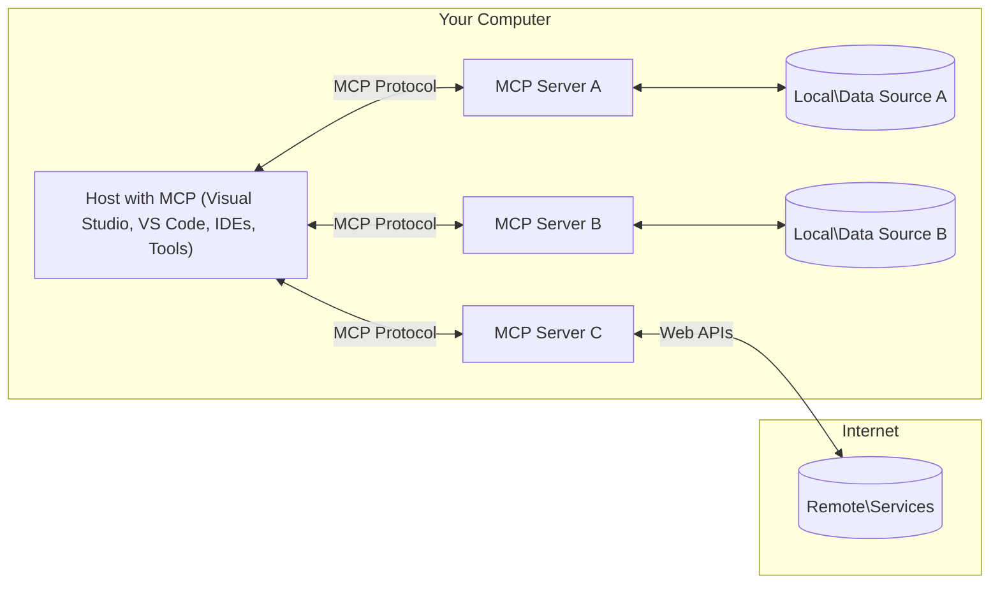

<!--
CO_OP_TRANSLATOR_METADATA:
{
  "original_hash": "88b863a69b4f18b15e82da358ffd3489",
  "translation_date": "2025-08-21T13:42:20+00:00",
  "source_file": "01-CoreConcepts/README.md",
  "language_code": "sk"
}
-->
# MCP Základné Koncepty: Ovládnutie Model Context Protocol pre AI Integráciu

[](https://youtu.be/earDzWGtE84)

_(Kliknite na obrázok vyššie pre zobrazenie videa k tejto lekcii)_

[Model Context Protocol (MCP)](https://github.com/modelcontextprotocol) je výkonný, štandardizovaný rámec, ktorý optimalizuje komunikáciu medzi veľkými jazykovými modelmi (LLMs) a externými nástrojmi, aplikáciami a zdrojmi dát. 
Táto príručka vás prevedie základnými konceptmi MCP. Naučíte sa o jeho klient-server architektúre, základných komponentoch, mechanizme komunikácie a najlepších praktikách implementácie.

- **Výslovný Súhlas Používateľa**: Všetky prístupy k dátam a operácie vyžadujú výslovný súhlas používateľa pred vykonaním. Používatelia musia jasne rozumieť, aké dáta budú prístupné a aké akcie budú vykonané, s detailnou kontrolou nad povoleniami a autorizáciami.

- **Ochrana Súkromia Dát**: Dáta používateľa sú prístupné len s výslovným súhlasom a musia byť chránené robustnými kontrolami prístupu počas celého životného cyklu interakcie. Implementácie musia zabrániť neoprávnenému prenosu dát a udržiavať prísne hranice súkromia.

- **Bezpečnosť Spúšťania Nástrojov**: Každé spustenie nástroja vyžaduje výslovný súhlas používateľa s jasným pochopením funkčnosti nástroja, parametrov a potenciálneho dopadu. Robustné bezpečnostné hranice musia zabrániť neúmyselnému, nebezpečnému alebo škodlivému spusteniu nástroja.

- **Bezpečnosť Transportnej Vrstvy**: Všetky komunikačné kanály by mali používať vhodné šifrovacie a autentifikačné mechanizmy. Vzdialené pripojenia by mali implementovať bezpečné transportné protokoly a správu poverení.

#### Pokyny k Implementácii:

- **Správa Povolení**: Implementujte detailné systémy povolení, ktoré umožňujú používateľom kontrolovať, ktoré servery, nástroje a zdroje sú prístupné.
- **Autentifikácia a Autorizácia**: Používajte bezpečné metódy autentifikácie (OAuth, API kľúče) so správnou správou tokenov a ich expiráciou.  
- **Validácia Vstupov**: Validujte všetky parametre a vstupy dát podľa definovaných schém, aby ste zabránili útokom typu injection.
- **Auditovanie Logov**: Udržiavajte komplexné logy všetkých operácií pre monitorovanie bezpečnosti a súlad.

## Prehľad

Táto lekcia skúma základnú architektúru a komponenty, ktoré tvoria ekosystém Model Context Protocol (MCP). Naučíte sa o klient-server architektúre, kľúčových komponentoch a mechanizmoch komunikácie, ktoré poháňajú interakcie MCP.

## Kľúčové Ciele Učenia

Na konci tejto lekcie budete:

- Rozumieť klient-server architektúre MCP.
- Identifikovať úlohy a zodpovednosti Hostov, Klientov a Serverov.
- Analyzovať základné funkcie, ktoré robia MCP flexibilnou integračnou vrstvou.
- Naučiť sa, ako informácie prúdia v ekosystéme MCP.
- Získať praktické poznatky prostredníctvom ukážok kódu v .NET, Java, Python a JavaScript.

## MCP Architektúra: Hlbší Pohľad

Ekosystém MCP je postavený na modeli klient-server. Táto modulárna štruktúra umožňuje AI aplikáciám efektívne interagovať s nástrojmi, databázami, API a kontextovými zdrojmi. Rozdeľme túto architektúru na jej základné komponenty.

V jadre MCP nasleduje klient-server architektúru, kde hostiteľská aplikácia môže pripojiť viacero serverov:



- **MCP Hostitelia**: Programy ako VSCode, Claude Desktop, IDE alebo AI nástroje, ktoré chcú pristupovať k dátam cez MCP.
- **MCP Klienti**: Protokoloví klienti, ktorí udržiavajú 1:1 spojenia so servermi.
- **MCP Servery**: Ľahké programy, ktoré každý poskytujú špecifické schopnosti cez štandardizovaný Model Context Protocol.
- **Lokálne Zdroje Dát**: Súbory, databázy a služby vášho počítača, ku ktorým môžu MCP servery bezpečne pristupovať.
- **Vzdialené Služby**: Externé systémy dostupné cez internet, ku ktorým sa MCP servery môžu pripojiť cez API.

Protokol MCP je vyvíjajúci sa štandard používajúci verziu založenú na dátume (formát YYYY-MM-DD). Aktuálna verzia protokolu je **2025-06-18**. Najnovšie aktualizácie špecifikácie protokolu nájdete na [protocol specification](https://modelcontextprotocol.io/specification/2025-06-18/).

### 1. Hostitelia

V Model Context Protocol (MCP) sú **Hostitelia** AI aplikácie, ktoré slúžia ako primárne rozhranie, cez ktoré používatelia interagujú s protokolom. Hostitelia koordinujú a spravujú spojenia s viacerými MCP servermi vytváraním dedikovaných MCP klientov pre každé spojenie so serverom. Príklady Hostiteľov zahŕňajú:

- **AI Aplikácie**: Claude Desktop, Visual Studio Code, Claude Code.
- **Vývojové Prostredia**: IDE a editory kódu s integráciou MCP.  
- **Vlastné Aplikácie**: Účelovo vytvorení AI agenti a nástroje.

**Hostitelia** sú aplikácie, ktoré koordinujú interakcie AI modelov. Oni:

- **Orchestrujú AI Modely**: Spúšťajú alebo interagujú s LLMs na generovanie odpovedí a koordináciu AI pracovných tokov.
- **Spravujú Klientské Spojenia**: Vytvárajú a udržiavajú jedného MCP klienta na každé spojenie so serverom MCP.
- **Kontrolujú Užívateľské Rozhranie**: Spravujú tok konverzácie, interakcie používateľa a prezentáciu odpovedí.  
- **Zabezpečujú Bezpečnosť**: Kontrolujú povolenia, bezpečnostné obmedzenia a autentifikáciu.
- **Spravujú Súhlas Používateľa**: Riadia schválenie používateľa pre zdieľanie dát a spúšťanie nástrojov.

### 2. Klienti

**Klienti** sú základné komponenty, ktoré udržiavajú dedikované spojenia 1:1 medzi Hostiteľmi a MCP servermi. Každý MCP klient je inicializovaný Hostiteľom na pripojenie k špecifickému MCP serveru, čím sa zabezpečujú organizované a bezpečné komunikačné kanály. Viacero klientov umožňuje Hostiteľom pripojiť sa k viacerým serverom súčasne.

**Klienti** sú konektorové komponenty v hostiteľskej aplikácii. Oni:

- **Komunikácia Protokolu**: Posielajú JSON-RPC 2.0 požiadavky serverom s promptami a inštrukciami.
- **Vyjednávanie Schopností**: Vyjednávajú podporované funkcie a verzie protokolu so servermi počas inicializácie.
- **Spúšťanie Nástrojov**: Spravujú požiadavky na spúšťanie nástrojov od modelov a spracovávajú odpovede.
- **Aktualizácie v Reálnom Čase**: Spracovávajú notifikácie a aktualizácie v reálnom čase od serverov.
- **Spracovanie Odpovedí**: Spracovávajú a formátujú odpovede serverov na zobrazenie používateľom.

### 3. Servery

**Servery** sú programy, ktoré poskytujú kontext, nástroje a schopnosti MCP klientom. Môžu byť spustené lokálne (na rovnakom zariadení ako Hostiteľ) alebo vzdialene (na externých platformách) a sú zodpovedné za spracovanie požiadaviek klientov a poskytovanie štruktúrovaných odpovedí. Servery poskytujú špecifickú funkcionalitu cez štandardizovaný Model Context Protocol.

**Servery** sú služby, ktoré poskytujú kontext a schopnosti. Oni:

- **Registrácia Funkcií**: Registrujú a poskytujú dostupné primitívy (zdroje, prompty, nástroje) klientom.
- **Spracovanie Požiadaviek**: Prijímajú a vykonávajú volania nástrojov, požiadavky na zdroje a požiadavky na prompty od klientov.
- **Poskytovanie Kontextu**: Poskytujú kontextové informácie a dáta na zlepšenie odpovedí modelov.
- **Správa Stavu**: Udržiavajú stav relácie a spracovávajú interakcie so stavom, keď je to potrebné.
- **Notifikácie v Reálnom Čase**: Posielajú notifikácie o zmenách schopností a aktualizáciách pripojeným klientom.

Servery môžu byť vyvinuté kýmkoľvek na rozšírenie schopností modelov špecializovanou funkcionalitou a podporujú lokálne aj vzdialené scenáre nasadenia.

### 4. Primitívy Serverov

Servery v Model Context Protocol (MCP) poskytujú tri základné **primitívy**, ktoré definujú fundamentálne stavebné bloky pre bohaté interakcie medzi klientmi, hostiteľmi a jazykovými modelmi. Tieto primitívy špecifikujú typy kontextových informácií a akcií dostupných cez protokol.

MCP servery môžu poskytovať akúkoľvek kombináciu nasledujúcich troch základných primitív:

#### Zdroje

**Zdroje** sú dátové zdroje, ktoré poskytujú kontextové informácie AI aplikáciám. Reprezentujú statický alebo dynamický obsah, ktorý môže zlepšiť porozumenie modelu a rozhodovanie:

- **Kontextové Dáta**: Štruktúrované informácie a kontext pre spotrebu AI modelov.
- **Znalostné Databázy**: Repozitáre dokumentov, články, manuály a výskumné práce.
- **Lokálne Zdroje Dát**: Súbory, databázy a informácie lokálneho systému.  
- **Externé Dáta**: Odpovede API, webové služby a dáta vzdialených systémov.
- **Dynamický Obsah**: Dáta v reálnom čase, ktoré sa aktualizujú na základe externých podmienok.

Zdroje sú identifikované URI a podporujú objavovanie cez `resources/list` a získavanie cez `resources/read` metódy:

```text
file://documents/project-spec.md
database://production/users/schema
api://weather/current
```

#### Prompty

**Prompty** sú opakovane použiteľné šablóny, ktoré pomáhajú štruktúrovať interakcie s jazykovými modelmi. Poskytujú štandardizované vzory interakcií a šablónové pracovné toky:

- **Interakcie na Základe Šablón**: Predštruktúrované správy a začiatky konverzácií.
- **Šablóny Pracovných Tokov**: Štandardizované sekvencie pre bežné úlohy a interakcie.
- **Few-shot Príklady**: Šablóny založené na príkladoch pre inštrukcie modelu.
- **Systémové Prompty**: Základné prompty, ktoré definujú správanie modelu a kontext.
- **Dynamické Šablóny**: Šablóny s parametrami, ktoré sa prispôsobujú špecifickým kontextom.

Prompty podporujú substitúciu premenných a môžu byť objavené cez `prompts/list` a získané pomocou `prompts/get`:

```markdown
Generate a {{task_type}} for {{product}} targeting {{audience}} with the following requirements: {{requirements}}
```

#### Nástroje

**Nástroje** sú vykonateľné funkcie, ktoré môžu AI modely vyvolať na vykonanie špecifických akcií. Reprezentujú "slovesá" ekosystému MCP, umožňujúc modelom interagovať s externými systémami:

- **Vykonateľné Funkcie**: Diskrétne operácie, ktoré môžu modely vyvolať s konkrétnymi parametrami.
- **Integrácia Externých Systémov**: Volania API, dotazy do databáz, operácie so súbormi, výpočty.
- **Jedinečná Identita**: Každý nástroj má jedinečný názov, popis a schému parametrov.
- **Štruktúrované I/O**: Nástroje akceptujú validované parametre a vracajú štruktúrované, typované odpovede.
- **Akčné Schopnosti**: Umožňujú modelom vykonávať reálne akcie a získavať živé dáta.

Nástroje sú definované pomocou JSON Schema na validáciu parametrov a objavené cez `tools/list` a vykonané pomocou `tools/call`:

```typescript
server.tool(
  "search_products", 
  {
    query: z.string().describe("Search query for products"),
    category: z.string().optional().describe("Product category filter"),
    max_results: z.number().default(10).describe("Maximum results to return")
  }, 
  async (params) => {
    // Execute search and return structured results
    return await productService.search(params);
  }
);
```

## Primitívy Klientov

V Model Context Protocol (MCP) môžu **klienti** poskytovať primitívy, ktoré umožňujú serverom požadovať dodatočné schopnosti od hostiteľskej aplikácie. Tieto primitívy na strane klienta umožňujú bohatšie, interaktívnejšie implementácie serverov, ktoré môžu pristupovať k schopnostiam AI modelov a interakciám používateľov.

### Sampling

**Sampling** umožňuje serverom požadovať dokončenia jazykového modelu od AI aplikácie klienta. Tento primitív umožňuje serverom pristupovať k schopnostiam LLM bez toho, aby obsahovali vlastné závislosti modelu:

- **Prístup Nezávislý od Modelu**: Servery môžu požadovať dokončenia bez zahrnutia SDK LLM alebo správy prístupu k modelu.
- **AI Iniciované Serverom**: Umožňuje serverom autonómne generovať obsah pomocou AI modelu klienta.
- **Rekurzívne Interakcie LLM**: Podporuje komplexné scenáre, kde servery potrebujú AI asistenciu na spracovanie.
- **Generovanie Dynamického Obsahu**: Umožňuje serverom vytvárať kontextové odpovede pomocou modelu hostiteľa.

Sampling je iniciované cez metódu `sampling/complete`, kde servery posielajú požiadavky na dokončenie klientom.

### Elicitation  

**Elicitation** umožňuje serverom požadovať dodatočné informácie alebo potvrdenie od používateľov cez rozhranie klienta:

- **Požiadavky na Vstup Používateľa**: Servery môžu žiadať dodatočné informácie, keď sú potrebné na vykonanie nástroja.
- **Dialógy Potvrdenia**: Požiadavka na schválenie používateľa pre citlivé alebo významné operácie.
- **Interaktívne Pracovné Toky**: Umožňuje serverom vytvárať krok-za-krokom interakcie s používateľom.
- **Dynamické Zbieranie Parametrov**: Získavanie chýbajúcich alebo voliteľných parametrov počas vykonávania nástroja.

Požiadavky na elicitation sú vykonané pomocou metódy `elicitation/request` na zber vstupov používateľa cez rozhranie klienta.

### Logging

**Logging** umožňuje serverom posielať štruktúrované logovacie správy klientom na účely ladenia, monitorovania a operačnej viditeľnosti:

- **Podpora Ladenia**: Umožňuje serverom poskytovať detailné logy vykonávania na riešenie problémov.
- **Operačné Monitorovanie**: Posielanie stavových aktualizácií a výkonnostných metrík klientom.
- **Hlásenie Chýb**: Poskytovanie detailného kontextu chýb a diagnostických informácií.
- **Auditné Stopy**: Vytváranie komplexných logov operácií servera a rozhodnutí.

Logovacie správy sú posielané klientom na zabezpečenie transparentnosti operácií servera a uľahčenie ladenia.

## Tok Informácií v MCP

Model Context Protocol (MCP) definuje štruktúrovaný tok informácií medzi hostiteľmi, klientmi, servermi a modelmi. Porozumenie tomuto toku pomáha objasniť, ako sú požiadavky používateľov spracované a ako sú externé nástroje
- **JSON-RPC 2.0 Protokol**: Všetka komunikácia používa štandardizovaný formát správ JSON-RPC 2.0 pre volania metód, odpovede a notifikácie  
- **Správa životného cyklu**: Rieši inicializáciu spojenia, vyjednávanie schopností a ukončenie relácie medzi klientmi a servermi  
- **Serverové primitíva**: Umožňuje serverom poskytovať základnú funkcionalitu prostredníctvom nástrojov, zdrojov a výziev  
- **Klientské primitíva**: Umožňuje serverom žiadať vzorkovanie z LLM, získavať vstupy od používateľov a odosielať logovacie správy  
- **Notifikácie v reálnom čase**: Podporuje asynchrónne notifikácie pre dynamické aktualizácie bez potreby polling-u  

#### Kľúčové vlastnosti:

- **Vyjednávanie verzie protokolu**: Používa verzovanie na základe dátumu (YYYY-MM-DD) na zabezpečenie kompatibility  
- **Objavovanie schopností**: Klienti a servery si počas inicializácie vymieňajú informácie o podporovaných funkciách  
- **Stavové relácie**: Udržiava stav spojenia počas viacerých interakcií pre zachovanie kontextu  

### Transportná vrstva

**Transportná vrstva** spravuje komunikačné kanály, rámcovanie správ a autentifikáciu medzi účastníkmi MCP:

#### Podporované transportné mechanizmy:

1. **STDIO Transport**:
   - Používa štandardné vstupno-výstupné prúdy na priamu komunikáciu procesov  
   - Optimálne pre lokálne procesy na rovnakom zariadení bez sieťovej záťaže  
   - Bežne používané pre lokálne implementácie MCP serverov  

2. **Streamovateľný HTTP Transport**:
   - Používa HTTP POST pre správy od klienta k serveru  
   - Voliteľné Server-Sent Events (SSE) pre streamovanie od servera ku klientovi  
   - Umožňuje komunikáciu so vzdialenými servermi cez siete  
   - Podporuje štandardnú HTTP autentifikáciu (bearer tokeny, API kľúče, vlastné hlavičky)  
   - MCP odporúča OAuth pre bezpečnú autentifikáciu na báze tokenov  

#### Abstrakcia transportu:

Transportná vrstva abstrahuje detaily komunikácie od dátovej vrstvy, čo umožňuje používať rovnaký formát správ JSON-RPC 2.0 naprieč všetkými transportnými mechanizmami. Táto abstrakcia umožňuje aplikáciám plynule prechádzať medzi lokálnymi a vzdialenými servermi.

### Bezpečnostné aspekty

Implementácie MCP musia dodržiavať niekoľko kľúčových bezpečnostných princípov na zabezpečenie bezpečných, dôveryhodných a spoľahlivých interakcií vo všetkých operáciách protokolu:

- **Súhlas a kontrola používateľa**: Používatelia musia poskytnúť výslovný súhlas pred prístupom k akýmkoľvek údajom alebo vykonaním operácií. Mali by mať jasnú kontrolu nad tým, aké údaje sa zdieľajú a aké akcie sú autorizované, podporené intuitívnym používateľským rozhraním na kontrolu a schvaľovanie aktivít.

- **Ochrana súkromia údajov**: Údaje používateľa by mali byť sprístupnené iba s výslovným súhlasom a musia byť chránené vhodnými prístupovými kontrolami. Implementácie MCP musia zabrániť neoprávnenému prenosu údajov a zabezpečiť ochranu súkromia počas všetkých interakcií.

- **Bezpečnosť nástrojov**: Pred spustením akéhokoľvek nástroja je potrebný výslovný súhlas používateľa. Používatelia by mali jasne rozumieť funkčnosti každého nástroja a musia byť zavedené robustné bezpečnostné hranice na zabránenie neúmyselnému alebo nebezpečnému spusteniu nástrojov.

Dodržiavaním týchto bezpečnostných princípov MCP zabezpečuje dôveru používateľov, ochranu súkromia a bezpečnosť vo všetkých interakciách protokolu, pričom umožňuje výkonné integrácie AI.

## Príklady kódu: Kľúčové komponenty

Nižšie sú uvedené príklady kódu v niekoľkých populárnych programovacích jazykoch, ktoré ilustrujú, ako implementovať kľúčové komponenty a nástroje MCP servera.

### Príklad v .NET: Vytvorenie jednoduchého MCP servera s nástrojmi

Tu je praktický príklad kódu v .NET, ktorý demonštruje, ako implementovať jednoduchý MCP server s vlastnými nástrojmi. Tento príklad ukazuje, ako definovať a registrovať nástroje, spracovávať požiadavky a pripojiť server pomocou Model Context Protocol.

```csharp
using System;
using System.Threading.Tasks;
using ModelContextProtocol.Server;
using ModelContextProtocol.Server.Transport;
using ModelContextProtocol.Server.Tools;

public class WeatherServer
{
    public static async Task Main(string[] args)
    {
        // Create an MCP server
        var server = new McpServer(
            name: "Weather MCP Server",
            version: "1.0.0"
        );
        
        // Register our custom weather tool
        server.AddTool<string, WeatherData>("weatherTool", 
            description: "Gets current weather for a location",
            execute: async (location) => {
                // Call weather API (simplified)
                var weatherData = await GetWeatherDataAsync(location);
                return weatherData;
            });
        
        // Connect the server using stdio transport
        var transport = new StdioServerTransport();
        await server.ConnectAsync(transport);
        
        Console.WriteLine("Weather MCP Server started");
        
        // Keep the server running until process is terminated
        await Task.Delay(-1);
    }
    
    private static async Task<WeatherData> GetWeatherDataAsync(string location)
    {
        // This would normally call a weather API
        // Simplified for demonstration
        await Task.Delay(100); // Simulate API call
        return new WeatherData { 
            Temperature = 72.5,
            Conditions = "Sunny",
            Location = location
        };
    }
}

public class WeatherData
{
    public double Temperature { get; set; }
    public string Conditions { get; set; }
    public string Location { get; set; }
}
```

### Príklad v Jave: Komponenty MCP servera

Tento príklad demonštruje rovnaký MCP server a registráciu nástrojov ako vyššie uvedený príklad v .NET, ale implementovaný v Jave.

```java
import io.modelcontextprotocol.server.McpServer;
import io.modelcontextprotocol.server.McpToolDefinition;
import io.modelcontextprotocol.server.transport.StdioServerTransport;
import io.modelcontextprotocol.server.tool.ToolExecutionContext;
import io.modelcontextprotocol.server.tool.ToolResponse;

public class WeatherMcpServer {
    public static void main(String[] args) throws Exception {
        // Create an MCP server
        McpServer server = McpServer.builder()
            .name("Weather MCP Server")
            .version("1.0.0")
            .build();
            
        // Register a weather tool
        server.registerTool(McpToolDefinition.builder("weatherTool")
            .description("Gets current weather for a location")
            .parameter("location", String.class)
            .execute((ToolExecutionContext ctx) -> {
                String location = ctx.getParameter("location", String.class);
                
                // Get weather data (simplified)
                WeatherData data = getWeatherData(location);
                
                // Return formatted response
                return ToolResponse.content(
                    String.format("Temperature: %.1f°F, Conditions: %s, Location: %s", 
                    data.getTemperature(), 
                    data.getConditions(), 
                    data.getLocation())
                );
            })
            .build());
        
        // Connect the server using stdio transport
        try (StdioServerTransport transport = new StdioServerTransport()) {
            server.connect(transport);
            System.out.println("Weather MCP Server started");
            // Keep server running until process is terminated
            Thread.currentThread().join();
        }
    }
    
    private static WeatherData getWeatherData(String location) {
        // Implementation would call a weather API
        // Simplified for example purposes
        return new WeatherData(72.5, "Sunny", location);
    }
}

class WeatherData {
    private double temperature;
    private String conditions;
    private String location;
    
    public WeatherData(double temperature, String conditions, String location) {
        this.temperature = temperature;
        this.conditions = conditions;
        this.location = location;
    }
    
    public double getTemperature() {
        return temperature;
    }
    
    public String getConditions() {
        return conditions;
    }
    
    public String getLocation() {
        return location;
    }
}
```

### Príklad v Pythone: Vytvorenie MCP servera

V tomto príklade ukazujeme, ako vytvoriť MCP server v Pythone. Tiež sú ukázané dva rôzne spôsoby, ako vytvoriť nástroje.

```python
#!/usr/bin/env python3
import asyncio
from mcp.server.fastmcp import FastMCP
from mcp.server.transports.stdio import serve_stdio

# Create a FastMCP server
mcp = FastMCP(
    name="Weather MCP Server",
    version="1.0.0"
)

@mcp.tool()
def get_weather(location: str) -> dict:
    """Gets current weather for a location."""
    # This would normally call a weather API
    # Simplified for demonstration
    return {
        "temperature": 72.5,
        "conditions": "Sunny",
        "location": location
    }

# Alternative approach using a class
class WeatherTools:
    @mcp.tool()
    def forecast(self, location: str, days: int = 1) -> dict:
        """Gets weather forecast for a location for the specified number of days."""
        # This would normally call a weather API forecast endpoint
        # Simplified for demonstration
        return {
            "location": location,
            "forecast": [
                {"day": i+1, "temperature": 70 + i, "conditions": "Partly Cloudy"}
                for i in range(days)
            ]
        }

# Instantiate the class to register its tools
weather_tools = WeatherTools()

# Start the server using stdio transport
if __name__ == "__main__":
    asyncio.run(serve_stdio(mcp))
```

### Príklad v JavaScripte: Vytvorenie MCP servera

Tento príklad ukazuje vytvorenie MCP servera v JavaScripte a ako zaregistrovať dva nástroje súvisiace s počasím.

```javascript
// Using the official Model Context Protocol SDK
import { McpServer } from "@modelcontextprotocol/sdk/server/mcp.js";
import { StdioServerTransport } from "@modelcontextprotocol/sdk/server/stdio.js";
import { z } from "zod"; // For parameter validation

// Create an MCP server
const server = new McpServer({
  name: "Weather MCP Server",
  version: "1.0.0"
});

// Define a weather tool
server.tool(
  "weatherTool",
  {
    location: z.string().describe("The location to get weather for")
  },
  async ({ location }) => {
    // This would normally call a weather API
    // Simplified for demonstration
    const weatherData = await getWeatherData(location);
    
    return {
      content: [
        { 
          type: "text", 
          text: `Temperature: ${weatherData.temperature}°F, Conditions: ${weatherData.conditions}, Location: ${weatherData.location}` 
        }
      ]
    };
  }
);

// Define a forecast tool
server.tool(
  "forecastTool",
  {
    location: z.string(),
    days: z.number().default(3).describe("Number of days for forecast")
  },
  async ({ location, days }) => {
    // This would normally call a weather API
    // Simplified for demonstration
    const forecast = await getForecastData(location, days);
    
    return {
      content: [
        { 
          type: "text", 
          text: `${days}-day forecast for ${location}: ${JSON.stringify(forecast)}` 
        }
      ]
    };
  }
);

// Helper functions
async function getWeatherData(location) {
  // Simulate API call
  return {
    temperature: 72.5,
    conditions: "Sunny",
    location: location
  };
}

async function getForecastData(location, days) {
  // Simulate API call
  return Array.from({ length: days }, (_, i) => ({
    day: i + 1,
    temperature: 70 + Math.floor(Math.random() * 10),
    conditions: i % 2 === 0 ? "Sunny" : "Partly Cloudy"
  }));
}

// Connect the server using stdio transport
const transport = new StdioServerTransport();
server.connect(transport).catch(console.error);

console.log("Weather MCP Server started");
```

Tento JavaScriptový príklad demonštruje, ako vytvoriť MCP klienta, ktorý sa pripojí k serveru, odošle výzvu a spracuje odpoveď vrátane akýchkoľvek volaní nástrojov, ktoré boli vykonané.

## Bezpečnosť a autorizácia

MCP obsahuje niekoľko zabudovaných konceptov a mechanizmov na správu bezpečnosti a autorizácie v celom protokole:

1. **Kontrola povolení nástrojov**:  
   Klienti môžu špecifikovať, ktoré nástroje môže model používať počas relácie. To zabezpečuje, že sú prístupné iba výslovne autorizované nástroje, čím sa znižuje riziko neúmyselných alebo nebezpečných operácií. Povolenia môžu byť konfigurované dynamicky na základe preferencií používateľa, organizačných politík alebo kontextu interakcie.

2. **Autentifikácia**:  
   Servery môžu vyžadovať autentifikáciu pred udelením prístupu k nástrojom, zdrojom alebo citlivým operáciám. To môže zahŕňať API kľúče, OAuth tokeny alebo iné autentifikačné schémy. Správna autentifikácia zabezpečuje, že iba dôveryhodní klienti a používatelia môžu využívať schopnosti servera.

3. **Validácia**:  
   Validácia parametrov je vynucovaná pre všetky volania nástrojov. Každý nástroj definuje očakávané typy, formáty a obmedzenia pre svoje parametre a server validuje prichádzajúce požiadavky podľa toho. To zabraňuje tomu, aby sa nesprávne alebo škodlivé vstupy dostali k implementáciám nástrojov a pomáha udržiavať integritu operácií.

4. **Obmedzovanie rýchlosti**:  
   Na zabránenie zneužitiu a zabezpečenie spravodlivého využívania zdrojov servera môžu MCP servery implementovať obmedzovanie rýchlosti pre volania nástrojov a prístup k zdrojom. Obmedzenia rýchlosti môžu byť aplikované na používateľa, reláciu alebo globálne a pomáhajú chrániť pred útokmi typu denial-of-service alebo nadmerným využívaním zdrojov.

Kombináciou týchto mechanizmov poskytuje MCP bezpečný základ pre integráciu jazykových modelov s externými nástrojmi a zdrojmi údajov, pričom dáva používateľom a vývojárom jemnozrnnú kontrolu nad prístupom a používaním.

## Správy protokolu a tok komunikácie

Komunikácia MCP používa štruktúrované správy **JSON-RPC 2.0** na uľahčenie jasných a spoľahlivých interakcií medzi hostiteľmi, klientmi a servermi. Protokol definuje špecifické vzory správ pre rôzne typy operácií:

### Základné typy správ:

#### **Inicializačné správy**
- **`initialize` Požiadavka**: Zriaďuje spojenie a vyjednáva verziu protokolu a schopnosti  
- **`initialize` Odpoveď**: Potvrdzuje podporované funkcie a informácie o serveri  
- **`notifications/initialized`**: Signalizuje, že inicializácia je dokončená a relácia je pripravená  

#### **Správy na objavovanie**
- **`tools/list` Požiadavka**: Zisťuje dostupné nástroje zo servera  
- **`resources/list` Požiadavka**: Zobrazuje dostupné zdroje (databázy)  
- **`prompts/list` Požiadavka**: Získava dostupné šablóny výziev  

#### **Správy na vykonávanie**  
- **`tools/call` Požiadavka**: Spúšťa konkrétny nástroj s poskytnutými parametrami  
- **`resources/read` Požiadavka**: Získava obsah zo špecifického zdroja  
- **`prompts/get` Požiadavka**: Načíta šablónu výzvy s voliteľnými parametrami  

#### **Správy na strane klienta**
- **`sampling/complete` Požiadavka**: Server žiada dokončenie LLM od klienta  
- **`elicitation/request`**: Server žiada vstup používateľa prostredníctvom klientského rozhrania  
- **Logovacie správy**: Server odosiela štruktúrované logovacie správy klientovi  

#### **Notifikačné správy**
- **`notifications/tools/list_changed`**: Server notifikoval klienta o zmenách nástrojov  
- **`notifications/resources/list_changed`**: Server notifikoval klienta o zmenách zdrojov  
- **`notifications/prompts/list_changed`**: Server notifikoval klienta o zmenách šablón výziev  

### Štruktúra správ:

Všetky správy MCP dodržiavajú formát JSON-RPC 2.0 s:  
- **Požiadavkami**: Obsahujú `id`, `method` a voliteľné `params`  
- **Odpoveďami**: Obsahujú `id` a buď `result` alebo `error`  
- **Notifikáciami**: Obsahujú `method` a voliteľné `params` (bez `id` alebo očakávanej odpovede)  

Táto štruktúrovaná komunikácia zabezpečuje spoľahlivé, sledovateľné a rozšíriteľné interakcie podporujúce pokročilé scenáre ako dynamické aktualizácie v reálnom čase, reťazenie nástrojov a robustné spracovanie chýb.

## Kľúčové poznatky

- **Architektúra**: MCP používa architektúru klient-server, kde hostitelia spravujú viacero klientskych spojení so servermi  
- **Účastníci**: Ekosystém zahŕňa hostiteľov (AI aplikácie), klientov (konektory protokolu) a servery (poskytovateľov schopností)  
- **Transportné mechanizmy**: Komunikácia podporuje STDIO (lokálne) a Streamovateľný HTTP s voliteľným SSE (vzdialené)  
- **Základné primitíva**: Servery vystavujú nástroje (spustiteľné funkcie), zdroje (databázy) a výzvy (šablóny)  
- **Klientské primitíva**: Servery môžu žiadať vzorkovanie (LLM dokončenia), získavanie vstupov (od používateľov) a logovanie od klientov  
- **Základ protokolu**: Postavený na JSON-RPC 2.0 s verzovaním na základe dátumu (aktuálne: 2025-06-18)  
- **Funkcie v reálnom čase**: Podporuje notifikácie pre dynamické aktualizácie a synchronizáciu v reálnom čase  
- **Bezpečnosť na prvom mieste**: Výslovný súhlas používateľa, ochrana súkromia údajov a bezpečný transport sú základnými požiadavkami  

## Cvičenie

Navrhnite jednoduchý MCP nástroj, ktorý by bol užitočný vo vašej oblasti. Definujte:  
1. Ako by sa nástroj volal  
2. Aké parametre by prijímal  
3. Aký výstup by vracal  
4. Ako by model mohol tento nástroj použiť na riešenie problémov používateľa  

---

## Čo ďalej

Ďalej: [Kapitola 2: Bezpečnosť](../02-Security/README.md)  

**Upozornenie**:  
Tento dokument bol preložený pomocou služby na automatický preklad [Co-op Translator](https://github.com/Azure/co-op-translator). Hoci sa snažíme o presnosť, upozorňujeme, že automatické preklady môžu obsahovať chyby alebo nepresnosti. Pôvodný dokument v jeho pôvodnom jazyku by mal byť považovaný za autoritatívny zdroj. Pre dôležité informácie odporúčame profesionálny preklad vykonaný človekom. Nezodpovedáme za žiadne nedorozumenia alebo nesprávne interpretácie vyplývajúce z použitia tohto prekladu.