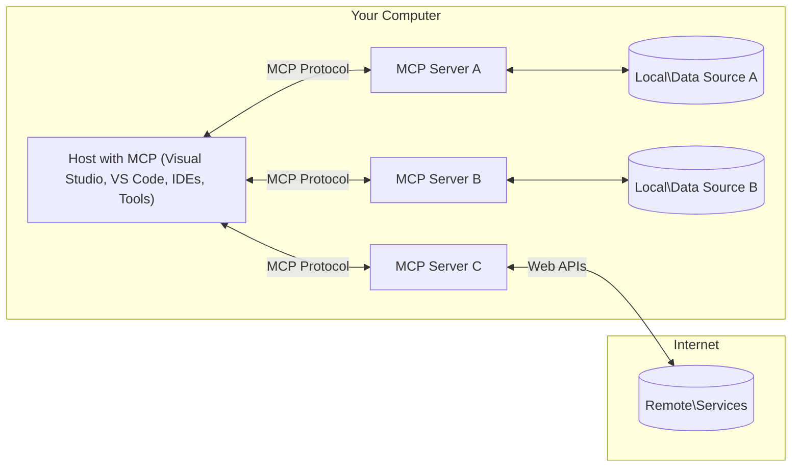

<!--
CO_OP_TRANSLATOR_METADATA:
{
  "original_hash": "0a6a7bcb289c024a91289e0444cb370b",
  "translation_date": "2025-08-18T15:21:17+00:00",
  "source_file": "01-CoreConcepts/README.md",
  "language_code": "sk"
}
-->
# MCP Základné Koncepty: Ovládnutie Protokolu Model Context pre AI Integráciu

[](https://youtu.be/earDzWGtE84)

_(Kliknite na obrázok vyššie pre zobrazenie videa k tejto lekcii)_

[Model Context Protocol (MCP)](https://gi- **Výslovný Súhlas Používateľa**: Všetky prístupy k údajom a operácie vyžadujú výslovný súhlas používateľa pred ich vykonaním. Používatelia musia jasne rozumieť, aké údaje budú spracované a aké akcie budú vykonané, s detailnou kontrolou nad povoleniami a autorizáciami.

- **Ochrana Súkromia Údajov**: Údaje používateľa sú sprístupnené iba s výslovným súhlasom a musia byť chránené robustnými kontrolami prístupu počas celého životného cyklu interakcie. Implementácie musia zabrániť neoprávnenému prenosu údajov a udržiavať prísne hranice súkromia.

- **Bezpečnosť Spúšťania Nástrojov**: Každé spustenie nástroja vyžaduje výslovný súhlas používateľa s jasným pochopením funkčnosti nástroja, parametrov a možného dopadu. Robustné bezpečnostné hranice musia zabrániť neúmyselnému, nebezpečnému alebo škodlivému spusteniu nástrojov.

- **Bezpečnosť Prenosovej Vrstvy**: Všetky komunikačné kanály by mali používať vhodné šifrovacie a autentifikačné mechanizmy. Vzdialené pripojenia by mali implementovať bezpečné prenosové protokoly a správu poverení.

#### Pokyny na Implementáciu:

- **Správa Povolení**: Implementujte detailné systémy povolení, ktoré umožňujú používateľom kontrolovať, ku ktorým serverom, nástrojom a zdrojom majú prístup.
- **Autentifikácia a Autorizácia**: Používajte bezpečné metódy autentifikácie (OAuth, API kľúče) so správnou správou tokenov a ich expiráciou.  
- **Validácia Vstupov**: Validujte všetky parametre a vstupy údajov podľa definovaných schém, aby ste zabránili útokom injekciou.  
- **Auditovanie Logov**: Udržiavajte komplexné záznamy všetkých operácií na účely monitorovania bezpečnosti a súladu.

[Model Context Protocol (MCP)](https://modelcontextprotocol.io/specification/2025-06-18/) je výkonný, štandardizovaný rámec, ktorý optimalizuje komunikáciu medzi veľkými jazykovými modelmi (LLM) a externými nástrojmi, aplikáciami a zdrojmi údajov. Táto príručka vás prevedie základnými konceptmi MCP, aby ste pochopili jeho klient-server architektúru, základné komponenty, mechanizmy komunikácie a osvedčené postupy implementácie.

## Prehľad

Táto lekcia skúma základnú architektúru a komponenty, ktoré tvoria ekosystém Model Context Protocol (MCP). Naučíte sa o klient-server architektúre, kľúčových komponentoch a komunikačných mechanizmoch, ktoré poháňajú interakcie MCP.

## Kľúčové Ciele Učenia

Na konci tejto lekcie budete:

- Rozumieť klient-server architektúre MCP.
- Identifikovať úlohy a zodpovednosti Hostiteľov, Klientov a Serverov.
- Analyzovať základné funkcie, ktoré robia MCP flexibilnou integračnou vrstvou.
- Naučiť sa, ako informácie prúdia v rámci ekosystému MCP.
- Získať praktické poznatky prostredníctvom ukážok kódu v .NET, Java, Python a JavaScript.

## Architektúra MCP: Hlbší Pohľad

Ekosystém MCP je postavený na modeli klient-server. Táto modulárna štruktúra umožňuje AI aplikáciám efektívne interagovať s nástrojmi, databázami, API a kontextovými zdrojmi. Rozdeľme si túto architektúru na jej základné komponenty.

V jadre MCP nasleduje klient-server architektúru, kde hostiteľská aplikácia môže byť pripojená k viacerým serverom:



- **Hostitelia MCP**: Programy ako VSCode, Claude Desktop, IDE alebo AI nástroje, ktoré chcú pristupovať k údajom prostredníctvom MCP.
- **Klienti MCP**: Protokoloví klienti, ktorí udržiavajú 1:1 spojenia so servermi.
- **Servery MCP**: Ľahké programy, ktoré poskytujú špecifické schopnosti prostredníctvom štandardizovaného Model Context Protocol.
- **Lokálne Zdroje Údajov**: Súbory, databázy a služby vášho počítača, ku ktorým môžu servery MCP bezpečne pristupovať.
- **Vzdialené Služby**: Externé systémy dostupné cez internet, ku ktorým sa servery MCP môžu pripojiť prostredníctvom API.

Protokol MCP je vyvíjajúci sa štandard používajúci verzovanie na základe dátumu (formát YYYY-MM-DD). Aktuálna verzia protokolu je **2025-06-18**. Najnovšie aktualizácie špecifikácie protokolu nájdete [tu](https://modelcontextprotocol.io/specification/2025-06-18/).

### 1. Hostitelia

V Model Context Protocol (MCP) sú **Hostitelia** AI aplikácie, ktoré slúžia ako primárne rozhranie, prostredníctvom ktorého používatelia interagujú s protokolom. Hostitelia koordinujú a spravujú spojenia s viacerými servermi MCP vytváraním dedikovaných klientov MCP pre každé spojenie so serverom. Príklady Hostiteľov zahŕňajú:

- **AI Aplikácie**: Claude Desktop, Visual Studio Code, Claude Code.
- **Vývojové Prostredia**: IDE a editory kódu s integráciou MCP.  
- **Vlastné Aplikácie**: Účelovo vytvorení AI agenti a nástroje.

**Hostitelia** sú aplikácie, ktoré koordinujú interakcie AI modelov. Oni:

- **Orchestrujú AI Modely**: Spúšťajú alebo interagujú s LLM na generovanie odpovedí a koordináciu AI pracovných tokov.
- **Spravujú Klientské Spojenia**: Vytvárajú a udržiavajú jedného klienta MCP na každé spojenie so serverom MCP.
- **Riadenie Užívateľského Rozhrania**: Spracovávajú tok konverzácie, interakcie používateľa a prezentáciu odpovedí.  
- **Zabezpečenie**: Kontrolujú povolenia, bezpečnostné obmedzenia a autentifikáciu.
- **Správa Súhlasu Používateľa**: Riadenie schválenia používateľa pre zdieľanie údajov a spúšťanie nástrojov.

### 2. Klienti

**Klienti** sú základné komponenty, ktoré udržiavajú dedikované spojenia 1:1 medzi Hostiteľmi a servermi MCP. Každý klient MCP je inicializovaný Hostiteľom na pripojenie ku konkrétnemu serveru MCP, čím sa zabezpečujú organizované a bezpečné komunikačné kanály. Viacero klientov umožňuje Hostiteľom pripojiť sa k viacerým serverom súčasne.

**Klienti** sú konektorové komponenty v rámci hostiteľskej aplikácie. Oni:

- **Komunikácia Protokolu**: Posielajú JSON-RPC 2.0 požiadavky serverom s výzvami a inštrukciami.
- **Vyjednávanie Schopností**: Vyjednávajú podporované funkcie a verzie protokolu so servermi počas inicializácie.
- **Spúšťanie Nástrojov**: Spravujú požiadavky na spúšťanie nástrojov od modelov a spracovávajú odpovede.
- **Aktualizácie v Reálnom Čase**: Spracovávajú notifikácie a aktualizácie v reálnom čase od serverov.
- **Spracovanie Odpovedí**: Spracovávajú a formátujú odpovede serverov na zobrazenie používateľom.

### 3. Servery

**Servery** sú programy, ktoré poskytujú kontext, nástroje a schopnosti klientom MCP. Môžu byť spustené lokálne (na rovnakom zariadení ako Hostiteľ) alebo vzdialene (na externých platformách) a sú zodpovedné za spracovanie požiadaviek klientov a poskytovanie štruktúrovaných odpovedí. Servery poskytujú špecifickú funkcionalitu prostredníctvom štandardizovaného Model Context Protocol.

**Servery** sú služby, ktoré poskytujú kontext a schopnosti. Oni:

- **Registrácia Funkcií**: Registrujú a sprístupňujú dostupné primitívy (zdroje, výzvy, nástroje) klientom.
- **Spracovanie Požiadaviek**: Prijímajú a vykonávajú výzvy nástrojov, požiadavky na zdroje a výzvy na výzvy od klientov.
- **Poskytovanie Kontextu**: Poskytujú kontextové informácie a údaje na zlepšenie odpovedí modelu.
- **Správa Stavu**: Udržiavajú stav relácie a spracovávajú stavové interakcie, keď je to potrebné.
- **Notifikácie v Reálnom Čase**: Posielajú notifikácie o zmenách schopností a aktualizáciách pripojeným klientom.

Servery môžu byť vyvinuté kýmkoľvek na rozšírenie schopností modelu špecializovanou funkcionalitou a podporujú lokálne aj vzdialené scenáre nasadenia.
- **Správa životného cyklu**: Zabezpečuje inicializáciu spojenia, vyjednávanie schopností a ukončenie relácie medzi klientmi a servermi
- **Serverové primitívy**: Umožňuje serverom poskytovať základné funkcie prostredníctvom nástrojov, zdrojov a šablón
- **Klientské primitívy**: Umožňuje serverom požadovať vzorkovanie od LLM, získavať vstupy od používateľov a posielať logovacie správy
- **Notifikácie v reálnom čase**: Podporuje asynchrónne notifikácie pre dynamické aktualizácie bez potreby opakovaného dotazovania

#### Kľúčové vlastnosti:

- **Vyjednávanie verzie protokolu**: Používa verzovanie založené na dátume (YYYY-MM-DD) na zabezpečenie kompatibility
- **Objavovanie schopností**: Klienti a servery si vymieňajú informácie o podporovaných funkciách počas inicializácie
- **Stavové relácie**: Udržiava stav spojenia naprieč viacerými interakciami pre zachovanie kontextu

### Transportná vrstva

**Transportná vrstva** spravuje komunikačné kanály, rámcovanie správ a autentifikáciu medzi účastníkmi MCP:

#### Podporované transportné mechanizmy:

1. **STDIO Transport**:
   - Používa štandardné vstupno-výstupné prúdy na priamu komunikáciu procesov
   - Optimálne pre lokálne procesy na rovnakom zariadení bez sieťového zaťaženia
   - Bežne používané pre lokálne implementácie MCP serverov

2. **Streamovateľný HTTP Transport**:
   - Používa HTTP POST na správy od klienta k serveru  
   - Voliteľné Server-Sent Events (SSE) na streamovanie od servera ku klientovi
   - Umožňuje komunikáciu s vzdialenými servermi cez siete
   - Podporuje štandardnú HTTP autentifikáciu (tokeny, API kľúče, vlastné hlavičky)
   - MCP odporúča OAuth pre bezpečnú autentifikáciu založenú na tokenoch

#### Abstrakcia transportu:

Transportná vrstva abstrahuje detaily komunikácie od dátovej vrstvy, čo umožňuje používanie rovnakého formátu správ JSON-RPC 2.0 naprieč všetkými transportnými mechanizmami. Táto abstrakcia umožňuje aplikáciám bezproblémovo prepínať medzi lokálnymi a vzdialenými servermi.

### Bezpečnostné aspekty

Implementácie MCP musia dodržiavať niekoľko kritických bezpečnostných princípov na zabezpečenie bezpečných, dôveryhodných a zabezpečených interakcií naprieč všetkými operáciami protokolu:

- **Súhlas a kontrola používateľa**: Používatelia musia poskytnúť výslovný súhlas pred prístupom k akýmkoľvek údajom alebo vykonaním operácií. Mali by mať jasnú kontrolu nad tým, aké údaje sú zdieľané a ktoré akcie sú autorizované, podporené intuitívnym rozhraním na kontrolu a schvaľovanie aktivít.

- **Ochrana súkromia údajov**: Údaje používateľa by mali byť sprístupnené len s výslovným súhlasom a musia byť chránené vhodnými kontrolami prístupu. Implementácie MCP musia zabrániť neoprávnenému prenosu údajov a zabezpečiť ochranu súkromia počas všetkých interakcií.

- **Bezpečnosť nástrojov**: Pred použitím akéhokoľvek nástroja je potrebný výslovný súhlas používateľa. Používatelia by mali jasne rozumieť funkčnosti každého nástroja a musia byť zavedené robustné bezpečnostné hranice na zabránenie neúmyselnému alebo nebezpečnému vykonaniu nástrojov.

Dodržiavaním týchto bezpečnostných princípov MCP zabezpečuje dôveru, ochranu súkromia a bezpečnosť používateľov naprieč všetkými interakciami protokolu, pričom umožňuje výkonné integrácie AI.

## Príklady kódu: Kľúčové komponenty

Nižšie sú uvedené príklady kódu v niekoľkých populárnych programovacích jazykoch, ktoré ilustrujú, ako implementovať kľúčové komponenty MCP servera a nástroje.

### Príklad .NET: Vytvorenie jednoduchého MCP servera s nástrojmi

Tu je praktický príklad kódu v .NET, ktorý demonštruje, ako implementovať jednoduchý MCP server s vlastnými nástrojmi. Tento príklad ukazuje, ako definovať a registrovať nástroje, spracovávať požiadavky a pripojiť server pomocou Model Context Protocol.

```csharp
using System;
using System.Threading.Tasks;
using ModelContextProtocol.Server;
using ModelContextProtocol.Server.Transport;
using ModelContextProtocol.Server.Tools;

public class WeatherServer
{
    public static async Task Main(string[] args)
    {
        // Create an MCP server
        var server = new McpServer(
            name: "Weather MCP Server",
            version: "1.0.0"
        );
        
        // Register our custom weather tool
        server.AddTool<string, WeatherData>("weatherTool", 
            description: "Gets current weather for a location",
            execute: async (location) => {
                // Call weather API (simplified)
                var weatherData = await GetWeatherDataAsync(location);
                return weatherData;
            });
        
        // Connect the server using stdio transport
        var transport = new StdioServerTransport();
        await server.ConnectAsync(transport);
        
        Console.WriteLine("Weather MCP Server started");
        
        // Keep the server running until process is terminated
        await Task.Delay(-1);
    }
    
    private static async Task<WeatherData> GetWeatherDataAsync(string location)
    {
        // This would normally call a weather API
        // Simplified for demonstration
        await Task.Delay(100); // Simulate API call
        return new WeatherData { 
            Temperature = 72.5,
            Conditions = "Sunny",
            Location = location
        };
    }
}

public class WeatherData
{
    public double Temperature { get; set; }
    public string Conditions { get; set; }
    public string Location { get; set; }
}
```

### Príklad Java: Komponenty MCP servera

Tento príklad demonštruje rovnaký MCP server a registráciu nástrojov ako vyššie uvedený príklad v .NET, ale implementovaný v Jave.

```java
import io.modelcontextprotocol.server.McpServer;
import io.modelcontextprotocol.server.McpToolDefinition;
import io.modelcontextprotocol.server.transport.StdioServerTransport;
import io.modelcontextprotocol.server.tool.ToolExecutionContext;
import io.modelcontextprotocol.server.tool.ToolResponse;

public class WeatherMcpServer {
    public static void main(String[] args) throws Exception {
        // Create an MCP server
        McpServer server = McpServer.builder()
            .name("Weather MCP Server")
            .version("1.0.0")
            .build();
            
        // Register a weather tool
        server.registerTool(McpToolDefinition.builder("weatherTool")
            .description("Gets current weather for a location")
            .parameter("location", String.class)
            .execute((ToolExecutionContext ctx) -> {
                String location = ctx.getParameter("location", String.class);
                
                // Get weather data (simplified)
                WeatherData data = getWeatherData(location);
                
                // Return formatted response
                return ToolResponse.content(
                    String.format("Temperature: %.1f°F, Conditions: %s, Location: %s", 
                    data.getTemperature(), 
                    data.getConditions(), 
                    data.getLocation())
                );
            })
            .build());
        
        // Connect the server using stdio transport
        try (StdioServerTransport transport = new StdioServerTransport()) {
            server.connect(transport);
            System.out.println("Weather MCP Server started");
            // Keep server running until process is terminated
            Thread.currentThread().join();
        }
    }
    
    private static WeatherData getWeatherData(String location) {
        // Implementation would call a weather API
        // Simplified for example purposes
        return new WeatherData(72.5, "Sunny", location);
    }
}

class WeatherData {
    private double temperature;
    private String conditions;
    private String location;
    
    public WeatherData(double temperature, String conditions, String location) {
        this.temperature = temperature;
        this.conditions = conditions;
        this.location = location;
    }
    
    public double getTemperature() {
        return temperature;
    }
    
    public String getConditions() {
        return conditions;
    }
    
    public String getLocation() {
        return location;
    }
}
```

### Príklad Python: Vytvorenie MCP servera

V tomto príklade ukazujeme, ako vytvoriť MCP server v Pythone. Sú tu tiež uvedené dva rôzne spôsoby, ako vytvoriť nástroje.

```python
#!/usr/bin/env python3
import asyncio
from mcp.server.fastmcp import FastMCP
from mcp.server.transports.stdio import serve_stdio

# Create a FastMCP server
mcp = FastMCP(
    name="Weather MCP Server",
    version="1.0.0"
)

@mcp.tool()
def get_weather(location: str) -> dict:
    """Gets current weather for a location."""
    # This would normally call a weather API
    # Simplified for demonstration
    return {
        "temperature": 72.5,
        "conditions": "Sunny",
        "location": location
    }

# Alternative approach using a class
class WeatherTools:
    @mcp.tool()
    def forecast(self, location: str, days: int = 1) -> dict:
        """Gets weather forecast for a location for the specified number of days."""
        # This would normally call a weather API forecast endpoint
        # Simplified for demonstration
        return {
            "location": location,
            "forecast": [
                {"day": i+1, "temperature": 70 + i, "conditions": "Partly Cloudy"}
                for i in range(days)
            ]
        }

# Instantiate the class to register its tools
weather_tools = WeatherTools()

# Start the server using stdio transport
if __name__ == "__main__":
    asyncio.run(serve_stdio(mcp))
```

### Príklad JavaScript: Vytvorenie MCP servera

Tento príklad ukazuje vytvorenie MCP servera v JavaScripte a ako registrovať dva nástroje súvisiace s počasím.

```javascript
// Using the official Model Context Protocol SDK
import { McpServer } from "@modelcontextprotocol/sdk/server/mcp.js";
import { StdioServerTransport } from "@modelcontextprotocol/sdk/server/stdio.js";
import { z } from "zod"; // For parameter validation

// Create an MCP server
const server = new McpServer({
  name: "Weather MCP Server",
  version: "1.0.0"
});

// Define a weather tool
server.tool(
  "weatherTool",
  {
    location: z.string().describe("The location to get weather for")
  },
  async ({ location }) => {
    // This would normally call a weather API
    // Simplified for demonstration
    const weatherData = await getWeatherData(location);
    
    return {
      content: [
        { 
          type: "text", 
          text: `Temperature: ${weatherData.temperature}°F, Conditions: ${weatherData.conditions}, Location: ${weatherData.location}` 
        }
      ]
    };
  }
);

// Define a forecast tool
server.tool(
  "forecastTool",
  {
    location: z.string(),
    days: z.number().default(3).describe("Number of days for forecast")
  },
  async ({ location, days }) => {
    // This would normally call a weather API
    // Simplified for demonstration
    const forecast = await getForecastData(location, days);
    
    return {
      content: [
        { 
          type: "text", 
          text: `${days}-day forecast for ${location}: ${JSON.stringify(forecast)}` 
        }
      ]
    };
  }
);

// Helper functions
async function getWeatherData(location) {
  // Simulate API call
  return {
    temperature: 72.5,
    conditions: "Sunny",
    location: location
  };
}

async function getForecastData(location, days) {
  // Simulate API call
  return Array.from({ length: days }, (_, i) => ({
    day: i + 1,
    temperature: 70 + Math.floor(Math.random() * 10),
    conditions: i % 2 === 0 ? "Sunny" : "Partly Cloudy"
  }));
}

// Connect the server using stdio transport
const transport = new StdioServerTransport();
server.connect(transport).catch(console.error);

console.log("Weather MCP Server started");
```

Tento JavaScript príklad demonštruje, ako vytvoriť MCP klienta, ktorý sa pripojí k serveru, pošle výzvu a spracuje odpoveď vrátane akýchkoľvek volaní nástrojov, ktoré boli vykonané.

## Bezpečnosť a autorizácia

MCP obsahuje niekoľko zabudovaných konceptov a mechanizmov na správu bezpečnosti a autorizácie v rámci protokolu:

1. **Kontrola povolení nástrojov**:  
   Klienti môžu špecifikovať, ktoré nástroje môže model používať počas relácie. To zabezpečuje, že sú prístupné iba výslovne autorizované nástroje, čím sa znižuje riziko neúmyselných alebo nebezpečných operácií. Povolenia môžu byť konfigurované dynamicky na základe preferencií používateľa, organizačných politík alebo kontextu interakcie.

2. **Autentifikácia**:  
   Servery môžu vyžadovať autentifikáciu pred udelením prístupu k nástrojom, zdrojom alebo citlivým operáciám. To môže zahŕňať API kľúče, OAuth tokeny alebo iné autentifikačné schémy. Správna autentifikácia zabezpečuje, že iba dôveryhodní klienti a používatelia môžu využívať schopnosti servera.

3. **Validácia**:  
   Validácia parametrov je vynútená pre všetky volania nástrojov. Každý nástroj definuje očakávané typy, formáty a obmedzenia pre svoje parametre a server validuje prichádzajúce požiadavky podľa toho. To zabraňuje nesprávne formátovaným alebo škodlivým vstupom dosiahnuť implementácie nástrojov a pomáha udržiavať integritu operácií.

4. **Obmedzenie rýchlosti**:  
   Na zabránenie zneužitia a zabezpečenie spravodlivého využívania serverových zdrojov môžu MCP servery implementovať obmedzenie rýchlosti pre volania nástrojov a prístup k zdrojom. Obmedzenia rýchlosti môžu byť aplikované na používateľa, reláciu alebo globálne a pomáhajú chrániť pred útokmi typu odmietnutie služby alebo nadmernou spotrebou zdrojov.

Kombináciou týchto mechanizmov MCP poskytuje bezpečný základ pre integráciu jazykových modelov s externými nástrojmi a zdrojmi údajov, pričom poskytuje používateľom a vývojárom jemnozrnnú kontrolu nad prístupom a využívaním.

## Správy protokolu a tok komunikácie

MCP komunikácia používa štruktúrované správy **JSON-RPC 2.0** na uľahčenie jasných a spoľahlivých interakcií medzi hostiteľmi, klientmi a servermi. Protokol definuje špecifické vzory správ pre rôzne typy operácií:

### Základné typy správ:

#### **Inicializačné správy**
- **`initialize` Požiadavka**: Zriaďuje spojenie a vyjednáva verziu protokolu a schopnosti
- **`initialize` Odpoveď**: Potvrdzuje podporované funkcie a informácie o serveri  
- **`notifications/initialized`**: Signalizuje, že inicializácia je dokončená a relácia je pripravená

#### **Objavovacie správy**
- **`tools/list` Požiadavka**: Objavuje dostupné nástroje zo servera
- **`resources/list` Požiadavka**: Zobrazuje dostupné zdroje (zdroje údajov)
- **`prompts/list` Požiadavka**: Získava dostupné šablóny výziev

#### **Výkonné správy**  
- **`tools/call` Požiadavka**: Vykonáva konkrétny nástroj s poskytnutými parametrami
- **`resources/read` Požiadavka**: Získava obsah z konkrétneho zdroja
- **`prompts/get` Požiadavka**: Načíta šablónu výzvy s voliteľnými parametrami

#### **Správy na strane klienta**
- **`sampling/complete` Požiadavka**: Server požaduje dokončenie LLM od klienta
- **`elicitation/request`**: Server požaduje vstup používateľa prostredníctvom klientského rozhrania
- **Logovacie správy**: Server posiela štruktúrované logovacie správy klientovi

#### **Notifikačné správy**
- **`notifications/tools/list_changed`**: Server informuje klienta o zmenách nástrojov
- **`notifications/resources/list_changed`**: Server informuje klienta o zmenách zdrojov  
- **`notifications/prompts/list_changed`**: Server informuje klienta o zmenách šablón výziev

### Štruktúra správ:

Všetky správy MCP dodržiavajú formát JSON-RPC 2.0 s:
- **Požiadavky**: Obsahujú `id`, `method` a voliteľné `params`
- **Odpovede**: Obsahujú `id` a buď `result` alebo `error`  
- **Notifikácie**: Obsahujú `method` a voliteľné `params` (bez `id` alebo očakávanej odpovede)

Táto štruktúrovaná komunikácia zabezpečuje spoľahlivé, sledovateľné a rozšíriteľné interakcie podporujúce pokročilé scenáre ako dynamické aktualizácie, reťazenie nástrojov a robustné spracovanie chýb.

## Kľúčové poznatky

- **Architektúra**: MCP používa architektúru klient-server, kde hostitelia spravujú viacero klientských spojení so servermi
- **Účastníci**: Ekosystém zahŕňa hostiteľov (AI aplikácie), klientov (konektory protokolu) a servery (poskytovateľov schopností)
- **Transportné mechanizmy**: Komunikácia podporuje STDIO (lokálne) a Streamovateľný HTTP s voliteľným SSE (vzdialené)
- **Základné primitívy**: Servery poskytujú nástroje (vykonateľné funkcie), zdroje (zdroje údajov) a šablóny (výzvy)
- **Klientské primitívy**: Servery môžu požadovať vzorkovanie (LLM dokončenia), získavanie vstupov (od používateľov) a logovanie od klientov
- **Základ protokolu**: Postavený na JSON-RPC 2.0 s verzovaním založeným na dátume (aktuálne: 2025-06-18)
- **Schopnosti v reálnom čase**: Podporuje notifikácie pre dynamické aktualizácie a synchronizáciu v reálnom čase
- **Bezpečnosť na prvom mieste**: Výslovný súhlas používateľa, ochrana súkromia údajov a bezpečný transport sú základné požiadavky

## Cvičenie

Navrhnite jednoduchý MCP nástroj, ktorý by bol užitočný vo vašej oblasti. Definujte:
1. Názov nástroja
2. Aké parametre by prijímal
3. Aký výstup by vracal
4. Ako by model mohol použiť tento nástroj na riešenie problémov používateľa


---

## Čo ďalej

Ďalej: [Kapitola 2: Bezpečnosť](../02-Security/README.md)

**Upozornenie**:  
Tento dokument bol preložený pomocou služby AI prekladu [Co-op Translator](https://github.com/Azure/co-op-translator). Aj keď sa snažíme o presnosť, prosím, berte na vedomie, že automatizované preklady môžu obsahovať chyby alebo nepresnosti. Pôvodný dokument v jeho rodnom jazyku by mal byť považovaný za autoritatívny zdroj. Pre kritické informácie sa odporúča profesionálny ľudský preklad. Nie sme zodpovední za žiadne nedorozumenia alebo nesprávne interpretácie vyplývajúce z použitia tohto prekladu.