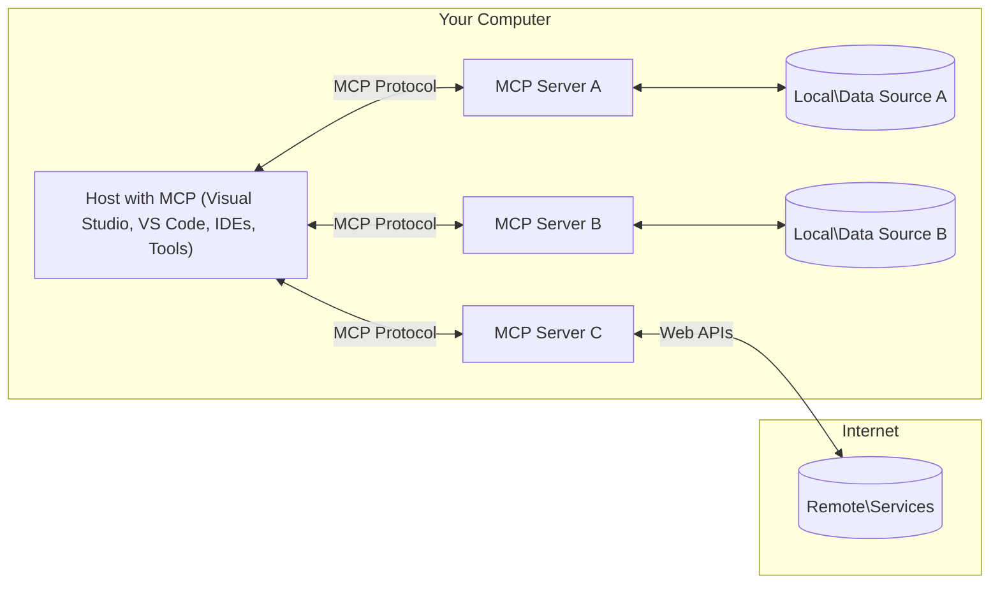

<!--
CO_OP_TRANSLATOR_METADATA:
{
  "original_hash": "904b59de1de9264801242d90a42cdd9d",
  "translation_date": "2025-09-05T11:31:37+00:00",
  "source_file": "01-CoreConcepts/README.md",
  "language_code": "sk"
}
-->
# MCP Základné Koncepty: Ovládnutie Protokolu Model Context pre Integráciu AI

[](https://youtu.be/earDzWGtE84)

_(Kliknite na obrázok vyššie pre zobrazenie videa k tejto lekcii)_

[Model Context Protocol (MCP)](https://github.com/modelcontextprotocol) je výkonný, štandardizovaný rámec, ktorý optimalizuje komunikáciu medzi veľkými jazykovými modelmi (LLMs) a externými nástrojmi, aplikáciami a zdrojmi dát. Tento sprievodca vás prevedie základnými konceptmi MCP. Naučíte sa o jeho architektúre klient-server, základných komponentoch, mechanizmoch komunikácie a najlepších praktikách implementácie.

- **Výslovný súhlas používateľa**: Všetky prístupy k dátam a operácie vyžadujú výslovné schválenie používateľom pred ich vykonaním. Používatelia musia jasne rozumieť, aké dáta budú prístupné a aké akcie budú vykonané, s detailnou kontrolou oprávnení a autorizácií.

- **Ochrana súkromia dát**: Dáta používateľa sú prístupné len s výslovným súhlasom a musia byť chránené robustnými kontrolami prístupu počas celého životného cyklu interakcie. Implementácie musia zabrániť neoprávnenému prenosu dát a zachovať prísne hranice súkromia.

- **Bezpečnosť vykonávania nástrojov**: Každé spustenie nástroja vyžaduje výslovný súhlas používateľa s jasným pochopením funkčnosti nástroja, parametrov a potenciálneho dopadu. Robustné bezpečnostné hranice musia zabrániť neúmyselnému, nebezpečnému alebo škodlivému spusteniu nástroja.

- **Bezpečnosť transportnej vrstvy**: Všetky komunikačné kanály by mali používať vhodné šifrovacie a autentifikačné mechanizmy. Vzdialené pripojenia by mali implementovať bezpečné transportné protokoly a správne riadenie poverení.

#### Usmernenia pre implementáciu:

- **Riadenie oprávnení**: Implementujte detailné systémy oprávnení, ktoré umožňujú používateľom kontrolovať, ktoré servery, nástroje a zdroje sú prístupné.
- **Autentifikácia a autorizácia**: Používajte bezpečné metódy autentifikácie (OAuth, API kľúče) so správnym riadením tokenov a ich exspiráciou.  
- **Validácia vstupov**: Validujte všetky parametre a vstupy dát podľa definovaných schém, aby ste zabránili útokom injekciou.
- **Auditovanie logov**: Udržiavajte komplexné logy všetkých operácií pre monitorovanie bezpečnosti a dodržiavanie predpisov.

## Prehľad

Táto lekcia skúma základnú architektúru a komponenty, ktoré tvoria ekosystém Model Context Protocol (MCP). Naučíte sa o architektúre klient-server, kľúčových komponentoch a mechanizmoch komunikácie, ktoré poháňajú interakcie MCP.

## Kľúčové vzdelávacie ciele

Na konci tejto lekcie budete:

- Rozumieť architektúre klient-server MCP.
- Identifikovať úlohy a zodpovednosti Hostov, Klientov a Serverov.
- Analyzovať základné funkcie, ktoré robia MCP flexibilnou integračnou vrstvou.
- Naučiť sa, ako informácie prúdia v rámci ekosystému MCP.
- Získať praktické poznatky prostredníctvom ukážok kódu v .NET, Java, Python a JavaScript.

## Architektúra MCP: Hlbší pohľad

Ekosystém MCP je postavený na modeli klient-server. Táto modulárna štruktúra umožňuje AI aplikáciám efektívne interagovať s nástrojmi, databázami, API a kontextovými zdrojmi. Rozoberme si túto architektúru na jej základné komponenty.

V jadre MCP nasleduje architektúru klient-server, kde hostiteľská aplikácia môže byť pripojená k viacerým serverom:



- **MCP Hostitelia**: Programy ako VSCode, Claude Desktop, IDE alebo AI nástroje, ktoré chcú pristupovať k dátam prostredníctvom MCP.
- **MCP Klienti**: Protokoloví klienti, ktorí udržiavajú 1:1 spojenia so servermi.
- **MCP Servery**: Ľahké programy, ktoré poskytujú špecifické schopnosti prostredníctvom štandardizovaného Model Context Protocol.
- **Lokálne zdroje dát**: Súbory, databázy a služby vášho počítača, ku ktorým môžu MCP servery bezpečne pristupovať.
- **Vzdialené služby**: Externé systémy dostupné cez internet, ku ktorým sa MCP servery môžu pripojiť prostredníctvom API.

Protokol MCP je vyvíjajúci sa štandard používajúci verzovanie na základe dátumu (formát YYYY-MM-DD). Aktuálna verzia protokolu je **2025-06-18**. Najnovšie aktualizácie špecifikácie protokolu nájdete na [protokolovej špecifikácii](https://modelcontextprotocol.io/specification/2025-06-18/).

### 1. Hostitelia

V Model Context Protocol (MCP) sú **Hostitelia** AI aplikácie, ktoré slúžia ako primárne rozhranie, prostredníctvom ktorého používatelia interagujú s protokolom. Hostitelia koordinujú a spravujú pripojenia k viacerým MCP serverom vytváraním dedikovaných MCP klientov pre každé pripojenie k serveru. Príklady hostiteľov zahŕňajú:

- **AI aplikácie**: Claude Desktop, Visual Studio Code, Claude Code.
- **Vývojové prostredia**: IDE a editory kódu s integráciou MCP.  
- **Vlastné aplikácie**: Špeciálne vytvorení AI agenti a nástroje.

**Hostitelia** sú aplikácie, ktoré koordinujú interakcie AI modelov. Oni:

- **Orchestrujú AI modely**: Spúšťajú alebo interagujú s LLM na generovanie odpovedí a koordináciu AI pracovných tokov.
- **Spravujú pripojenia klientov**: Vytvárajú a udržiavajú jedného MCP klienta na každé pripojenie k MCP serveru.
- **Riadenie používateľského rozhrania**: Spravujú tok konverzácie, interakcie používateľa a prezentáciu odpovedí.  
- **Zabezpečujú bezpečnosť**: Kontrolujú oprávnenia, bezpečnostné obmedzenia a autentifikáciu.
- **Spravujú súhlas používateľa**: Riadia schválenie používateľa pre zdieľanie dát a spúšťanie nástrojov.

### 2. Klienti

**Klienti** sú základné komponenty, ktoré udržiavajú dedikované spojenia 1:1 medzi Hostiteľmi a MCP servermi. Každý MCP klient je inicializovaný Hostiteľom na pripojenie k špecifickému MCP serveru, čím sa zabezpečujú organizované a bezpečné komunikačné kanály. Viacero klientov umožňuje Hostiteľom pripojiť sa k viacerým serverom súčasne.

**Klienti** sú konektorové komponenty v rámci hostiteľskej aplikácie. Oni:

- **Komunikácia protokolu**: Posielajú JSON-RPC 2.0 požiadavky na servery s promptmi a inštrukciami.
- **Vyjednávanie schopností**: Vyjednávajú podporované funkcie a verzie protokolu so servermi počas inicializácie.
- **Spúšťanie nástrojov**: Spravujú požiadavky na spúšťanie nástrojov od modelov a spracovávajú odpovede.
- **Aktualizácie v reálnom čase**: Spracovávajú notifikácie a aktualizácie v reálnom čase od serverov.
- **Spracovanie odpovedí**: Spracovávajú a formátujú odpovede serverov na zobrazenie používateľom.

### 3. Servery

**Servery** sú programy, ktoré poskytujú kontext, nástroje a schopnosti MCP klientom. Môžu byť spustené lokálne (na rovnakom zariadení ako Hostiteľ) alebo vzdialene (na externých platformách) a sú zodpovedné za spracovanie požiadaviek klientov a poskytovanie štruktúrovaných odpovedí. Servery vystavujú špecifickú funkcionalitu prostredníctvom štandardizovaného Model Context Protocol.

**Servery** sú služby, ktoré poskytujú kontext a schopnosti. Oni:

- **Registrácia funkcií**: Registrujú a vystavujú dostupné primitívy (zdroje, prompty, nástroje) klientom.
- **Spracovanie požiadaviek**: Prijímajú a vykonávajú volania nástrojov, požiadavky na zdroje a prompty od klientov.
- **Poskytovanie kontextu**: Poskytujú kontextové informácie a dáta na zlepšenie odpovedí modelu.
- **Správa stavu**: Udržiavajú stav relácie a spracovávajú stavové interakcie, keď je to potrebné.
- **Notifikácie v reálnom čase**: Posielajú notifikácie o zmenách schopností a aktualizáciách pripojeným klientom.

Servery môžu byť vyvíjané kýmkoľvek na rozšírenie schopností modelu špecializovanou funkcionalitou a podporujú lokálne aj vzdialené scenáre nasadenia.

### 4. Primitívy servera

Servery v Model Context Protocol (MCP) poskytujú tri základné **primitívy**, ktoré definujú základné stavebné bloky pre bohaté interakcie medzi klientmi, hostiteľmi a jazykovými modelmi. Tieto primitívy špecifikujú typy kontextových informácií a akcií dostupných prostredníctvom protokolu.

MCP servery môžu vystavovať akúkoľvek kombináciu nasledujúcich troch základných primitív:

#### Zdroje

**Zdroje** sú dátové zdroje, ktoré poskytujú kontextové informácie AI aplikáciám. Reprezentujú statický alebo dynamický obsah, ktorý môže zlepšiť porozumenie a rozhodovanie modelu:

- **Kontextové dáta**: Štruktúrované informácie a kontext pre spotrebu AI modelom.
- **Znalostné bázy**: Repozitáre dokumentov, články, manuály a výskumné práce.
- **Lokálne zdroje dát**: Súbory, databázy a informácie lokálneho systému.  
- **Externé dáta**: Odpovede API, webové služby a dáta vzdialených systémov.
- **Dynamický obsah**: Dáta v reálnom čase, ktoré sa aktualizujú na základe externých podmienok.

Zdroje sú identifikované URI a podporujú objavovanie prostredníctvom metód `resources/list` a načítanie prostredníctvom `resources/read`:

```text
file://documents/project-spec.md
database://production/users/schema
api://weather/current
```

#### Prompty

**Prompty** sú opakovane použiteľné šablóny, ktoré pomáhajú štruktúrovať interakcie s jazykovými modelmi. Poskytujú štandardizované vzory interakcií a šablóny pracovných tokov:

- **Šablónové interakcie**: Predštruktúrované správy a začiatky konverzácií.
- **Šablóny pracovných tokov**: Štandardizované sekvencie pre bežné úlohy a interakcie.
- **Príklady few-shot**: Šablóny založené na príkladoch pre inštrukcie modelu.
- **Systémové prompty**: Základné prompty, ktoré definujú správanie a kontext modelu.
- **Dynamické šablóny**: Parameterizované prompty, ktoré sa prispôsobujú špecifickým kontextom.

Prompty podporujú substitúciu premenných a môžu byť objavené prostredníctvom `prompts/list` a načítané pomocou `prompts/get`:

```markdown
Generate a {{task_type}} for {{product}} targeting {{audience}} with the following requirements: {{requirements}}
```

#### Nástroje

**Nástroje** sú vykonateľné funkcie, ktoré môžu AI modely vyvolať na vykonanie špecifických akcií. Reprezentujú „slovesá“ ekosystému MCP, umožňujúc modelom interagovať s externými systémami:

- **Vykonateľné funkcie**: Diskrétne operácie, ktoré môžu modely vyvolať so špecifickými parametrami.
- **Integrácia externých systémov**: Volania API, dotazy do databáz, operácie so súbormi, výpočty.
- **Jedinečná identita**: Každý nástroj má jedinečný názov, popis a schému parametrov.
- **Štruktúrované I/O**: Nástroje akceptujú validované parametre a vracajú štruktúrované, typované odpovede.
- **Akčné schopnosti**: Umožňujú modelom vykonávať reálne akcie a získavať aktuálne dáta.

Nástroje sú definované pomocou JSON schémy na validáciu parametrov a objavené prostredníctvom `tools/list` a vykonané pomocou `tools/call`:

```typescript
server.tool(
  "search_products", 
  {
    query: z.string().describe("Search query for products"),
    category: z.string().optional().describe("Product category filter"),
    max_results: z.number().default(10).describe("Maximum results to return")
  }, 
  async (params) => {
    // Execute search and return structured results
    return await productService.search(params);
  }
);
```

## Primitívy klienta

V Model Context Protocol (MCP) môžu **klienti** vystavovať primitívy, ktoré umožňujú serverom požadovať ďalšie schopnosti od hostiteľskej aplikácie. Tieto primitívy na strane klienta umožňujú bohatšie, interaktívne implementácie serverov, ktoré môžu pristupovať k schopnostiam AI modelov a interakciám používateľov.

### Sampling

**Sampling** umožňuje serverom požadovať dokončenia jazykového modelu od AI aplikácie klienta. Tento primitív umožňuje serverom prístup k schopnostiam LLM bez potreby vlastných závislostí na modeloch:

- **Prístup nezávislý od modelu**: Servery môžu požadovať dokončenia bez zahrnutia SDK LLM alebo správy prístupu k modelu.
- **AI iniciované serverom**: Umožňuje serverom autonómne generovať obsah pomocou AI modelu klienta.
- **Rekurzívne interakcie LLM**: Podporuje komplexné scenáre, kde servery potrebujú AI pomoc na spracovanie.
- **Generovanie dynamického obsahu**: Umožňuje serverom vytvárať kontextové odpovede pomocou modelu hostiteľa.

Sampling sa iniciuje prostredníctvom metódy `sampling/complete`, kde servery posielajú požiadavky na dokončenie klientom.

### Elicitation  

**Elicitation** umožňuje serverom požadovať dodatočné informácie alebo potvrdenie od používateľov prostredníctvom rozhrania klienta:

- **Požiadavky na vstup používateľa**: Servery môžu žiadať dodatočné informácie potrebné na vykonanie nástroja.
- **Potvrdzovacie dialógy**: Požiadavky na schválenie používateľa pre citlivé alebo významné operácie.
- **Interaktívne pracovné toky**: Umožňujú serverom vytvárať krok-za-krokom interakcie s používateľom.
- **Zber dynamických parametrov**: Získavanie chýbajúcich alebo voliteľných parametrov počas vykonávania nástroja.

Požiadavky na elicitation sa vykonávajú pomocou metódy `elicitation/request` na zber vstupov používateľa prostredníctvom rozhrania klienta.

### Logging

**Logging** umožňuje serverom posielať štruktúrované logovacie správy klientom na ladenie, monitorovanie a operačnú viditeľnosť:

- **Podpora ladenia**: Umožňuje serverom poskytovať detailné logy vykonávania na riešenie problémov.
- **Operačné monitorovanie**: Posielanie aktualizácií stavu a výkonnostných metrík klientom.
- **Hlásenie chýb**: Poskytovanie detailného kontextu chýb a diagnostických informácií.
- **Auditné stopy**: Vytváranie komplexných logov operácií a rozhodnutí servera.

Logovacie správy sú posielané klientom na zabezpečenie transparentnosti operácií servera a uľahčenie ladenia.

## Tok informácií v MCP

Model Context Protocol (MCP) definuje štruktúrovaný tok informácií medzi hostiteľmi, klientmi, servermi a modelmi
- **JSON-RPC 2.0 Protokol**: Všetka komunikácia používa štandardizovaný formát správ JSON-RPC 2.0 pre volania metód, odpovede a notifikácie
- **Riadenie životného cyklu**: Zabezpečuje inicializáciu spojenia, vyjednávanie schopností a ukončenie relácie medzi klientmi a servermi
- **Serverové primitívy**: Umožňuje serverom poskytovať základné funkcie prostredníctvom nástrojov, zdrojov a šablón
- **Klientské primitívy**: Umožňuje serverom požadovať vzorkovanie od LLM, získavať vstupy od používateľov a posielať logovacie správy
- **Notifikácie v reálnom čase**: Podporuje asynchrónne notifikácie pre dynamické aktualizácie bez potreby opakovaného dotazovania

#### Kľúčové vlastnosti:

- **Vyjednávanie verzie protokolu**: Používa verzovanie založené na dátume (YYYY-MM-DD) na zabezpečenie kompatibility
- **Objavovanie schopností**: Klienti a servery si vymieňajú informácie o podporovaných funkciách počas inicializácie
- **Stavové relácie**: Udržiava stav spojenia naprieč viacerými interakciami pre zachovanie kontextu

### Transportná vrstva

**Transportná vrstva** spravuje komunikačné kanály, rámcovanie správ a autentifikáciu medzi účastníkmi MCP:

#### Podporované transportné mechanizmy:

1. **STDIO Transport**:
   - Používa štandardné vstupno-výstupné prúdy na priamu komunikáciu medzi procesmi
   - Optimálne pre lokálne procesy na rovnakom zariadení bez sieťového zaťaženia
   - Bežne používané pre lokálne implementácie MCP serverov

2. **Streamovateľný HTTP Transport**:
   - Používa HTTP POST pre správy od klienta k serveru  
   - Voliteľné Server-Sent Events (SSE) pre streamovanie od servera ku klientovi
   - Umožňuje komunikáciu s diaľkovými servermi cez siete
   - Podporuje štandardnú HTTP autentifikáciu (tokeny, API kľúče, vlastné hlavičky)
   - MCP odporúča OAuth pre bezpečnú autentifikáciu založenú na tokenoch

#### Abstrakcia transportu:

Transportná vrstva abstrahuje detaily komunikácie od dátovej vrstvy, čo umožňuje používanie rovnakého formátu správ JSON-RPC 2.0 naprieč všetkými transportnými mechanizmami. Táto abstrakcia umožňuje aplikáciám bezproblémovo prepínať medzi lokálnymi a diaľkovými servermi.

### Bezpečnostné aspekty

Implementácie MCP musia dodržiavať niekoľko kritických bezpečnostných princípov na zabezpečenie bezpečných, dôveryhodných a zabezpečených interakcií naprieč všetkými operáciami protokolu:

- **Súhlas a kontrola používateľa**: Používatelia musia poskytnúť výslovný súhlas pred prístupom k akýmkoľvek údajom alebo vykonaním operácií. Mali by mať jasnú kontrolu nad tým, aké údaje sú zdieľané a ktoré akcie sú autorizované, podporené intuitívnym rozhraním na preskúmanie a schválenie aktivít.

- **Ochrana údajov**: Údaje používateľa by mali byť sprístupnené len s výslovným súhlasom a musia byť chránené vhodnými prístupovými kontrolami. Implementácie MCP musia zabrániť neoprávnenému prenosu údajov a zabezpečiť ochranu súkromia počas všetkých interakcií.

- **Bezpečnosť nástrojov**: Pred použitím akéhokoľvek nástroja je potrebný výslovný súhlas používateľa. Používatelia by mali jasne rozumieť funkčnosti každého nástroja a musia byť zavedené robustné bezpečnostné hranice na zabránenie neúmyselnému alebo nebezpečnému vykonaniu nástrojov.

Dodržiavaním týchto bezpečnostných princípov MCP zabezpečuje dôveru, ochranu súkromia a bezpečnosť používateľov naprieč všetkými interakciami protokolu, pričom umožňuje výkonné integrácie AI.

## Príklady kódu: Kľúčové komponenty

Nižšie sú uvedené príklady kódu v niekoľkých populárnych programovacích jazykoch, ktoré ilustrujú, ako implementovať kľúčové komponenty MCP servera a nástroje.

### Príklad .NET: Vytvorenie jednoduchého MCP servera s nástrojmi

Tu je praktický príklad kódu v .NET, ktorý demonštruje, ako implementovať jednoduchý MCP server s vlastnými nástrojmi. Tento príklad ukazuje, ako definovať a registrovať nástroje, spracovávať požiadavky a pripojiť server pomocou Model Context Protocol.

```csharp
using System;
using System.Threading.Tasks;
using ModelContextProtocol.Server;
using ModelContextProtocol.Server.Transport;
using ModelContextProtocol.Server.Tools;

public class WeatherServer
{
    public static async Task Main(string[] args)
    {
        // Create an MCP server
        var server = new McpServer(
            name: "Weather MCP Server",
            version: "1.0.0"
        );
        
        // Register our custom weather tool
        server.AddTool<string, WeatherData>("weatherTool", 
            description: "Gets current weather for a location",
            execute: async (location) => {
                // Call weather API (simplified)
                var weatherData = await GetWeatherDataAsync(location);
                return weatherData;
            });
        
        // Connect the server using stdio transport
        var transport = new StdioServerTransport();
        await server.ConnectAsync(transport);
        
        Console.WriteLine("Weather MCP Server started");
        
        // Keep the server running until process is terminated
        await Task.Delay(-1);
    }
    
    private static async Task<WeatherData> GetWeatherDataAsync(string location)
    {
        // This would normally call a weather API
        // Simplified for demonstration
        await Task.Delay(100); // Simulate API call
        return new WeatherData { 
            Temperature = 72.5,
            Conditions = "Sunny",
            Location = location
        };
    }
}

public class WeatherData
{
    public double Temperature { get; set; }
    public string Conditions { get; set; }
    public string Location { get; set; }
}
```

### Príklad Java: Komponenty MCP servera

Tento príklad demonštruje rovnaký MCP server a registráciu nástrojov ako vyššie uvedený príklad v .NET, ale implementovaný v Jave.

```java
import io.modelcontextprotocol.server.McpServer;
import io.modelcontextprotocol.server.McpToolDefinition;
import io.modelcontextprotocol.server.transport.StdioServerTransport;
import io.modelcontextprotocol.server.tool.ToolExecutionContext;
import io.modelcontextprotocol.server.tool.ToolResponse;

public class WeatherMcpServer {
    public static void main(String[] args) throws Exception {
        // Create an MCP server
        McpServer server = McpServer.builder()
            .name("Weather MCP Server")
            .version("1.0.0")
            .build();
            
        // Register a weather tool
        server.registerTool(McpToolDefinition.builder("weatherTool")
            .description("Gets current weather for a location")
            .parameter("location", String.class)
            .execute((ToolExecutionContext ctx) -> {
                String location = ctx.getParameter("location", String.class);
                
                // Get weather data (simplified)
                WeatherData data = getWeatherData(location);
                
                // Return formatted response
                return ToolResponse.content(
                    String.format("Temperature: %.1f°F, Conditions: %s, Location: %s", 
                    data.getTemperature(), 
                    data.getConditions(), 
                    data.getLocation())
                );
            })
            .build());
        
        // Connect the server using stdio transport
        try (StdioServerTransport transport = new StdioServerTransport()) {
            server.connect(transport);
            System.out.println("Weather MCP Server started");
            // Keep server running until process is terminated
            Thread.currentThread().join();
        }
    }
    
    private static WeatherData getWeatherData(String location) {
        // Implementation would call a weather API
        // Simplified for example purposes
        return new WeatherData(72.5, "Sunny", location);
    }
}

class WeatherData {
    private double temperature;
    private String conditions;
    private String location;
    
    public WeatherData(double temperature, String conditions, String location) {
        this.temperature = temperature;
        this.conditions = conditions;
        this.location = location;
    }
    
    public double getTemperature() {
        return temperature;
    }
    
    public String getConditions() {
        return conditions;
    }
    
    public String getLocation() {
        return location;
    }
}
```

### Príklad Python: Vytvorenie MCP servera

Tento príklad používa fastmcp, preto sa uistite, že ho najskôr nainštalujete:

```python
pip install fastmcp
```
Ukážka kódu:

```python
#!/usr/bin/env python3
import asyncio
from fastmcp import FastMCP
from fastmcp.transports.stdio import serve_stdio

# Create a FastMCP server
mcp = FastMCP(
    name="Weather MCP Server",
    version="1.0.0"
)

@mcp.tool()
def get_weather(location: str) -> dict:
    """Gets current weather for a location."""
    return {
        "temperature": 72.5,
        "conditions": "Sunny",
        "location": location
    }

# Alternative approach using a class
class WeatherTools:
    @mcp.tool()
    def forecast(self, location: str, days: int = 1) -> dict:
        """Gets weather forecast for a location for the specified number of days."""
        return {
            "location": location,
            "forecast": [
                {"day": i+1, "temperature": 70 + i, "conditions": "Partly Cloudy"}
                for i in range(days)
            ]
        }

# Register class tools
weather_tools = WeatherTools()

# Start the server
if __name__ == "__main__":
    asyncio.run(serve_stdio(mcp))
```

### Príklad JavaScript: Vytvorenie MCP servera

Tento príklad ukazuje vytvorenie MCP servera v JavaScripte a ako registrovať dva nástroje súvisiace s počasím.

```javascript
// Using the official Model Context Protocol SDK
import { McpServer } from "@modelcontextprotocol/sdk/server/mcp.js";
import { StdioServerTransport } from "@modelcontextprotocol/sdk/server/stdio.js";
import { z } from "zod"; // For parameter validation

// Create an MCP server
const server = new McpServer({
  name: "Weather MCP Server",
  version: "1.0.0"
});

// Define a weather tool
server.tool(
  "weatherTool",
  {
    location: z.string().describe("The location to get weather for")
  },
  async ({ location }) => {
    // This would normally call a weather API
    // Simplified for demonstration
    const weatherData = await getWeatherData(location);
    
    return {
      content: [
        { 
          type: "text", 
          text: `Temperature: ${weatherData.temperature}°F, Conditions: ${weatherData.conditions}, Location: ${weatherData.location}` 
        }
      ]
    };
  }
);

// Define a forecast tool
server.tool(
  "forecastTool",
  {
    location: z.string(),
    days: z.number().default(3).describe("Number of days for forecast")
  },
  async ({ location, days }) => {
    // This would normally call a weather API
    // Simplified for demonstration
    const forecast = await getForecastData(location, days);
    
    return {
      content: [
        { 
          type: "text", 
          text: `${days}-day forecast for ${location}: ${JSON.stringify(forecast)}` 
        }
      ]
    };
  }
);

// Helper functions
async function getWeatherData(location) {
  // Simulate API call
  return {
    temperature: 72.5,
    conditions: "Sunny",
    location: location
  };
}

async function getForecastData(location, days) {
  // Simulate API call
  return Array.from({ length: days }, (_, i) => ({
    day: i + 1,
    temperature: 70 + Math.floor(Math.random() * 10),
    conditions: i % 2 === 0 ? "Sunny" : "Partly Cloudy"
  }));
}

// Connect the server using stdio transport
const transport = new StdioServerTransport();
server.connect(transport).catch(console.error);

console.log("Weather MCP Server started");
```

Tento JavaScriptový príklad demonštruje, ako vytvoriť MCP klienta, ktorý sa pripojí k serveru, pošle výzvu a spracuje odpoveď vrátane akýchkoľvek volaní nástrojov, ktoré boli vykonané.

## Bezpečnosť a autorizácia

MCP obsahuje niekoľko zabudovaných konceptov a mechanizmov na správu bezpečnosti a autorizácie v rámci protokolu:

1. **Kontrola povolení nástrojov**:  
   Klienti môžu špecifikovať, ktoré nástroje môže model používať počas relácie. To zabezpečuje, že sú prístupné iba výslovne autorizované nástroje, čím sa znižuje riziko neúmyselných alebo nebezpečných operácií. Povolenia je možné konfigurovať dynamicky na základe preferencií používateľa, organizačných politík alebo kontextu interakcie.

2. **Autentifikácia**:  
   Servery môžu vyžadovať autentifikáciu pred udelením prístupu k nástrojom, zdrojom alebo citlivým operáciám. To môže zahŕňať API kľúče, OAuth tokeny alebo iné autentifikačné schémy. Správna autentifikácia zabezpečuje, že iba dôveryhodní klienti a používatelia môžu využívať schopnosti servera.

3. **Validácia**:  
   Validácia parametrov je vynútená pre všetky volania nástrojov. Každý nástroj definuje očakávané typy, formáty a obmedzenia pre svoje parametre a server validuje prichádzajúce požiadavky podľa toho. To zabraňuje nesprávne formátovaným alebo škodlivým vstupom dosiahnuť implementácie nástrojov a pomáha udržiavať integritu operácií.

4. **Obmedzenie rýchlosti**:  
   Na zabránenie zneužitiu a zabezpečenie spravodlivého využívania serverových zdrojov môžu MCP servery implementovať obmedzenie rýchlosti pre volania nástrojov a prístup k zdrojom. Obmedzenia rýchlosti môžu byť aplikované na používateľa, reláciu alebo globálne a pomáhajú chrániť pred útokmi typu odmietnutie služby alebo nadmerným využívaním zdrojov.

Kombináciou týchto mechanizmov MCP poskytuje bezpečný základ pre integráciu jazykových modelov s externými nástrojmi a zdrojmi údajov, pričom poskytuje používateľom a vývojárom jemnozrnnú kontrolu nad prístupom a využívaním.

## Správy protokolu a tok komunikácie

Komunikácia MCP používa štruktúrované správy **JSON-RPC 2.0** na uľahčenie jasných a spoľahlivých interakcií medzi hostiteľmi, klientmi a servermi. Protokol definuje špecifické vzory správ pre rôzne typy operácií:

### Základné typy správ:

#### **Inicializačné správy**
- **`initialize` Požiadavka**: Zriaďuje spojenie a vyjednáva verziu protokolu a schopnosti
- **`initialize` Odpoveď**: Potvrdzuje podporované funkcie a informácie o serveri  
- **`notifications/initialized`**: Signalizuje, že inicializácia je dokončená a relácia je pripravená

#### **Správy objavovania**
- **`tools/list` Požiadavka**: Objavuje dostupné nástroje zo servera
- **`resources/list` Požiadavka**: Zobrazuje dostupné zdroje (zdroje údajov)
- **`prompts/list` Požiadavka**: Získava dostupné šablóny výziev

#### **Správy vykonávania**  
- **`tools/call` Požiadavka**: Vykonáva konkrétny nástroj s poskytnutými parametrami
- **`resources/read` Požiadavka**: Získava obsah zo špecifického zdroja
- **`prompts/get` Požiadavka**: Načíta šablónu výzvy s voliteľnými parametrami

#### **Správy na strane klienta**
- **`sampling/complete` Požiadavka**: Server požaduje dokončenie LLM od klienta
- **`elicitation/request`**: Server požaduje vstup používateľa prostredníctvom rozhrania klienta
- **Logovacie správy**: Server posiela štruktúrované logovacie správy klientovi

#### **Notifikačné správy**
- **`notifications/tools/list_changed`**: Server upozorňuje klienta na zmeny nástrojov
- **`notifications/resources/list_changed`**: Server upozorňuje klienta na zmeny zdrojov  
- **`notifications/prompts/list_changed`**: Server upozorňuje klienta na zmeny šablón výziev

### Štruktúra správ:

Všetky správy MCP dodržiavajú formát JSON-RPC 2.0 s:
- **Požiadavky**: Obsahujú `id`, `method` a voliteľné `params`
- **Odpovede**: Obsahujú `id` a buď `result` alebo `error`  
- **Notifikácie**: Obsahujú `method` a voliteľné `params` (bez `id` alebo očakávanej odpovede)

Táto štruktúrovaná komunikácia zabezpečuje spoľahlivé, sledovateľné a rozšíriteľné interakcie podporujúce pokročilé scenáre ako dynamické aktualizácie, reťazenie nástrojov a robustné spracovanie chýb.

## Kľúčové poznatky

- **Architektúra**: MCP používa architektúru klient-server, kde hostitelia spravujú viacero klientských spojení so servermi
- **Účastníci**: Ekosystém zahŕňa hostiteľov (AI aplikácie), klientov (konektory protokolu) a servery (poskytovateľov schopností)
- **Transportné mechanizmy**: Komunikácia podporuje STDIO (lokálne) a Streamovateľný HTTP s voliteľným SSE (diaľkové)
- **Základné primitívy**: Servery poskytujú nástroje (vykonateľné funkcie), zdroje (zdroje údajov) a šablóny (výzvy)
- **Klientské primitívy**: Servery môžu požadovať vzorkovanie (LLM dokončenia), získavanie vstupov (používateľské vstupy) a logovanie od klientov
- **Základ protokolu**: Postavený na JSON-RPC 2.0 s verzovaním založeným na dátume (aktuálne: 2025-06-18)
- **Schopnosti v reálnom čase**: Podporuje notifikácie pre dynamické aktualizácie a synchronizáciu v reálnom čase
- **Bezpečnosť na prvom mieste**: Výslovný súhlas používateľa, ochrana súkromia údajov a bezpečný transport sú základné požiadavky

## Cvičenie

Navrhnite jednoduchý MCP nástroj, ktorý by bol užitočný vo vašej oblasti. Definujte:
1. Ako by sa nástroj volal
2. Aké parametre by prijímal
3. Aký výstup by vracal
4. Ako by model mohol použiť tento nástroj na riešenie problémov používateľa


---

## Čo ďalej

Ďalej: [Kapitola 2: Bezpečnosť](../02-Security/README.md)

---

**Upozornenie**:  
Tento dokument bol preložený pomocou služby na automatický preklad [Co-op Translator](https://github.com/Azure/co-op-translator). Hoci sa snažíme o presnosť, upozorňujeme, že automatické preklady môžu obsahovať chyby alebo nepresnosti. Pôvodný dokument v jeho pôvodnom jazyku by mal byť považovaný za autoritatívny zdroj. Pre dôležité informácie odporúčame profesionálny ľudský preklad. Nezodpovedáme za akékoľvek nedorozumenia alebo nesprávne interpretácie vyplývajúce z použitia tohto prekladu.