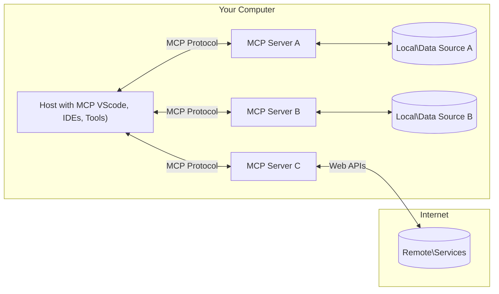

<!--
CO_OP_TRANSLATOR_METADATA:
{
  "original_hash": "355b12a5970c5c9e6db0bee970c751ba",
  "translation_date": "2025-07-04T18:42:14+00:00",
  "source_file": "01-CoreConcepts/README.md",
  "language_code": "sk"
}
-->
# 📖 MCP Základné koncepty: Ovládnutie Model Context Protocol pre integráciu AI

[Model Context Protocol (MCP)](https://github.com/modelcontextprotocol) je výkonný, štandardizovaný rámec, ktorý optimalizuje komunikáciu medzi veľkými jazykovými modelmi (LLM) a externými nástrojmi, aplikáciami a zdrojmi dát. Tento SEO-optimalizovaný sprievodca vás prevedie základnými konceptmi MCP, aby ste pochopili jeho klient-server architektúru, kľúčové komponenty, mechanizmy komunikácie a najlepšie postupy implementácie.

## Prehľad

Táto lekcia skúma základnú architektúru a komponenty, ktoré tvoria ekosystém Model Context Protocol (MCP). Naučíte sa o klient-server architektúre, hlavných komponentoch a komunikačných mechanizmoch, ktoré umožňujú interakcie v MCP.

## 👩‍🎓 Kľúčové ciele učenia

Na konci tejto lekcie budete:

- Rozumieť klient-server architektúre MCP.
- Identifikovať úlohy a zodpovednosti Hosts, Clients a Servers.
- Analyzovať hlavné vlastnosti, ktoré robia MCP flexibilnou integračnou vrstvou.
- Naučiť sa, ako prebieha tok informácií v ekosystéme MCP.
- Získať praktické poznatky prostredníctvom ukážok kódu v .NET, Java, Python a JavaScript.

## 🔎 Architektúra MCP: Hlbší pohľad

Ekosystém MCP je postavený na modeli klient-server. Táto modulárna štruktúra umožňuje AI aplikáciám efektívne komunikovať s nástrojmi, databázami, API a kontextovými zdrojmi. Rozoberme si túto architektúru na jej základné komponenty.

V jadre MCP nasleduje klient-server architektúru, kde hostiteľská aplikácia môže byť pripojená k viacerým serverom:



- **MCP Hosts**: Programy ako VSCode, Claude Desktop, IDE alebo AI nástroje, ktoré chcú pristupovať k dátam cez MCP
- **MCP Clients**: Protokoloví klienti, ktorí udržiavajú 1:1 spojenia so servermi
- **MCP Servers**: Ľahké programy, ktoré každé vystavujú špecifické schopnosti cez štandardizovaný Model Context Protocol
- **Lokálne zdroje dát**: Súbory, databázy a služby na vašom počítači, ku ktorým MCP servery môžu bezpečne pristupovať
- **Vzdialené služby**: Externé systémy dostupné cez internet, ku ktorým sa MCP servery môžu pripájať cez API.

MCP protokol je vyvíjajúci sa štandard, najnovšie aktualizácie nájdete v [špecifikácii protokolu](https://modelcontextprotocol.io/specification/2025-06-18/)

### 1. Hosts

V Model Context Protocol (MCP) zohrávajú Hosts kľúčovú úlohu ako primárne rozhranie, cez ktoré používatelia komunikujú s protokolom. Hosts sú aplikácie alebo prostredia, ktoré iniciujú spojenia s MCP servermi, aby získali prístup k dátam, nástrojom a promptom. Príklady Hosts zahŕňajú integrované vývojové prostredia (IDEs) ako Visual Studio Code, AI nástroje ako Claude Desktop alebo vlastné agenti vytvorení pre špecifické úlohy.

**Hosts** sú LLM aplikácie, ktoré iniciujú spojenia. Ich úlohy sú:

- Spúšťať alebo komunikovať s AI modelmi na generovanie odpovedí.
- Iniciovať spojenia s MCP servermi.
- Riadiť tok konverzácie a používateľské rozhranie.
- Kontrolovať povolenia a bezpečnostné obmedzenia.
- Spravovať súhlas používateľa so zdieľaním dát a vykonávaním nástrojov.

### 2. Clients

Clients sú nevyhnutné komponenty, ktoré uľahčujú interakciu medzi Hosts a MCP servermi. Klienti fungujú ako sprostredkovatelia, ktorí umožňujú Hosts pristupovať a využívať funkcie poskytované MCP servermi. Zohrávajú dôležitú úlohu pri zabezpečení plynulej komunikácie a efektívnej výmeny dát v rámci architektúry MCP.

**Clients** sú konektory v rámci hostiteľskej aplikácie. Ich úlohy sú:

- Posielať požiadavky serverom s promptmi/inštrukciami.
- Rokovať o schopnostiach so servermi.
- Spravovať požiadavky na vykonávanie nástrojov od modelov.
- Spracovávať a zobrazovať odpovede používateľom.

### 3. Servers

Servery sú zodpovedné za spracovanie požiadaviek od MCP klientov a poskytovanie vhodných odpovedí. Riadia rôzne operácie ako získavanie dát, vykonávanie nástrojov a generovanie promptov. Servery zabezpečujú efektívnu a spoľahlivú komunikáciu medzi klientmi a Hosts, pričom zachovávajú integritu interakčného procesu.

**Servers** sú služby, ktoré poskytujú kontext a schopnosti. Ich úlohy sú:

- Registrovať dostupné funkcie (zdroje, prompty, nástroje)
- Prijímať a vykonávať volania nástrojov od klienta
- Poskytovať kontextové informácie na zlepšenie odpovedí modelu
- Vracať výstupy späť klientovi
- Udržiavať stav počas interakcií, ak je to potrebné

Servery môže vyvíjať ktokoľvek, aby rozšíril schopnosti modelu o špecializované funkcie.

### 4. Funkcie serverov

Servery v Model Context Protocol (MCP) poskytujú základné stavebné bloky, ktoré umožňujú bohaté interakcie medzi klientmi, hostiteľmi a jazykovými modelmi. Tieto funkcie sú navrhnuté tak, aby rozšírili schopnosti MCP ponukou štruktúrovaného kontextu, nástrojov a promptov.

MCP servery môžu ponúkať niektorú z nasledujúcich funkcií:

#### 📑 Zdroje

Zdroje v Model Context Protocol (MCP) zahŕňajú rôzne typy kontextu a dát, ktoré môžu používatelia alebo AI modely využiť. Patria sem:

- **Kontextové dáta**: Informácie a kontext, ktoré môžu používatelia alebo AI modely využiť pri rozhodovaní a vykonávaní úloh.
- **Znalostné bázy a dokumentové úložiská**: Kolekcie štruktúrovaných a neštruktúrovaných dát, ako sú články, manuály a výskumné práce, ktoré poskytujú cenné poznatky a informácie.
- **Lokálne súbory a databázy**: Dáta uložené lokálne na zariadeniach alebo v databázach, prístupné na spracovanie a analýzu.
- **API a webové služby**: Externé rozhrania a služby, ktoré ponúkajú ďalšie dáta a funkcie, umožňujúce integráciu s rôznymi online zdrojmi a nástrojmi.

Príkladom zdroja môže byť databázové schéma alebo súbor, ku ktorému sa pristupuje takto:

```text
file://log.txt
database://schema
```

### 🤖 Prompty

Prompty v Model Context Protocol (MCP) zahŕňajú rôzne preddefinované šablóny a vzory interakcie navrhnuté na zjednodušenie pracovných tokov používateľov a zlepšenie komunikácie. Patria sem:

- **Šablónové správy a pracovné postupy**: Predštruktúrované správy a procesy, ktoré vedú používateľov cez konkrétne úlohy a interakcie.
- **Preddefinované vzory interakcie**: Štandardizované sekvencie akcií a odpovedí, ktoré umožňujú konzistentnú a efektívnu komunikáciu.
- **Špecializované šablóny konverzácií**: Prispôsobiteľné šablóny určené pre špecifické typy rozhovorov, zabezpečujúce relevantné a kontextovo vhodné interakcie.

Šablóna promptu môže vyzerať takto:

```markdown
Generate a product slogan based on the following {{product}} with the following {{keywords}}
```

#### ⛏️ Nástroje

Nástroje v Model Context Protocol (MCP) sú funkcie, ktoré môže AI model vykonať na splnenie konkrétnych úloh. Tieto nástroje sú navrhnuté tak, aby rozšírili schopnosti AI modelu poskytovaním štruktúrovaných a spoľahlivých operácií. Kľúčové aspekty zahŕňajú:

- **Funkcie, ktoré AI model môže vykonať**: Nástroje sú spustiteľné funkcie, ktoré AI model môže vyvolať na vykonanie rôznych úloh.
- **Jedinečný názov a popis**: Každý nástroj má jedinečný názov a podrobný popis, ktorý vysvetľuje jeho účel a funkčnosť.
- **Parametre a výstupy**: Nástroje prijímajú špecifické parametre a vracajú štruktúrované výstupy, čo zabezpečuje konzistentné a predvídateľné výsledky.
- **Samostatné funkcie**: Nástroje vykonávajú samostatné funkcie, ako sú webové vyhľadávania, výpočty a dotazy do databázy.

Príklad nástroja môže vyzerať takto:

```typescript
server.tool(
  "GetProducts",
  {
    pageSize: z.string().optional(),
    pageCount: z.string().optional()
  }, () => {
    // return results from API
  }
)
```

## Funkcie klientov

V Model Context Protocol (MCP) klienti ponúkajú serverom niekoľko kľúčových funkcií, ktoré zlepšujú celkovú funkcionalitu a interakciu v rámci protokolu. Jednou z pozoruhodných funkcií je Sampling.

### 👉 Sampling

- **Agentné správanie iniciované serverom**: Klienti umožňujú serverom autonómne iniciovať špecifické akcie alebo správanie, čím sa zvyšujú dynamické schopnosti systému.
- **Rekurzívne interakcie s LLM**: Táto funkcia umožňuje rekurzívne interakcie s veľkými jazykovými modelmi (LLM), čo umožňuje zložitejšie a iteratívne spracovanie úloh.
- **Žiadanie ďalších dokončení modelu**: Servery môžu žiadať ďalšie dokončenia od modelu, čím zabezpečujú, že odpovede sú dôkladné a kontextovo relevantné.

## Tok informácií v MCP

Model Context Protocol (MCP) definuje štruktúrovaný tok informácií medzi hosts, clients, servers a modelmi. Pochopenie tohto toku pomáha objasniť, ako sa spracovávajú požiadavky používateľov a ako sa externé nástroje a dáta integrujú do odpovedí modelu.

- **Host iniciuje spojenie**  
  Hostiteľská aplikácia (napr. IDE alebo chat rozhranie) nadviaže spojenie s MCP serverom, zvyčajne cez STDIO, WebSocket alebo iný podporovaný transport.

- **Rokovanie o schopnostiach**  
  Klient (vložený v hostiteľovi) a server si vymieňajú informácie o podporovaných funkciách, nástrojoch, zdrojoch a verziách protokolu. To zabezpečuje, že obe strany rozumejú dostupným schopnostiam pre danú reláciu.

- **Používateľská požiadavka**  
  Používateľ komunikuje s hostiteľom (napr. zadá prompt alebo príkaz). Hostiteľ túto vstupnú informáciu zhromaždí a odovzdá klientovi na spracovanie.

- **Použitie zdroja alebo nástroja**  
  - Klient môže požiadať server o ďalší kontext alebo zdroje (napr. súbory, záznamy v databáze alebo články zo znalostnej bázy) na obohatenie porozumenia modelu.
  - Ak model určí, že je potrebný nástroj (napr. na získanie dát, vykonanie výpočtu alebo volanie API), klient pošle serveru požiadavku na vyvolanie nástroja, špecifikujúc názov nástroja a parametre.

- **Vykonanie serverom**  
  Server prijme požiadavku na zdroj alebo nástroj, vykoná potrebné operácie (napr. spustenie funkcie, dotaz do databázy alebo získanie súboru) a vráti výsledky klientovi v štruktúrovanej forme.

- **Generovanie odpovede**  
  Klient integruje odpovede servera (dáta zo zdrojov, výstupy nástrojov atď.) do prebiehajúcej interakcie s modelom. Model využíva tieto informácie na vytvorenie komplexnej a kontextovo relevantnej odpovede.

- **Prezentácia výsledku**  
  Hostiteľ prijme finálny výstup od klienta a zobrazí ho používateľovi, často vrátane textu generovaného modelom a výsledkov z vykonaných nástrojov alebo vyhľadávania zdrojov.

Tento tok umožňuje MCP podporovať pokročilé, interaktívne a kontextovo uvedomelé AI aplikácie tým, že bezproblémovo prepája modely s externými nástrojmi a zdrojmi dát.

## Detaily protokolu

MCP (Model Context Protocol) je postavený na [JSON-RPC 2.0](https://www.jsonrpc.org/), ktorý poskytuje štandardizovaný, jazykovo nezávislý formát správ pre komunikáciu medzi hosts, clients a servers. Táto základňa umožňuje spoľahlivé, štruktúrované a rozšíriteľné interakcie naprieč rôznymi platformami a programovacími jazykmi.

### Kľúčové vlastnosti protokolu

MCP rozširuje JSON-RPC 2.0 o ďalšie konvencie pre vyvolávanie nástrojov, prístup k zdrojom a správu promptov. Podporuje viacero transportných vrstiev (STDIO, WebSocket, SSE) a umožňuje bezpečnú, rozšíriteľnú a jazykovo nezávislú komunikáciu medzi komponentmi.

#### 🧢 Základný protokol

- **Formát správ JSON-RPC**: Všetky požiadavky a odpovede používajú špecifikáciu JSON-RPC 2.0, čo zabezpečuje konzistentnú štruktúru pre volania metód, parametre, výsledky a spracovanie chýb.
- **Stavové spojenia**: MCP relácie udržiavajú stav naprieč viacerými požiadavkami, podporujúc prebiehajúce konverzácie, akumuláciu kontextu a správu zdrojov.
- **Rokovanie o schopnostiach**: Počas nastavovania spojenia si klienti a servery vymieňajú informácie o podporovaných funkciách, verziách protokolu, dostupných nástrojoch a zdrojoch. To zabezpečuje, že obe strany rozumejú schopnostiam druhej strany a môžu sa podľa toho prispôsobiť.

#### ➕ Dodatočné nástroje

Nižšie sú uvedené niektoré ďalšie nástroje a rozšírenia protokolu, ktoré MCP poskytuje na zlepšenie vývojárskej skúsenosti a umožnenie pokročilých scenárov:

- **Konfiguračné možnosti**: MCP umožňuje dynamickú konfiguráciu parametrov relácie, ako sú povolenia nástrojov, prístup k zdrojom a nastavenia modelu, prispôsobené každej interakcii.
- **Sledovanie priebehu**: Dlhšie trvajúce operácie môžu hlásiť aktualizácie priebehu, čo umožňuje responzívne používateľské rozhrania a lepší zážitok počas zložitých úloh.
- **Zrušenie požiadaviek**: Klienti môžu zrušiť prebiehajúce požiadavky, čo umožňuje používateľom prerušiť operácie, ktoré už nie sú potrebné alebo trvajú príliš dlho.
- **Hlásenie chýb**: Štandardizované chybové správy a kódy pomáhajú diagnostikovať problémy, elegantne riešiť zlyhania a poskytovať použiteľnú spätnú väzbu používateľom a vývojárom.
- **Logovanie**: Klienti aj servery môžu emitovať štruktúrované logy na audit, ladenie a monitorovanie interakcií protokolu.

Vďaka týmto vlastnostiam protokolu MCP zabezpečuje robustnú, bezpečnú a flexibilnú komunikáciu medzi jazykovými modelmi a externými nástrojmi či zdrojmi dát.

### 🔐 Bezpečnostné aspekty

Implementácie MCP by mali dodržiavať niekoľko kľúčových bezpečnostných princípov, aby zabezpečili bezpečné a dôveryhodné interakcie:

- **Súhlas a kontrola používateľa**:
MCP obsahuje niekoľko zabudovaných konceptov a mechanizmov na riadenie bezpečnosti a autorizácie v celom protokole:

1. **Kontrola povolení nástrojov**:  
  Klienti môžu určiť, ktoré nástroje môže model počas relácie používať. Tým sa zabezpečí, že sú prístupné iba explicitne autorizované nástroje, čím sa znižuje riziko neúmyselných alebo nebezpečných operácií. Povolenia je možné dynamicky nastavovať podľa preferencií používateľa, organizačných pravidiel alebo kontextu interakcie.

2. **Overovanie**:  
  Servery môžu vyžadovať overenie pred udelením prístupu k nástrojom, zdrojom alebo citlivým operáciám. Môže ísť o API kľúče, OAuth tokeny alebo iné overovacie schémy. Správne overenie zabezpečuje, že iba dôveryhodní klienti a používatelia môžu vyvolávať schopnosti na strane servera.

3. **Validácia**:  
  Validácia parametrov je vynucovaná pri všetkých volaniach nástrojov. Každý nástroj definuje očakávané typy, formáty a obmedzenia svojich parametrov a server overuje prichádzajúce požiadavky podľa toho. Tým sa zabraňuje tomu, aby do implementácií nástrojov prenikli nesprávne alebo škodlivé vstupy, a pomáha sa udržiavať integrita operácií.

4. **Obmedzenie rýchlosti (Rate Limiting)**:  
  Aby sa predišlo zneužitiu a zabezpečilo spravodlivé využívanie serverových zdrojov, servery MCP môžu implementovať obmedzenie rýchlosti volaní nástrojov a prístupu k zdrojom. Obmedzenia môžu byť aplikované na používateľa, reláciu alebo globálne a pomáhajú chrániť pred útokmi typu denial-of-service alebo nadmerným využívaním zdrojov.

Kombináciou týchto mechanizmov MCP poskytuje bezpečný základ pre integráciu jazykových modelov s externými nástrojmi a zdrojmi dát, pričom používateľom a vývojárom dáva detailnú kontrolu nad prístupom a používaním.

## Protokolové správy

Komunikácia MCP používa štruktúrované JSON správy na zabezpečenie jasnej a spoľahlivej interakcie medzi klientmi, servermi a modelmi. Hlavné typy správ zahŕňajú:

- **Žiadosť klienta**  
  Odosielaná z klienta na server, táto správa zvyčajne obsahuje:
  - Výzvu alebo príkaz používateľa
  - Históriu konverzácie pre kontext
  - Konfiguráciu nástrojov a povolenia
  - Ďalšie metadáta alebo informácie o relácii

- **Odpoveď modelu**  
  Vracia model (prostredníctvom klienta), táto správa obsahuje:
  - Generovaný text alebo dokončenie na základe výzvy a kontextu
  - Voliteľné inštrukcie na volanie nástroja, ak model rozhodne, že je potrebné nástroj vyvolať
  - Odkazy na zdroje alebo ďalší kontext podľa potreby

- **Žiadosť nástroja**  
  Odosielaná z klienta na server, keď je potrebné vykonať nástroj. Táto správa obsahuje:
  - Názov nástroja, ktorý sa má vyvolať
  - Parametre požadované nástrojom (validované podľa schémy nástroja)
  - Kontextové informácie alebo identifikátory na sledovanie požiadavky

- **Odpoveď nástroja**  
  Vracia server po vykonaní nástroja. Táto správa poskytuje:
  - Výsledky vykonania nástroja (štruktúrované dáta alebo obsah)
  - Akékoľvek chyby alebo stavové informácie, ak volanie nástroja zlyhalo
  - Voliteľne ďalšie metadáta alebo záznamy súvisiace s vykonaním

Tieto štruktúrované správy zabezpečujú, že každý krok v pracovnom postupe MCP je explicitný, sledovateľný a rozšíriteľný, podporujúc pokročilé scenáre ako viackolové konverzácie, reťazenie nástrojov a robustné spracovanie chýb.

## Kľúčové poznatky

- MCP používa architektúru klient-server na prepojenie modelov s externými schopnosťami
- Ekosystém pozostáva z klientov, hostiteľov, serverov, nástrojov a zdrojov dát
- Komunikácia môže prebiehať cez STDIO, SSE alebo WebSockets
- Nástroje sú základné jednotky funkcionality sprístupnené modelom
- Štruktúrované komunikačné protokoly zabezpečujú konzistentnú interakciu

## Cvičenie

Navrhnite jednoduchý MCP nástroj, ktorý by bol užitočný vo vašej oblasti. Definujte:
1. Ako by sa nástroj volal
2. Aké parametre by prijímal
3. Aký výstup by vracal
4. Ako by model mohol tento nástroj použiť na riešenie problémov používateľa


---

## Čo ďalej

Ďalej: [Chapter 2: Security](../02-Security/README.md)

**Vyhlásenie o zodpovednosti**:  
Tento dokument bol preložený pomocou AI prekladateľskej služby [Co-op Translator](https://github.com/Azure/co-op-translator). Aj keď sa snažíme o presnosť, prosím, majte na pamäti, že automatizované preklady môžu obsahovať chyby alebo nepresnosti. Originálny dokument v jeho pôvodnom jazyku by mal byť považovaný za autoritatívny zdroj. Pre kritické informácie sa odporúča profesionálny ľudský preklad. Nie sme zodpovední za akékoľvek nedorozumenia alebo nesprávne interpretácie vyplývajúce z použitia tohto prekladu.