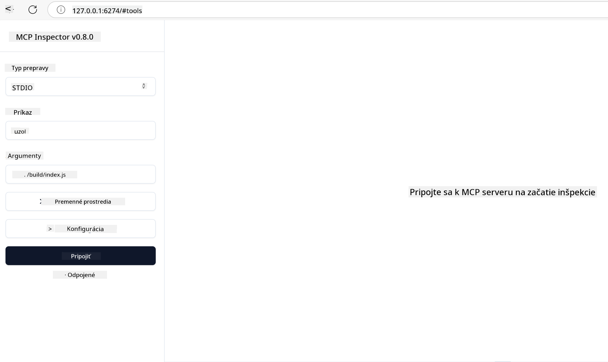

<!--
CO_OP_TRANSLATOR_METADATA:
{
  "original_hash": "5331ffd328a54b90f76706c52b673e27",
  "translation_date": "2025-05-17T08:52:51+00:00",
  "source_file": "03-GettingStarted/01-first-server/README.md",
  "language_code": "sk"
}
-->
# Začíname s MCP

Vitajte pri vašich prvých krokoch s Model Context Protocol (MCP)! Či už ste nováčikom v MCP alebo sa snažíte prehĺbiť svoje znalosti, tento sprievodca vás prevedie základným nastavením a vývojovým procesom. Zistíte, ako MCP umožňuje bezproblémovú integráciu medzi AI modelmi a aplikáciami, a naučíte sa, ako rýchlo pripraviť svoje prostredie na budovanie a testovanie riešení s podporou MCP.

> Stručne: Ak vytvárate AI aplikácie, viete, že môžete pridať nástroje a ďalšie zdroje do vášho LLM (veľký jazykový model), aby ste zvýšili jeho znalosti. Ak však umiestnite tieto nástroje a zdroje na server, aplikácia a schopnosti servera môžu byť použité akýmkoľvek klientom s/bez LLM.

## Prehľad

Táto lekcia poskytuje praktické pokyny na nastavenie prostredí MCP a vytvorenie vašich prvých MCP aplikácií. Naučíte sa, ako nastaviť potrebné nástroje a rámce, vytvárať základné MCP servery, vytvárať hostiteľské aplikácie a testovať vaše implementácie.

Model Context Protocol (MCP) je otvorený protokol, ktorý štandardizuje, ako aplikácie poskytujú kontext pre LLM. Predstavte si MCP ako USB-C port pre AI aplikácie - poskytuje štandardizovaný spôsob pripojenia AI modelov k rôznym zdrojom dát a nástrojom.

## Ciele učenia

Na konci tejto lekcie budete schopní:

- Nastaviť vývojové prostredia pre MCP v jazykoch C#, Java, Python, TypeScript a JavaScript
- Vytvárať a nasadzovať základné MCP servery s vlastnými funkciami (zdroje, výzvy a nástroje)
- Vytvárať hostiteľské aplikácie, ktoré sa pripájajú k MCP serverom
- Testovať a ladiť implementácie MCP

## Nastavenie vášho MCP prostredia

Predtým, ako začnete pracovať s MCP, je dôležité pripraviť vaše vývojové prostredie a porozumieť základnému pracovného postupu. Táto časť vás prevedie počiatočnými krokmi nastavenia, aby ste zaistili plynulý štart s MCP.

### Predpoklady

Predtým, ako sa pustíte do vývoja MCP, uistite sa, že máte:

- **Vývojové prostredie**: Pre váš zvolený jazyk (C#, Java, Python, TypeScript alebo JavaScript)
- **IDE/Editor**: Visual Studio, Visual Studio Code, IntelliJ, Eclipse, PyCharm alebo akýkoľvek moderný kódový editor
- **Správcovia balíčkov**: NuGet, Maven/Gradle, pip alebo npm/yarn
- **API kľúče**: Pre akékoľvek AI služby, ktoré plánujete použiť vo vašich hostiteľských aplikáciách

## Základná štruktúra MCP servera

MCP server zvyčajne obsahuje:

- **Konfigurácia servera**: Nastavenie portu, autentifikácie a ďalších nastavení
- **Zdroje**: Dáta a kontext, ktoré sú k dispozícii pre LLM
- **Nástroje**: Funkcionalita, ktorú modely môžu vyvolať
- **Výzvy**: Šablóny na generovanie alebo štruktúrovanie textu

Tu je zjednodušený príklad v TypeScripte:

```typescript
import { Server, Tool, Resource } from "@modelcontextprotocol/typescript-server-sdk";

// Create a new MCP server
const server = new Server({
  port: 3000,
  name: "Example MCP Server",
  version: "1.0.0"
});

// Register a tool
server.registerTool({
  name: "calculator",
  description: "Performs basic calculations",
  parameters: {
    expression: {
      type: "string",
      description: "The math expression to evaluate"
    }
  },
  handler: async (params) => {
    const result = eval(params.expression);
    return { result };
  }
});

// Start the server
server.start();
```

V predchádzajúcom kóde sme:

- Importovali potrebné triedy z MCP TypeScript SDK.
- Vytvorili a nakonfigurovali novú inštanciu MCP servera.
- Registrovali vlastný nástroj (`calculator`) s funkciou handlera.
- Spustili server, aby počúval prichádzajúce požiadavky MCP.

## Testovanie a ladenie

Predtým, ako začnete testovať váš MCP server, je dôležité porozumieť dostupným nástrojom a najlepším praktikám pre ladenie. Efektívne testovanie zabezpečuje, že váš server sa správa podľa očakávania a pomáha rýchlo identifikovať a riešiť problémy. Nasledujúca časť načrtáva odporúčané prístupy na overenie vašej implementácie MCP.

MCP poskytuje nástroje, ktoré vám pomôžu testovať a ladiť vaše servery:

- **Inspector tool**, tento grafický rozhranie vám umožňuje pripojiť sa k vášmu serveru a testovať vaše nástroje, výzvy a zdroje.
- **curl**, môžete sa tiež pripojiť k vášmu serveru pomocou nástroja príkazového riadku ako curl alebo iných klientov, ktoré dokážu vytvárať a spúšťať HTTP príkazy.

### Použitie MCP Inspector

[MCP Inspector](https://github.com/modelcontextprotocol/inspector) je vizuálny nástroj na testovanie, ktorý vám pomôže:

1. **Objavovať schopnosti servera**: Automaticky zistiť dostupné zdroje, nástroje a výzvy
2. **Testovať vykonávanie nástrojov**: Skúsiť rôzne parametre a vidieť odpovede v reálnom čase
3. **Zobraziť metadáta servera**: Preskúmať informácie o serveri, schémy a konfigurácie

```bash
# ex TypeScript, installing and running MCP Inspector
npx @modelcontextprotocol/inspector node build/index.js
```

Keď spustíte vyššie uvedené príkazy, MCP Inspector spustí lokálne webové rozhranie vo vašom prehliadači. Môžete očakávať, že uvidíte dashboard zobrazujúci vaše registrované MCP servery, ich dostupné nástroje, zdroje a výzvy. Rozhranie vám umožňuje interaktívne testovať vykonávanie nástrojov, skúmať metadáta servera a zobrazovať odpovede v reálnom čase, čo uľahčuje overenie a ladenie vašich implementácií MCP servera.

Tu je snímka obrazovky, ako to môže vyzerať:


## Bežné problémy s nastavením a riešenia

| Problém | Možné riešenie |
|-------|-------------------|
| Odmietnuté pripojenie | Skontrolujte, či server beží a port je správny |
| Chyby pri vykonávaní nástrojov | Skontrolujte validáciu parametrov a spracovanie chýb |
| Chyby autentifikácie | Overte API kľúče a povolenia |
| Chyby validácie schémy | Uistite sa, že parametre zodpovedajú definovanej schéme |
| Server sa nespúšťa | Skontrolujte konflikty portov alebo chýbajúce závislosti |
| CORS chyby | Nakonfigurujte správne CORS hlavičky pre cross-origin požiadavky |
| Problémy s autentifikáciou | Overte platnosť tokenov a povolenia |

## Lokálny vývoj

Pre lokálny vývoj a testovanie môžete spustiť MCP servery priamo na vašom počítači:

1. **Spustite proces servera**: Spustite vašu MCP serverovú aplikáciu 
2. **Nakonfigurujte sieťové nastavenia**: Uistite sa, že server je prístupný na očakávanom porte 
3. **Pripojte klientov**: Použite lokálne URL pripojenia ako `http://localhost:3000`

```bash
# Example: Running a TypeScript MCP server locally
npm run start
# Server running at http://localhost:3000
```

## Vytvorenie vášho prvého MCP servera

Prebrali sme [Základné koncepty](/01-CoreConcepts/README.md) v predchádzajúcej lekcii, teraz je čas tieto znalosti využiť.

### Čo môže server robiť

Predtým, než začneme písať kód, pripomeňme si, čo môže server robiť:

MCP server môže napríklad:

- Pristupovať k lokálnym súborom a databázam
- Pripojiť sa k vzdialeným API
- Vykonávať výpočty
- Integrovať sa s inými nástrojmi a službami
- Poskytovať užívateľské rozhranie pre interakciu

Skvelé, teraz keď vieme, čo môžeme pre to urobiť, začnime kódovať.

## Cvičenie: Vytvorenie servera

Na vytvorenie servera musíte postupovať podľa týchto krokov:

- Nainštalujte MCP SDK.
- Vytvorte projekt a nastavte štruktúru projektu.
- Napíšte kód servera.
- Otestujte server.

### -1- Inštalácia SDK

Toto sa líši v závislosti od vášho zvoleného runtime, takže si vyberte jeden z nižšie uvedených runtime:

Generatívna AI môže generovať text, obrázky a dokonca aj kód.

### -2- Vytvorte projekt

Teraz, keď máte nainštalovaný SDK, poďme vytvoriť projekt:

### -3- Vytvorte súbory projektu

### -4- Vytvorte kód servera

### -5- Pridanie nástroja a zdroja

Pridajte nástroj a zdroj pridaním nasledujúceho kódu:

### -6 Konečný kód

Pridajme posledný kód, ktorý potrebujeme, aby sa server mohol spustiť:

### -7- Testovanie servera

Spustite server pomocou nasledujúceho príkazu:

### -8- Spustenie pomocou inspektora

Inspektor je skvelý nástroj, ktorý dokáže spustiť váš server a umožňuje vám s ním interagovať, takže môžete otestovať, či funguje. Spustime ho:

> [!NOTE]
> Môže to vyzerať inak v poli "command", pretože obsahuje príkaz na spustenie servera s vaším špecifickým runtime.

Mali by ste vidieť nasledujúce užívateľské rozhranie:



1. Pripojte sa k serveru výberom tlačidla Connect
  Keď sa pripojíte k serveru, mali by ste teraz vidieť nasledujúce:

  

1. Vyberte "Tools" a "listTools", mali by ste vidieť "Add" sa zobraziť, vyberte "Add" a vyplňte hodnoty parametrov.

  Mali by ste vidieť nasledujúcu odpoveď, t.j. výsledok z nástroja "add":

  

Gratulujeme, podarilo sa vám vytvoriť a spustiť váš prvý server!

### Oficiálne SDK

MCP poskytuje oficiálne SDK pre viaceré jazyky:
- [C# SDK](https://github.com/modelcontextprotocol/csharp-sdk) - Udržiavané v spolupráci s Microsoft
- [Java SDK](https://github.com/modelcontextprotocol/java-sdk) - Udržiavané v spolupráci so Spring AI
- [TypeScript SDK](https://github.com/modelcontextprotocol/typescript-sdk) - Oficiálna implementácia v TypeScript
- [Python SDK](https://github.com/modelcontextprotocol/python-sdk) - Oficiálna implementácia v Pythone
- [Kotlin SDK](https://github.com/modelcontextprotocol/kotlin-sdk) - Oficiálna implementácia v Kotline
- [Swift SDK](https://github.com/modelcontextprotocol/swift-sdk) - Udržiavané v spolupráci s Loopwork AI
- [Rust SDK](https://github.com/modelcontextprotocol/rust-sdk) - Oficiálna implementácia v Ruste

## Kľúčové poznatky

- Nastavenie vývojového prostredia MCP je jednoduché s jazykovo špecifickými SDK
- Budovanie MCP serverov zahŕňa vytváranie a registráciu nástrojov s jasnými schémami
- Testovanie a ladenie sú nevyhnutné pre spoľahlivé implementácie MCP

## Ukážky

- [Java Kalkulačka](../samples/java/calculator/README.md)
- [.Net Kalkulačka](../../../../03-GettingStarted/samples/csharp)
- [JavaScript Kalkulačka](../samples/javascript/README.md)
- [TypeScript Kalkulačka](../samples/typescript/README.md)
- [Python Kalkulačka](../../../../03-GettingStarted/samples/python)

## Zadanie

Vytvorte jednoduchý MCP server s nástrojom podľa vášho výberu:
1. Implementujte nástroj vo vašom preferovanom jazyku (.NET, Java, Python alebo JavaScript).
2. Definujte vstupné parametre a návratové hodnoty.
3. Spustite nástroj inspektora, aby ste sa uistili, že server funguje podľa očakávania.
4. Otestujte implementáciu s rôznymi vstupmi.

## Riešenie

[Riešenie](./solution/README.md)

## Ďalšie zdroje

- [MCP GitHub Repozitár](https://github.com/microsoft/mcp-for-beginners)

## Čo ďalej

Ďalej: [Začíname s MCP klientmi](/03-GettingStarted/02-client/README.md)

**Upozornenie**:  
Tento dokument bol preložený pomocou služby AI prekladu [Co-op Translator](https://github.com/Azure/co-op-translator). Aj keď sa snažíme o presnosť, uvedomte si, že automatizované preklady môžu obsahovať chyby alebo nepresnosti. Pôvodný dokument v jeho rodnom jazyku by mal byť považovaný za autoritatívny zdroj. Pre kritické informácie sa odporúča profesionálny ľudský preklad. Nezodpovedáme za žiadne nedorozumenia alebo nesprávne interpretácie vyplývajúce z použitia tohto prekladu.