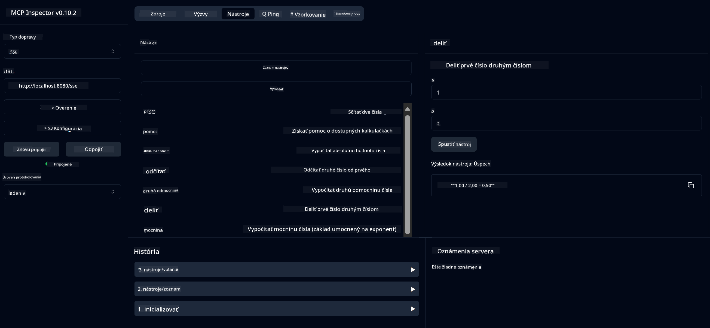

<!--
CO_OP_TRANSLATOR_METADATA:
{
  "original_hash": "ed9cab32cc67c12d8969b407aa47100a",
  "translation_date": "2025-07-13T17:56:25+00:00",
  "source_file": "03-GettingStarted/01-first-server/solution/java/README.md",
  "language_code": "sk"
}
-->
# Základná kalkulačka MCP služba

Táto služba poskytuje základné kalkulačné operácie prostredníctvom Model Context Protocol (MCP) s využitím Spring Boot a WebFlux transportu. Je navrhnutá ako jednoduchý príklad pre začiatočníkov, ktorí sa učia o implementáciách MCP.

Pre viac informácií si pozrite referenčnú dokumentáciu [MCP Server Boot Starter](https://docs.spring.io/spring-ai/reference/api/mcp/mcp-server-boot-starter-docs.html).


## Použitie služby

Služba sprístupňuje nasledujúce API endpointy cez MCP protokol:

- `add(a, b)`: Sčíta dve čísla
- `subtract(a, b)`: Odčíta druhé číslo od prvého
- `multiply(a, b)`: Vynásobí dve čísla
- `divide(a, b)`: Vydelí prvé číslo druhým (s kontrolou delenia nulou)
- `power(base, exponent)`: Vypočíta mocninu čísla
- `squareRoot(number)`: Vypočíta druhú odmocninu (s kontrolou záporného čísla)
- `modulus(a, b)`: Vypočíta zvyšok po delení
- `absolute(number)`: Vypočíta absolútnu hodnotu

## Závislosti

Projekt vyžaduje nasledujúce kľúčové závislosti:

```xml
<dependency>
    <groupId>org.springframework.ai</groupId>
    <artifactId>spring-ai-starter-mcp-server-webflux</artifactId>
</dependency>
```

## Kompilácia projektu

Projekt zostavte pomocou Maven:
```bash
./mvnw clean install -DskipTests
```

## Spustenie servera

### Použitie Java

```bash
java -jar target/calculator-server-0.0.1-SNAPSHOT.jar
```

### Použitie MCP Inspector

MCP Inspector je užitočný nástroj na interakciu s MCP službami. Na použitie s touto kalkulačkovou službou:

1. **Nainštalujte a spustite MCP Inspector** v novom terminálovom okne:
   ```bash
   npx @modelcontextprotocol/inspector
   ```

2. **Otvorte webové rozhranie** kliknutím na URL, ktorú aplikácia zobrazí (zvyčajne http://localhost:6274)

3. **Nakonfigurujte pripojenie**:
   - Nastavte typ transportu na "SSE"
   - Zadajte URL SSE endpointu vášho bežiaceho servera: `http://localhost:8080/sse`
   - Kliknite na "Connect"

4. **Použite nástroje**:
   - Kliknite na "List Tools" pre zobrazenie dostupných kalkulačných operácií
   - Vyberte nástroj a kliknite na "Run Tool" pre vykonanie operácie



**Zrieknutie sa zodpovednosti**:  
Tento dokument bol preložený pomocou AI prekladateľskej služby [Co-op Translator](https://github.com/Azure/co-op-translator). Aj keď sa snažíme o presnosť, prosím, majte na pamäti, že automatizované preklady môžu obsahovať chyby alebo nepresnosti. Originálny dokument v jeho pôvodnom jazyku by mal byť považovaný za autoritatívny zdroj. Pre kritické informácie sa odporúča profesionálny ľudský preklad. Nie sme zodpovední za akékoľvek nedorozumenia alebo nesprávne interpretácie vyplývajúce z použitia tohto prekladu.