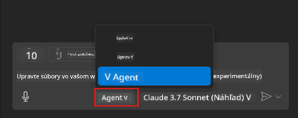
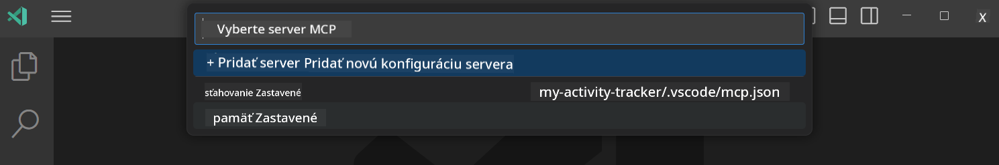
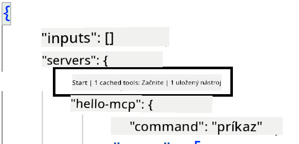

<!--
CO_OP_TRANSLATOR_METADATA:
{
  "original_hash": "d940b5e0af75e3a3a4d1c3179120d1d9",
  "translation_date": "2025-08-26T18:16:05+00:00",
  "source_file": "03-GettingStarted/04-vscode/README.md",
  "language_code": "sk"
}
-->
# Používanie servera v režime GitHub Copilot Agent

Visual Studio Code a GitHub Copilot môžu fungovať ako klient a využívať MCP Server. Prečo by sme to chceli robiť, pýtate sa? No, to znamená, že všetky funkcie, ktoré MCP Server má, môžu byť teraz použité priamo vo vašom IDE. Predstavte si, že pridáte napríklad GitHubov MCP server, čo by vám umožnilo ovládať GitHub pomocou príkazov namiesto písania konkrétnych príkazov v termináli. Alebo si predstavte čokoľvek, čo by mohlo zlepšiť váš vývojársky zážitok, všetko ovládané prirodzeným jazykom. Teraz už vidíte výhody, však?

## Prehľad

Táto lekcia pokrýva, ako používať Visual Studio Code a režim Agent GitHub Copilot ako klient pre váš MCP Server.

## Ciele učenia

Na konci tejto lekcie budete schopní:

- Využívať MCP Server prostredníctvom Visual Studio Code.
- Spúšťať funkcie, ako sú nástroje, cez GitHub Copilot.
- Konfigurovať Visual Studio Code na vyhľadanie a správu vášho MCP Servera.

## Použitie

Svoj MCP server môžete ovládať dvoma rôznymi spôsobmi:

- Používateľské rozhranie, neskôr v tejto kapitole uvidíte, ako sa to robí.
- Terminál, je možné ovládať veci z terminálu pomocou `code` spustiteľného súboru:

  Na pridanie MCP servera do vášho používateľského profilu použite príkazový riadok --add-mcp a poskytnite konfiguráciu JSON servera vo forme {\"name\":\"server-name\",\"command\":...}.

  ```
  code --add-mcp "{\"name\":\"my-server\",\"command\": \"uvx\",\"args\": [\"mcp-server-fetch\"]}"
  ```

### Screenshoty





V ďalších sekciách sa budeme viac venovať tomu, ako používať vizuálne rozhranie.

## Prístup

Tu je vysoká úroveň prístupu, ktorý potrebujeme:

- Konfigurovať súbor na vyhľadanie MCP Servera.
- Spustiť/Pripojiť sa k danému serveru, aby zobrazil svoje funkcie.
- Používať tieto funkcie prostredníctvom rozhrania GitHub Copilot Chat.

Skvelé, teraz keď rozumieme toku, poďme si vyskúšať používanie MCP Servera cez Visual Studio Code v rámci cvičenia.

## Cvičenie: Používanie servera

V tomto cvičení nakonfigurujeme Visual Studio Code na vyhľadanie vášho MCP servera, aby ho bolo možné používať prostredníctvom rozhrania GitHub Copilot Chat.

### -0- Predkrok, povolenie vyhľadávania MCP Servera

Možno budete musieť povoliť vyhľadávanie MCP Serverov.

1. Prejdite na `File -> Preferences -> Settings` vo Visual Studio Code.

1. Vyhľadajte "MCP" a povolte `chat.mcp.discovery.enabled` v súbore settings.json.

### -1- Vytvorenie konfiguračného súboru

Začnite vytvorením konfiguračného súboru v koreňovom adresári vášho projektu. Budete potrebovať súbor s názvom MCP.json, ktorý umiestnite do priečinka .vscode. Mal by vyzerať takto:

```text
.vscode
|-- mcp.json
```

Ďalej sa pozrime, ako môžeme pridať záznam servera.

### -2- Konfigurácia servera

Pridajte nasledujúci obsah do *mcp.json*:

```json
{
    "inputs": [],
    "servers": {
       "hello-mcp": {
           "command": "node",
           "args": [
               "build/index.js"
           ]
       }
    }
}
```

Tu je jednoduchý príklad, ako spustiť server napísaný v Node.js. Pre iné runtime uveďte správny príkaz na spustenie servera pomocou `command` a `args`.

### -3- Spustenie servera

Teraz, keď ste pridali záznam, spustime server:

1. Nájdite svoj záznam v *mcp.json* a uistite sa, že vidíte ikonu "play":

    

1. Kliknite na ikonu "play". Mali by ste vidieť, že ikona nástrojov v GitHub Copilot Chat zvýši počet dostupných nástrojov. Ak kliknete na túto ikonu nástrojov, uvidíte zoznam registrovaných nástrojov. Môžete zaškrtnúť/odškrtnúť každý nástroj v závislosti od toho, či chcete, aby ich GitHub Copilot používal ako kontext:

  

1. Na spustenie nástroja zadajte príkaz, o ktorom viete, že zodpovedá popisu jedného z vašich nástrojov, napríklad príkaz "add 22 to 1":

  

  Mali by ste vidieť odpoveď s hodnotou 23.

## Zadanie

Skúste pridať záznam servera do svojho súboru *mcp.json* a uistite sa, že dokážete server spustiť/zastaviť. Uistite sa tiež, že dokážete komunikovať s nástrojmi na vašom serveri prostredníctvom rozhrania GitHub Copilot Chat.

## Riešenie

[Riešenie](./solution/README.md)

## Kľúčové poznatky

Kľúčové poznatky z tejto kapitoly sú nasledujúce:

- Visual Studio Code je skvelý klient, ktorý vám umožňuje využívať niekoľko MCP Serverov a ich nástroje.
- Rozhranie GitHub Copilot Chat je spôsob, ako komunikovať so servermi.
- Môžete vyzvať používateľa na zadanie údajov, ako sú API kľúče, ktoré môžu byť odoslané MCP Serveru pri konfigurácii záznamu servera v súbore *mcp.json*.

## Príklady

- [Java Kalkulačka](../samples/java/calculator/README.md)
- [.Net Kalkulačka](../../../../03-GettingStarted/samples/csharp)
- [JavaScript Kalkulačka](../samples/javascript/README.md)
- [TypeScript Kalkulačka](../samples/typescript/README.md)
- [Python Kalkulačka](../../../../03-GettingStarted/samples/python)

## Ďalšie zdroje

- [Dokumentácia Visual Studio](https://code.visualstudio.com/docs/copilot/chat/mcp-servers)

## Čo ďalej

- Ďalej: [Vytvorenie stdio Servera](../05-stdio-server/README.md)

---

**Upozornenie**:  
Tento dokument bol preložený pomocou služby AI prekladu [Co-op Translator](https://github.com/Azure/co-op-translator). Aj keď sa snažíme o presnosť, prosím, berte na vedomie, že automatizované preklady môžu obsahovať chyby alebo nepresnosti. Pôvodný dokument v jeho rodnom jazyku by mal byť považovaný za autoritatívny zdroj. Pre kritické informácie sa odporúča profesionálny ľudský preklad. Nie sme zodpovední za akékoľvek nedorozumenia alebo nesprávne interpretácie vyplývajúce z použitia tohto prekladu.