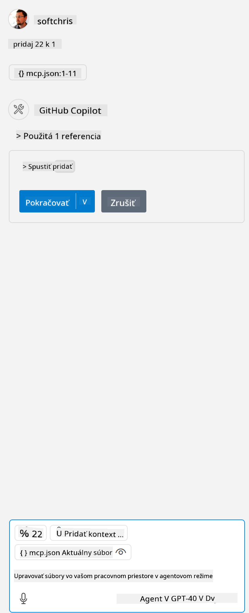

<!--
CO_OP_TRANSLATOR_METADATA:
{
  "original_hash": "c37fabfbc0dcbc9a4afb6d17e7d3be9f",
  "translation_date": "2025-05-17T11:15:12+00:00",
  "source_file": "03-GettingStarted/04-vscode/README.md",
  "language_code": "sk"
}
-->
Poďme sa v nasledujúcich častiach podrobnejšie pozrieť na to, ako používame vizuálne rozhranie.

## Prístup

Tu je, ako by sme mali pristupovať k tomuto procesu na vysokej úrovni:

- Nakonfigurovať súbor na nájdenie nášho MCP Servera.
- Spustiť/Pripojiť sa k danému serveru, aby sme videli zoznam jeho schopností.
- Využiť tieto schopnosti prostredníctvom chatového rozhrania GitHub Copilot.

Skvelé, teraz keď rozumieme tomuto procesu, poďme skúsiť použiť MCP Server prostredníctvom Visual Studio Code pomocou cvičenia.

## Cvičenie: Spotreba servera

V tomto cvičení nakonfigurujeme Visual Studio Code tak, aby našlo váš MCP server, aby ho bolo možné použiť prostredníctvom chatového rozhrania GitHub Copilot.

### -0- Predkrok, povoliť objavovanie MCP Serverov

Možno budete musieť povoliť objavovanie MCP Serverov.

1. Choďte na `File -> Preferences -> Settings` in Visual Studio Code.

1. Search for "MCP" and enable `chat.mcp.discovery.enabled` v súbore settings.json.

### -1- Vytvoriť konfiguračný súbor

Začnite vytvorením konfiguračného súboru v koreňovom adresári vášho projektu, budete potrebovať súbor s názvom MCP.json a umiestniť ho do priečinka s názvom .vscode. Malo by to vyzerať takto:

```text
.vscode
|-- mcp.json
```

Ďalej sa pozrime, ako môžeme pridať záznam servera.

### -2- Nakonfigurovať server

Pridajte nasledujúci obsah do súboru *mcp.json*:

```json
{
    "inputs": [],
    "servers": {
       "hello-mcp": {
           "command": "cmd",
           "args": [
               "/c", "node", "<absolute path>\\build\\index.js"
           ]
       }
    }
}
```

Tu je jednoduchý príklad, ako spustiť server napísaný v Node.js, pre iné runtime prostredia určte správny príkaz na spustenie servera pomocou `command` and `args`.

### -3- Spustiť server

Teraz, keď ste pridali záznam, poďme spustiť server:

1. Nájdite svoj záznam v *mcp.json* a uistite sa, že nájdete ikonu "play":

    

1. Kliknite na ikonu "play", mali by ste vidieť, že ikona nástrojov v chatovom rozhraní GitHub Copilot zvyšuje počet dostupných nástrojov. Ak kliknete na túto ikonu nástrojov, uvidíte zoznam registrovaných nástrojov. Môžete zaškrtnúť/odškrtnúť každý nástroj v závislosti na tom, či chcete, aby GitHub Copilot ich používal ako kontext:

  

1. Na spustenie nástroja napíšte výzvu, o ktorej viete, že zodpovedá popisu jedného z vašich nástrojov, napríklad výzva ako "pridať 22 k 1":

  

  Mali by ste vidieť odpoveď hovoriacu 23.

## Úloha

Skúste pridať záznam servera do vášho súboru *mcp.json* a uistite sa, že môžete spustiť/zastaviť server. Uistite sa tiež, že môžete komunikovať s nástrojmi na vašom serveri prostredníctvom chatového rozhrania GitHub Copilot.

## Riešenie

[Riešenie](./solution/README.md)

## Kľúčové poznatky

Kľúčové poznatky z tejto kapitoly sú nasledujúce:

- Visual Studio Code je skvelý klient, ktorý vám umožňuje spotrebovať niekoľko MCP Serverov a ich nástroje.
- Chatové rozhranie GitHub Copilot je spôsob, ako komunikovať so servermi.
- Môžete vyzvať používateľa na zadanie vstupov, ako sú API kľúče, ktoré môžu byť odovzdané MCP Serveru pri konfigurácii záznamu servera v súbore *mcp.json*.

## Príklady

- [Java Kalkulačka](../samples/java/calculator/README.md)
- [.Net Kalkulačka](../../../../03-GettingStarted/samples/csharp)
- [JavaScript Kalkulačka](../samples/javascript/README.md)
- [TypeScript Kalkulačka](../samples/typescript/README.md)
- [Python Kalkulačka](../../../../03-GettingStarted/samples/python) 

## Ďalšie zdroje

- [Dokumentácia Visual Studio](https://code.visualstudio.com/docs/copilot/chat/mcp-servers)

## Čo ďalej

- Ďalej: [Vytváranie SSE Servera](/03-GettingStarted/05-sse-server/README.md)

**Upozornenie**:  
Tento dokument bol preložený pomocou AI prekladateľskej služby [Co-op Translator](https://github.com/Azure/co-op-translator). Hoci sa snažíme o presnosť, uvedomte si, že automatizované preklady môžu obsahovať chyby alebo nepresnosti. Pôvodný dokument v jeho pôvodnom jazyku by sa mal považovať za autoritatívny zdroj. Pre kritické informácie sa odporúča profesionálny ľudský preklad. Nie sme zodpovední za žiadne nedorozumenia alebo nesprávne interpretácie vyplývajúce z použitia tohto prekladu.