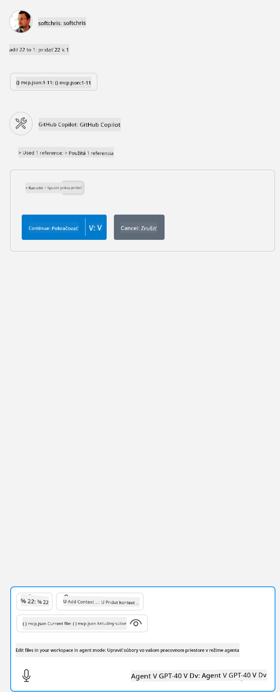

<!--
CO_OP_TRANSLATOR_METADATA:
{
  "original_hash": "5ef8f5821c1a04f7b1fc4f15098ecab8",
  "translation_date": "2025-07-13T19:45:44+00:00",
  "source_file": "03-GettingStarted/04-vscode/solution/README.md",
  "language_code": "sk"
}
-->
To zodpovedá spusteniu príkazu ako `node build/index.js`.

- Zmeňte tento záznam servera tak, aby ukazoval na absolútnu cestu k vášmu serveru vrátane potrebného úplného príkazu na spustenie.

## Použitie funkcií na serveri

- Kliknite na ikonu `play`, keď pridáte *mcp.json* do priečinka *./vscode*,

    Sledujte, ako sa ikona nástrojov zmení a zvýši počet dostupných nástrojov. Ikona nástrojov sa nachádza priamo nad chatovacím poľom v GitHub Copilot.

## Spustenie nástroja

- Napíšte do chatovacieho okna príkaz, ktorý zodpovedá popisu vášho nástroja. Napríklad na spustenie nástroja `add` napíšte niečo ako "add 3 to 20".

    Mali by ste vidieť, že sa nad textovým poľom chatu zobrazí nástroj, ktorý môžete vybrať na spustenie, ako je to znázornené na tomto obrázku:

    

    Výber nástroja by mal vrátiť číselný výsledok "23", ak bol váš príkaz ako sme uviedli vyššie.

**Vyhlásenie o zodpovednosti**:  
Tento dokument bol preložený pomocou AI prekladateľskej služby [Co-op Translator](https://github.com/Azure/co-op-translator). Hoci sa snažíme o presnosť, prosím, majte na pamäti, že automatizované preklady môžu obsahovať chyby alebo nepresnosti. Originálny dokument v jeho pôvodnom jazyku by mal byť považovaný za autoritatívny zdroj. Pre kritické informácie sa odporúča profesionálny ľudský preklad. Nie sme zodpovední za akékoľvek nedorozumenia alebo nesprávne interpretácie vyplývajúce z použitia tohto prekladu.