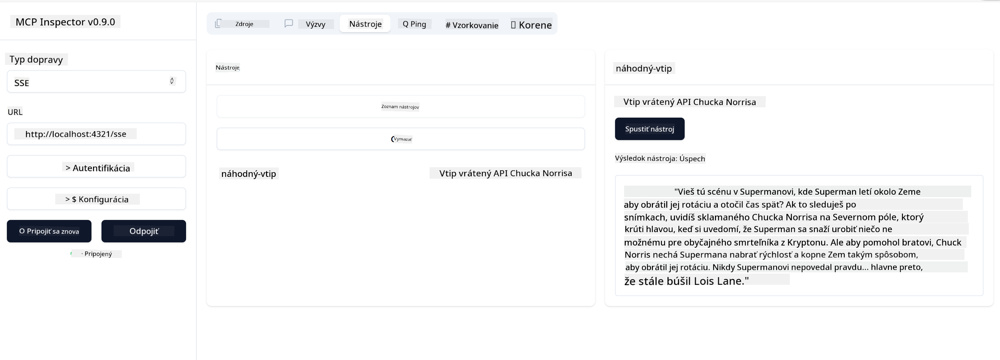

<!--
CO_OP_TRANSLATOR_METADATA:
{
  "original_hash": "0a8086dc4bf89448f83e7936db972c42",
  "translation_date": "2025-05-17T11:42:57+00:00",
  "source_file": "03-GettingStarted/05-sse-server/README.md",
  "language_code": "sk"
}
-->
Teraz, keď vieme o SSE trochu viac, poďme si vytvoriť SSE server.

## Cvičenie: Vytvorenie SSE servera

Pri vytváraní nášho servera musíme mať na pamäti dve veci:

- Musíme použiť webový server na sprístupnenie koncových bodov pre pripojenie a správy.
- Vytvorte náš server tak, ako to bežne robíme s nástrojmi, zdrojmi a výzvami, keď sme používali stdio.

### -1- Vytvorte inštanciu servera

Na vytvorenie nášho servera používame rovnaké typy ako so stdio. Avšak pre transport musíme zvoliť SSE.

Poďme pridať potrebné trasy ďalej.

### -2- Pridajte trasy

Poďme pridať trasy, ktoré spracovávajú pripojenie a prichádzajúce správy:

Poďme pridať schopnosti servera ďalej.

### -3- Pridanie schopností servera

Teraz, keď máme všetko špecifické pre SSE definované, pridajme schopnosti servera ako nástroje, výzvy a zdroje.

Váš kompletný kód by mal vyzerať takto:

Skvelé, máme server používajúci SSE, poďme ho vyskúšať ďalej.

## Cvičenie: Ladenie SSE servera pomocou Inspectoru

Inspector je skvelý nástroj, ktorý sme videli v predchádzajúcej lekcii [Vytvorenie vášho prvého servera](/03-GettingStarted/01-first-server/README.md). Pozrime sa, či môžeme použiť Inspector aj tu:

### -1- Spustenie inspectoru

Aby ste spustili inspector, musíte mať najprv spustený SSE server, takže to urobme ďalej:

1. Spustite server

1. Spustite inspector

    > ![NOTE]
    > Spustite to v samostatnom terminálovom okne, než v ktorom beží server. Tiež si všimnite, že potrebujete upraviť nižšie uvedený príkaz, aby zodpovedal URL, kde beží váš server.

    ```sh
    npx @modelcontextprotocol/inspector --cli http://localhost:8000/sse --method tools/list
    ```

    Spustenie inspectoru vyzerá rovnako vo všetkých runtime prostrediach. Všimnite si, ako namiesto cesty k nášmu serveru a príkazu na spustenie servera namiesto toho zadávame URL, kde server beží, a tiež špecifikujeme trasu `/sse`.

### -2- Vyskúšanie nástroja

Pripojte server výberom SSE v rozbaľovacom zozname a vyplňte pole url, kde váš server beží, napríklad http:localhost:4321/sse. Teraz kliknite na tlačidlo "Connect". Ako predtým, vyberte zoznam nástrojov, vyberte nástroj a zadajte vstupné hodnoty. Mali by ste vidieť výsledok ako nižšie:



Skvelé, môžete pracovať s inspectorom, pozrime sa, ako môžeme pracovať s Visual Studio Code ďalej.

## Zadanie

Skúste rozšíriť svoj server o ďalšie schopnosti. Pozrite si [túto stránku](https://api.chucknorris.io/), aby ste napríklad pridali nástroj, ktorý volá API, rozhodnite sa, ako by mal server vyzerať. Bavte sa :)

## Riešenie

[Riešenie](./solution/README.md) Tu je možné riešenie s funkčným kódom.

## Kľúčové poznatky

Kľúčové poznatky z tejto kapitoly sú nasledovné:

- SSE je druhý podporovaný transport vedľa stdio.
- Na podporu SSE musíte spravovať prichádzajúce pripojenia a správy pomocou webového rámca.
- Môžete použiť ako Inspector, tak Visual Studio Code na spotrebu SSE servera, rovnako ako stdio servery. Všimnite si, ako sa to trochu líši medzi stdio a SSE. Pre SSE potrebujete spustiť server samostatne a potom spustiť váš inspector nástroj. Pre inspector nástroj sú tiež nejaké rozdiely v tom, že musíte špecifikovať URL.

## Príklady

- [Java Kalkulačka](../samples/java/calculator/README.md)
- [.Net Kalkulačka](../../../../03-GettingStarted/samples/csharp)
- [JavaScript Kalkulačka](../samples/javascript/README.md)
- [TypeScript Kalkulačka](../samples/typescript/README.md)
- [Python Kalkulačka](../../../../03-GettingStarted/samples/python)

## Ďalšie zdroje

- [SSE](https://developer.mozilla.org/en-US/docs/Web/API/Server-sent_events)

## Čo ďalej

- Ďalej: [Začíname s AI Toolkit pre VSCode](/03-GettingStarted/06-aitk/README.md)

**Upozornenie**:  
Tento dokument bol preložený pomocou AI prekladovej služby [Co-op Translator](https://github.com/Azure/co-op-translator). Hoci sa snažíme o presnosť, prosím, uvedomte si, že automatizované preklady môžu obsahovať chyby alebo nepresnosti. Pôvodný dokument v jeho rodnom jazyku by mal byť považovaný za autoritatívny zdroj. Pre kritické informácie sa odporúča profesionálny ľudský preklad. Nie sme zodpovední za žiadne nedorozumenia alebo nesprávne interpretácie vzniknuté použitím tohto prekladu.