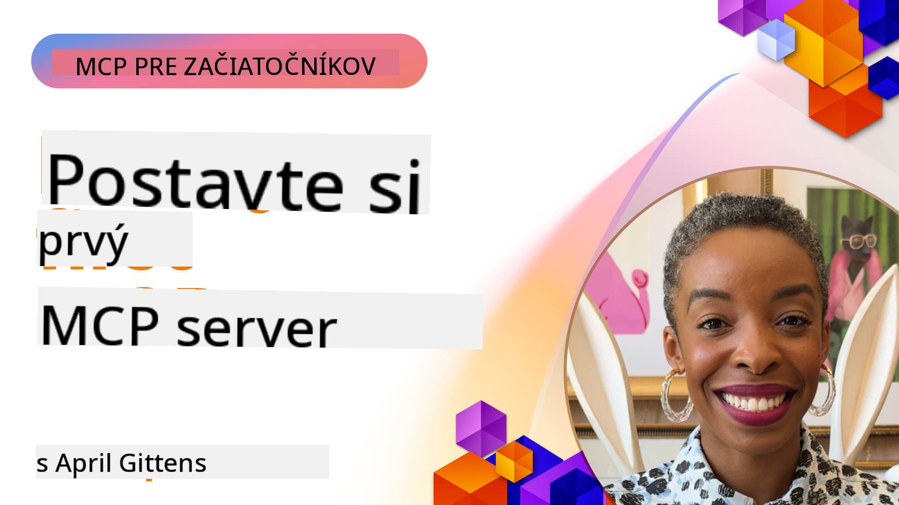

<!--
CO_OP_TRANSLATOR_METADATA:
{
  "original_hash": "1197b6dbde36773e04a5ae826557fdb9",
  "translation_date": "2025-08-26T18:15:42+00:00",
  "source_file": "03-GettingStarted/README.md",
  "language_code": "sk"
}
-->
## Začíname  

_(Kliknite na obrázok vyššie pre zobrazenie videa tejto lekcie)_

Táto sekcia pozostáva z niekoľkých lekcií:

- **1 Váš prvý server**, v tejto prvej lekcii sa naučíte, ako vytvoriť svoj prvý server a skontrolovať ho pomocou nástroja inspector, čo je cenný spôsob testovania a ladenia vášho servera, [na lekciu](01-first-server/README.md)

- **2 Klient**, v tejto lekcii sa naučíte, ako napísať klienta, ktorý sa dokáže pripojiť k vášmu serveru, [na lekciu](02-client/README.md)

- **3 Klient s LLM**, ešte lepší spôsob, ako napísať klienta, je pridať do neho LLM, aby mohol "rokovať" s vaším serverom o tom, čo má robiť, [na lekciu](03-llm-client/README.md)

- **4 Používanie servera GitHub Copilot Agent v režime Visual Studio Code**. Tu sa pozrieme na spustenie nášho MCP servera priamo vo Visual Studio Code, [na lekciu](04-vscode/README.md)

- **5 stdio Transport Server** stdio transport je odporúčaný štandard pre komunikáciu medzi MCP serverom a klientom v aktuálnej špecifikácii, poskytujúci bezpečnú komunikáciu založenú na podprocesoch [na lekciu](05-stdio-server/README.md)

- **6 HTTP Streaming s MCP (Streamable HTTP)**. Naučte sa o modernom HTTP streamingu, notifikáciách o priebehu a o tom, ako implementovať škálovateľné, real-time MCP servery a klientov pomocou Streamable HTTP. [na lekciu](06-http-streaming/README.md)

- **7 Využitie AI Toolkit pre VSCode** na spotrebovanie a testovanie vašich MCP klientov a serverov [na lekciu](07-aitk/README.md)

- **8 Testovanie**. Tu sa zameriame najmä na to, ako môžeme testovať náš server a klienta rôznymi spôsobmi, [na lekciu](08-testing/README.md)

- **9 Nasadenie**. Táto kapitola sa zaoberá rôznymi spôsobmi nasadenia vašich MCP riešení, [na lekciu](09-deployment/README.md)

Model Context Protocol (MCP) je otvorený protokol, ktorý štandardizuje, ako aplikácie poskytujú kontext LLM. Predstavte si MCP ako USB-C port pre AI aplikácie - poskytuje štandardizovaný spôsob pripojenia AI modelov k rôznym zdrojom dát a nástrojom.

## Ciele učenia

Na konci tejto lekcie budete schopní:

- Nastaviť vývojové prostredia pre MCP v jazykoch C#, Java, Python, TypeScript a JavaScript
- Vytvoriť a nasadiť základné MCP servery s vlastnými funkciami (zdroje, prompty a nástroje)
- Vytvoriť hostiteľské aplikácie, ktoré sa pripájajú k MCP serverom
- Testovať a ladiť implementácie MCP
- Pochopiť bežné problémy pri nastavovaní a ich riešenia
- Pripojiť vaše MCP implementácie k populárnym LLM službám

## Nastavenie vášho MCP prostredia

Predtým, než začnete pracovať s MCP, je dôležité pripraviť si vývojové prostredie a pochopiť základný pracovný postup. Táto sekcia vás prevedie počiatočnými krokmi nastavenia, aby ste mohli s MCP začať hladko.

### Predpoklady

Predtým, než sa pustíte do vývoja MCP, uistite sa, že máte:

- **Vývojové prostredie**: Pre váš zvolený jazyk (C#, Java, Python, TypeScript alebo JavaScript)
- **IDE/Editor**: Visual Studio, Visual Studio Code, IntelliJ, Eclipse, PyCharm alebo akýkoľvek moderný editor kódu
- **Správcov balíčkov**: NuGet, Maven/Gradle, pip alebo npm/yarn
- **API kľúče**: Pre akékoľvek AI služby, ktoré plánujete použiť vo vašich hostiteľských aplikáciách

### Oficiálne SDK

V nasledujúcich kapitolách uvidíte riešenia postavené pomocou Pythonu, TypeScriptu, Javy a .NET. Tu sú všetky oficiálne podporované SDK.

MCP poskytuje oficiálne SDK pre viaceré jazyky:
- [C# SDK](https://github.com/modelcontextprotocol/csharp-sdk) - Udržiavané v spolupráci s Microsoftom
- [Java SDK](https://github.com/modelcontextprotocol/java-sdk) - Udržiavané v spolupráci so Spring AI
- [TypeScript SDK](https://github.com/modelcontextprotocol/typescript-sdk) - Oficiálna implementácia pre TypeScript
- [Python SDK](https://github.com/modelcontextprotocol/python-sdk) - Oficiálna implementácia pre Python
- [Kotlin SDK](https://github.com/modelcontextprotocol/kotlin-sdk) - Oficiálna implementácia pre Kotlin
- [Swift SDK](https://github.com/modelcontextprotocol/swift-sdk) - Udržiavané v spolupráci s Loopwork AI
- [Rust SDK](https://github.com/modelcontextprotocol/rust-sdk) - Oficiálna implementácia pre Rust

## Kľúčové poznatky

- Nastavenie vývojového prostredia MCP je jednoduché s jazykovo špecifickými SDK
- Budovanie MCP serverov zahŕňa vytváranie a registráciu nástrojov s jasnými schémami
- MCP klienti sa pripájajú k serverom a modelom, aby využili rozšírené schopnosti
- Testovanie a ladenie sú nevyhnutné pre spoľahlivé implementácie MCP
- Možnosti nasadenia siahajú od lokálneho vývoja po cloudové riešenia

## Precvičovanie

Máme sadu ukážok, ktoré dopĺňajú cvičenia, ktoré uvidíte vo všetkých kapitolách tejto sekcie. Okrem toho má každá kapitola aj svoje vlastné cvičenia a úlohy.

- [Java Kalkulačka](./samples/java/calculator/README.md)
- [.Net Kalkulačka](../../../03-GettingStarted/samples/csharp)
- [JavaScript Kalkulačka](./samples/javascript/README.md)
- [TypeScript Kalkulačka](./samples/typescript/README.md)
- [Python Kalkulačka](../../../03-GettingStarted/samples/python)

## Ďalšie zdroje

- [Budovanie agentov pomocou Model Context Protocol na Azure](https://learn.microsoft.com/azure/developer/ai/intro-agents-mcp)
- [Vzdialený MCP s Azure Container Apps (Node.js/TypeScript/JavaScript)](https://learn.microsoft.com/samples/azure-samples/mcp-container-ts/mcp-container-ts/)
- [.NET OpenAI MCP Agent](https://learn.microsoft.com/samples/azure-samples/openai-mcp-agent-dotnet/openai-mcp-agent-dotnet/)

## Čo ďalej

Ďalej: [Vytvorenie vášho prvého MCP servera](01-first-server/README.md)

---

**Upozornenie**:  
Tento dokument bol preložený pomocou služby AI prekladu [Co-op Translator](https://github.com/Azure/co-op-translator). Aj keď sa snažíme o presnosť, prosím, berte na vedomie, že automatizované preklady môžu obsahovať chyby alebo nepresnosti. Pôvodný dokument v jeho pôvodnom jazyku by mal byť považovaný za autoritatívny zdroj. Pre kritické informácie sa odporúča profesionálny ľudský preklad. Nie sme zodpovední za akékoľvek nedorozumenia alebo nesprávne interpretácie vyplývajúce z použitia tohto prekladu.