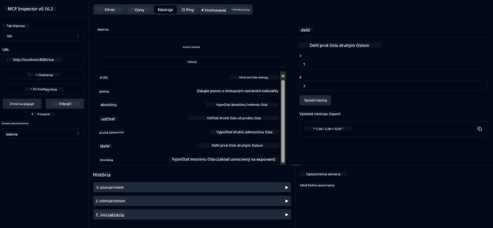

<!--
CO_OP_TRANSLATOR_METADATA:
{
  "original_hash": "13231e9951b68efd9df8c56bd5cdb27e",
  "translation_date": "2025-07-13T22:30:53+00:00",
  "source_file": "03-GettingStarted/samples/java/calculator/README.md",
  "language_code": "sk"
}
-->
# Basic Calculator MCP Service

Táto služba poskytuje základné kalkulačné operácie cez Model Context Protocol (MCP) pomocou Spring Boot s WebFlux transportom. Je navrhnutá ako jednoduchý príklad pre začiatočníkov, ktorí sa učia o implementáciách MCP.

Pre viac informácií si pozrite referenčnú dokumentáciu [MCP Server Boot Starter](https://docs.spring.io/spring-ai/reference/api/mcp/mcp-server-boot-starter-docs.html).

## Prehľad

Služba ukazuje:
- Podporu SSE (Server-Sent Events)
- Automatickú registráciu nástrojov pomocou anotácie `@Tool` zo Spring AI
- Základné kalkulačné funkcie:
  - Sčítanie, odčítanie, násobenie, delenie
  - Výpočet mocniny a druhá odmocnina
  - Modulo (zvyšok po delení) a absolútna hodnota
  - Pomocná funkcia s popisom operácií

## Funkcie

Táto kalkulačná služba ponúka nasledujúce možnosti:

1. **Základné aritmetické operácie**:
   - Sčítanie dvoch čísel
   - Odčítanie jedného čísla od druhého
   - Násobenie dvoch čísel
   - Delenie jedného čísla druhým (s kontrolou delenia nulou)

2. **Pokročilé operácie**:
   - Výpočet mocniny (základ na exponent)
   - Výpočet druhej odmocniny (s kontrolou záporného čísla)
   - Výpočet zvyšku po delení (modulo)
   - Výpočet absolútnej hodnoty

3. **Systém pomoci**:
   - Vstavaná pomocná funkcia vysvetľujúca všetky dostupné operácie

## Použitie služby

Služba sprístupňuje nasledujúce API endpointy cez MCP protokol:

- `add(a, b)`: Sčíta dve čísla
- `subtract(a, b)`: Odčíta druhé číslo od prvého
- `multiply(a, b)`: Vynásobí dve čísla
- `divide(a, b)`: Vydelí prvé číslo druhým (s kontrolou delenia nulou)
- `power(base, exponent)`: Vypočíta mocninu čísla
- `squareRoot(number)`: Vypočíta druhú odmocninu (s kontrolou záporného čísla)
- `modulus(a, b)`: Vypočíta zvyšok po delení
- `absolute(number)`: Vypočíta absolútnu hodnotu
- `help()`: Získa informácie o dostupných operáciách

## Testovací klient

Jednoduchý testovací klient je zahrnutý v balíku `com.microsoft.mcp.sample.client`. Trieda `SampleCalculatorClient` demonštruje dostupné operácie kalkulačnej služby.

## Použitie LangChain4j klienta

Projekt obsahuje príklad LangChain4j klienta v `com.microsoft.mcp.sample.client.LangChain4jClient`, ktorý ukazuje, ako integrovať kalkulačnú službu s LangChain4j a GitHub modelmi:

### Predpoklady

1. **Nastavenie GitHub tokenu**:
   
   Pre použitie AI modelov GitHubu (napr. phi-4) potrebujete osobný prístupový token GitHub:

   a. Prejdite do nastavení svojho GitHub účtu: https://github.com/settings/tokens
   
   b. Kliknite na "Generate new token" → "Generate new token (classic)"
   
   c. Pomenujte token popisným názvom
   
   d. Vyberte nasledujúce oprávnenia:
      - `repo` (plná kontrola nad súkromnými repozitármi)
      - `read:org` (čítanie členstva v organizáciách a tímoch, čítanie projektov organizácie)
      - `gist` (vytváranie gistov)
      - `user:email` (prístup k emailovým adresám používateľa (len na čítanie))
   
   e. Kliknite na "Generate token" a skopírujte nový token
   
   f. Nastavte ho ako premennú prostredia:
      
      Na Windows:
      ```
      set GITHUB_TOKEN=your-github-token
      ```
      
      Na macOS/Linux:
      ```bash
      export GITHUB_TOKEN=your-github-token
      ```

   g. Pre trvalé nastavenie pridajte token do systémových premenných prostredia

2. Pridajte závislosť LangChain4j GitHub do svojho projektu (už zahrnuté v pom.xml):
   ```xml
   <dependency>
       <groupId>dev.langchain4j</groupId>
       <artifactId>langchain4j-github</artifactId>
       <version>${langchain4j.version}</version>
   </dependency>
   ```

3. Uistite sa, že kalkulačný server beží na `localhost:8080`

### Spustenie LangChain4j klienta

Tento príklad demonštruje:
- Pripojenie k MCP serveru kalkulačky cez SSE transport
- Použitie LangChain4j na vytvorenie chatbota, ktorý využíva kalkulačné operácie
- Integráciu s GitHub AI modelmi (aktuálne model phi-4)

Klient posiela nasledujúce ukážkové dotazy na demonštráciu funkčnosti:
1. Výpočet súčtu dvoch čísel
2. Výpočet druhej odmocniny čísla
3. Získanie informácií o dostupných kalkulačných operáciách

Spustite príklad a sledujte výstup v konzole, aby ste videli, ako AI model využíva kalkulačné nástroje na odpovede.

### Konfigurácia GitHub modelu

LangChain4j klient je nastavený na použitie GitHub modelu phi-4 s nasledujúcimi parametrami:

```java
ChatLanguageModel model = GitHubChatModel.builder()
    .apiKey(System.getenv("GITHUB_TOKEN"))
    .timeout(Duration.ofSeconds(60))
    .modelName("phi-4")
    .logRequests(true)
    .logResponses(true)
    .build();
```

Pre použitie iných GitHub modelov jednoducho zmeňte parameter `modelName` na iný podporovaný model (napr. "claude-3-haiku-20240307", "llama-3-70b-8192" a pod.).

## Závislosti

Projekt vyžaduje nasledujúce kľúčové závislosti:

```xml
<!-- For MCP Server -->
<dependency>
    <groupId>org.springframework.ai</groupId>
    <artifactId>spring-ai-starter-mcp-server-webflux</artifactId>
</dependency>

<!-- For LangChain4j integration -->
<dependency>
    <groupId>dev.langchain4j</groupId>
    <artifactId>langchain4j-mcp</artifactId>
    <version>${langchain4j.version}</version>
</dependency>

<!-- For GitHub models support -->
<dependency>
    <groupId>dev.langchain4j</groupId>
    <artifactId>langchain4j-github</artifactId>
    <version>${langchain4j.version}</version>
</dependency>
```

## Kompilácia projektu

Projekt zostavte pomocou Maven:
```bash
./mvnw clean install -DskipTests
```

## Spustenie servera

### Použitie Java

```bash
java -jar target/calculator-server-0.0.1-SNAPSHOT.jar
```

### Použitie MCP Inspector

MCP Inspector je užitočný nástroj na interakciu so službami MCP. Pre použitie s touto kalkulačnou službou:

1. **Nainštalujte a spustite MCP Inspector** v novom terminálovom okne:
   ```bash
   npx @modelcontextprotocol/inspector
   ```

2. **Pristúpte k webovému rozhraniu** kliknutím na URL zobrazenú aplikáciou (zvyčajne http://localhost:6274)

3. **Nakonfigurujte pripojenie**:
   - Nastavte typ transportu na "SSE"
   - Nastavte URL na SSE endpoint bežiaceho servera: `http://localhost:8080/sse`
   - Kliknite na "Connect"

4. **Používajte nástroje**:
   - Kliknite na "List Tools" pre zobrazenie dostupných kalkulačných operácií
   - Vyberte nástroj a kliknite na "Run Tool" pre vykonanie operácie



### Použitie Dockeru

Projekt obsahuje Dockerfile pre nasadenie v kontajneri:

1. **Vytvorte Docker image**:
   ```bash
   docker build -t calculator-mcp-service .
   ```

2. **Spustite Docker kontajner**:
   ```bash
   docker run -p 8080:8080 calculator-mcp-service
   ```

Týmto sa:
- Vytvorí multi-stage Docker image s Maven 3.9.9 a Eclipse Temurin 24 JDK
- Vytvorí optimalizovaný kontajnerový image
- Otvorí port 8080 pre službu
- Spustí MCP kalkulačnú službu v kontajneri

Po spustení kontajnera môžete službu používať na `http://localhost:8080`.

## Riešenie problémov

### Bežné problémy s GitHub tokenom

1. **Problémy s oprávneniami tokenu**: Ak dostanete chybu 403 Forbidden, skontrolujte, či má token správne oprávnenia podľa predpokladov.

2. **Token nenájdený**: Ak sa zobrazí chyba "No API key found", uistite sa, že premenná prostredia GITHUB_TOKEN je správne nastavená.

3. **Obmedzenie počtu požiadaviek (rate limiting)**: GitHub API má limity na počet požiadaviek. Ak narazíte na chybu limitu (status kód 429), počkajte niekoľko minút a skúste to znova.

4. **Vypršanie platnosti tokenu**: GitHub tokeny môžu expirovať. Ak po čase dostávate chyby autentifikácie, vygenerujte nový token a aktualizujte premennú prostredia.

Ak potrebujete ďalšiu pomoc, pozrite si [LangChain4j dokumentáciu](https://github.com/langchain4j/langchain4j) alebo [GitHub API dokumentáciu](https://docs.github.com/en/rest).

**Vyhlásenie o zodpovednosti**:  
Tento dokument bol preložený pomocou AI prekladateľskej služby [Co-op Translator](https://github.com/Azure/co-op-translator). Hoci sa snažíme o presnosť, prosím, majte na pamäti, že automatizované preklady môžu obsahovať chyby alebo nepresnosti. Originálny dokument v jeho pôvodnom jazyku by mal byť považovaný za autoritatívny zdroj. Pre kritické informácie sa odporúča profesionálny ľudský preklad. Nie sme zodpovední za akékoľvek nedorozumenia alebo nesprávne interpretácie vyplývajúce z použitia tohto prekladu.