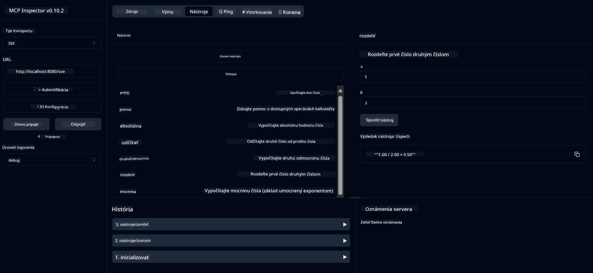

<!--
CO_OP_TRANSLATOR_METADATA:
{
  "original_hash": "13231e9951b68efd9df8c56bd5cdb27e",
  "translation_date": "2025-05-17T13:17:26+00:00",
  "source_file": "03-GettingStarted/samples/java/calculator/README.md",
  "language_code": "sk"
}
-->
# Základná kalkulačka MCP služba

Táto služba poskytuje základné kalkulačné operácie prostredníctvom Model Context Protocol (MCP) s použitím Spring Boot s WebFlux transportom. Je navrhnutá ako jednoduchý príklad pre začiatočníkov, ktorí sa učia o implementáciách MCP.

Pre viac informácií si pozrite referenčnú dokumentáciu [MCP Server Boot Starter](https://docs.spring.io/spring-ai/reference/api/mcp/mcp-server-boot-starter-docs.html).

## Prehľad

Služba predstavuje:
- Podporu pre SSE (Server-Sent Events)
- Automatickú registráciu nástrojov pomocou `@Tool` anotácie zo Spring AI
- Základné kalkulačné funkcie:
  - Sčítanie, odčítanie, násobenie, delenie
  - Výpočet mocniny a odmocniny
  - Modulus (zvyšok) a absolútna hodnota
  - Pomocná funkcia pre popis operácií

## Funkcie

Táto kalkulačná služba ponúka nasledujúce možnosti:

1. **Základné aritmetické operácie**:
   - Sčítanie dvoch čísel
   - Odčítanie jedného čísla od druhého
   - Násobenie dvoch čísel
   - Delenie jedného čísla druhým (s kontrolou delenia nulou)

2. **Pokročilé operácie**:
   - Výpočet mocniny (základ na exponent)
   - Výpočet odmocniny (s kontrolou záporného čísla)
   - Výpočet modulu (zvyšok)
   - Výpočet absolútnej hodnoty

3. **Systém pomoci**:
   - Vstavaná pomocná funkcia vysvetľujúca všetky dostupné operácie

## Používanie služby

Služba sprístupňuje nasledujúce API endpointy prostredníctvom MCP protokolu:

- `add(a, b)`: Sčítanie dvoch čísel
- `subtract(a, b)`: Odčítanie druhého čísla od prvého
- `multiply(a, b)`: Násobenie dvoch čísel
- `divide(a, b)`: Delenie prvého čísla druhým (s kontrolou nulou)
- `power(base, exponent)`: Výpočet mocniny čísla
- `squareRoot(number)`: Výpočet odmocniny (s kontrolou záporného čísla)
- `modulus(a, b)`: Výpočet zvyšku pri delení
- `absolute(number)`: Výpočet absolútnej hodnoty
- `help()`: Získanie informácií o dostupných operáciách

## Testovací klient

Jednoduchý testovací klient je zahrnutý v `com.microsoft.mcp.sample.client` balíčku. `SampleCalculatorClient` trieda demonštruje dostupné operácie kalkulačnej služby.

## Používanie LangChain4j klienta

Projekt obsahuje príklad klienta LangChain4j v `com.microsoft.mcp.sample.client.LangChain4jClient`, ktorý demonštruje, ako integrovať kalkulačnú službu s LangChain4j a GitHub modelmi:

### Predpoklady

1. **Nastavenie GitHub tokenu**:
   
   Na používanie AI modelov GitHubu (ako phi-4) potrebujete osobný prístupový token GitHubu:

   a. Choďte do nastavení svojho GitHub účtu: https://github.com/settings/tokens
   
   b. Kliknite na "Generate new token" → "Generate new token (classic)"
   
   c. Dajte svojmu tokenu popisný názov
   
   d. Vyberte nasledujúce rozsahy:
      - `repo` (Plná kontrola nad súkromnými repozitármi)
      - `read:org` (Čítanie členstva v organizácii a tíme, čítanie projektov organizácie)
      - `gist` (Vytváranie gistov)
      - `user:email` (Prístup k emailovým adresám používateľa (len na čítanie))
   
   e. Kliknite na "Generate token" a skopírujte svoj nový token
   
   f. Nastavte ho ako premennú prostredia:
      
      Na Windows:
      ```
      set GITHUB_TOKEN=your-github-token
      ```
      
      Na macOS/Linux:
      ```bash
      export GITHUB_TOKEN=your-github-token
      ```

   g. Pre trvalé nastavenie pridajte ho do svojich premenných prostredia cez systémové nastavenia

2. Pridajte LangChain4j GitHub závislosť do svojho projektu (už zahrnuté v pom.xml):
   ```xml
   <dependency>
       <groupId>dev.langchain4j</groupId>
       <artifactId>langchain4j-github</artifactId>
       <version>${langchain4j.version}</version>
   </dependency>
   ```

3. Uistite sa, že kalkulačný server beží na `localhost:8080`

### Spustenie LangChain4j klienta

Tento príklad demonštruje:
- Pripojenie k kalkulačnému MCP serveru cez SSE transport
- Používanie LangChain4j na vytvorenie chat bota, ktorý využíva kalkulačné operácie
- Integráciu s GitHub AI modelmi (teraz používajúci phi-4 model)

Klient posiela nasledujúce ukážkové dotazy na demonštráciu funkčnosti:
1. Výpočet súčtu dvoch čísel
2. Nájdete odmocninu čísla
3. Získanie informácií o dostupných kalkulačných operáciách

Spustite príklad a skontrolujte výstup na konzole, aby ste videli, ako AI model používa kalkulačné nástroje na odpovedanie na dotazy.

### Konfigurácia GitHub modelu

LangChain4j klient je nakonfigurovaný na používanie GitHub phi-4 modelu s nasledujúcimi nastaveniami:

```java
ChatLanguageModel model = GitHubChatModel.builder()
    .apiKey(System.getenv("GITHUB_TOKEN"))
    .timeout(Duration.ofSeconds(60))
    .modelName("phi-4")
    .logRequests(true)
    .logResponses(true)
    .build();
```

Ak chcete používať rôzne GitHub modely, jednoducho zmeňte parameter `modelName` na iný podporovaný model (napr. "claude-3-haiku-20240307", "llama-3-70b-8192", atď.).

## Závislosti

Projekt vyžaduje nasledujúce kľúčové závislosti:

```xml
<!-- For MCP Server -->
<dependency>
    <groupId>org.springframework.ai</groupId>
    <artifactId>spring-ai-starter-mcp-server-webflux</artifactId>
</dependency>

<!-- For LangChain4j integration -->
<dependency>
    <groupId>dev.langchain4j</groupId>
    <artifactId>langchain4j-mcp</artifactId>
    <version>${langchain4j.version}</version>
</dependency>

<!-- For GitHub models support -->
<dependency>
    <groupId>dev.langchain4j</groupId>
    <artifactId>langchain4j-github</artifactId>
    <version>${langchain4j.version}</version>
</dependency>
```

## Stavba projektu

Postavte projekt pomocou Maven:
```bash
./mvnw clean install -DskipTests
```

## Spustenie servera

### Používanie Java

```bash
java -jar target/calculator-server-0.0.1-SNAPSHOT.jar
```

### Používanie MCP Inspector

MCP Inspector je užitočný nástroj pre interakciu s MCP službami. Aby ste ho použili s touto kalkulačnou službou:

1. **Inštalujte a spustite MCP Inspector** v novom terminálovom okne:
   ```bash
   npx @modelcontextprotocol/inspector
   ```

2. **Prístup k webovému rozhraniu** kliknutím na URL zobrazenú aplikáciou (typicky http://localhost:6274)

3. **Konfigurujte pripojenie**:
   - Nastavte typ transportu na "SSE"
   - Nastavte URL na SSE endpoint vášho bežiaceho servera: `http://localhost:8080/sse`
   - Kliknite na "Connect"

4. **Používanie nástrojov**:
   - Kliknite na "List Tools" pre zobrazenie dostupných kalkulačných operácií
   - Vyberte nástroj a kliknite na "Run Tool" pre vykonanie operácie



### Používanie Dockeru

Projekt obsahuje Dockerfile pre kontajnerizované nasadenie:

1. **Vytvorte Docker obraz**:
   ```bash
   docker build -t calculator-mcp-service .
   ```

2. **Spustite Docker kontajner**:
   ```bash
   docker run -p 8080:8080 calculator-mcp-service
   ```

Toto:
- Vytvorí multi-stage Docker obraz s Maven 3.9.9 a Eclipse Temurin 24 JDK
- Vytvorí optimalizovaný kontajnerový obraz
- Sprístupní službu na porte 8080
- Spustí MCP kalkulačnú službu vnútri kontajnera

Keď kontajner beží, môžete službu prístupovať na `http://localhost:8080`.

## Riešenie problémov

### Bežné problémy s GitHub tokenom

1. **Problémy s povoleniami tokenu**: Ak dostanete 403 Forbidden chybu, skontrolujte, či váš token má správne povolenia, ako je uvedené v predpokladoch.

2. **Token nenájdený**: Ak dostanete chybu "No API key found", uistite sa, že premenná prostredia GITHUB_TOKEN je správne nastavená.

3. **Obmedzenie rýchlosti**: GitHub API má obmedzenia rýchlosti. Ak narazíte na chybu obmedzenia rýchlosti (status code 429), počkajte niekoľko minút pred opätovným pokusom.

4. **Vypršanie tokenu**: GitHub tokeny môžu vypršať. Ak po čase dostávate chyby autentifikácie, vygenerujte nový token a aktualizujte svoju premennú prostredia.

Ak potrebujete ďalšiu pomoc, skontrolujte [LangChain4j dokumentáciu](https://github.com/langchain4j/langchain4j) alebo [GitHub API dokumentáciu](https://docs.github.com/en/rest).

**Upozornenie**:  
Tento dokument bol preložený pomocou služby AI prekladu [Co-op Translator](https://github.com/Azure/co-op-translator). Hoci sa snažíme o presnosť, uvedomte si, že automatizované preklady môžu obsahovať chyby alebo nepresnosti. Pôvodný dokument v jeho rodnom jazyku by sa mal považovať za autoritatívny zdroj. Pre kritické informácie sa odporúča profesionálny ľudský preklad. Nezodpovedáme za žiadne nedorozumenia alebo nesprávne interpretácie vyplývajúce z použitia tohto prekladu.