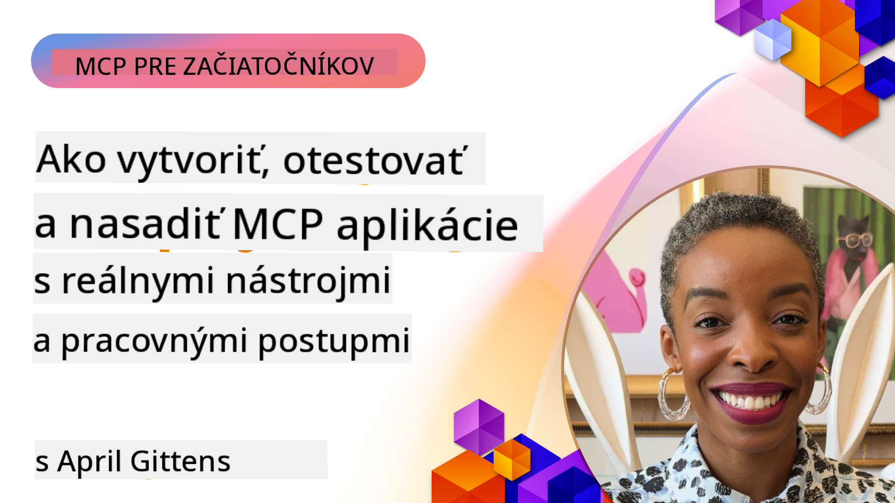
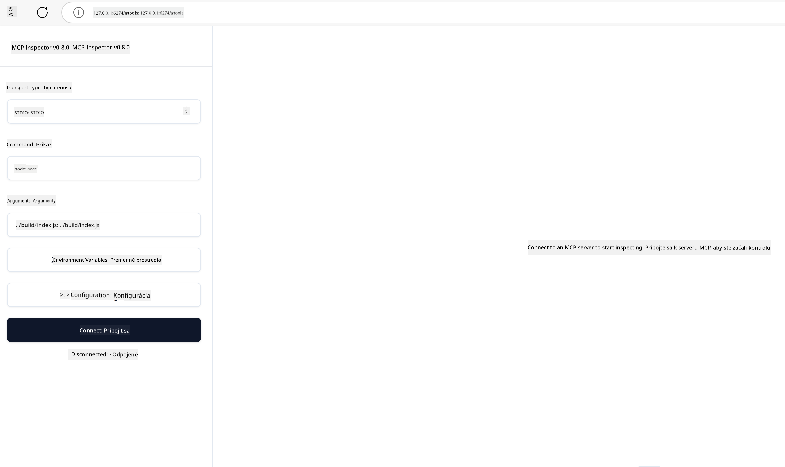

<!--
CO_OP_TRANSLATOR_METADATA:
{
  "original_hash": "83efa75a69bc831277263a6f1ae53669",
  "translation_date": "2025-08-19T15:57:54+00:00",
  "source_file": "04-PracticalImplementation/README.md",
  "language_code": "sk"
}
-->
# Praktická implementácia

[](https://youtu.be/vCN9-mKBDfQ)

_(Kliknite na obrázok vyššie pre zobrazenie videa k tejto lekcii)_

Praktická implementácia je miesto, kde sa sila Model Context Protocol (MCP) stáva hmatateľnou. Zatiaľ čo pochopenie teórie a architektúry MCP je dôležité, skutočná hodnota sa prejaví, keď tieto koncepty aplikujete na vytváranie, testovanie a nasadzovanie riešení, ktoré riešia reálne problémy. Táto kapitola prepojí medzeru medzi konceptuálnymi vedomosťami a praktickým vývojom, pričom vás prevedie procesom oživovania aplikácií založených na MCP.

Či už vyvíjate inteligentných asistentov, integrujete AI do obchodných pracovných postupov alebo vytvárate vlastné nástroje na spracovanie dát, MCP poskytuje flexibilný základ. Jeho jazykovo nezávislý dizajn a oficiálne SDK pre populárne programovacie jazyky ho robia prístupným pre široké spektrum vývojárov. Využitím týchto SDK môžete rýchlo prototypovať, iterovať a škálovať svoje riešenia naprieč rôznymi platformami a prostrediami.

V nasledujúcich sekciách nájdete praktické príklady, ukážkový kód a stratégie nasadzovania, ktoré demonštrujú, ako implementovať MCP v C#, Java so Spring, TypeScript, JavaScript a Python. Naučíte sa tiež, ako debugovať a testovať MCP servery, spravovať API a nasadzovať riešenia do cloudu pomocou Azure. Tieto praktické zdroje sú navrhnuté tak, aby urýchlili vaše učenie a pomohli vám s istotou vytvárať robustné, produkčne pripravené MCP aplikácie.

## Prehľad

Táto lekcia sa zameriava na praktické aspekty implementácie MCP naprieč viacerými programovacími jazykmi. Preskúmame, ako používať MCP SDK v C#, Java so Spring, TypeScript, JavaScript a Python na vytváranie robustných aplikácií, debugovanie a testovanie MCP serverov a vytváranie opakovane použiteľných zdrojov, promptov a nástrojov.

## Ciele učenia

Na konci tejto lekcie budete schopní:

- Implementovať MCP riešenia pomocou oficiálnych SDK v rôznych programovacích jazykoch
- Systematicky debugovať a testovať MCP servery
- Vytvárať a používať funkcie servera (Zdroje, Prompty a Nástroje)
- Navrhovať efektívne MCP pracovné postupy pre komplexné úlohy
- Optimalizovať implementácie MCP pre výkon a spoľahlivosť

## Oficiálne SDK zdroje

Model Context Protocol ponúka oficiálne SDK pre viaceré jazyky:

- [C# SDK](https://github.com/modelcontextprotocol/csharp-sdk)
- [Java so Spring SDK](https://github.com/modelcontextprotocol/java-sdk) **Poznámka:** vyžaduje závislosť na [Project Reactor](https://projectreactor.io). (Pozrite si [diskusiu issue 246](https://github.com/orgs/modelcontextprotocol/discussions/246).)
- [TypeScript SDK](https://github.com/modelcontextprotocol/typescript-sdk)
- [Python SDK](https://github.com/modelcontextprotocol/python-sdk)
- [Kotlin SDK](https://github.com/modelcontextprotocol/kotlin-sdk)

## Práca s MCP SDK

Táto sekcia poskytuje praktické príklady implementácie MCP naprieč viacerými programovacími jazykmi. Ukážkový kód nájdete v adresári `samples` organizovanom podľa jazyka.

### Dostupné ukážky

Repozitár obsahuje [ukážkové implementácie](../../../04-PracticalImplementation/samples) v nasledujúcich jazykoch:

- [C#](./samples/csharp/README.md)
- [Java so Spring](./samples/java/containerapp/README.md)
- [TypeScript](./samples/typescript/README.md)
- [JavaScript](./samples/javascript/README.md)
- [Python](./samples/python/README.md)

Každá ukážka demonštruje kľúčové koncepty MCP a implementačné vzory pre konkrétny jazyk a ekosystém.

## Základné funkcie servera

MCP servery môžu implementovať akúkoľvek kombináciu týchto funkcií:

### Zdroje

Zdroje poskytujú kontext a dáta pre používateľa alebo AI model na použitie:

- Dokumentové repozitáre
- Znalostné databázy
- Štruktúrované dátové zdroje
- Súborové systémy

### Prompty

Prompty sú šablónové správy a pracovné postupy pre používateľov:

- Preddefinované konverzačné šablóny
- Riadené interakčné vzory
- Špecializované štruktúry dialógu

### Nástroje

Nástroje sú funkcie, ktoré AI model vykonáva:

- Nástroje na spracovanie dát
- Integrácie externých API
- Výpočtové schopnosti
- Funkcionalita vyhľadávania

## Ukážkové implementácie: Implementácia v C#

Oficiálny C# SDK repozitár obsahuje niekoľko ukážkových implementácií demonštrujúcich rôzne aspekty MCP:

- **Základný MCP klient**: Jednoduchý príklad, ako vytvoriť MCP klienta a volať nástroje
- **Základný MCP server**: Minimálna implementácia servera so základnou registráciou nástrojov
- **Pokročilý MCP server**: Plne vybavený server s registráciou nástrojov, autentifikáciou a spracovaním chýb
- **Integrácia s ASP.NET**: Príklady demonštrujúce integráciu s ASP.NET Core
- **Vzory implementácie nástrojov**: Rôzne vzory implementácie nástrojov s rôznou úrovňou zložitosti

C# SDK MCP je v náhľade a API sa môžu meniť. Tento blog budeme priebežne aktualizovať, ako sa SDK vyvíja.

### Kľúčové funkcie

- [C# MCP Nuget ModelContextProtocol](https://www.nuget.org/packages/ModelContextProtocol)
- Vytvorenie vášho [prvého MCP servera](https://devblogs.microsoft.com/dotnet/build-a-model-context-protocol-mcp-server-in-csharp/).

Pre kompletné ukážky implementácie v C# navštívte [oficiálny repozitár ukážok C# SDK](https://github.com/modelcontextprotocol/csharp-sdk)

## Ukážková implementácia: Implementácia v Java so Spring

Java so Spring SDK ponúka robustné možnosti implementácie MCP s funkciami na úrovni podnikového prostredia.

### Kľúčové funkcie

- Integrácia s Spring Framework
- Silná typová bezpečnosť
- Podpora reaktívneho programovania
- Komplexné spracovanie chýb

Pre kompletnú ukážku implementácie v Java so Spring si pozrite [Java so Spring ukážku](samples/java/containerapp/README.md) v adresári ukážok.

## Ukážková implementácia: Implementácia v JavaScript

JavaScript SDK poskytuje ľahký a flexibilný prístup k implementácii MCP.

### Kľúčové funkcie

- Podpora Node.js a prehliadača
- API založené na Promise
- Jednoduchá integrácia s Express a ďalšími frameworkmi
- Podpora WebSocket pre streamovanie

Pre kompletnú ukážku implementácie v JavaScript si pozrite [JavaScript ukážku](samples/javascript/README.md) v adresári ukážok.

## Ukážková implementácia: Implementácia v Python

Python SDK ponúka Pythonický prístup k implementácii MCP s výbornou integráciou ML frameworkov.

### Kľúčové funkcie

- Podpora Async/await s asyncio
- Integrácia s FastAPI
- Jednoduchá registrácia nástrojov
- Natívna integrácia s populárnymi ML knižnicami

Pre kompletnú ukážku implementácie v Python si pozrite [Python ukážku](samples/python/README.md) v adresári ukážok.

## Správa API

Azure API Management je skvelým riešením na zabezpečenie MCP serverov. Myšlienka je umiestniť Azure API Management inštanciu pred váš MCP server a nechať ju spravovať funkcie, ktoré pravdepodobne budete chcieť, ako napríklad:

- obmedzovanie rýchlosti
- správa tokenov
- monitorovanie
- vyvažovanie záťaže
- bezpečnosť

### Azure ukážka

Tu je Azure ukážka, ktorá presne toto robí, t.j. [vytvorenie MCP servera a jeho zabezpečenie pomocou Azure API Management](https://github.com/Azure-Samples/remote-mcp-apim-functions-python).

Pozrite si, ako prebieha autorizačný tok na obrázku nižšie:


Na predchádzajúcom obrázku sa deje nasledovné:

- Autentifikácia/autorizácia prebieha pomocou Microsoft Entra.
- Azure API Management funguje ako brána a používa politiky na smerovanie a správu prevádzky.
- Azure Monitor zaznamenáva všetky požiadavky na ďalšiu analýzu.

#### Autorizačný tok

Pozrime sa na autorizačný tok podrobnejšie:


#### Špecifikácia autorizácie MCP

Viac informácií o [špecifikácii autorizácie MCP](https://modelcontextprotocol.io/specification/2025-03-26/basic/authorization#2-10-third-party-authorization-flow)

## Nasadenie vzdialeného MCP servera na Azure

Pozrime sa, či môžeme nasadiť ukážku, ktorú sme spomenuli vyššie:

1. Naklonujte repozitár

    ```bash
    git clone https://github.com/Azure-Samples/remote-mcp-apim-functions-python.git
    cd remote-mcp-apim-functions-python
    ```

1. Zaregistrujte poskytovateľa zdrojov `Microsoft.App`.

   - Ak používate Azure CLI, spustite `az provider register --namespace Microsoft.App --wait`.
   - Ak používate Azure PowerShell, spustite `Register-AzResourceProvider -ProviderNamespace Microsoft.App`. Potom po chvíli spustite `(Get-AzResourceProvider -ProviderNamespace Microsoft.App).RegistrationState`, aby ste skontrolovali, či je registrácia dokončená.

1. Spustite tento [azd](https://aka.ms/azd) príkaz na zriadenie služby správy API, funkčnej aplikácie (s kódom) a všetkých ďalších potrebných Azure zdrojov

    ```shell
    azd up
    ```

    Tento príkaz by mal nasadiť všetky cloudové zdroje na Azure.

### Testovanie vášho servera pomocou MCP Inspector

1. V **novom okne terminálu** nainštalujte a spustite MCP Inspector

    ```shell
    npx @modelcontextprotocol/inspector
    ```

    Mali by ste vidieť rozhranie podobné:

    

1. CTRL kliknite na načítanie webovej aplikácie MCP Inspector z URL zobrazeného aplikáciou (napr. [http://127.0.0.1:6274/#resources](http://127.0.0.1:6274/#resources))
1. Nastavte typ transportu na `SSE`
1. Nastavte URL na váš bežiaci API Management SSE endpoint zobrazený po `azd up` a **Pripojiť**:

    ```shell
    https://<apim-servicename-from-azd-output>.azure-api.net/mcp/sse
    ```

1. **Zoznam nástrojov**. Kliknite na nástroj a **Spustiť nástroj**.

Ak všetky kroky fungovali, mali by ste byť teraz pripojení k MCP serveru a mali by ste byť schopní zavolať nástroj.

## MCP servery pre Azure

[Remote-mcp-functions](https://github.com/Azure-Samples/remote-mcp-functions-dotnet): Táto sada repozitárov je rýchlym štartovacím šablónom na vytváranie a nasadzovanie vlastných vzdialených MCP (Model Context Protocol) serverov pomocou Azure Functions s Python, C# .NET alebo Node/TypeScript.

Ukážky poskytujú kompletné riešenie, ktoré umožňuje vývojárom:

- Vytvárať a spúšťať lokálne: Vyvíjať a debugovať MCP server na lokálnom počítači
- Nasadiť na Azure: Jednoducho nasadiť do cloudu pomocou jednoduchého príkazu azd up
- Pripojiť sa z klientov: Pripojiť sa k MCP serveru z rôznych klientov vrátane režimu agenta VS Code Copilot a nástroja MCP Inspector

### Kľúčové funkcie

- Bezpečnosť od základu: MCP server je zabezpečený pomocou kľúčov a HTTPS
- Možnosti autentifikácie: Podpora OAuth pomocou zabudovanej autentifikácie a/alebo správy API
- Izolácia siete: Umožňuje izoláciu siete pomocou Azure Virtual Networks (VNET)
- Serverless architektúra: Využíva Azure Functions na škálovateľné, udalosťami riadené vykonávanie
- Lokálny vývoj: Komplexná podpora lokálneho vývoja a debugovania
- Jednoduché nasadenie: Zjednodušený proces nasadenia na Azure

Repozitár obsahuje všetky potrebné konfiguračné súbory, zdrojový kód a definície infraštruktúry na rýchly štart s produkčne pripravenou implementáciou MCP servera.

- [Azure Remote MCP Functions Python](https://github.com/Azure-Samples/remote-mcp-functions-python) - Ukážková implementácia MCP pomocou Azure Functions s Python

- [Azure Remote MCP Functions .NET](https://github.com/Azure-Samples/remote-mcp-functions-dotnet) - Ukážková implementácia MCP pomocou Azure Functions s C# .NET

- [Azure Remote MCP Functions Node/Typescript](https://github.com/Azure-Samples/remote-mcp-functions-typescript) - Ukážková implementácia MCP pomocou Azure Functions s Node/TypeScript.

## Kľúčové poznatky

- MCP SDK poskytujú jazykovo špecifické nástroje na implementáciu robustných MCP riešení
- Proces debugovania a testovania je kritický pre spoľahlivé MCP aplikácie
- Opakovane použiteľné šablóny promptov umožňujú konzistentné AI interakcie
- Dobre navrhnuté pracovné postupy môžu orchestrovať komplexné úlohy pomocou viacerých nástrojov
- Implementácia MCP riešení vyžaduje zohľadnenie bezpečnosti, výkonu a spracovania chýb

## Cvičenie

Navrhnite praktický MCP pracovný postup, ktorý rieši reálny problém vo vašej oblasti:

1. Identifikujte 3-4 nástroje, ktoré by boli užitočné na riešenie tohto problému
2. Vytvorte diagram pracovného postupu, ktorý ukazuje, ako tieto nástroje interagujú
3. Implementujte základnú verziu jedného z nástrojov pomocou vášho preferovaného jazyka
4. Vytvorte šablónu promptu, ktorá by modelu pomohla efektívne používať váš nástroj

## Ďalšie zdroje

---

Ďalej: [Pokročilé témy](../05-AdvancedTopics/README.md)

**Upozornenie**:  
Tento dokument bol preložený pomocou služby na automatický preklad [Co-op Translator](https://github.com/Azure/co-op-translator). Hoci sa snažíme o presnosť, upozorňujeme, že automatické preklady môžu obsahovať chyby alebo nepresnosti. Pôvodný dokument v jeho pôvodnom jazyku by mal byť považovaný za autoritatívny zdroj. Pre dôležité informácie odporúčame profesionálny ľudský preklad. Nezodpovedáme za žiadne nedorozumenia alebo nesprávne interpretácie vyplývajúce z použitia tohto prekladu.