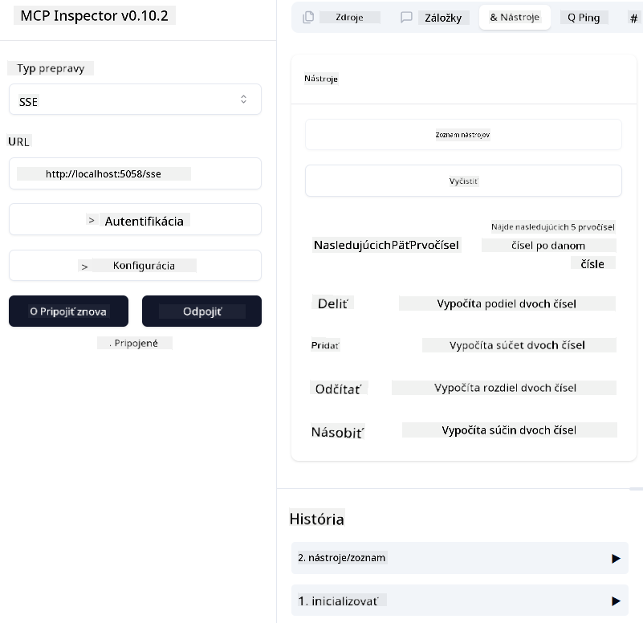

<!--
CO_OP_TRANSLATOR_METADATA:
{
  "original_hash": "5020a3e1a1c7f30c00f9e37f1fa208e3",
  "translation_date": "2025-05-17T14:12:04+00:00",
  "source_file": "04-PracticalImplementation/samples/csharp/README.md",
  "language_code": "sk"
}
-->
# Vzor

Predchádzajúci príklad ukazuje, ako použiť lokálny .NET projekt s typom `sdio`. A ako spustiť server lokálne v kontajneri. Toto je dobré riešenie v mnohých situáciách. Avšak môže byť užitočné mať server spustený vzdialene, napríklad v cloudovom prostredí. Tu prichádza do hry typ `http`.

Pri pohľade na riešenie v priečinku `04-PracticalImplementation` sa môže zdať oveľa zložitejšie ako to predchádzajúce. Ale v skutočnosti to tak nie je. Ak sa pozriete bližšie na projekt `src/mcpserver/mcpserver.csproj`, uvidíte, že je to väčšinou ten istý kód ako v predchádzajúcom príklade. Jediný rozdiel je, že používame inú knižnicu `ModelContextProtocol.AspNetCore` na spracovanie HTTP požiadaviek. A meníme metódu `IsPrime`, aby bola súkromná, len aby sme ukázali, že vo svojom kóde môžete mať súkromné metódy. Zvyšok kódu je rovnaký ako predtým.

Ostatné projekty sú z [.NET Aspire](https://learn.microsoft.com/dotnet/aspire/get-started/aspire-overview). Mať .NET Aspire v riešení zlepší skúsenosti vývojára počas vývoja a testovania a pomôže so sledovateľnosťou. Nie je to potrebné na spustenie servera, ale je dobré mať to vo svojom riešení.

## Spustite server lokálne

1. Z VS Code (s rozšírením C# DevKit) otvorte riešenie `04-PracticalImplementation\samples\csharp\src\Calculator-chap4.sln`.
2. Stlačte `F5` na spustenie servera. Malo by sa spustiť webový prehliadač s .NET Aspire dashboardom.

alebo

1. Z terminálu prejdite do priečinka `04-PracticalImplementation\samples\csharp\src`
2. Spustite nasledujúci príkaz na spustenie servera:
   ```bash
    dotnet run --project .\AppHost
   ```

3. Z Dashboardu si všimnite URL `http`. Malo by to byť niečo ako `http://localhost:5058/`.

## Test `SSE` s ModelContext Protocol Inspector

Ak máte Node.js 22.7.5 a vyššie, môžete použiť ModelContext Protocol Inspector na testovanie vášho servera.

Spustite server a spustite nasledujúci príkaz v termináli:

```bash
npx @modelcontextprotocol/inspector@latest
```



- Vyberte `SSE` as the Transport type. SSE stand for Server-Sent Events. 
- In the Url field, enter the URL of the server noted earlier,and append `/sse`. Malo by to byť `http` (nie `https`) something like `http://localhost:5058/sse`.
- select the Connect button.

A nice thing about the Inspector is that it provide a nice visibility on what is happening.

- Try listing the availables tools
- Try some of them, it should works just like before.


## Test `SSE` with Github Copilot Chat in VS Code

To use the `SSE` transport with Github Copilot Chat, change the configuration of the `mcp-calc` server vytvorený predtým, aby vyzeral takto:

```json
"mcp-calc": {
    "type": "sse",
    "url": "http://localhost:5058/sse"
}
```

Urobte niekoľko testov:
- Požiadajte o 3 prvočísla po 6780. Všimnite si, ako Copilot použije nové nástroje `NextFivePrimeNumbers` a vráti iba prvé 3 prvočísla.
- Požiadajte o 7 prvočísel po 111, aby ste videli, čo sa stane.

# Nasadenie servera na Azure

Nasadíme server na Azure, aby ho mohlo používať viac ľudí.

Z terminálu prejdite do priečinka `04-PracticalImplementation\samples\csharp\src` a spustite nasledujúci príkaz:

```bash
azd init
```

Tým sa lokálne vytvorí niekoľko súborov na uloženie konfigurácie Azure zdrojov a vašej infraštruktúry ako kódu (IaC).

Potom spustite nasledujúci príkaz na nasadenie servera na Azure:

```bash
azd up
```

Po dokončení nasadenia by ste mali vidieť správu podobnú tejto:


Prejdite na Aspire dashboard a všimnite si URL `HTTP`, aby ste ju mohli použiť v MCP Inspector a v Github Copilot Chat.

## Čo ďalej?

Skúšame rôzne typy prenosov, testovacie nástroje a tiež nasadzujeme náš MCP server na Azure. Ale čo ak náš server potrebuje prístup k súkromným zdrojom? Napríklad k databáze alebo súkromnému API? V ďalšej kapitole uvidíme, ako môžeme zlepšiť bezpečnosť nášho servera.

**Upozornenie**:  
Tento dokument bol preložený pomocou AI prekladovej služby [Co-op Translator](https://github.com/Azure/co-op-translator). Hoci sa snažíme o presnosť, berte na vedomie, že automatizované preklady môžu obsahovať chyby alebo nepresnosti. Pôvodný dokument v jeho rodnom jazyku by mal byť považovaný za autoritatívny zdroj. Pre kritické informácie sa odporúča profesionálny preklad od človeka. Nezodpovedáme za žiadne nedorozumenia alebo nesprávne interpretácie vyplývajúce z použitia tohto prekladu.