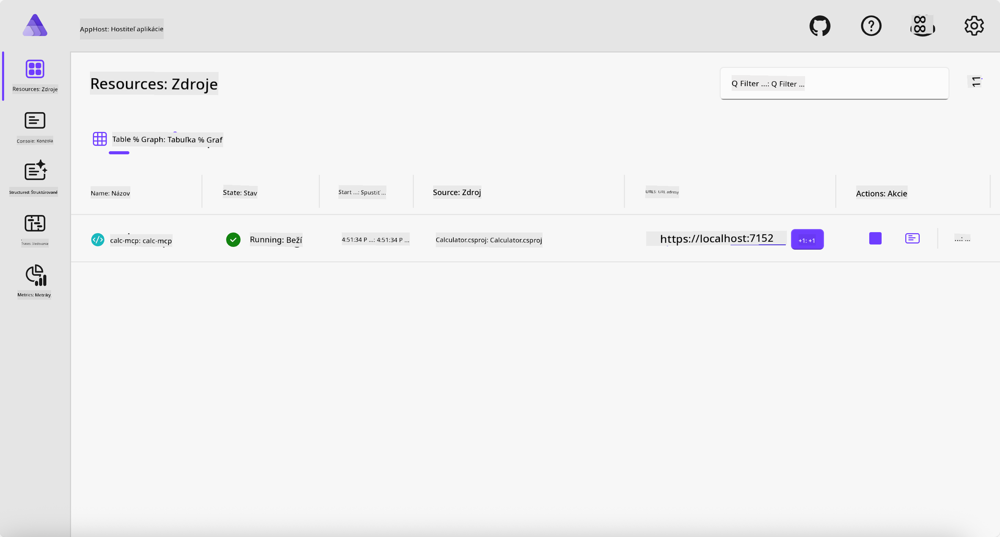
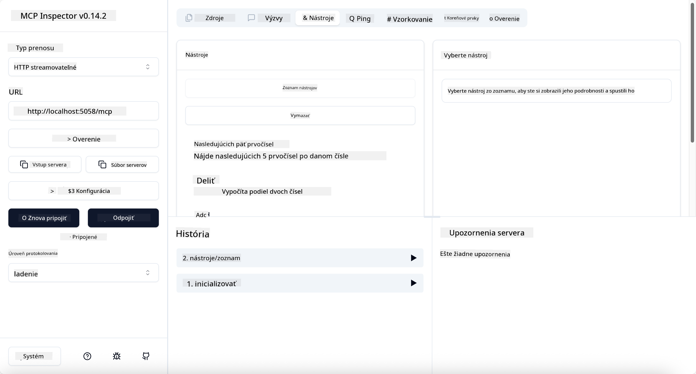
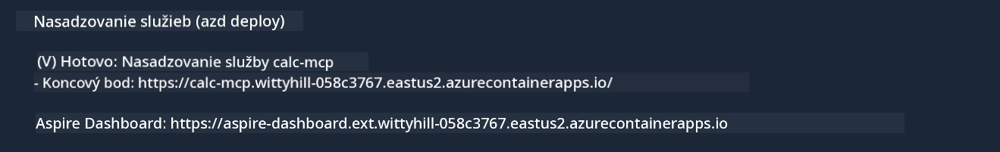

<!--
CO_OP_TRANSLATOR_METADATA:
{
  "original_hash": "0bc7bd48f55f1565f1d95ccb2c16f728",
  "translation_date": "2025-06-18T07:53:11+00:00",
  "source_file": "04-PracticalImplementation/samples/csharp/README.md",
  "language_code": "sk"
}
-->
# Príklad

Predchádzajúci príklad ukazuje, ako používať lokálny .NET projekt s typom `stdio`. A ako spustiť server lokálne v kontajneri. Toto je dobré riešenie v mnohých situáciách. Avšak, môže byť užitočné mať server bežiaci na diaľku, napríklad v cloudovom prostredí. Práve tu prichádza na rad typ `http`.

Ak sa pozriete na riešenie v priečinku `04-PracticalImplementation`, môže vyzerať oveľa zložitejšie ako predchádzajúce. Ale v skutočnosti to tak nie je. Ak sa pozorne pozriete na projekt `src/Calculator`, uvidíte, že ide väčšinou o rovnaký kód ako v predchádzajúcom príklade. Jediný rozdiel je, že používame inú knižnicu `ModelContextProtocol.AspNetCore` na spracovanie HTTP požiadaviek. A meníme metódu `IsPrime` na súkromnú, len aby sme ukázali, že v kóde môžete mať súkromné metódy. Zvyšok kódu je rovnaký ako predtým.

Ostatné projekty sú z [.NET Aspire](https://learn.microsoft.com/dotnet/aspire/get-started/aspire-overview). Mať .NET Aspire v riešení zlepší skúsenosť vývojára počas vývoja a testovania a pomôže s observabilitou. Nie je to nevyhnutné pre spustenie servera, ale je to dobrá prax mať ho vo svojom riešení.

## Spustenie servera lokálne

1. Vo VS Code (s rozšírením C# DevKit) prejdite do priečinka `04-PracticalImplementation/samples/csharp`.
1. Spustite nasledujúci príkaz na spustenie servera:

   ```bash
    dotnet watch run --project ./src/AppHost
   ```

1. Keď webový prehliadač otvorí dashboard .NET Aspire, všimnite si URL adresu `http`. Mala by vyzerať nejako takto: `http://localhost:5058/`.

   

## Testovanie Streamable HTTP pomocou MCP Inspectora

Ak máte Node.js verzie 22.7.5 alebo novšej, môžete použiť MCP Inspector na otestovanie svojho servera.

Spustite server a v termináli zadajte nasledujúci príkaz:

```bash
npx @modelcontextprotocol/inspector http://localhost:5058
```



- Vyberte `Streamable HTTP` as the Transport type.
- In the Url field, enter the URL of the server noted earlier, and append `/mcp`. Malo by to byť `http` (nie `https`) something like `http://localhost:5058/mcp`.
- select the Connect button.

A nice thing about the Inspector is that it provide a nice visibility on what is happening.

- Try listing the available tools
- Try some of them, it should works just like before.

## Test MCP Server with GitHub Copilot Chat in VS Code

To use the Streamable HTTP transport with GitHub Copilot Chat, change the configuration of the `calc-mcp` server vytvorený predtým, aby vyzeral takto:

```jsonc
// .vscode/mcp.json
{
  "servers": {
    "calc-mcp": {
      "type": "http",
      "url": "http://localhost:5058/mcp"
    }
  }
}
```

Vykonajte niekoľko testov:

- Požiadajte o „3 prvočísla po 6780“. Všimnite si, ako Copilot použije nové nástroje `NextFivePrimeNumbers` a vráti len prvé 3 prvočísla.
- Požiadajte o „7 prvočísel po 111“, aby ste videli, čo sa stane.
- Požiadajte o „John má 24 lízaniek a chce ich rozdať všetkým svojim 3 deťom. Koľko lízaniek dostane každé dieťa?“, aby ste videli, čo sa stane.

## Nasadenie servera do Azure

Nasadíme server do Azure, aby ho mohlo používať viac ľudí.

V termináli prejdite do priečinka `04-PracticalImplementation/samples/csharp` a spustite nasledujúci príkaz:

```bash
azd up
```

Po dokončení nasadenia by ste mali vidieť správu ako táto:



Skopírujte URL a použite ju v MCP Inspectore a v GitHub Copilot Chate.

```jsonc
// .vscode/mcp.json
{
  "servers": {
    "calc-mcp": {
      "type": "http",
      "url": "https://calc-mcp.gentleriver-3977fbcf.australiaeast.azurecontainerapps.io/mcp"
    }
  }
}
```

## Čo ďalej?

Vyskúšame rôzne typy transportov a testovacie nástroje. Tiež nasadíme váš MCP server do Azure. Ale čo ak náš server potrebuje prístup k súkromným zdrojom? Napríklad databáze alebo súkromnému API? V ďalšej kapitole uvidíme, ako môžeme zlepšiť bezpečnosť nášho servera.

**Vyhlásenie o zodpovednosti**:  
Tento dokument bol preložený pomocou AI prekladateľskej služby [Co-op Translator](https://github.com/Azure/co-op-translator). Aj keď sa snažíme o presnosť, majte prosím na pamäti, že automatické preklady môžu obsahovať chyby alebo nepresnosti. Pôvodný dokument v jeho rodnom jazyku by mal byť považovaný za autoritatívny zdroj. Pre kritické informácie sa odporúča profesionálny ľudský preklad. Nezodpovedáme za akékoľvek nedorozumenia alebo nesprávne výklady vyplývajúce z použitia tohto prekladu.