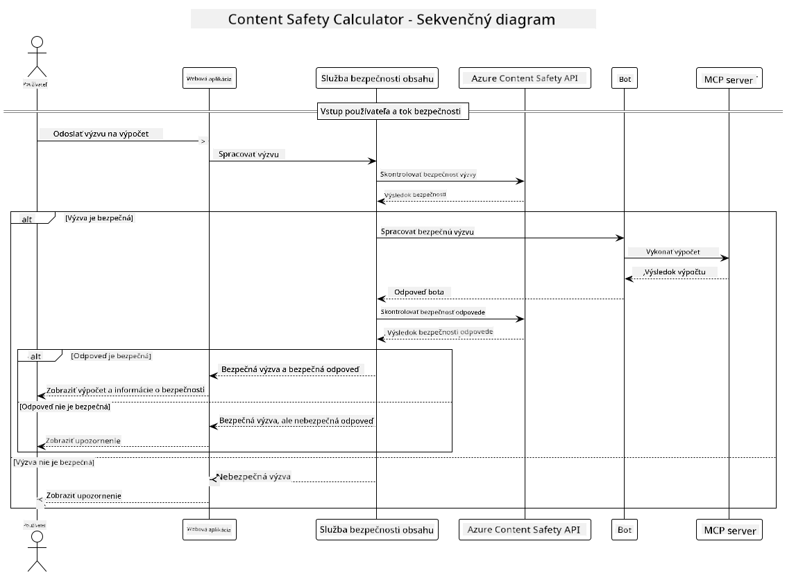

<!--
CO_OP_TRANSLATOR_METADATA:
{
  "original_hash": "e5ea5e7582f70008ea9bec3b3820f20a",
  "translation_date": "2025-07-13T23:19:51+00:00",
  "source_file": "04-PracticalImplementation/samples/java/containerapp/README.md",
  "language_code": "sk"
}
-->
## Architektúra systému

Tento projekt demonštruje webovú aplikáciu, ktorá pred odoslaním používateľských požiadaviek do kalkulačnej služby cez Model Context Protocol (MCP) vykonáva kontrolu bezpečnosti obsahu.



### Ako to funguje

1. **Vstup používateľa**: Používateľ zadá výpočetný príkaz do webového rozhrania  
2. **Kontrola bezpečnosti obsahu (vstup)**: Príkaz je analyzovaný pomocou Azure Content Safety API  
3. **Rozhodnutie o bezpečnosti (vstup)**:  
   - Ak je obsah bezpečný (závažnosť < 2 vo všetkých kategóriách), pokračuje sa ku kalkulačke  
   - Ak je obsah označený ako potenciálne škodlivý, proces sa zastaví a vráti sa varovanie  
4. **Integrácia kalkulačky**: Bezpečný obsah spracuje LangChain4j, ktorý komunikuje so serverom kalkulačky MCP  
5. **Kontrola bezpečnosti obsahu (výstup)**: Odpoveď bota je analyzovaná pomocou Azure Content Safety API  
6. **Rozhodnutie o bezpečnosti (výstup)**:  
   - Ak je odpoveď bota bezpečná, zobrazí sa používateľovi  
   - Ak je odpoveď bota označená ako potenciálne škodlivá, nahradí sa varovaním  
7. **Odpoveď**: Výsledky (ak sú bezpečné) sa zobrazia používateľovi spolu s oboma analýzami bezpečnosti

## Použitie Model Context Protocol (MCP) s kalkulačnými službami

Tento projekt ukazuje, ako používať Model Context Protocol (MCP) na volanie kalkulačných MCP služieb z LangChain4j. Implementácia využíva lokálny MCP server bežiaci na porte 8080, ktorý poskytuje kalkulačné operácie.

### Nastavenie služby Azure Content Safety

Pred použitím funkcií bezpečnosti obsahu je potrebné vytvoriť zdroj služby Azure Content Safety:

1. Prihláste sa do [Azure Portálu](https://portal.azure.com)  
2. Kliknite na „Create a resource“ a vyhľadajte „Content Safety“  
3. Vyberte „Content Safety“ a kliknite na „Create“  
4. Zadajte jedinečný názov pre váš zdroj  
5. Vyberte predplatné a skupinu zdrojov (alebo vytvorte novú)  
6. Zvoľte podporovaný región (podrobnosti nájdete v [Region availability](https://azure.microsoft.com/en-us/global-infrastructure/services/?products=cognitive-services))  
7. Vyberte vhodný cenový plán  
8. Kliknite na „Create“ pre nasadenie zdroja  
9. Po dokončení nasadenia kliknite na „Go to resource“  
10. V ľavom paneli, pod „Resource Management“, vyberte „Keys and Endpoint“  
11. Skopírujte jeden z kľúčov a URL koncového bodu pre použitie v ďalšom kroku

### Konfigurácia premenných prostredia

Nastavte premennú prostredia `GITHUB_TOKEN` pre autentifikáciu GitHub modelov:  
```sh
export GITHUB_TOKEN=<your_github_token>
```

Pre funkcie bezpečnosti obsahu nastavte:  
```sh
export CONTENT_SAFETY_ENDPOINT=<your_content_safety_endpoint>
export CONTENT_SAFETY_KEY=<your_content_safety_key>
```

Tieto premenné prostredia používa aplikácia na autentifikáciu so službou Azure Content Safety. Ak nie sú nastavené, aplikácia použije zástupné hodnoty pre demonštračné účely, no funkcie bezpečnosti obsahu nebudú fungovať správne.

### Spustenie MCP servera kalkulačky

Pred spustením klienta je potrebné spustiť MCP server kalkulačky v režime SSE na localhost:8080.

## Popis projektu

Tento projekt demonštruje integráciu Model Context Protocol (MCP) s LangChain4j na volanie kalkulačných služieb. Hlavné vlastnosti zahŕňajú:

- Použitie MCP na pripojenie ku kalkulačnej službe pre základné matematické operácie  
- Dvojvrstvová kontrola bezpečnosti obsahu na vstupoch používateľa aj výstupoch bota  
- Integrácia s GitHub modelom gpt-4.1-nano cez LangChain4j  
- Použitie Server-Sent Events (SSE) pre MCP transport

## Integrácia bezpečnosti obsahu

Projekt obsahuje komplexné funkcie bezpečnosti obsahu, ktoré zabezpečujú, že vstupy používateľa aj odpovede systému sú bez škodlivého obsahu:

1. **Kontrola vstupu**: Všetky používateľské požiadavky sú pred spracovaním analyzované na škodlivý obsah v kategóriách ako nenávisť, násilie, sebapoškodzovanie a sexuálny obsah.  

2. **Kontrola výstupu**: Aj pri použití potenciálne necenzurovaných modelov systém kontroluje všetky generované odpovede cez rovnaké filtre bezpečnosti obsahu pred ich zobrazením používateľovi.

Tento dvojvrstvový prístup zabezpečuje, že systém zostáva bezpečný bez ohľadu na použitý AI model, čím chráni používateľov pred škodlivými vstupmi aj potenciálne problematickými výstupmi generovanými AI.

## Webový klient

Aplikácia obsahuje používateľsky prívetivé webové rozhranie, ktoré umožňuje interakciu so systémom Content Safety Calculator:

### Funkcie webového rozhrania

- Jednoduchý, intuitívny formulár na zadávanie výpočtových príkazov  
- Dvojvrstvová validácia bezpečnosti obsahu (vstup a výstup)  
- Spätná väzba v reálnom čase o bezpečnosti príkazu a odpovede  
- Farebne odlíšené indikátory bezpečnosti pre jednoduchú interpretáciu  
- Čistý, responzívny dizajn fungujúci na rôznych zariadeniach  
- Príklady bezpečných príkazov na usmernenie používateľov

### Použitie webového klienta

1. Spustite aplikáciu:  
   ```sh
   mvn spring-boot:run
   ```

2. Otvorte prehliadač a prejdite na `http://localhost:8087`

3. Zadajte výpočtový príkaz do poskytnutého textového poľa (napr. „Vypočítaj súčet 24.5 a 17.3“)

4. Kliknite na „Submit“ pre spracovanie požiadavky

5. Prezrite si výsledky, ktoré budú obsahovať:  
   - Analýzu bezpečnosti vášho príkazu  
   - Vypočítaný výsledok (ak bol príkaz bezpečný)  
   - Analýzu bezpečnosti odpovede bota  
   - Prípadné varovania o bezpečnosti, ak bol vstup alebo výstup označený

Webový klient automaticky spracováva oba procesy overovania bezpečnosti obsahu, čím zabezpečuje, že všetky interakcie sú bezpečné a vhodné bez ohľadu na použitý AI model.

**Vyhlásenie o zodpovednosti**:  
Tento dokument bol preložený pomocou AI prekladateľskej služby [Co-op Translator](https://github.com/Azure/co-op-translator). Aj keď sa snažíme o presnosť, prosím, majte na pamäti, že automatizované preklady môžu obsahovať chyby alebo nepresnosti. Originálny dokument v jeho pôvodnom jazyku by mal byť považovaný za autoritatívny zdroj. Pre kritické informácie sa odporúča profesionálny ľudský preklad. Nie sme zodpovední za akékoľvek nedorozumenia alebo nesprávne interpretácie vyplývajúce z použitia tohto prekladu.