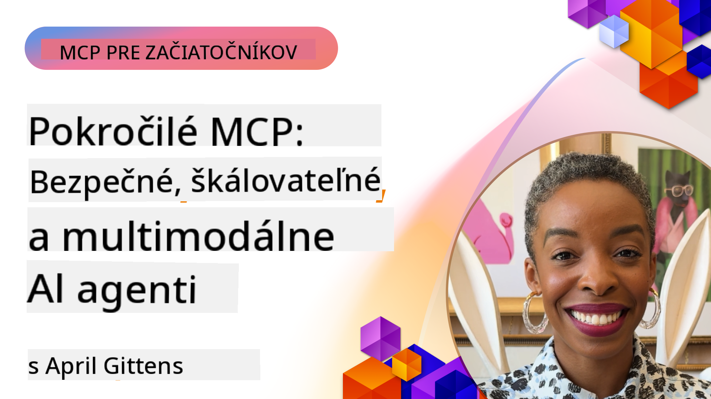

<!--
CO_OP_TRANSLATOR_METADATA:
{
  "original_hash": "d204bc94ea6027d06a703b21b711ca57",
  "translation_date": "2025-08-19T16:01:00+00:00",
  "source_file": "05-AdvancedTopics/README.md",
  "language_code": "sk"
}
-->
# Pokročilé témy v MCP

_(Kliknite na obrázok vyššie pre zobrazenie videa k tejto lekcii)_

Táto kapitola pokrýva sériu pokročilých tém v implementácii Model Context Protocol (MCP), vrátane multimodálnej integrácie, škálovateľnosti, najlepších bezpečnostných postupov a podnikovej integrácie. Tieto témy sú kľúčové pre vytváranie robustných a produkčne pripravených MCP aplikácií, ktoré dokážu splniť požiadavky moderných AI systémov.

## Prehľad

Táto lekcia skúma pokročilé koncepty v implementácii Model Context Protocol, so zameraním na multimodálnu integráciu, škálovateľnosť, najlepšie bezpečnostné postupy a podnikovú integráciu. Tieto témy sú nevyhnutné pre vytváranie produkčne pripravených MCP aplikácií, ktoré dokážu zvládnuť komplexné požiadavky v podnikových prostrediach.

## Ciele učenia

Na konci tejto lekcie budete schopní:

- Implementovať multimodálne schopnosti v rámci MCP rámcov
- Navrhnúť škálovateľné MCP architektúry pre scenáre s vysokými nárokmi
- Aplikovať najlepšie bezpečnostné postupy v súlade s bezpečnostnými princípmi MCP
- Integrovať MCP s podnikovými AI systémami a rámcami
- Optimalizovať výkon a spoľahlivosť v produkčných prostrediach

## Lekcie a ukážkové projekty

| Odkaz | Názov | Popis |
|------|-------|-------------|
| [5.1 Integrácia s Azure](./mcp-integration/README.md) | Integrácia s Azure | Naučte sa, ako integrovať váš MCP server na Azure |
| [5.2 Multimodálne ukážky](./mcp-multi-modality/README.md) | MCP multimodálne ukážky | Ukážky pre audio, obraz a multimodálne odpovede |
| [5.3 MCP OAuth2 ukážka](../../../05-AdvancedTopics/mcp-oauth2-demo) | MCP OAuth2 Demo | Minimálna Spring Boot aplikácia ukazujúca OAuth2 s MCP, ako autorizačný aj zdrojový server. Demonštruje vydávanie bezpečných tokenov, chránené endpointy, nasadenie na Azure Container Apps a integráciu s API Management. |
| [5.4 Root Contexts](./mcp-root-contexts/README.md) | Root Contexts | Naučte sa viac o root contextoch a ako ich implementovať |
| [5.5 Routing](./mcp-routing/README.md) | Routing | Naučte sa rôzne typy routingu |
| [5.6 Sampling](./mcp-sampling/README.md) | Sampling | Naučte sa pracovať so samplingom |
| [5.7 Škálovanie](./mcp-scaling/README.md) | Škálovanie | Naučte sa o škálovaní |
| [5.8 Bezpečnosť](./mcp-security/README.md) | Bezpečnosť | Zabezpečte váš MCP server |
| [5.9 Ukážka webového vyhľadávania](./web-search-mcp/README.md) | Web Search MCP | Python MCP server a klient integrujúci sa so SerpAPI pre real-time webové, spravodajské, produktové vyhľadávanie a Q&A. Demonštruje orchestráciu viacerých nástrojov, integráciu externých API a robustné spracovanie chýb. |
| [5.10 Reálne časové streamovanie](./mcp-realtimestreaming/README.md) | Streamovanie | Reálne časové streamovanie sa stalo nevyhnutným v dnešnom dátovo orientovanom svete, kde podniky a aplikácie potrebujú okamžitý prístup k informáciám na včasné rozhodovanie. |
| [5.11 Reálne časové webové vyhľadávanie](./mcp-realtimesearch/README.md) | Webové vyhľadávanie | Reálne časové webové vyhľadávanie, ako MCP transformuje reálne časové webové vyhľadávanie poskytovaním štandardizovaného prístupu k správe kontextu medzi AI modelmi, vyhľadávacími nástrojmi a aplikáciami. |
| [5.12 Entra ID autentifikácia pre Model Context Protocol servery](./mcp-security-entra/README.md) | Entra ID autentifikácia | Microsoft Entra ID poskytuje robustné cloudové riešenie pre správu identity a prístupu, ktoré pomáha zabezpečiť, že iba autorizovaní používatelia a aplikácie môžu interagovať s vaším MCP serverom. |
| [5.13 Integrácia s Azure AI Foundry Agent](./mcp-foundry-agent-integration/README.md) | Integrácia s Azure AI Foundry | Naučte sa, ako integrovať Model Context Protocol servery s agentmi Azure AI Foundry, umožňujúc silnú orchestráciu nástrojov a podnikové AI schopnosti so štandardizovanými pripojeniami k externým zdrojom dát. |
| [5.14 Kontextové inžinierstvo](./mcp-contextengineering/README.md) | Kontextové inžinierstvo | Budúce príležitosti techník kontextového inžinierstva pre MCP servery, vrátane optimalizácie kontextu, dynamického manažmentu kontextu a stratégií efektívneho promptového inžinierstva v rámci MCP rámcov. |

## Ďalšie odkazy

Pre najaktuálnejšie informácie o pokročilých témach MCP, pozrite si:
- [MCP Dokumentácia](https://modelcontextprotocol.io/)
- [MCP Špecifikácia](https://spec.modelcontextprotocol.io/)
- [GitHub Repository](https://github.com/modelcontextprotocol)

## Kľúčové poznatky

- Multimodálne implementácie MCP rozširujú schopnosti AI nad rámec spracovania textu
- Škálovateľnosť je nevyhnutná pre podnikové nasadenia a môže byť riešená horizontálnym a vertikálnym škálovaním
- Komplexné bezpečnostné opatrenia chránia dáta a zabezpečujú správnu kontrolu prístupu
- Podniková integrácia s platformami ako Azure OpenAI a Microsoft AI Foundry zvyšuje schopnosti MCP
- Pokročilé implementácie MCP profitujú z optimalizovaných architektúr a starostlivého manažmentu zdrojov

## Cvičenie

Navrhnite podnikové MCP riešenie pre konkrétny prípad použitia:

1. Identifikujte multimodálne požiadavky pre váš prípad použitia
2. Načrtnite bezpečnostné opatrenia potrebné na ochranu citlivých dát
3. Navrhnite škálovateľnú architektúru, ktorá zvládne rôzne zaťaženie
4. Naplánujte integračné body s podnikovými AI systémami
5. Dokumentujte potenciálne úzke miesta výkonu a stratégie ich zmiernenia

## Ďalšie zdroje

- [Azure OpenAI Dokumentácia](https://learn.microsoft.com/en-us/azure/ai-services/openai/)
- [Microsoft AI Foundry Dokumentácia](https://learn.microsoft.com/en-us/ai-services/)

---

## Čo ďalej

- [5.1 MCP Integrácia](./mcp-integration/README.md)

**Upozornenie**:  
Tento dokument bol preložený pomocou služby na automatický preklad [Co-op Translator](https://github.com/Azure/co-op-translator). Hoci sa snažíme o presnosť, upozorňujeme, že automatické preklady môžu obsahovať chyby alebo nepresnosti. Pôvodný dokument v jeho pôvodnom jazyku by mal byť považovaný za autoritatívny zdroj. Pre dôležité informácie odporúčame profesionálny ľudský preklad. Nezodpovedáme za žiadne nedorozumenia alebo nesprávne interpretácie vyplývajúce z použitia tohto prekladu.