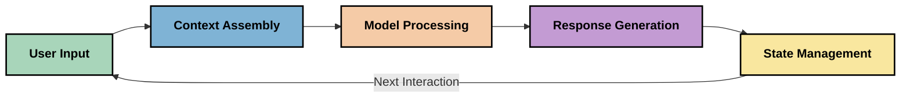
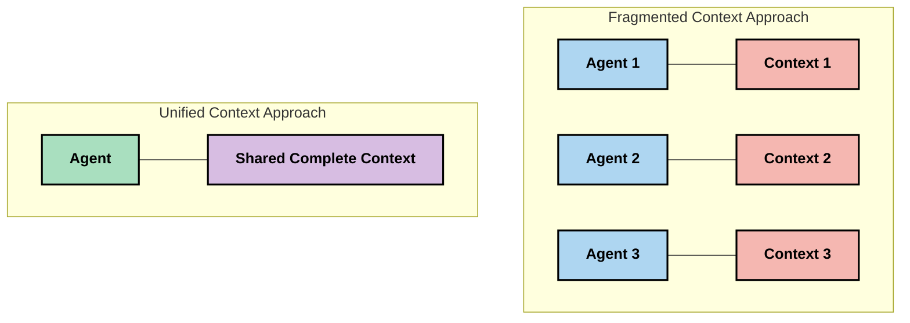

<!--
CO_OP_TRANSLATOR_METADATA:
{
  "original_hash": "fd169ca3071b81b5ee282e194bc823df",
  "translation_date": "2025-09-15T21:04:31+00:00",
  "source_file": "05-AdvancedTopics/mcp-contextengineering/README.md",
  "language_code": "sk"
}
-->
# Kontextové inžinierstvo: Nový koncept v ekosystéme MCP

## Prehľad

Kontextové inžinierstvo je nový koncept v oblasti AI, ktorý skúma, ako je informácia štruktúrovaná, doručovaná a udržiavaná počas interakcií medzi klientmi a AI službami. Ako sa ekosystém Model Context Protocol (MCP) vyvíja, porozumenie efektívnemu riadeniu kontextu sa stáva čoraz dôležitejším. Tento modul predstavuje koncept kontextového inžinierstva a skúma jeho potenciálne aplikácie v implementáciách MCP.

## Ciele učenia

Na konci tohto modulu budete schopní:

- Porozumieť novému konceptu kontextového inžinierstva a jeho potenciálnej úlohe v aplikáciách MCP
- Identifikovať hlavné výzvy v riadení kontextu, ktoré dizajn MCP protokolu rieši
- Preskúmať techniky na zlepšenie výkonu modelov prostredníctvom lepšieho spracovania kontextu
- Zvážiť prístupy na meranie a hodnotenie efektívnosti kontextu
- Aplikovať tieto nové koncepty na zlepšenie AI zážitkov prostredníctvom MCP rámca

## Úvod do kontextového inžinierstva

Kontextové inžinierstvo je nový koncept zameraný na zámerný dizajn a riadenie toku informácií medzi používateľmi, aplikáciami a AI modelmi. Na rozdiel od etablovaných oblastí, ako je promptové inžinierstvo, kontextové inžinierstvo je stále definované odborníkmi, ktorí pracujú na riešení jedinečných výziev poskytovania AI modelom správnych informácií v správnom čase.

Ako sa veľké jazykové modely (LLMs) vyvíjali, dôležitosť kontextu sa stala čoraz zreteľnejšou. Kvalita, relevantnosť a štruktúra poskytovaného kontextu priamo ovplyvňujú výstupy modelov. Kontextové inžinierstvo skúma tento vzťah a snaží sa vyvinúť princípy efektívneho riadenia kontextu.

> „V roku 2025 budú modely extrémne inteligentné. Ale ani najinteligentnejší človek nebude schopný efektívne vykonávať svoju prácu bez kontextu toho, čo sa od neho žiada... 'Kontextové inžinierstvo' je ďalšia úroveň promptového inžinierstva. Ide o to, aby sa to robilo automaticky v dynamickom systéme." — Walden Yan, Cognition AI

Kontextové inžinierstvo môže zahŕňať:

1. **Výber kontextu**: Určenie, ktoré informácie sú relevantné pre danú úlohu
2. **Štruktúrovanie kontextu**: Organizácia informácií na maximalizáciu porozumenia modelu
3. **Doručovanie kontextu**: Optimalizácia spôsobu a času, kedy sú informácie posielané modelom
4. **Udržiavanie kontextu**: Riadenie stavu a vývoja kontextu v priebehu času
5. **Hodnotenie kontextu**: Meranie a zlepšovanie efektívnosti kontextu

Tieto oblasti sú obzvlášť relevantné pre ekosystém MCP, ktorý poskytuje štandardizovaný spôsob, ako aplikácie poskytujú kontext LLMs.

## Perspektíva cesty kontextu

Jedným zo spôsobov, ako si vizualizovať kontextové inžinierstvo, je sledovať cestu, ktorú informácia prechádza cez systém MCP:

### Kľúčové fázy cesty kontextu:

1. **Vstup používateľa**: Surové informácie od používateľa (text, obrázky, dokumenty)
2. **Zostavenie kontextu**: Kombinácia vstupu používateľa so systémovým kontextom, históriou konverzácie a ďalšími získanými informáciami
3. **Spracovanie modelom**: AI model spracováva zostavený kontext
4. **Generovanie odpovede**: Model produkuje výstupy na základe poskytnutého kontextu
5. **Riadenie stavu**: Systém aktualizuje svoj interný stav na základe interakcie

Táto perspektíva zdôrazňuje dynamickú povahu kontextu v AI systémoch a kladie dôležité otázky o tom, ako najlepšie riadiť informácie v každej fáze.

## Nové princípy v kontextovom inžinierstve

Ako sa oblasť kontextového inžinierstva formuje, začínajú sa objavovať niektoré prvé princípy od odborníkov. Tieto princípy môžu pomôcť informovať rozhodnutia pri implementácii MCP:

### Princíp 1: Zdieľajte kontext úplne

Kontext by mal byť zdieľaný úplne medzi všetkými komponentmi systému, namiesto toho, aby bol rozdelený medzi viacerých agentov alebo procesy. Keď je kontext rozdelený, rozhodnutia urobené v jednej časti systému môžu byť v konflikte s rozhodnutiami urobenými inde.

V aplikáciách MCP to naznačuje návrh systémov, kde kontext prúdi hladko cez celý pipeline, namiesto toho, aby bol rozdelený.

### Princíp 2: Uznajte, že akcie nesú implicitné rozhodnutia

Každá akcia, ktorú model vykoná, zahŕňa implicitné rozhodnutia o tom, ako interpretovať kontext. Keď viaceré komponenty pracujú na rôznych kontextoch, tieto implicitné rozhodnutia môžu byť v konflikte, čo vedie k nekonzistentným výsledkom.

Tento princíp má dôležité dôsledky pre aplikácie MCP:
- Uprednostnite lineárne spracovanie komplexných úloh pred paralelným vykonávaním s rozdeleným kontextom
- Zabezpečte, aby všetky rozhodovacie body mali prístup k rovnakým kontextovým informáciám
- Navrhnite systémy, kde neskoršie kroky môžu vidieť celý kontext predchádzajúcich rozhodnutí

### Princíp 3: Vyvážte hĺbku kontextu s obmedzeniami okna

Ako sa konverzácie a procesy predlžujú, kontextové okná nakoniec pretečú. Efektívne kontextové inžinierstvo skúma prístupy na zvládnutie tohto napätia medzi komplexným kontextom a technickými obmedzeniami.

Potenciálne prístupy, ktoré sa skúmajú, zahŕňajú:
- Kompresiu kontextu, ktorá zachováva podstatné informácie a zároveň znižuje využitie tokenov
- Progresívne načítanie kontextu na základe relevantnosti pre aktuálne potreby
- Zhrnutie predchádzajúcich interakcií pri zachovaní kľúčových rozhodnutí a faktov

## Výzvy kontextu a dizajn MCP protokolu

Model Context Protocol (MCP) bol navrhnutý s vedomím jedinečných výziev riadenia kontextu. Porozumenie týmto výzvam pomáha vysvetliť kľúčové aspekty dizajnu MCP protokolu:

### Výzva 1: Obmedzenia kontextového okna
Väčšina AI modelov má pevné veľkosti kontextových okien, čo obmedzuje množstvo informácií, ktoré môžu naraz spracovať.

**Odpoveď dizajnu MCP:** 
- Protokol podporuje štruktúrovaný, zdrojovo založený kontext, ktorý môže byť efektívne referencovaný
- Zdroje môžu byť stránkované a načítané progresívne

### Výzva 2: Určenie relevantnosti
Určenie, ktoré informácie sú najrelevantnejšie na zahrnutie do kontextu, je náročné.

**Odpoveď dizajnu MCP:**
- Flexibilné nástroje umožňujú dynamické získavanie informácií na základe potreby
- Štruktúrované prompty umožňujú konzistentnú organizáciu kontextu

### Výzva 3: Perzistencia kontextu
Riadenie stavu naprieč interakciami vyžaduje dôsledné sledovanie kontextu.

**Odpoveď dizajnu MCP:**
- Štandardizované riadenie relácií
- Jasne definované vzory interakcií pre vývoj kontextu

### Výzva 4: Multimodálny kontext
Rôzne typy dát (text, obrázky, štruktúrované dáta) vyžadujú odlišné spracovanie.

**Odpoveď dizajnu MCP:**
- Dizajn protokolu umožňuje rôzne typy obsahu
- Štandardizovaná reprezentácia multimodálnych informácií

### Výzva 5: Bezpečnosť a súkromie
Kontext často obsahuje citlivé informácie, ktoré musia byť chránené.

**Odpoveď dizajnu MCP:**
- Jasné hranice medzi zodpovednosťami klienta a servera
- Možnosti lokálneho spracovania na minimalizáciu expozície dát

Porozumenie týmto výzvam a tomu, ako ich MCP rieši, poskytuje základ pre skúmanie pokročilejších techník kontextového inžinierstva.
- [Model Context Protocol Website](https://modelcontextprotocol.io/)
- [Model Context Protocol Specification](https://github.com/modelcontextprotocol/modelcontextprotocol)
- [MCP Documentation](https://modelcontextprotocol.io/docs)
- [MCP C# SDK](https://github.com/modelcontextprotocol/csharp-sdk)
- [MCP Python SDK](https://github.com/modelcontextprotocol/python-sdk)
- [MCP TypeScript SDK](https://github.com/modelcontextprotocol/typescript-sdk)
- [MCP Inspector](https://github.com/modelcontextprotocol/inspector) - Vizualizačný nástroj na testovanie MCP serverov

### Články o kontextovom inžinierstve
- [Nerobte multi-agentov: Princípy kontextového inžinierstva](https://cognition.ai/blog/dont-build-multi-agents) - Walden Yanove poznatky o princípoch kontextového inžinierstva
- [Praktický sprievodca budovaním agentov](https://cdn.openai.com/business-guides-and-resources/a-practical-guide-to-building-agents.pdf) - OpenAI sprievodca efektívnym návrhom agentov
- [Budovanie efektívnych agentov](https://www.anthropic.com/engineering/building-effective-agents) - Prístup spoločnosti Anthropic k vývoju agentov

### Súvisiaci výskum
- [Dynamické dopĺňanie vyhľadávania pre veľké jazykové modely](https://arxiv.org/abs/2310.01487) - Výskum dynamických prístupov k vyhľadávaniu
- [Stratení uprostred: Ako jazykové modely využívajú dlhé kontexty](https://arxiv.org/abs/2307.03172) - Dôležitý výskum o vzoroch spracovania kontextu
- [Hierarchická textom podmienená generácia obrázkov s CLIP latentmi](https://arxiv.org/abs/2204.06125) - Práca o DALL-E 2 s poznatkami o štruktúrovaní kontextu
- [Skúmanie úlohy kontextu v architektúrach veľkých jazykových modelov](https://aclanthology.org/2023.findings-emnlp.124/) - Nedávny výskum o spracovaní kontextu
- [Spolupráca multi-agentov: Prehľad](https://arxiv.org/abs/2304.03442) - Výskum o systémoch multi-agentov a ich výzvach

### Ďalšie zdroje
- [Techniky optimalizácie kontextového okna](https://learn.microsoft.com/en-us/azure/ai-services/openai/concepts/context-window)
- [Pokročilé techniky RAG](https://www.microsoft.com/en-us/research/blog/retrieval-augmented-generation-rag-and-frontier-models/)
- [Dokumentácia k Semantic Kernel](https://github.com/microsoft/semantic-kernel)
- [AI Toolkit na správu kontextu](https://github.com/microsoft/aitoolkit)

## Čo ďalej

- [5.15 MCP Custom Transport](../mcp-transport/README.md)

---

**Upozornenie**:  
Tento dokument bol preložený pomocou služby AI prekladu [Co-op Translator](https://github.com/Azure/co-op-translator). Aj keď sa snažíme o presnosť, prosím, berte na vedomie, že automatizované preklady môžu obsahovať chyby alebo nepresnosti. Pôvodný dokument v jeho pôvodnom jazyku by mal byť považovaný za autoritatívny zdroj. Pre kritické informácie sa odporúča profesionálny ľudský preklad. Nenesieme zodpovednosť za akékoľvek nedorozumenia alebo nesprávne interpretácie vyplývajúce z použitia tohto prekladu.