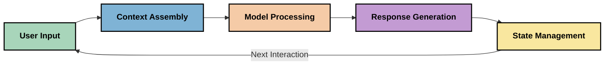
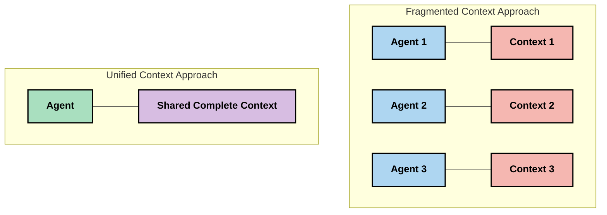
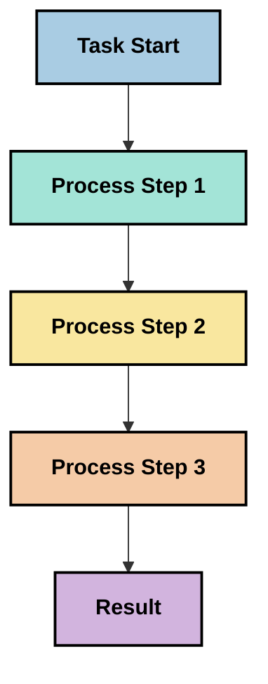
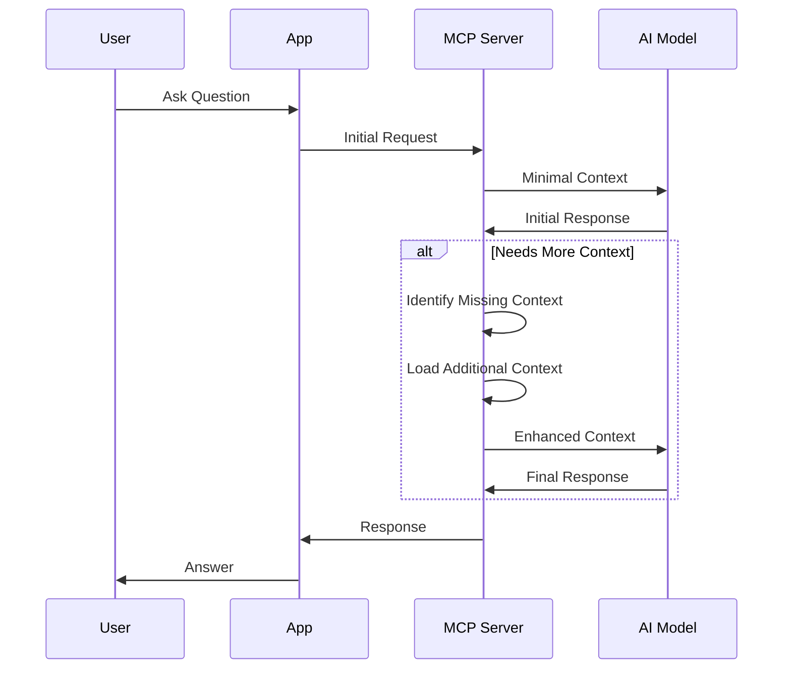
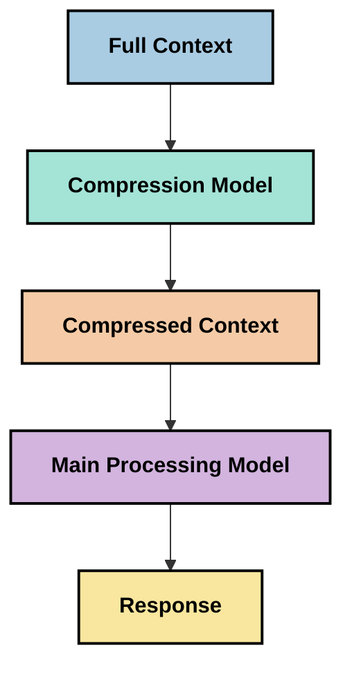

<!--
CO_OP_TRANSLATOR_METADATA:
{
  "original_hash": "5762e8e74dd99d8b7dbb31e69a82561e",
  "translation_date": "2025-07-17T13:17:20+00:00",
  "source_file": "05-AdvancedTopics/mcp-contextengineering/README.md",
  "language_code": "sk"
}
-->
# Context Engineering: Nový koncept v ekosystéme MCP

## Prehľad

Context engineering je nový koncept v oblasti AI, ktorý skúma, ako sa informácie štruktúrujú, doručujú a udržiavajú počas interakcií medzi klientmi a AI službami. S vývojom ekosystému Model Context Protocol (MCP) je čoraz dôležitejšie pochopiť, ako efektívne spravovať kontext. Tento modul predstavuje pojem context engineering a skúma jeho možné využitia v implementáciách MCP.

## Ciele učenia

Na konci tohto modulu budete schopní:

- Pochopiť nový koncept context engineering a jeho potenciálnu úlohu v aplikáciách MCP
- Identifikovať kľúčové výzvy v správe kontextu, ktoré rieši návrh protokolu MCP
- Preskúmať techniky na zlepšenie výkonu modelu prostredníctvom lepšej správy kontextu
- Zvážiť prístupy na meranie a hodnotenie efektívnosti kontextu
- Aplikovať tieto nové koncepty na zlepšenie AI zážitkov v rámci MCP

## Úvod do Context Engineering

Context engineering je nový koncept zameraný na zámerný návrh a správu toku informácií medzi používateľmi, aplikáciami a AI modelmi. Na rozdiel od etablovaných oblastí, ako je prompt engineering, context engineering je stále definovaný praktickými odborníkmi, ktorí riešia jedinečné výzvy poskytovania správnych informácií AI modelom v správnom čase.

S vývojom veľkých jazykových modelov (LLM) sa význam kontextu stal čoraz zrejmejší. Kvalita, relevantnosť a štruktúra kontextu, ktorý poskytujeme, priamo ovplyvňuje výstupy modelu. Context engineering skúma tento vzťah a snaží sa vyvinúť princípy efektívnej správy kontextu.

> „V roku 2025 sú modely neuveriteľne inteligentné. Ale ani ten najchytrejší človek nedokáže efektívne pracovať bez kontextu toho, čo sa od neho žiada... ‚Context engineering‘ je ďalšia úroveň prompt engineeringu. Ide o to robiť to automaticky v dynamickom systéme.“ — Walden Yan, Cognition AI

Context engineering môže zahŕňať:

1. **Výber kontextu**: Určenie, ktoré informácie sú relevantné pre danú úlohu
2. **Štruktúrovanie kontextu**: Organizovanie informácií tak, aby model čo najlepšie porozumel
3. **Doručenie kontextu**: Optimalizácia spôsobu a času, kedy sa informácie posielajú modelom
4. **Údržba kontextu**: Správa stavu a vývoja kontextu v čase
5. **Hodnotenie kontextu**: Meranie a zlepšovanie efektívnosti kontextu

Tieto oblasti sú obzvlášť relevantné pre ekosystém MCP, ktorý poskytuje štandardizovaný spôsob, ako aplikácie môžu poskytovať kontext LLM.

## Perspektíva cesty kontextu

Jedným zo spôsobov, ako si predstaviť context engineering, je sledovať cestu, ktorú informácie prechádzajú v systéme MCP:



### Kľúčové fázy cesty kontextu:

1. **Vstup používateľa**: Surové informácie od používateľa (text, obrázky, dokumenty)
2. **Zostavenie kontextu**: Kombinovanie vstupu používateľa so systémovým kontextom, históriou konverzácie a ďalšími získanými informáciami
3. **Spracovanie modelom**: AI model spracováva zostavený kontext
4. **Generovanie odpovede**: Model vytvára výstupy na základe poskytnutého kontextu
5. **Správa stavu**: Systém aktualizuje svoj interný stav na základe interakcie

Táto perspektíva zdôrazňuje dynamickú povahu kontextu v AI systémoch a kladie dôležité otázky o tom, ako najlepšie spravovať informácie v každej fáze.

## Vznikajúce princípy context engineering

Ako sa oblasť context engineering formuje, niektoré základné princípy začínajú vznikať od praktikov. Tieto princípy môžu pomôcť pri rozhodovaní o implementácii MCP:

### Princíp 1: Zdieľajte kontext úplne

Kontext by mal byť zdieľaný úplne medzi všetkými komponentmi systému, nie rozdelený medzi viacerých agentov alebo procesov. Keď je kontext rozptýlený, rozhodnutia prijaté v jednej časti systému môžu byť v rozpore s rozhodnutiami inde.



V aplikáciách MCP to naznačuje navrhnúť systémy, kde kontext plynule prechádza celým procesom namiesto jeho rozdelenia.

### Princíp 2: Uvedomte si, že akcie nesú implicitné rozhodnutia

Každá akcia modelu obsahuje implicitné rozhodnutia o tom, ako interpretovať kontext. Keď viaceré komponenty pracujú s rôznymi kontextami, tieto implicitné rozhodnutia môžu byť v konflikte, čo vedie k nekonzistentným výsledkom.

Tento princíp má dôležité dôsledky pre aplikácie MCP:
- Uprednostňujte lineárne spracovanie zložitých úloh pred paralelným vykonávaním s rozdeleným kontextom
- Zabezpečte, aby všetky rozhodovacie body mali prístup k rovnakým kontextovým informáciám
- Navrhujte systémy tak, aby neskoršie kroky videli celý kontext skorších rozhodnutí

### Princíp 3: Vyvažujte hĺbku kontextu s obmedzeniami okna

Ako sa konverzácie a procesy predlžujú, kontextové okná sa naplnia. Efektívny context engineering skúma prístupy na zvládnutie tohto napätia medzi komplexným kontextom a technickými limitmi.

Potenciálne prístupy zahŕňajú:
- Kompresiu kontextu, ktorá zachováva podstatné informácie a zároveň znižuje počet tokenov
- Postupné načítavanie kontextu podľa aktuálnej potreby
- Zhrnutie predchádzajúcich interakcií pri zachovaní kľúčových rozhodnutí a faktov

## Výzvy kontextu a návrh protokolu MCP

Model Context Protocol (MCP) bol navrhnutý s ohľadom na jedinečné výzvy správy kontextu. Pochopenie týchto výziev pomáha vysvetliť kľúčové aspekty návrhu protokolu MCP:

### Výzva 1: Obmedzenia veľkosti kontextového okna  
Väčšina AI modelov má pevne stanovenú veľkosť kontextového okna, čo obmedzuje množstvo informácií, ktoré môžu spracovať naraz.

**Odpoveď návrhu MCP:**  
- Protokol podporuje štruktúrovaný, na zdrojoch založený kontext, ktorý možno efektívne odkazovať  
- Zdroje môžu byť stránkované a načítavané postupne

### Výzva 2: Určenie relevantnosti  
Určiť, ktoré informácie sú najrelevantnejšie na zahrnutie do kontextu, je náročné.

**Odpoveď návrhu MCP:**  
- Flexibilné nástroje umožňujú dynamické získavanie informácií podľa potreby  
- Štruktúrované promptovanie zabezpečuje konzistentnú organizáciu kontextu

### Výzva 3: Trvácnosť kontextu  
Správa stavu naprieč interakciami vyžaduje dôkladné sledovanie kontextu.

**Odpoveď návrhu MCP:**  
- Štandardizovaná správa relácií  
- Jasne definované vzory interakcií pre vývoj kontextu

### Výzva 4: Multimodálny kontext  
Rôzne typy dát (text, obrázky, štruktúrované dáta) vyžadujú odlišné spracovanie.

**Odpoveď návrhu MCP:**  
- Návrh protokolu podporuje rôzne typy obsahu  
- Štandardizovaná reprezentácia multimodálnych informácií

### Výzva 5: Bezpečnosť a súkromie  
Kontext často obsahuje citlivé informácie, ktoré je potrebné chrániť.

**Odpoveď návrhu MCP:**  
- Jasné hranice medzi zodpovednosťami klienta a servera  
- Možnosti lokálneho spracovania na minimalizáciu expozície dát

Pochopenie týchto výziev a spôsobov, akými ich MCP rieši, poskytuje základ pre skúmanie pokročilejších techník context engineering.

## Vznikajúce prístupy v context engineering

Ako sa oblasť context engineering rozvíja, objavujú sa viaceré sľubné prístupy. Ide o aktuálne myšlienky, nie o zavedené najlepšie praktiky, ktoré sa pravdepodobne budú vyvíjať s rastúcimi skúsenosťami s implementáciami MCP.

### 1. Jednoprúdové lineárne spracovanie

Na rozdiel od viacagentových architektúr, ktoré rozdeľujú kontext, niektorí praktici zistili, že jednoprúdové lineárne spracovanie prináša konzistentnejšie výsledky. To korešponduje s princípom udržiavania jednotného kontextu.



Hoci sa tento prístup môže zdať menej efektívny ako paralelné spracovanie, často prináša koherentnejšie a spoľahlivejšie výsledky, pretože každý krok vychádza z úplného pochopenia predchádzajúcich rozhodnutí.

### 2. Rozdeľovanie a prioritizácia kontextu

Rozdelenie veľkého kontextu na zvládnuteľné časti a uprednostnenie toho najdôležitejšieho.

```python
# Conceptual Example: Context Chunking and Prioritization
def process_with_chunked_context(documents, query):
    # 1. Break documents into smaller chunks
    chunks = chunk_documents(documents)
    
    # 2. Calculate relevance scores for each chunk
    scored_chunks = [(chunk, calculate_relevance(chunk, query)) for chunk in chunks]
    
    # 3. Sort chunks by relevance score
    sorted_chunks = sorted(scored_chunks, key=lambda x: x[1], reverse=True)
    
    # 4. Use the most relevant chunks as context
    context = create_context_from_chunks([chunk for chunk, score in sorted_chunks[:5]])
    
    # 5. Process with the prioritized context
    return generate_response(context, query)
```

Koncept vyššie ukazuje, ako môžeme rozdeliť veľké dokumenty na menšie časti a vybrať len najrelevantnejšie pre kontext. Tento prístup pomáha pracovať v rámci obmedzení kontextového okna a zároveň využiť rozsiahle znalostné bázy.

### 3. Postupné načítavanie kontextu

Načítavanie kontextu postupne podľa potreby namiesto naraz.



Postupné načítavanie začína s minimálnym kontextom a rozširuje ho len v prípade potreby. To môže výrazne znížiť spotrebu tokenov pri jednoduchých dopytoch a zároveň umožniť spracovanie zložitých otázok.

### 4. Kompresia a sumarizácia kontextu

Zmenšovanie veľkosti kontextu pri zachovaní podstatných informácií.



Kompresia kontextu sa zameriava na:  
- Odstránenie redundantných informácií  
- Zhrnutie rozsiahleho obsahu  
- Extrakciu kľúčových faktov a detailov  
- Zachovanie kritických prvkov kontextu  
- Optimalizáciu využitia tokenov

Tento prístup je obzvlášť cenný pre udržiavanie dlhých konverzácií v rámci kontextových okien alebo efektívne spracovanie veľkých dokumentov. Niektorí praktici používajú špecializované modely na kompresiu a sumarizáciu histórie konverzácie.

## Prieskumné úvahy o context engineering

Pri skúmaní vznikajúcej oblasti context engineering je dobré mať na pamäti niekoľko úvah pri práci s implementáciami MCP. Nejde o presné odporúčania, ale o oblasti, ktoré môžu priniesť zlepšenia vo vašom konkrétnom prípade.

### Zvážte svoje ciele kontextu

Pred implementáciou zložitých riešení správy kontextu jasne definujte, čo chcete dosiahnuť:  
- Aké konkrétne informácie model potrebuje na úspech?  
- Ktoré informácie sú nevyhnutné a ktoré doplnkové?  
- Aké sú vaše obmedzenia výkonu (latencia, limity tokenov, náklady)?

### Preskúmajte vrstvené prístupy ku kontextu

Niektorí praktici dosahujú úspech s kontextom usporiadaným do konceptuálnych vrstiev:  
- **Jadrová vrstva**: Nevyhnutné informácie, ktoré model vždy potrebuje  
- **Situacionálna vrstva**: Kontext špecifický pre aktuálnu interakciu  
- **Podporná vrstva**: Dodatočné informácie, ktoré môžu byť užitočné  
- **Náhradná vrstva**: Informácie prístupné len v prípade potreby

### Preskúmajte stratégie získavania informácií

Efektivita vášho kontextu často závisí od spôsobu získavania informácií:  
- Sémantické vyhľadávanie a embeddingy na nájdenie konceptuálne relevantných informácií  
- Vyhľadávanie podľa kľúčových slov pre konkrétne fakty  
- Hybridné prístupy kombinujúce viaceré metódy získavania  
- Filtrovanie metadát na zúženie rozsahu podľa kategórií, dátumov alebo zdrojov

### Experimentujte s koherenciou kontextu

Štruktúra a tok vášho kontextu môžu ovplyvniť porozumenie modelu:  
- Zoskupovanie súvisiacich informácií  
- Používanie konzistentného formátovania a organizácie  
- Udržiavanie logického alebo chronologického poradia, kde je to vhodné  
- Vyhýbanie sa protirečivým informáciám

### Zvážte kompromisy viacagentových architektúr

Hoci sú viacagentové architektúry populárne v mnohých AI rámcoch, prinášajú významné výzvy pre správu kontextu:  
- Fragmentácia kontextu môže viesť k nekonzistentným rozhodnutiam medzi agentmi  
- Paralelné spracovanie môže spôsobiť konflikty, ktoré je ťažké vyriešiť  
- Komunikačné náklady medzi agentmi môžu znižovať výkon  
- Komplexná správa stavu je potrebná na udržanie koherencie

V mnohých prípadoch môže jednoprúdový prístup s komplexnou správou kontextu priniesť spoľahlivejšie výsledky než viacero špecializovaných agentov s rozdeleným kontextom.

### Vyvíjajte metódy hodnotenia

Na zlepšenie context engineering v čase zvážte, ako budete merať úspech:  
- A/B testovanie rôznych štruktúr kontextu  
- Monitorovanie spotreby tokenov a doby odozvy  
- Sledovanie spokojnosti používateľov a miery dokončenia úloh  
- Analýza prípadov, kedy stratégie kontextu zlyhávajú

Tieto úvahy predstavujú aktívne oblasti skúmania v oblasti context engineering. Ako sa oblasť vyvíja, pravdepodobne sa objavia jasnejšie vzory a praktiky.

## Meranie efektívnosti kontextu: Vyvíjajúci sa rámec

Ako sa context engineering formuje, praktici začínajú skúmať, ako merať jeho efektívnosť. Zatiaľ neexistuje zavedený rámec, ale zvažujú sa rôzne metriky, ktoré by mohli viesť budúcu prax.

### Potenciálne dimenzie merania

#### 1. Úvahy o efektívnosti vstupu

- **Pomer kontextu k odpovedi**: Koľko kontextu je potrebné vzhľadom na veľkosť odpovede?  
- **Využitie tokenov**: Aké percento tokenov z poskytnutého kontextu ovplyvňuje odpoveď?  
- **Redukcia kontextu**: Ako efektívne môžeme komprimovať surové informácie?

#### 2. Úvahy o výkone

- **Vplyv na latenciu**: Ako správa kontextu ovplyvňuje čas odozvy?  
- **Tokenová ekonomika**: Optimalizujeme efektívne využitie tokenov?  
- **Presnosť získavania**: Ako relevantné sú získané informácie?  
- **Využitie zdrojov**: Aké výpočtové zdroje sú potrebné?

#### 3. Úvahy o kvalite

- **Relevantnosť odpovede**: Ako dobre odpoveď rieši dopyt?  
- **Faktická presnosť**: Zlepšuje správa kontextu správnosť faktov?  
- **Konzistentnosť**: Sú odpovede konzistentné pri podobných dopytoch?  
- **Miera halucinácií**: Znižuje lepší kontext halucinácie modelu?

#### 4. Úvahy o používateľskom zážitku

- **Miera následných otázok**: Ako často používatelia potrebujú upresnenie?  
- **Dokončen
- [Model Context Protocol Website](https://modelcontextprotocol.io/)
- [Model Context Protocol Specification](https://github.com/modelcontextprotocol/modelcontextprotocol)
- [MCP Documentation](https://modelcontextprotocol.io/docs)
- [MCP C# SDK](https://github.com/modelcontextprotocol/csharp-sdk)
- [MCP Python SDK](https://github.com/modelcontextprotocol/python-sdk)
- [MCP TypeScript SDK](https://github.com/modelcontextprotocol/typescript-sdk)
- [MCP Inspector](https://github.com/modelcontextprotocol/inspector) - Nástroj na vizuálne testovanie MCP serverov

### Články o Context Engineering
- [Nekonštruujte Multi-Agentov: Zásady Context Engineering](https://cognition.ai/blog/dont-build-multi-agents) - Postrehy Waldena Yana o princípoch context engineering
- [Praktický sprievodca tvorbou agentov](https://cdn.openai.com/business-guides-and-resources/a-practical-guide-to-building-agents.pdf) - OpenAI sprievodca efektívnym dizajnom agentov
- [Tvorba efektívnych agentov](https://www.anthropic.com/engineering/building-effective-agents) - Prístup Anthropic k vývoju agentov

### Súvisiaci výskum
- [Dynamické rozšírenie vyhľadávania pre veľké jazykové modely](https://arxiv.org/abs/2310.01487) - Výskum dynamických prístupov k vyhľadávaniu
- [Stratení uprostred: Ako jazykové modely využívajú dlhý kontext](https://arxiv.org/abs/2307.03172) - Dôležitý výskum o spracovaní kontextu
- [Hierarchická generácia obrázkov podmienená textom s CLIP latentmi](https://arxiv.org/abs/2204.06125) - Článok o DALL-E 2 s poznatkami o štruktúrovaní kontextu
- [Preskúmanie úlohy kontextu v architektúrach veľkých jazykových modelov](https://aclanthology.org/2023.findings-emnlp.124/) - Najnovší výskum o spracovaní kontextu
- [Spolupráca viacerých agentov: Prehľad](https://arxiv.org/abs/2304.03442) - Výskum multi-agentových systémov a ich výziev

### Ďalšie zdroje
- [Techniky optimalizácie kontextového okna](https://learn.microsoft.com/en-us/azure/ai-services/openai/concepts/context-window)
- [Pokročilé techniky RAG](https://www.microsoft.com/en-us/research/blog/retrieval-augmented-generation-rag-and-frontier-models/)
- [Dokumentácia Semantic Kernel](https://github.com/microsoft/semantic-kernel)
- [AI Toolkit pre správu kontextu](https://github.com/microsoft/aitoolkit)

## Čo ďalej
- [6. Príspevky komunity](../../06-CommunityContributions/README.md)

**Zrieknutie sa zodpovednosti**:  
Tento dokument bol preložený pomocou AI prekladateľskej služby [Co-op Translator](https://github.com/Azure/co-op-translator). Aj keď sa snažíme o presnosť, prosím, majte na pamäti, že automatizované preklady môžu obsahovať chyby alebo nepresnosti. Pôvodný dokument v jeho rodnom jazyku by mal byť považovaný za autoritatívny zdroj. Pre kritické informácie sa odporúča profesionálny ľudský preklad. Nie sme zodpovední za akékoľvek nedorozumenia alebo nesprávne výklady vyplývajúce z použitia tohto prekladu.