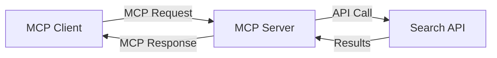
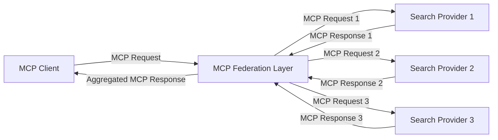
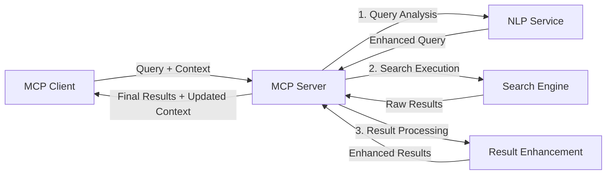

<!--
CO_OP_TRANSLATOR_METADATA:
{
  "original_hash": "333a03e51f90bdf3e6f1ba1694c73f36",
  "translation_date": "2025-07-17T11:00:58+00:00",
  "source_file": "05-AdvancedTopics/mcp-realtimesearch/README.md",
  "language_code": "sk"
}
-->
## Upozornenie k príkladom kódu

> **Dôležitá poznámka**: Nižšie uvedené príklady kódu demonštrujú integráciu Model Context Protocol (MCP) s funkciou webového vyhľadávania. Hoci nasledujú vzory a štruktúry oficiálnych MCP SDK, boli zjednodušené pre vzdelávacie účely.
> 
> Tieto príklady ukazujú:
> 
> 1. **Implementácia v Pythone**: Implementácia servera FastMCP, ktorý poskytuje nástroj na webové vyhľadávanie a pripája sa k externému vyhľadávaciemu API. Tento príklad demonštruje správu životného cyklu, spracovanie kontextu a implementáciu nástroja podľa vzorov [oficiálneho MCP Python SDK](https://github.com/modelcontextprotocol/python-sdk). Server využíva odporúčaný transport Streamable HTTP, ktorý nahradil starší SSE transport pre produkčné nasadenia.
> 
> 2. **Implementácia v JavaScripte**: Implementácia v TypeScripte/JavaScripte využívajúca vzor FastMCP z [oficiálneho MCP TypeScript SDK](https://github.com/modelcontextprotocol/typescript-sdk) na vytvorenie vyhľadávacieho servera so správnymi definíciami nástrojov a klientskymi pripojeniami. Nasleduje najnovšie odporúčané vzory pre správu relácií a zachovanie kontextu.
> 
> Tieto príklady by v produkčnom prostredí vyžadovali ďalšie spracovanie chýb, autentifikáciu a špecifickú integráciu API. Ukázané koncové body vyhľadávacieho API (`https://api.search-service.example/search`) sú zástupné a je potrebné ich nahradiť skutočnými koncovými bodmi vyhľadávacích služieb.
> 
> Pre kompletné implementačné detaily a najaktuálnejšie prístupy, prosím, pozrite si [oficiálnu špecifikáciu MCP](https://spec.modelcontextprotocol.io/) a dokumentáciu SDK.

## Základné koncepty

### Rámec Model Context Protocol (MCP)

Model Context Protocol poskytuje štandardizovaný spôsob, ako si AI modely, aplikácie a služby vymieňajú kontext. V reálnom čase webového vyhľadávania je tento rámec nevyhnutný pre vytváranie koherentných, viackolových vyhľadávacích skúseností. Kľúčové komponenty zahŕňajú:

1. **Klient-server architektúra**: MCP vytvára jasné oddelenie medzi vyhľadávacími klientmi (žiadajúcimi) a vyhľadávacími servermi (poskytovateľmi), čo umožňuje flexibilné modely nasadenia.

2. **Komunikácia JSON-RPC**: Protokol používa JSON-RPC na výmenu správ, čo ho robí kompatibilným s webovými technológiami a ľahko implementovateľným na rôznych platformách.

3. **Správa kontextu**: MCP definuje štruktúrované metódy na udržiavanie, aktualizáciu a využívanie vyhľadávacieho kontextu počas viacerých interakcií.

4. **Definície nástrojov**: Vyhľadávacie schopnosti sú vystavené ako štandardizované nástroje s dobre definovanými parametrami a návratovými hodnotami.

5. **Podpora streamovania**: Protokol podporuje streamovanie výsledkov, čo je nevyhnutné pre reálne časové vyhľadávanie, kde výsledky môžu prichádzať postupne.

### Vzory integrácie webového vyhľadávania

Pri integrácii MCP s webovým vyhľadávaním sa objavuje niekoľko vzorov:

#### 1. Priama integrácia poskytovateľa vyhľadávania

V tomto vzore MCP server priamo komunikuje s jedným alebo viacerými vyhľadávacími API, prekladá MCP požiadavky na API-špecifické volania a formátuje výsledky ako MCP odpovede.

#### 2. Federované vyhľadávanie so zachovaním kontextu

Tento vzor rozdeľuje vyhľadávacie dotazy medzi viacerých MCP-kompatibilných poskytovateľov vyhľadávania, z ktorých každý sa môže špecializovať na rôzne typy obsahu alebo vyhľadávacie schopnosti, pričom zachováva jednotný kontext.

#### 3. Reťazec vyhľadávania s vylepšeným kontextom

V tomto vzore je vyhľadávací proces rozdelený do viacerých fáz, pričom kontext sa na každom kroku obohacuje, čo vedie k postupne relevantnejším výsledkom.

### Komponenty vyhľadávacieho kontextu

V MCP založenom webovom vyhľadávaní kontext typicky zahŕňa:

- **Históriu dotazov**: Predchádzajúce vyhľadávacie dotazy v relácii
- **Preferencie používateľa**: Jazyk, región, nastavenia bezpečného vyhľadávania
- **Históriu interakcií**: Ktoré výsledky boli kliknuté, čas strávený pri výsledkoch
- **Vyhľadávacie parametre**: Filtre, poradie zoradenia a iné modifikátory vyhľadávania
- **Doménové znalosti**: Predmetovo špecifický kontext relevantný pre vyhľadávanie
- **Časový kontext**: Faktory relevantnosti založené na čase
- **Preferencie zdrojov**: Dôveryhodné alebo preferované informačné zdroje

## Prípady použitia a aplikácie

### Výskum a zhromažďovanie informácií

MCP zlepšuje pracovné postupy výskumu tým, že:

- Zachováva výskumný kontext počas vyhľadávacích relácií
- Umožňuje sofistikovanejšie a kontextovo relevantné dotazy
- Podporuje federované vyhľadávanie z viacerých zdrojov
- Uľahčuje extrakciu poznatkov z vyhľadávacích výsledkov

### Monitorovanie správ a trendov v reálnom čase

Vyhľadávanie poháňané MCP ponúka výhody pre monitorovanie správ:

- Objavovanie nových správ takmer v reálnom čase
- Kontextové filtrovanie relevantných informácií
- Sledovanie tém a entít naprieč viacerými zdrojmi
- Personalizované upozornenia na správy na základe používateľského kontextu

### AI rozšírené prehliadanie a výskum

MCP otvára nové možnosti pre AI rozšírené prehliadanie:

- Kontextové návrhy vyhľadávania založené na aktuálnej aktivite v prehliadači
- Bezproblémová integrácia webového vyhľadávania s asistentmi poháňanými LLM
- Viackolové vylepšovanie vyhľadávania so zachovaným kontextom
- Vylepšené overovanie faktov a kontrola informácií

## Budúce trendy a inovácie

### Vývoj MCP vo webovom vyhľadávaní

Do budúcnosti očakávame, že MCP sa bude vyvíjať tak, aby riešil:

- **Multimodálne vyhľadávanie**: Integrácia textového, obrazového, audio a video vyhľadávania so zachovaným kontextom
- **Decentralizované vyhľadávanie**: Podpora distribuovaných a federovaných vyhľadávacích ekosystémov
- **Ochrana súkromia pri vyhľadávaní**: Kontextovo uvedomelé mechanizmy vyhľadávania s ochranou súkromia  
- **Porozumenie dopytu**: Hlboké sémantické spracovanie vyhľadávacích dopytov v prirodzenom jazyku

### Potenciálne technologické pokroky

Nové technológie, ktoré budú formovať budúcnosť MCP vyhľadávania:

1. **Neurónové vyhľadávacie architektúry**: Vyhľadávacie systémy založené na embeddingoch optimalizované pre MCP  
2. **Personalizovaný kontext vyhľadávania**: Učenie sa individuálnych vzorcov vyhľadávania používateľov v čase  
3. **Integrácia znalostných grafov**: Kontextové vyhľadávanie vylepšené doménovo špecifickými znalostnými grafmi  
4. **Krosmodálny kontext**: Udržiavanie kontextu naprieč rôznymi vyhľadávacími modalitami

## Praktické cvičenia

### Cvičenie 1: Nastavenie základného MCP vyhľadávacieho reťazca

V tomto cvičení sa naučíte:  
- Konfigurovať základné MCP vyhľadávacie prostredie  
- Implementovať spracovateľov kontextu pre webové vyhľadávanie  
- Testovať a overovať zachovanie kontextu počas viacerých vyhľadávacích iterácií

### Cvičenie 2: Vytvorenie výskumného asistenta s MCP vyhľadávaním

Vytvorte kompletnú aplikáciu, ktorá:  
- Spracováva výskumné otázky v prirodzenom jazyku  
- Vykonáva kontextovo uvedomelé webové vyhľadávanie  
- Syntetizuje informácie z viacerých zdrojov  
- Predstavuje usporiadané výsledky výskumu

### Cvičenie 3: Implementácia federácie vyhľadávania z viacerých zdrojov s MCP

Pokročilé cvičenie zahŕňa:  
- Kontextovo uvedomelé smerovanie dopytov do viacerých vyhľadávacích enginov  
- Zoradenie a agregáciu výsledkov  
- Kontextovú deduplikáciu výsledkov vyhľadávania  
- Spracovanie metadát špecifických pre zdroje

## Dodatočné zdroje

- [Model Context Protocol Specification](https://spec.modelcontextprotocol.io/) - Oficiálna špecifikácia MCP a podrobná dokumentácia protokolu  
- [Model Context Protocol Documentation](https://modelcontextprotocol.io/) - Podrobné návody a implementačné príručky  
- [MCP Python SDK](https://github.com/modelcontextprotocol/python-sdk) - Oficiálna Python implementácia MCP protokolu  
- [MCP TypeScript SDK](https://github.com/modelcontextprotocol/typescript-sdk) - Oficiálna TypeScript implementácia MCP protokolu  
- [MCP Reference Servers](https://github.com/modelcontextprotocol/servers) - Referenčné implementácie MCP serverov  
- [Bing Web Search API Documentation](https://learn.microsoft.com/en-us/bing/search-apis/bing-web-search/overview) - Microsoft API pre webové vyhľadávanie  
- [Google Custom Search JSON API](https://developers.google.com/custom-search/v1/overview) - Programovateľný vyhľadávací engine Google  
- [SerpAPI Documentation](https://serpapi.com/search-api) - API pre výsledky vyhľadávania  
- [Meilisearch Documentation](https://www.meilisearch.com/docs) - Open-source vyhľadávací engine  
- [Elasticsearch Documentation](https://www.elastic.co/guide/index.html) - Distribuovaný vyhľadávací a analytický engine  
- [LangChain Documentation](https://python.langchain.com/docs/get_started/introduction) - Tvorba aplikácií s LLM

## Výsledky učenia

Po dokončení tohto modulu budete schopní:

- Pochopiť základy vyhľadávania na webe v reálnom čase a jeho výzvy  
- Vysvetliť, ako Model Context Protocol (MCP) zlepšuje možnosti vyhľadávania v reálnom čase  
- Implementovať vyhľadávacie riešenia založené na MCP pomocou populárnych frameworkov a API  
- Navrhovať a nasadzovať škálovateľné, vysoko výkonné vyhľadávacie architektúry s MCP  
- Aplikovať koncepty MCP na rôzne prípady použitia vrátane sémantického vyhľadávania, výskumných asistentov a AI-podporovaného prehliadania  
- Hodnotiť nové trendy a budúce inovácie v technológiách vyhľadávania založených na MCP

### Úvahy o dôvere a bezpečnosti

Pri implementácii MCP založených riešení webového vyhľadávania si zapamätajte tieto dôležité princípy zo špecifikácie MCP:

1. **Súhlas a kontrola používateľa**: Používatelia musia výslovne súhlasiť a rozumieť všetkým prístupom k dátam a operáciám. Toto je obzvlášť dôležité pri implementáciách webového vyhľadávania, ktoré môžu pristupovať k externým zdrojom dát.

2. **Ochrana súkromia dát**: Zabezpečte primerané zaobchádzanie s vyhľadávacími dopytmi a výsledkami, najmä ak môžu obsahovať citlivé informácie. Implementujte vhodné prístupové kontroly na ochranu používateľských dát.

3. **Bezpečnosť nástrojov**: Implementujte správnu autorizáciu a validáciu pre vyhľadávacie nástroje, pretože predstavujú potenciálne bezpečnostné riziká cez spúšťanie ľubovoľného kódu. Popisy správania nástrojov by sa mali považovať za nedôveryhodné, pokiaľ nepochádzajú z dôveryhodného servera.

4. **Jasná dokumentácia**: Poskytnite jasnú dokumentáciu o schopnostiach, obmedzeniach a bezpečnostných aspektoch vašej MCP implementácie podľa odporúčaní zo špecifikácie MCP.

5. **Robustné procesy súhlasu**: Vytvorte robustné procesy súhlasu a autorizácie, ktoré jasne vysvetľujú, čo každý nástroj robí pred jeho povolením, najmä pre nástroje, ktoré komunikujú s externými webovými zdrojmi.

Pre kompletné informácie o bezpečnosti a dôvere MCP sa odkazujte na [oficiálnu dokumentáciu](https://modelcontextprotocol.io/specification/2025-03-26#security-and-trust-%26-safety).

## Čo ďalej

- [5.12 Entra ID Authentication for Model Context Protocol Servers](../mcp-security-entra/README.md)

**Vyhlásenie o zodpovednosti**:  
Tento dokument bol preložený pomocou AI prekladateľskej služby [Co-op Translator](https://github.com/Azure/co-op-translator). Aj keď sa snažíme o presnosť, prosím, majte na pamäti, že automatizované preklady môžu obsahovať chyby alebo nepresnosti. Originálny dokument v jeho pôvodnom jazyku by mal byť považovaný za autoritatívny zdroj. Pre kritické informácie sa odporúča profesionálny ľudský preklad. Nie sme zodpovední za akékoľvek nedorozumenia alebo nesprávne interpretácie vyplývajúce z použitia tohto prekladu.