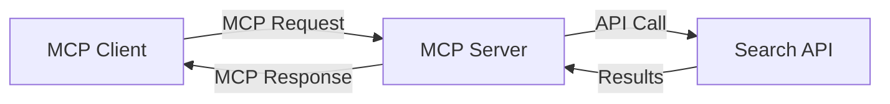
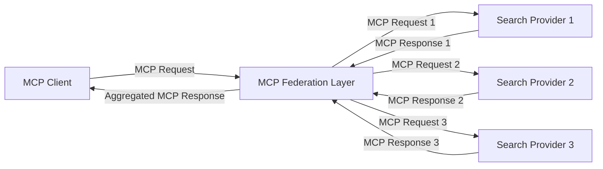
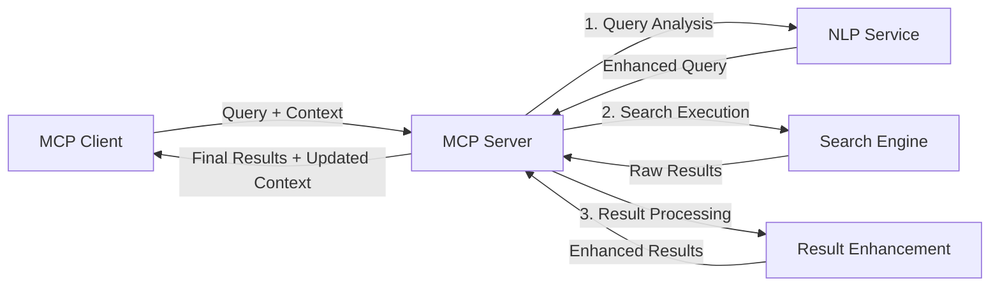

<!--
CO_OP_TRANSLATOR_METADATA:
{
  "original_hash": "eb12652eb7bd17f2193b835a344425c6",
  "translation_date": "2025-06-26T14:20:36+00:00",
  "source_file": "05-AdvancedTopics/mcp-realtimesearch/README.md",
  "language_code": "sk"
}
-->
## Upozornenie k príkladom kódu

> **Dôležité upozornenie**: Nižšie uvedené príklady kódu demonštrujú integráciu Model Context Protocol (MCP) s funkciami webového vyhľadávania. Aj keď nasledujú vzory a štruktúry oficiálnych MCP SDK, boli zjednodušené na účely vzdelávania.
> 
> Tieto príklady predstavujú:
> 
> 1. **Implementáciu v Pythone**: Implementáciu servera FastMCP, ktorý poskytuje nástroj na webové vyhľadávanie a pripája sa k externému vyhľadávaciemu API. Tento príklad ukazuje správu životného cyklu, manipuláciu s kontextom a implementáciu nástroja podľa vzorov [oficiálneho MCP Python SDK](https://github.com/modelcontextprotocol/python-sdk). Server využíva odporúčaný Streamable HTTP transport, ktorý nahradil starší SSE transport pre produkčné nasadenia.
> 
> 2. **Implementáciu v JavaScripte**: Implementáciu v TypeScripte/JavaScripte využívajúcu vzor FastMCP z [oficiálneho MCP TypeScript SDK](https://github.com/modelcontextprotocol/typescript-sdk) na vytvorenie vyhľadávacieho servera so správnymi definíciami nástrojov a klientskými pripojeniami. Nasleduje najnovšie odporúčané vzory pre správu relácií a zachovanie kontextu.
> 
> Tieto príklady by v produkčnom prostredí vyžadovali doplnenie o spracovanie chýb, autentifikáciu a špecifickú integráciu API. Ukázané vyhľadávacie API endpointy (`https://api.search-service.example/search`) sú zástupné a musia byť nahradené reálnymi koncovými bodmi vyhľadávacích služieb.
> 
> Pre úplné implementačné detaily a najaktuálnejšie prístupy navštívte [oficiálnu špecifikáciu MCP](https://spec.modelcontextprotocol.io/) a dokumentáciu SDK.

## Základné koncepty

### Rámec Model Context Protocol (MCP)

Model Context Protocol poskytuje štandardizovaný spôsob výmeny kontextu medzi AI modelmi, aplikáciami a službami. V reálnom čase webového vyhľadávania je tento rámec nevyhnutný pre vytváranie koherentných vyhľadávacích skúseností s viacerými kolami. Kľúčové komponenty zahŕňajú:

1. **Klient-server architektúra**: MCP jasne rozdeľuje vyhľadávacích klientov (žiadajúcich) a vyhľadávacie servery (poskytovateľov), čo umožňuje flexibilné modely nasadenia.

2. **Komunikácia JSON-RPC**: Protokol používa JSON-RPC na výmenu správ, čo zaručuje kompatibilitu s webovými technológiami a jednoduchú implementáciu na rôznych platformách.

3. **Správa kontextu**: MCP definuje štruktúrované metódy na udržiavanie, aktualizáciu a využívanie vyhľadávacieho kontextu počas viacerých interakcií.

4. **Definície nástrojov**: Vyhľadávacie schopnosti sú vystavené ako štandardizované nástroje s jasne definovanými parametrami a návratovými hodnotami.

5. **Podpora streamovania**: Protokol podporuje streamovanie výsledkov, čo je kľúčové pre reálne časové vyhľadávanie, kde výsledky môžu prichádzať postupne.

### Vzory integrácie webového vyhľadávania

Pri integrácii MCP s webovým vyhľadávaním sa objavujú viaceré vzory:

#### 1. Priama integrácia poskytovateľa vyhľadávania

V tomto vzore MCP server priamo komunikuje s jedným alebo viacerými vyhľadávacími API, prekladá MCP požiadavky na API-špecifické volania a formátuje výsledky ako MCP odpovede.

#### 2. Federované vyhľadávanie so zachovaním kontextu

Tento vzor rozdeľuje vyhľadávacie dotazy medzi viacerých MCP-kompatibilných poskytovateľov vyhľadávania, z ktorých každý sa môže špecializovať na rôzne typy obsahu alebo vyhľadávacie schopnosti, pričom zachováva jednotný kontext.

#### 3. Vyhľadávací reťazec s rozšíreným kontextom

V tomto vzore je vyhľadávací proces rozdelený do viacerých fáz, pričom kontext sa na každom kroku obohacuje, čo vedie k postupne relevantnejším výsledkom.

### Komponenty vyhľadávacieho kontextu

V MCP založenom webovom vyhľadávaní kontext zvyčajne zahŕňa:

- **Históriu dotazov**: Predchádzajúce vyhľadávacie dotazy v relácii
- **Preferencie používateľa**: Jazyk, región, nastavenia bezpečného vyhľadávania
- **Históriu interakcií**: Kliknuté výsledky, čas strávený pri výsledkoch
- **Vyhľadávacie parametre**: Filtre, zoradenie a iné modifikátory vyhľadávania
- **Doménové znalosti**: Kontext špecifický pre predmet vyhľadávania
- **Časový kontext**: Faktory relevantnosti založené na čase
- **Preferencie zdrojov**: Dôveryhodné alebo preferované informačné zdroje

## Prípady použitia a aplikácie

### Výskum a zber informácií

MCP zlepšuje pracovné postupy výskumu tým, že:

- Zachováva kontext výskumu naprieč vyhľadávacími reláciami
- Umožňuje sofistikovanejšie a kontextovo relevantné dotazy
- Podporuje federáciu vyhľadávania z viacerých zdrojov
- Uľahčuje extrakciu znalostí z vyhľadávacích výsledkov

### Monitorovanie správ a trendov v reálnom čase

Vyhľadávanie poháňané MCP ponúka výhody pre monitorovanie správ:

- Takmer okamžité objavovanie nových správ
- Kontextové filtrovanie relevantných informácií
- Sledovanie tém a entít naprieč viacerými zdrojmi
- Personalizované upozornenia na správy na základe používateľského kontextu

### AI rozšírené prehliadanie a výskum

MCP otvára nové možnosti pre AI rozšírené prehliadanie:

- Kontextové návrhy vyhľadávania založené na aktuálnej aktivite prehliadača
- Bezproblémová integrácia webového vyhľadávania s asistentmi poháňanými LLM
- Viackolové spresňovanie vyhľadávania so zachovaným kontextom
- Vylepšené overovanie faktov a kontrola informácií

## Budúce trendy a inovácie

### Vývoj MCP vo webovom vyhľadávaní

Do budúcnosti očakávame, že MCP sa bude vyvíjať tak, aby riešil:

- **Multimodálne vyhľadávanie**: Integrácia textového, obrazového, zvukového a video vyhľadávania so zachovaným kontextom
- **Decentralizované vyhľadávanie**: Podpora distribuovaných a federovaných vyhľadávacích ekosystémov
- **Súkromie pri vyhľadávaní**: Kontextovo uvedomelé mechanizmy na ochranu súkromia pri vyhľadávaní
- **Porozumenie dotazom**: Hlboké sémantické spracovanie prirodzeného jazyka vo vyhľadávacích dotazoch

### Potenciálne technologické pokroky

Nové technológie, ktoré ovplyvnia budúcnosť MCP vyhľadávania:

1. **Neurónové vyhľadávacie architektúry**: Vyhľadávacie systémy založené na vektorových reprezentáciách optimalizované pre MCP
2. **Personalizovaný vyhľadávací kontext**: Učenie sa individuálnych vzorcov vyhľadávania používateľa v čase
3. **Integrácia znalostných grafov**: Kontextové vyhľadávanie obohatené o doménovo špecifické znalostné grafy
4. **Krosmodálny kontext**: Zachovanie kontextu naprieč rôznymi modalitami vyhľadávania

## Praktické cvičenia

### Cvičenie 1: Nastavenie základného MCP vyhľadávacieho pipeline

V tomto cvičení sa naučíte:
- Konfigurovať základné MCP vyhľadávacie prostredie
- Implementovať správu kontextu pre webové vyhľadávanie
- Testovať a overovať zachovanie kontextu naprieč vyhľadávacími iteráciami

### Cvičenie 2: Vytvorenie výskumného asistenta s MCP vyhľadávaním

Vytvorte kompletnú aplikáciu, ktorá:
- Spracováva výskumné otázky v prirodzenom jazyku
- Vykonáva kontextovo uvedomelé webové vyhľadávanie
- Synthesizuje informácie z viacerých zdrojov
- Predstavuje organizované výskumné výsledky

### Cvičenie 3: Implementácia federovaného vyhľadávania z viacerých zdrojov s MCP

Pokročilé cvičenie pokrývajúce:
- Kontextovo uvedomelé smerovanie dotazov do viacerých vyhľadávacích enginov
- Zoradenie a agregáciu výsledkov
- Kontextovú deduplikáciu vyhľadávacích výsledkov
- Spracovanie metadát špecifických pre zdroje

## Dodatočné zdroje

- [Model Context Protocol Specification](https://spec.modelcontextprotocol.io/) - Oficiálna špecifikácia MCP a podrobná dokumentácia protokolu
- [Model Context Protocol Documentation](https://modelcontextprotocol.io/) - Podrobné návody a implementačné príručky
- [MCP Python SDK](https://github.com/modelcontextprotocol/python-sdk) - Oficiálna Python implementácia MCP protokolu
- [MCP TypeScript SDK](https://github.com/modelcontextprotocol/typescript-sdk) - Oficiálna TypeScript implementácia MCP protokolu
- [MCP Reference Servers](https://github.com/modelcontextprotocol/servers) - Referenčné implementácie MCP serverov
- [Bing Web Search API Documentation](https://learn.microsoft.com/en-us/bing/search-apis/bing-web-search/overview) - Microsoft API pre webové vyhľadávanie
- [Google Custom Search JSON API](https://developers.google.com/custom-search/v1/overview) - Google programovateľný vyhľadávací engine
- [SerpAPI Documentation](https://serpapi.com/search-api) - API pre výsledkové stránky vyhľadávačov
- [Meilisearch Documentation](https://www.meilisearch.com/docs) - Open-source vyhľadávací engine
- [Elasticsearch Documentation](https://www.elastic.co/guide/index.html) - Distribuovaný vyhľadávací a analytický engine
- [LangChain Documentation](https://python.langchain.com/docs/get_started/introduction) - Tvorba aplikácií s LLM

## Výsledky učenia

Po dokončení tohto modulu budete schopní:

- Pochopiť základy reálneho časového webového vyhľadávania a jeho výzvy
- Vysvetliť, ako Model Context Protocol (MCP) zlepšuje schopnosti reálneho časového vyhľadávania
- Implementovať vyhľadávacie riešenia založené na MCP s využitím populárnych rámcov a API
- Navrhovať a nasadzovať škálovateľné, vysoko výkonné vyhľadávacie architektúry s MCP
- Aplikovať koncepty MCP na rôzne prípady použitia vrátane sémantického vyhľadávania, asistencie pri výskume a AI rozšíreného prehliadania
- Hodnotiť vznikajúce trendy a budúce inovácie v technológiách vyhľadávania založených na MCP

### Úvahy o dôvere a bezpečnosti

Pri implementácii MCP založených riešení webového vyhľadávania majte na pamäti tieto dôležité princípy zo špecifikácie MCP:

1. **Súhlas a kontrola používateľa**: Používatelia musia výslovne súhlasiť a rozumieť všetkým prístupom k údajom a operáciám. To je obzvlášť dôležité pri implementáciách webového vyhľadávania, ktoré môžu pristupovať k externým zdrojom dát.

2. **Ochrana súkromia údajov**: Zabezpečte primerané zaobchádzanie s vyhľadávacími dotazmi a výsledkami, najmä ak môžu obsahovať citlivé informácie. Implementujte adekvátne prístupové kontroly na ochranu používateľských dát.

3. **Bezpečnosť nástrojov**: Implementujte správnu autorizáciu a validáciu pre vyhľadávacie nástroje, pretože predstavujú potenciálne bezpečnostné riziká cez spúšťanie ľubovoľného kódu. Popisy správania nástrojov by sa mali považovať za nedôveryhodné, pokiaľ nepochádzajú z dôveryhodného servera.

4. **Jasná dokumentácia**: Poskytnite jasnú dokumentáciu o schopnostiach, obmedzeniach a bezpečnostných aspektoch vašej MCP založenej implementácie vyhľadávania, v súlade s implementačnými pokynmi zo špecifikácie MCP.

5. **Robustné procesy súhlasu**: Vytvorte robustné procesy získavania súhlasu a autorizácie, ktoré jasne vysvetľujú, čo každý nástroj robí pred jeho povolením, najmä pre nástroje, ktoré komunikujú s externými webovými zdrojmi.

Pre úplné informácie o bezpečnosti a dôvere MCP pozrite [oficiálnu dokumentáciu](https://modelcontextprotocol.io/specification/2025-03-26#security-and-trust-%26-safety).

## Čo ďalej

- [5.11 Autentifikácia Entra ID pre Model Context Protocol servery](../mcp-security-entra/README.md)

**Zrieknutie sa zodpovednosti**:  
Tento dokument bol preložený pomocou AI prekladateľskej služby [Co-op Translator](https://github.com/Azure/co-op-translator). Aj keď sa snažíme o presnosť, vezmite prosím na vedomie, že automatické preklady môžu obsahovať chyby alebo nepresnosti. Originálny dokument v jeho pôvodnom jazyku by mal byť považovaný za autoritatívny zdroj. Pre dôležité informácie sa odporúča profesionálny ľudský preklad. Nie sme zodpovední za akékoľvek nedorozumenia alebo nesprávne výklady vyplývajúce z použitia tohto prekladu.