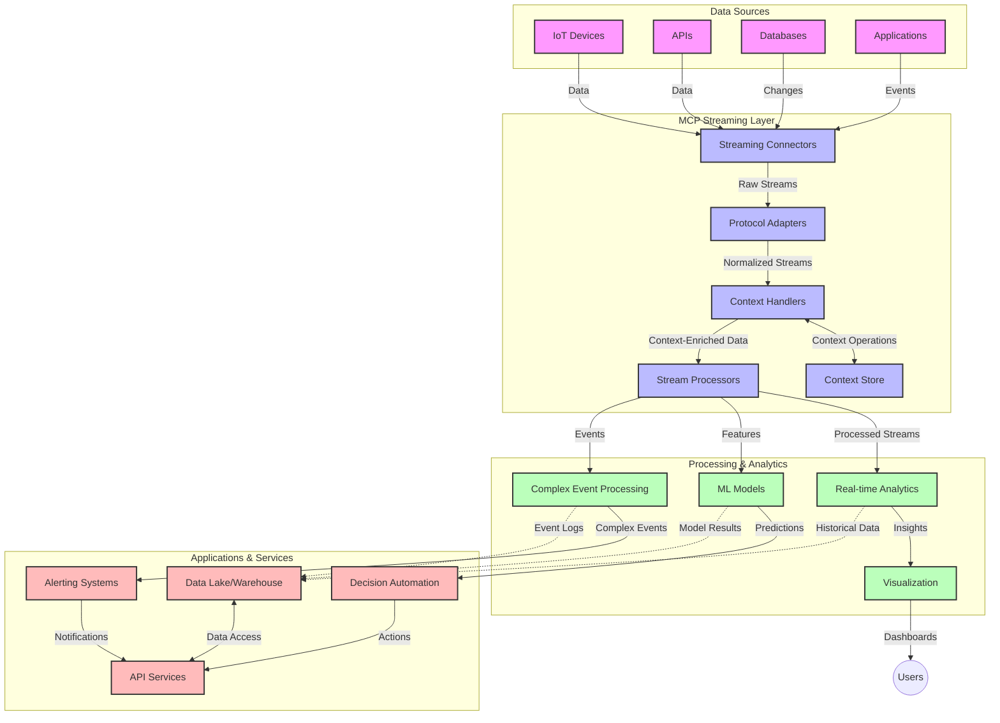

<!--
CO_OP_TRANSLATOR_METADATA:
{
  "original_hash": "b41174ac781ebf228b2043cbdfc09105",
  "translation_date": "2025-06-12T00:46:57+00:00",
  "source_file": "05-AdvancedTopics/mcp-realtimestreaming/README.md",
  "language_code": "sk"
}
-->
# Protokol kontextu modelu pre streamovanie dát v reálnom čase

## Prehľad

Streamovanie dát v reálnom čase sa stalo nevyhnutnosťou v dnešnom svete orientovanom na dáta, kde podniky a aplikácie potrebujú okamžitý prístup k informáciám na prijímanie včasných rozhodnutí. Protokol kontextu modelu (MCP) predstavuje významný pokrok v optimalizácii týchto procesov streamovania v reálnom čase, zlepšuje efektivitu spracovania dát, zachováva kontextovú integritu a zvyšuje celkový výkon systému.

Tento modul skúma, ako MCP transformuje streamovanie dát v reálnom čase tým, že poskytuje štandardizovaný prístup k správe kontextu naprieč AI modelmi, streamovacími platformami a aplikáciami.

## Úvod do streamovania dát v reálnom čase

Streamovanie dát v reálnom čase je technologický prístup, ktorý umožňuje kontinuálny prenos, spracovanie a analýzu dát počas ich generovania, čo umožňuje systémom okamžite reagovať na nové informácie. Na rozdiel od tradičného dávkového spracovania, ktoré pracuje so statickými súbormi dát, streamovanie spracováva dáta počas ich prúdenia a poskytuje poznatky a akcie s minimálnou latenciou.

### Základné pojmy streamovania dát v reálnom čase:

- **Kontinuálny tok dát**: Dáta sa spracovávajú ako nepretržitý, nikdy nekončiaci prúd udalostí alebo záznamov.
- **Nízka latencia spracovania**: Systémy sú navrhnuté tak, aby minimalizovali čas medzi generovaním dát a ich spracovaním.
- **Škálovateľnosť**: Architektúry streamovania musia zvládať variabilné objemy a rýchlosti dát.
- **Odolnosť voči chybám**: Systémy musia byť odolné voči zlyhaniam, aby zabezpečili nepretržitý tok dát.
- **Spracovanie so stavom**: Udržiavanie kontextu naprieč udalosťami je kľúčové pre zmysluplnú analýzu.

### Protokol kontextu modelu a streamovanie v reálnom čase

Protokol kontextu modelu (MCP) rieši niekoľko kritických výziev v prostredí streamovania v reálnom čase:

1. **Kontextová kontinuita**: MCP štandardizuje spôsob, akým sa kontext udržiava naprieč distribuovanými streamovacími komponentmi, čím zabezpečuje, že AI modely a spracovateľské uzly majú prístup k relevantnému historickému a environmentálnemu kontextu.

2. **Efektívna správa stavu**: Poskytovaním štruktúrovaných mechanizmov pre prenos kontextu MCP znižuje režijné náklady správy stavu v streamovacích pipeline.

3. **Interoperabilita**: MCP vytvára spoločný jazyk pre zdieľanie kontextu medzi rôznymi streamovacími technológiami a AI modelmi, čo umožňuje flexibilnejšie a rozšíriteľnejšie architektúry.

4. **Kontext optimalizovaný pre streamovanie**: Implementácie MCP môžu uprednostniť, ktoré prvky kontextu sú najrelevantnejšie pre rozhodovanie v reálnom čase, čím sa optimalizuje výkon aj presnosť.

5. **Adaptívne spracovanie**: Vďaka správnej správe kontextu prostredníctvom MCP môžu streamovacie systémy dynamicky prispôsobovať spracovanie na základe vyvíjajúcich sa podmienok a vzorov v dátach.

V moderných aplikáciách od IoT senzorových sietí po finančné obchodné platformy umožňuje integrácia MCP so streamovacími technológiami inteligentnejšie, kontextovo uvedomelé spracovanie, ktoré dokáže adekvátne reagovať na komplexné a menlivé situácie v reálnom čase.

## Ciele učenia

Na konci tejto lekcie budete schopní:

- Pochopiť základy streamovania dát v reálnom čase a jeho výzvy
- Vysvetliť, ako Protokol kontextu modelu (MCP) zlepšuje streamovanie dát v reálnom čase
- Implementovať riešenia streamovania založené na MCP pomocou populárnych frameworkov ako Kafka a Pulsar
- Navrhnúť a nasadiť odolné a vysoko výkonné streamovacie architektúry s MCP
- Aplikovať koncepty MCP v prípadoch použitia IoT, finančného obchodovania a analytiky riadenej AI
- Vyhodnotiť vznikajúce trendy a budúce inovácie v technológiách streamovania založených na MCP

### Definícia a význam

Streamovanie dát v reálnom čase zahŕňa kontinuálnu generáciu, spracovanie a doručovanie dát s minimálnou latenciou. Na rozdiel od dávkového spracovania, kde sa dáta zhromažďujú a spracovávajú v skupinách, sa streamované dáta spracovávajú postupne, hneď ako prichádzajú, čo umožňuje okamžité poznatky a reakcie.

Kľúčové charakteristiky streamovania dát v reálnom čase zahŕňajú:

- **Nízka latencia**: Spracovanie a analýza dát v priebehu milisekúnd až sekúnd
- **Kontinuálny tok**: Neprerušené prúdy dát z rôznych zdrojov
- **Okamžité spracovanie**: Analýza dát ihneď po ich príchode, nie v dávkach
- **Architektúra riadená udalosťami**: Reakcia na udalosti v okamihu ich výskytu

### Výzvy v tradičnom streamovaní dát

Tradičné prístupy k streamovaniu dát čelia viacerým obmedzeniam:

1. **Strata kontextu**: Problémy s udržiavaním kontextu naprieč distribuovanými systémami
2. **Problémy so škálovateľnosťou**: Ťažkosti so škálovaním na vysoké objemy a rýchlosti dát
3. **Komplexná integrácia**: Problémy s interoperabilitou medzi rôznymi systémami
4. **Správa latencie**: Vyváženie priepustnosti a času spracovania
5. **Konzistencia dát**: Zabezpečenie presnosti a úplnosti dát v celom prúde

## Pochopenie Protokolu kontextu modelu (MCP)

### Čo je MCP?

Protokol kontextu modelu (MCP) je štandardizovaný komunikačný protokol navrhnutý na efektívnu interakciu medzi AI modelmi a aplikáciami. V kontexte streamovania dát v reálnom čase poskytuje MCP rámec pre:

- Zachovanie kontextu počas celého dátového pipeline
- Štandardizáciu formátov výmeny dát
- Optimalizáciu prenosu veľkých datasetov
- Zlepšenie komunikácie medzi modelmi a medzi modelmi a aplikáciami

### Základné komponenty a architektúra

Architektúra MCP pre streamovanie v reálnom čase pozostáva z niekoľkých kľúčových komponentov:

1. **Správci kontextu**: Spravujú a udržiavajú kontextové informácie v celom streamovacom pipeline
2. **Streamovacie procesory**: Spracovávajú prichádzajúce dátové prúdy s využitím kontextovo uvedomelých techník
3. **Protokolové adaptéry**: Konvertujú medzi rôznymi streamovacími protokolmi pri zachovaní kontextu
4. **Úložisko kontextu**: Efektívne ukladá a získava kontextové informácie
5. **Streamovacie konektory**: Pripájajú sa k rôznym streamovacím platformám (Kafka, Pulsar, Kinesis a pod.)



### Ako MCP zlepšuje spracovanie dát v reálnom čase

MCP rieši tradičné výzvy streamovania prostredníctvom:

- **Kontextovej integrity**: Udržiavanie vzťahov medzi dátovými bodmi v celom pipeline
- **Optimalizovaného prenosu**: Znižovanie redundancie vo výmene dát inteligentnou správou kontextu
- **Štandardizovaných rozhraní**: Poskytovanie konzistentných API pre streamovacie komponenty
- **Zníženej latencie**: Minimalizovanie režijných nákladov spracovania efektívnym nakladaním s kontextom
- **Zlepšenej škálovateľnosti**: Podpora horizontálneho škálovania pri zachovaní kontextu

## Integrácia a implementácia

Streamovacie systémy v reálnom čase vyžadujú starostlivý návrh architektúry a implementáciu, aby sa zachoval výkon aj kontextová integrita. Protokol kontextu modelu ponúka štandardizovaný prístup k integrácii AI modelov a streamovacích technológií, čo umožňuje sofistikovanejšie, kontextovo uvedomelé spracovanie pipeline.

### Prehľad integrácie MCP v streamovacích architektúrach

Implementácia MCP v prostredí streamovania v reálnom čase zahŕňa niekoľko dôležitých aspektov:

1. **Serializácia a prenos kontextu**: MCP poskytuje efektívne mechanizmy na kódovanie kontextových informácií v dátových paketoch streamu, čím zabezpečuje, že kľúčový kontext sprevádza dáta počas celého spracovania. To zahŕňa štandardizované serializačné formáty optimalizované pre streamovací prenos.

2. **Spracovanie so stavom**: MCP umožňuje inteligentnejšie spracovanie so stavom udržiavaním konzistentnej reprezentácie kontextu naprieč spracovateľskými uzlami. Toto je obzvlášť cenné v distribuovaných streamovacích architektúrach, kde je správa stavu tradične náročná.

3. **Čas udalosti vs. čas spracovania**: Implementácie MCP musia riešiť bežný problém rozlíšenia, kedy udalosti nastali a kedy sú spracované. Protokol môže začleniť časový kontext, ktorý zachováva sémantiku času udalosti.

4. **Správa spätného tlaku (backpressure)**: Štandardizáciou správy kontextu MCP pomáha riadiť spätný tlak v streamovacích systémoch, umožňujúc komponentom komunikovať svoje spracovateľské kapacity a podľa toho prispôsobovať tok dát.

5. **Okno kontextu a agregácia**: MCP podporuje sofistikovanejšie operácie okien poskytovaním štruktúrovaných reprezentácií časového a vzťahového kontextu, čo umožňuje zmysluplnejšie agregácie naprieč prúdmi udalostí.

6. **Presné spracovanie raz (exactly-once)**: V streamovacích systémoch vyžadujúcich presné spracovanie raz môže MCP začleniť metadáta spracovania na sledovanie a overovanie stavu spracovania naprieč distribuovanými komponentmi.

Implementácia MCP naprieč rôznymi streamovacími technológiami vytvára jednotný prístup k správe kontextu, znižuje potrebu vlastného integračného kódu a zároveň zlepšuje schopnosť systému udržiavať zmysluplný kontext počas toku dát pipeline.

### MCP v rôznych frameworkoch pre streamovanie dát

Tieto príklady vychádzajú z aktuálnej špecifikácie MCP, ktorá sa zameriava na protokol založený na JSON-RPC s rôznymi transportnými mechanizmami. Kód demonštruje, ako môžete implementovať vlastné transporty integrujúce streamovacie platformy ako Kafka a Pulsar, pričom zachovávajú plnú kompatibilitu s protokolom MCP.

Príklady ukazujú, ako možno streamovacie platformy spojiť s MCP na zabezpečenie spracovania dát v reálnom čase pri zachovaní kontextového povedomia, ktoré je pre MCP zásadné. Tento prístup zabezpečuje, že ukážky kódu presne odrážajú aktuálny stav špecifikácie MCP k júnu 2025.

MCP možno integrovať s populárnymi streamovacími frameworkmi vrátane:

#### Integrácia Apache Kafka

```python
import asyncio
import json
from typing import Dict, Any, Optional
from confluent_kafka import Consumer, Producer, KafkaError
from mcp.client import Client, ClientCapabilities
from mcp.core.message import JsonRpcMessage
from mcp.core.transports import Transport

# Custom transport class to bridge MCP with Kafka
class KafkaMCPTransport(Transport):
    def __init__(self, bootstrap_servers: str, input_topic: str, output_topic: str):
        self.bootstrap_servers = bootstrap_servers
        self.input_topic = input_topic
        self.output_topic = output_topic
        self.producer = Producer({'bootstrap.servers': bootstrap_servers})
        self.consumer = Consumer({
            'bootstrap.servers': bootstrap_servers,
            'group.id': 'mcp-client-group',
            'auto.offset.reset': 'earliest'
        })
        self.message_queue = asyncio.Queue()
        self.running = False
        self.consumer_task = None
        
    async def connect(self):
        """Connect to Kafka and start consuming messages"""
        self.consumer.subscribe([self.input_topic])
        self.running = True
        self.consumer_task = asyncio.create_task(self._consume_messages())
        return self
        
    async def _consume_messages(self):
        """Background task to consume messages from Kafka and queue them for processing"""
        while self.running:
            try:
                msg = self.consumer.poll(1.0)
                if msg is None:
                    await asyncio.sleep(0.1)
                    continue
                
                if msg.error():
                    if msg.error().code() == KafkaError._PARTITION_EOF:
                        continue
                    print(f"Consumer error: {msg.error()}")
                    continue
                
                # Parse the message value as JSON-RPC
                try:
                    message_str = msg.value().decode('utf-8')
                    message_data = json.loads(message_str)
                    mcp_message = JsonRpcMessage.from_dict(message_data)
                    await self.message_queue.put(mcp_message)
                except Exception as e:
                    print(f"Error parsing message: {e}")
            except Exception as e:
                print(f"Error in consumer loop: {e}")
                await asyncio.sleep(1)
    
    async def read(self) -> Optional[JsonRpcMessage]:
        """Read the next message from the queue"""
        try:
            message = await self.message_queue.get()
            return message
        except Exception as e:
            print(f"Error reading message: {e}")
            return None
    
    async def write(self, message: JsonRpcMessage) -> None:
        """Write a message to the Kafka output topic"""
        try:
            message_json = json.dumps(message.to_dict())
            self.producer.produce(
                self.output_topic,
                message_json.encode('utf-8'),
                callback=self._delivery_report
            )
            self.producer.poll(0)  # Trigger callbacks
        except Exception as e:
            print(f"Error writing message: {e}")
    
    def _delivery_report(self, err, msg):
        """Kafka producer delivery callback"""
        if err is not None:
            print(f'Message delivery failed: {err}')
        else:
            print(f'Message delivered to {msg.topic()} [{msg.partition()}]')
    
    async def close(self) -> None:
        """Close the transport"""
        self.running = False
        if self.consumer_task:
            self.consumer_task.cancel()
            try:
                await self.consumer_task
            except asyncio.CancelledError:
                pass
        self.consumer.close()
        self.producer.flush()

# Example usage of the Kafka MCP transport
async def kafka_mcp_example():
    # Create MCP client with Kafka transport
    client = Client(
        {"name": "kafka-mcp-client", "version": "1.0.0"},
        ClientCapabilities({})
    )
    
    # Create and connect the Kafka transport
    transport = KafkaMCPTransport(
        bootstrap_servers="localhost:9092",
        input_topic="mcp-responses",
        output_topic="mcp-requests"
    )
    
    await client.connect(transport)
    
    try:
        # Initialize the MCP session
        await client.initialize()
        
        # Example of executing a tool via MCP
        response = await client.execute_tool(
            "process_data",
            {
                "data": "sample data",
                "metadata": {
                    "source": "sensor-1",
                    "timestamp": "2025-06-12T10:30:00Z"
                }
            }
        )
        
        print(f"Tool execution response: {response}")
        
        # Clean shutdown
        await client.shutdown()
    finally:
        await transport.close()

# Run the example
if __name__ == "__main__":
    asyncio.run(kafka_mcp_example())
```

#### Implementácia Apache Pulsar

```python
import asyncio
import json
import pulsar
from typing import Dict, Any, Optional
from mcp.core.message import JsonRpcMessage
from mcp.core.transports import Transport
from mcp.server import Server, ServerOptions
from mcp.server.tools import Tool, ToolExecutionContext, ToolMetadata

# Create a custom MCP transport that uses Pulsar
class PulsarMCPTransport(Transport):
    def __init__(self, service_url: str, request_topic: str, response_topic: str):
        self.service_url = service_url
        self.request_topic = request_topic
        self.response_topic = response_topic
        self.client = pulsar.Client(service_url)
        self.producer = self.client.create_producer(response_topic)
        self.consumer = self.client.subscribe(
            request_topic,
            "mcp-server-subscription",
            consumer_type=pulsar.ConsumerType.Shared
        )
        self.message_queue = asyncio.Queue()
        self.running = False
        self.consumer_task = None
    
    async def connect(self):
        """Connect to Pulsar and start consuming messages"""
        self.running = True
        self.consumer_task = asyncio.create_task(self._consume_messages())
        return self
    
    async def _consume_messages(self):
        """Background task to consume messages from Pulsar and queue them for processing"""
        while self.running:
            try:
                # Non-blocking receive with timeout
                msg = self.consumer.receive(timeout_millis=500)
                
                # Process the message
                try:
                    message_str = msg.data().decode('utf-8')
                    message_data = json.loads(message_str)
                    mcp_message = JsonRpcMessage.from_dict(message_data)
                    await self.message_queue.put(mcp_message)
                    
                    # Acknowledge the message
                    self.consumer.acknowledge(msg)
                except Exception as e:
                    print(f"Error processing message: {e}")
                    # Negative acknowledge if there was an error
                    self.consumer.negative_acknowledge(msg)
            except Exception as e:
                # Handle timeout or other exceptions
                await asyncio.sleep(0.1)
    
    async def read(self) -> Optional[JsonRpcMessage]:
        """Read the next message from the queue"""
        try:
            message = await self.message_queue.get()
            return message
        except Exception as e:
            print(f"Error reading message: {e}")
            return None
    
    async def write(self, message: JsonRpcMessage) -> None:
        """Write a message to the Pulsar output topic"""
        try:
            message_json = json.dumps(message.to_dict())
            self.producer.send(message_json.encode('utf-8'))
        except Exception as e:
            print(f"Error writing message: {e}")
    
    async def close(self) -> None:
        """Close the transport"""
        self.running = False
        if self.consumer_task:
            self.consumer_task.cancel()
            try:
                await self.consumer_task
            except asyncio.CancelledError:
                pass
        self.consumer.close()
        self.producer.close()
        self.client.close()

# Define a sample MCP tool that processes streaming data
@Tool(
    name="process_streaming_data",
    description="Process streaming data with context preservation",
    metadata=ToolMetadata(
        required_capabilities=["streaming"]
    )
)
async def process_streaming_data(
    ctx: ToolExecutionContext,
    data: str,
    source: str,
    priority: str = "medium"
) -> Dict[str, Any]:
    """
    Process streaming data while preserving context
    
    Args:
        ctx: Tool execution context
        data: The data to process
        source: The source of the data
        priority: Priority level (low, medium, high)
        
    Returns:
        Dict containing processed results and context information
    """
    # Example processing that leverages MCP context
    print(f"Processing data from {source} with priority {priority}")
    
    # Access conversation context from MCP
    conversation_id = ctx.conversation_id if hasattr(ctx, 'conversation_id') else "unknown"
    
    # Return results with enhanced context
    return {
        "processed_data": f"Processed: {data}",
        "context": {
            "conversation_id": conversation_id,
            "source": source,
            "priority": priority,
            "processing_timestamp": ctx.get_current_time_iso()
        }
    }

# Example MCP server implementation using Pulsar transport
async def run_mcp_server_with_pulsar():
    # Create MCP server
    server = Server(
        {"name": "pulsar-mcp-server", "version": "1.0.0"},
        ServerOptions(
            capabilities={"streaming": True}
        )
    )
    
    # Register our tool
    server.register_tool(process_streaming_data)
    
    # Create and connect Pulsar transport
    transport = PulsarMCPTransport(
        service_url="pulsar://localhost:6650",
        request_topic="mcp-requests",
        response_topic="mcp-responses"
    )
    
    try:
        # Start the server with the Pulsar transport
        await server.run(transport)
    finally:
        await transport.close()

# Run the server
if __name__ == "__main__":
    asyncio.run(run_mcp_server_with_pulsar())
```

### Najlepšie praktiky nasadenia

Pri implementácii MCP pre streamovanie v reálnom čase:

1. **Návrh pre odolnosť voči chybám**:
   - Implementujte správu chýb
   - Používajte dead-letter fronty pre neúspešné správy
   - Navrhujte idempotentné procesory

2. **Optimalizácia výkonu**:
   - Konfigurujte vhodné veľkosti bufferov
   - Používajte dávkovanie tam, kde je vhodné
   - Implementujte mechanizmy spätného tlaku

3. **Monitorovanie a pozorovanie**:
   - Sledujte metriky spracovania prúdov
   - Monitorujte propagáciu kontextu
   - Nastavte upozornenia na anomálie

4. **Zabezpečenie prúdov**:
   - Implementujte šifrovanie citlivých dát
   - Používajte autentifikáciu a autorizáciu
   - Aplikujte správnu kontrolu prístupu

### MCP v IoT a edge computingu

MCP zlepšuje streamovanie IoT tým, že:

- Zachováva kontext zariadení v celom spracovacom pipeline
- Umožňuje efektívne streamovanie dát z edge do cloudu
- Podporuje analýzy v reálnom čase na IoT dátových prúdoch
- Uľahčuje komunikáciu zariadenie-zariadenie s kontextom

Príklad: Senzorové siete inteligentných miest  
```
Sensors → Edge Gateways → MCP Stream Processors → Real-time Analytics → Automated Responses
```

### Úloha vo finančných transakciách a vysokofrekvenčnom obchodovaní

MCP prináša významné výhody pre finančné streamovanie dát:

- Ultra nízke latencie spracovania pre obchodné rozhodnutia
- Zachovanie kontextu transakcií počas spracovania
- Podpora komplexného spracovania udalostí s kontextovým povedomím
- Zabezpečenie konzistencie dát naprieč distribuovanými obchodnými systémami

### Zlepšenie analytiky riadenej AI

MCP otvára nové možnosti pre streamovaciu analytiku:

- Tréning a inferencia modelov v reálnom čase
- Kontinuálne učenie zo streamovaných dát
- Kontextovo uvedomelé extrahovanie vlastností
- Pipelines s viacerými modelmi pri zachovaní kontextu

## Budúce trendy a inovácie

### Vývoj MCP v prostredí reálneho času

Do budúcnosti očakávame, že MCP sa bude vyvíjať s cieľom riešiť:

- **Integráciu kvantového počítania**: Príprava na streamovacie systémy založené na kvantovej technológii
- **Edge-native spracovanie**: Presun väčšiny kontextovo uvedomelého spracovania na edge zariadenia
- **Autonómna správa streamov**: Samooptimalizujúce sa streamovacie pipeline
- **Federované streamovanie**: Distribuované spracovanie pri zachovaní súkromia

### Potenciálne technologické pokroky

Vznikajúce technológie, ktoré ovplyvnia budúcnosť streamovania MCP:

1. **AI-optimalizované streamovacie protokoly**: Vlastné protokoly špecificky navrhnuté pre AI pracovné zaťaženia
2. **Integrácia neuromorfných počítačov**: Mozgom inšpirované počítače pre spracovanie prúdov
3. **Serverless streamovanie**: Udalosťami riadené, škálovateľné streamovanie bez správy infraštruktúry
4. **Distribuované úložiská kontextu**: Globálne distribuované, no vysoko konzistentné spravovanie kontextu

## Praktické cvičenia

### Cvičenie 1: Nastavenie základného MCP streamovacieho pipeline

V tomto cvičení sa naučíte:

- Konfigurovať základné MCP streamovacie prostredie
- Implementovať správu kontextu pre spracovanie prúdu
- Testovať a overovať zachovanie kontextu

### Cvičenie 2: Vytvorenie dashboardu pre analytiku v reálnom čase

Vytvorte kompletnú aplikáciu, ktorá:

- Prijíma streamované dáta pomocou MCP
- Spracováva prúd pri zachovaní kontextu
- Vizualizuje výsledky v reálnom čase

### Cvičenie 3: Implementácia komplexného spracovania udalostí s MCP

Pokročilé cvičenie

**Zrieknutie sa zodpovednosti**:  
Tento dokument bol preložený pomocou AI prekladateľskej služby [Co-op Translator](https://github.com/Azure/co-op-translator). Hoci sa snažíme o presnosť, prosím, majte na pamäti, že automatizované preklady môžu obsahovať chyby alebo nepresnosti. Pôvodný dokument v jeho rodnom jazyku by mal byť považovaný za autoritatívny zdroj. Pre dôležité informácie sa odporúča profesionálny ľudský preklad. Nie sme zodpovední za akékoľvek nedorozumenia alebo nesprávne interpretácie vyplývajúce z použitia tohto prekladu.