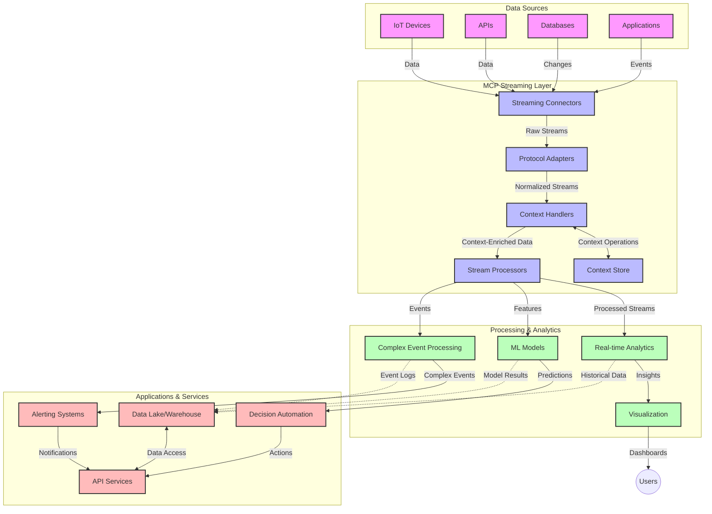

<!--
CO_OP_TRANSLATOR_METADATA:
{
  "original_hash": "195f7287638b77a549acadd96c8f981c",
  "translation_date": "2025-06-13T01:02:18+00:00",
  "source_file": "05-AdvancedTopics/mcp-realtimestreaming/README.md",
  "language_code": "sk"
}
-->
# Protokol Modelového Kontextu pre Prúdové Spracovanie Dát v Reálnom Čase

## Prehľad

Prúdové spracovanie dát v reálnom čase sa stalo nevyhnutným v dnešnom svete orientovanom na dáta, kde podniky a aplikácie potrebujú okamžitý prístup k informáciám na včasné rozhodovanie. Protokol Modelového Kontextu (MCP) predstavuje významný posun v optimalizácii týchto prúdových procesov, zvyšuje efektivitu spracovania dát, zachováva kontextovú integritu a zlepšuje celkový výkon systému.

Tento modul skúma, ako MCP transformuje prúdové spracovanie dát v reálnom čase poskytovaním štandardizovaného prístupu k správe kontextu medzi AI modelmi, prúdovými platformami a aplikáciami.

## Úvod do Prúdového Spracovania Dát v Reálnom Čase

Prúdové spracovanie dát v reálnom čase je technologický koncept, ktorý umožňuje nepretržitý prenos, spracovanie a analýzu dát počas ich generovania, čo umožňuje systémom okamžite reagovať na nové informácie. Na rozdiel od tradičného dávkového spracovania, ktoré pracuje so statickými súbormi dát, prúdové spracovanie spracúva dáta za behu a poskytuje poznatky a akcie s minimálnou latenciou.

### Kľúčové Koncepty Prúdového Spracovania Dát v Reálnom Čase:

- **Neustály Tok Dát**: Dáta sa spracovávajú ako kontinuálny, nikdy nekončiaci tok udalostí alebo záznamov.
- **Nízka Latencia Spracovania**: Systémy sú navrhnuté tak, aby minimalizovali čas medzi generovaním a spracovaním dát.
- **Škálovateľnosť**: Prúdové architektúry musia zvládať variabilné objemy a rýchlosti dát.
- **Odolnosť voči Chybám**: Systémy musia byť schopné odolať poruchám, aby zabezpečili nepretržitý tok dát.
- **Stavové Spracovanie**: Udržiavanie kontextu medzi udalosťami je kľúčové pre zmysluplnú analýzu.

### Protokol Modelového Kontextu a Prúdové Spracovanie

Protokol Modelového Kontextu (MCP) rieši niekoľko zásadných výziev v prostredí prúdového spracovania:

1. **Kontinuita Kontextu**: MCP štandardizuje spôsob, akým sa kontext udržiava naprieč distribuovanými prúdovými komponentmi, zabezpečujúc, že AI modely a spracovateľské uzly majú prístup k relevantnému historickému a environmentálnemu kontextu.

2. **Efektívna Správa Stavov**: Poskytovaním štruktúrovaných mechanizmov pre prenos kontextu MCP znižuje náklady na správu stavov v prúdových pipeline.

3. **Interoperabilita**: MCP vytvára spoločný jazyk pre zdieľanie kontextu medzi rôznymi prúdovými technológiami a AI modelmi, čo umožňuje flexibilnejšie a rozšíriteľnejšie architektúry.

4. **Kontext Optimalizovaný pre Prúdové Spracovanie**: Implementácie MCP môžu uprednostniť tie prvky kontextu, ktoré sú najrelevantnejšie pre rozhodovanie v reálnom čase, optimalizujúc výkon aj presnosť.

5. **Adaptívne Spracovanie**: Vďaka správnemu manažmentu kontextu cez MCP môžu prúdové systémy dynamicky upravovať spracovanie na základe meniaceho sa stavu a vzorcov v dátach.

V moderných aplikáciách, od IoT senzorových sietí po finančné obchodné platformy, integrácia MCP s prúdovými technológiami umožňuje inteligentnejšie, kontextovo uvedomelé spracovanie, ktoré dokáže adekvátne reagovať na komplexné, vyvíjajúce sa situácie v reálnom čase.

## Výukové Ciele

Po absolvovaní tejto lekcie budete schopní:

- Pochopiť základy prúdového spracovania dát v reálnom čase a jeho výzvy
- Vysvetliť, ako Protokol Modelového Kontextu (MCP) zlepšuje prúdové spracovanie dát
- Implementovať riešenia prúdového spracovania založené na MCP pomocou populárnych frameworkov ako Kafka a Pulsar
- Navrhnúť a nasadiť odolné a vysoko výkonné prúdové architektúry s MCP
- Aplikovať koncepty MCP na prípady použitia v IoT, finančnom obchodovaní a analytike riadenej AI
- Hodnotiť nové trendy a budúce inovácie v technológiách prúdového spracovania založených na MCP

### Definícia a Význam

Prúdové spracovanie dát v reálnom čase zahŕňa nepretržitú generáciu, spracovanie a doručovanie dát s minimálnou latenciou. Na rozdiel od dávkového spracovania, kde sa dáta zhromažďujú a spracovávajú v skupinách, prúdové dáta sa spracovávajú priebežne po ich príchode, čo umožňuje okamžité poznatky a reakcie.

Kľúčové vlastnosti prúdového spracovania dát v reálnom čase zahŕňajú:

- **Nízka Latencia**: Spracovanie a analýza dát v priebehu milisekúnd až sekúnd
- **Nepretržitý Tok**: Neustále prúdy dát z rôznych zdrojov
- **Okamžité Spracovanie**: Analýza dát ihneď po ich príchode, nie v dávkach
- **Architektúra Riadená Udalosťami**: Reakcia na udalosti v čase ich výskytu

### Výzvy v Tradičnom Prúdovom Spracovaní

Tradičné prístupy k prúdovému spracovaniu čelia niekoľkým obmedzeniam:

1. **Strata Kontextu**: Ťažkosti s udržiavaním kontextu naprieč distribuovanými systémami
2. **Problémy so Škálovateľnosťou**: Výzvy pri škálovaní na vysoký objem a rýchlosť dát
3. **Zložitosť Integrácie**: Problémy s interoperabilitou medzi rôznymi systémami
4. **Riadenie Latencie**: Vyvažovanie priepustnosti a času spracovania
5. **Konzistencia Dát**: Zabezpečenie presnosti a úplnosti dát v celom toku

## Pochopenie Protokolu Modelového Kontextu (MCP)

### Čo je MCP?

Protokol Modelového Kontextu (MCP) je štandardizovaný komunikačný protokol navrhnutý na efektívnu interakciu medzi AI modelmi a aplikáciami. V kontexte prúdového spracovania dát v reálnom čase poskytuje MCP rámec pre:

- Zachovanie kontextu počas celého dátového pipeline
- Štandardizáciu formátov výmeny dát
- Optimalizáciu prenosu veľkých dátových súborov
- Zlepšenie komunikácie medzi modelmi a medzi modelmi a aplikáciami

### Základné Komponenty a Architektúra

Architektúra MCP pre prúdové spracovanie zahŕňa niekoľko kľúčových komponentov:

1. **Správcovia Kontextu**: Riadia a udržiavajú kontextové informácie v celom prúdovom pipeline
2. **Prúdové Procesory**: Spracovávajú prichádzajúce dátové toky pomocou techník uvedomelých o kontexte
3. **Protokolové Adaptéry**: Konvertujú medzi rôznymi prúdovými protokolmi pri zachovaní kontextu
4. **Úložisko Kontextu**: Efektívne ukladá a načítava kontextové informácie
5. **Prúdové Konektory**: Pripájajú sa k rôznym prúdovým platformám (Kafka, Pulsar, Kinesis a pod.)



### Ako MCP Zlepšuje Spracovanie Dát v Reálnom Čase

MCP rieši tradičné výzvy prúdového spracovania prostredníctvom:

- **Kontextovej Integrality**: Udržiavanie vzťahov medzi dátovými bodmi v celom pipeline
- **Optimalizovaného Prenosu**: Znižovanie redundancie vo výmene dát inteligentným manažmentom kontextu
- **Štandardizovaných Rozhraní**: Poskytovanie konzistentných API pre prúdové komponenty
- **Zníženej Latencie**: Minimalizovanie režijných nákladov spracovania efektívnym spracovaním kontextu
- **Zvýšenej Škálovateľnosti**: Podpora horizontálneho škálovania pri zachovaní kontextu

## Integrácia a Implementácia

Systémy prúdového spracovania dát v reálnom čase vyžadujú dôkladný architektonický návrh a implementáciu na zachovanie výkonu aj kontextovej integrity. Protokol Modelového Kontextu ponúka štandardizovaný prístup k integrácii AI modelov a prúdových technológií, čo umožňuje sofistikovanejšie, kontextovo uvedomelé spracovateľské pipeline.

### Prehľad Integrácie MCP v Prúdových Architektúrach

Implementácia MCP v prostredí prúdového spracovania zahŕňa niekoľko kľúčových aspektov:

1. **Serializácia a Prenos Kontextu**: MCP poskytuje efektívne mechanizmy na kódovanie kontextových informácií v rámci dátových paketov prúdu, zabezpečujúc, že nevyhnutný kontext sprevádza dáta počas celého spracovania. Zahŕňa štandardizované serializačné formáty optimalizované pre prúdový prenos.

2. **Stavové Prúdové Spracovanie**: MCP umožňuje inteligentnejšie stavové spracovanie udržiavaním konzistentnej reprezentácie kontextu naprieč spracovateľskými uzlami. Toto je obzvlášť cenné v distribuovaných prúdových architektúrach, kde je správa stavov tradične náročná.

3. **Čas Udalosti vs. Čas Spracovania**: Implementácie MCP musia riešiť bežnú výzvu rozlíšenia, kedy udalosť nastala a kedy je spracovaná. Protokol môže začleniť časový kontext, ktorý zachováva sémantiku času udalosti.

4. **Riadenie Spätného Tlaku (Backpressure)**: Štandardizáciou správy kontextu MCP pomáha riadiť spätný tlak v prúdových systémoch, umožňujúc komponentom komunikovať svoje spracovateľské kapacity a podľa toho upravovať tok.

5. **Kontextové Okno a Agregácia**: MCP umožňuje sofistikovanejšie operácie okien a agregácií poskytovaním štruktúrovaných reprezentácií časových a vzťahových kontextov, čo umožňuje zmysluplnejšie agregácie naprieč prúdmi udalostí.

6. **Presne Raz Spracovanie (Exactly-Once Processing)**: V prúdových systémoch vyžadujúcich presne raz sémantiku môže MCP zahrnúť spracovateľské metadáta na sledovanie a overovanie stavu spracovania naprieč distribuovanými komponentmi.

Implementácia MCP naprieč rôznymi prúdovými technológiami vytvára jednotný prístup k správe kontextu, znižuje potrebu vlastného integračného kódu a zároveň zvyšuje schopnosť systému udržiavať zmysluplný kontext počas toku dát pipeline.

### MCP v Rôznych Prúdových Frameworkoch

Tieto príklady vychádzajú zo súčasnej špecifikácie MCP, ktorá sa zameriava na protokol založený na JSON-RPC s rôznymi transportnými mechanizmami. Kód demonštruje, ako možno implementovať vlastné transporty, ktoré integrujú prúdové platformy ako Kafka a Pulsar pri zachovaní plnej kompatibility s protokolom MCP.

Príklady ukazujú, ako možno prúdové platformy integrovať s MCP na zabezpečenie spracovania dát v reálnom čase pri zachovaní kontextovej informovanosti, ktorá je pre MCP kľúčová. Tento prístup zabezpečuje, že ukážky kódu presne odrážajú aktuálny stav špecifikácie MCP k júnu 2025.

MCP možno integrovať s populárnymi prúdovými frameworkmi vrátane:

#### Integrácia Apache Kafka

```python
import asyncio
import json
from typing import Dict, Any, Optional
from confluent_kafka import Consumer, Producer, KafkaError
from mcp.client import Client, ClientCapabilities
from mcp.core.message import JsonRpcMessage
from mcp.core.transports import Transport

# Custom transport class to bridge MCP with Kafka
class KafkaMCPTransport(Transport):
    def __init__(self, bootstrap_servers: str, input_topic: str, output_topic: str):
        self.bootstrap_servers = bootstrap_servers
        self.input_topic = input_topic
        self.output_topic = output_topic
        self.producer = Producer({'bootstrap.servers': bootstrap_servers})
        self.consumer = Consumer({
            'bootstrap.servers': bootstrap_servers,
            'group.id': 'mcp-client-group',
            'auto.offset.reset': 'earliest'
        })
        self.message_queue = asyncio.Queue()
        self.running = False
        self.consumer_task = None
        
    async def connect(self):
        """Connect to Kafka and start consuming messages"""
        self.consumer.subscribe([self.input_topic])
        self.running = True
        self.consumer_task = asyncio.create_task(self._consume_messages())
        return self
        
    async def _consume_messages(self):
        """Background task to consume messages from Kafka and queue them for processing"""
        while self.running:
            try:
                msg = self.consumer.poll(1.0)
                if msg is None:
                    await asyncio.sleep(0.1)
                    continue
                
                if msg.error():
                    if msg.error().code() == KafkaError._PARTITION_EOF:
                        continue
                    print(f"Consumer error: {msg.error()}")
                    continue
                
                # Parse the message value as JSON-RPC
                try:
                    message_str = msg.value().decode('utf-8')
                    message_data = json.loads(message_str)
                    mcp_message = JsonRpcMessage.from_dict(message_data)
                    await self.message_queue.put(mcp_message)
                except Exception as e:
                    print(f"Error parsing message: {e}")
            except Exception as e:
                print(f"Error in consumer loop: {e}")
                await asyncio.sleep(1)
    
    async def read(self) -> Optional[JsonRpcMessage]:
        """Read the next message from the queue"""
        try:
            message = await self.message_queue.get()
            return message
        except Exception as e:
            print(f"Error reading message: {e}")
            return None
    
    async def write(self, message: JsonRpcMessage) -> None:
        """Write a message to the Kafka output topic"""
        try:
            message_json = json.dumps(message.to_dict())
            self.producer.produce(
                self.output_topic,
                message_json.encode('utf-8'),
                callback=self._delivery_report
            )
            self.producer.poll(0)  # Trigger callbacks
        except Exception as e:
            print(f"Error writing message: {e}")
    
    def _delivery_report(self, err, msg):
        """Kafka producer delivery callback"""
        if err is not None:
            print(f'Message delivery failed: {err}')
        else:
            print(f'Message delivered to {msg.topic()} [{msg.partition()}]')
    
    async def close(self) -> None:
        """Close the transport"""
        self.running = False
        if self.consumer_task:
            self.consumer_task.cancel()
            try:
                await self.consumer_task
            except asyncio.CancelledError:
                pass
        self.consumer.close()
        self.producer.flush()

# Example usage of the Kafka MCP transport
async def kafka_mcp_example():
    # Create MCP client with Kafka transport
    client = Client(
        {"name": "kafka-mcp-client", "version": "1.0.0"},
        ClientCapabilities({})
    )
    
    # Create and connect the Kafka transport
    transport = KafkaMCPTransport(
        bootstrap_servers="localhost:9092",
        input_topic="mcp-responses",
        output_topic="mcp-requests"
    )
    
    await client.connect(transport)
    
    try:
        # Initialize the MCP session
        await client.initialize()
        
        # Example of executing a tool via MCP
        response = await client.execute_tool(
            "process_data",
            {
                "data": "sample data",
                "metadata": {
                    "source": "sensor-1",
                    "timestamp": "2025-06-12T10:30:00Z"
                }
            }
        )
        
        print(f"Tool execution response: {response}")
        
        # Clean shutdown
        await client.shutdown()
    finally:
        await transport.close()

# Run the example
if __name__ == "__main__":
    asyncio.run(kafka_mcp_example())
```

#### Implementácia Apache Pulsar

```python
import asyncio
import json
import pulsar
from typing import Dict, Any, Optional
from mcp.core.message import JsonRpcMessage
from mcp.core.transports import Transport
from mcp.server import Server, ServerOptions
from mcp.server.tools import Tool, ToolExecutionContext, ToolMetadata

# Create a custom MCP transport that uses Pulsar
class PulsarMCPTransport(Transport):
    def __init__(self, service_url: str, request_topic: str, response_topic: str):
        self.service_url = service_url
        self.request_topic = request_topic
        self.response_topic = response_topic
        self.client = pulsar.Client(service_url)
        self.producer = self.client.create_producer(response_topic)
        self.consumer = self.client.subscribe(
            request_topic,
            "mcp-server-subscription",
            consumer_type=pulsar.ConsumerType.Shared
        )
        self.message_queue = asyncio.Queue()
        self.running = False
        self.consumer_task = None
    
    async def connect(self):
        """Connect to Pulsar and start consuming messages"""
        self.running = True
        self.consumer_task = asyncio.create_task(self._consume_messages())
        return self
    
    async def _consume_messages(self):
        """Background task to consume messages from Pulsar and queue them for processing"""
        while self.running:
            try:
                # Non-blocking receive with timeout
                msg = self.consumer.receive(timeout_millis=500)
                
                # Process the message
                try:
                    message_str = msg.data().decode('utf-8')
                    message_data = json.loads(message_str)
                    mcp_message = JsonRpcMessage.from_dict(message_data)
                    await self.message_queue.put(mcp_message)
                    
                    # Acknowledge the message
                    self.consumer.acknowledge(msg)
                except Exception as e:
                    print(f"Error processing message: {e}")
                    # Negative acknowledge if there was an error
                    self.consumer.negative_acknowledge(msg)
            except Exception as e:
                # Handle timeout or other exceptions
                await asyncio.sleep(0.1)
    
    async def read(self) -> Optional[JsonRpcMessage]:
        """Read the next message from the queue"""
        try:
            message = await self.message_queue.get()
            return message
        except Exception as e:
            print(f"Error reading message: {e}")
            return None
    
    async def write(self, message: JsonRpcMessage) -> None:
        """Write a message to the Pulsar output topic"""
        try:
            message_json = json.dumps(message.to_dict())
            self.producer.send(message_json.encode('utf-8'))
        except Exception as e:
            print(f"Error writing message: {e}")
    
    async def close(self) -> None:
        """Close the transport"""
        self.running = False
        if self.consumer_task:
            self.consumer_task.cancel()
            try:
                await self.consumer_task
            except asyncio.CancelledError:
                pass
        self.consumer.close()
        self.producer.close()
        self.client.close()

# Define a sample MCP tool that processes streaming data
@Tool(
    name="process_streaming_data",
    description="Process streaming data with context preservation",
    metadata=ToolMetadata(
        required_capabilities=["streaming"]
    )
)
async def process_streaming_data(
    ctx: ToolExecutionContext,
    data: str,
    source: str,
    priority: str = "medium"
) -> Dict[str, Any]:
    """
    Process streaming data while preserving context
    
    Args:
        ctx: Tool execution context
        data: The data to process
        source: The source of the data
        priority: Priority level (low, medium, high)
        
    Returns:
        Dict containing processed results and context information
    """
    # Example processing that leverages MCP context
    print(f"Processing data from {source} with priority {priority}")
    
    # Access conversation context from MCP
    conversation_id = ctx.conversation_id if hasattr(ctx, 'conversation_id') else "unknown"
    
    # Return results with enhanced context
    return {
        "processed_data": f"Processed: {data}",
        "context": {
            "conversation_id": conversation_id,
            "source": source,
            "priority": priority,
            "processing_timestamp": ctx.get_current_time_iso()
        }
    }

# Example MCP server implementation using Pulsar transport
async def run_mcp_server_with_pulsar():
    # Create MCP server
    server = Server(
        {"name": "pulsar-mcp-server", "version": "1.0.0"},
        ServerOptions(
            capabilities={"streaming": True}
        )
    )
    
    # Register our tool
    server.register_tool(process_streaming_data)
    
    # Create and connect Pulsar transport
    transport = PulsarMCPTransport(
        service_url="pulsar://localhost:6650",
        request_topic="mcp-requests",
        response_topic="mcp-responses"
    )
    
    try:
        # Start the server with the Pulsar transport
        await server.run(transport)
    finally:
        await transport.close()

# Run the server
if __name__ == "__main__":
    asyncio.run(run_mcp_server_with_pulsar())
```

### Najlepšie Praktiky pre Nasadenie

Pri implementácii MCP pre prúdové spracovanie:

1. **Navrhnite pre Odolnosť voči Chybám**:
   - Implementujte správne spracovanie chýb
   - Používajte dead-letter queue pre správy, ktoré zlyhajú
   - Navrhujte idempotentné procesory

2. **Optimalizujte Výkon**:
   - Konfigurujte vhodné veľkosti bufferov
   - Používajte dávkovanie tam, kde je to vhodné
   - Implementujte mechanizmy spätného tlaku

3. **Monitorujte a Sledujte**:
   - Sledujte metriky spracovania prúdov
   - Monitorujte šírenie kontextu
   - Nastavte upozornenia na anomálie

4. **Zabezpečte Svoje Prúdy**:
   - Implementujte šifrovanie citlivých dát
   - Používajte autentifikáciu a autorizáciu
   - Aplikujte vhodné prístupové kontroly

### MCP v IoT a Edge Computingu

MCP zlepšuje IoT prúdové spracovanie tým, že:

- Zachováva kontext zariadení naprieč spracovateľským pipeline
- Umožňuje efektívne prúdové spracovanie dát z edge do cloudu
- Podporuje analytiku v reálnom čase na IoT dátových tokoch
- Uľahčuje komunikáciu medzi zariadeniami s kontextom

Príklad: Senzorové siete inteligentných miest  
```
Sensors → Edge Gateways → MCP Stream Processors → Real-time Analytics → Automated Responses
```

### Úloha vo Finančných Transakciách a Vysokofrekvenčnom Obchodovaní

MCP prináša významné výhody pre finančné prúdové spracovanie:

- Ultra-nízka latencia spracovania pre obchodné rozhodnutia
- Zachovanie kontextu transakcií počas spracovania
- Podpora komplexného spracovania udalostí s kontextovým uvedomením
- Zabezpečenie konzistencie dát naprieč distribuovanými obchodnými systémami

### Zlepšenie Analytiky Riadené AI

MCP otvára nové možnosti pre prúdovú analytiku:

- Tréning a inferencia modelov v reálnom čase
- Neustále učenie sa z prúdových dát
- Kontextovo uvedomené extrahovanie vlastností
- Pipelines s viacerými modelmi pri zachovaní kontextu

## Budúce Trendy a Inovácie

### Vývoj MCP v Prostredí Reálneho Času

Do budúcnosti očakávame, že MCP bude vyvíjaný tak, aby riešil:

- **Integráciu Kvantového Počítača**: Príprava na kvantové prúdové systémy
- **Edge-Natívne Spracovanie**: Presun viac kontextovo uvedomelého spracovania na edge zariadenia
- **Autonómnu Správu Prúdov**: Samooptimalizujúce sa prúdové pipeline
- **Federované Prúdové Spracovanie**: Distribuované spracovanie pri zachovaní súkromia

### Potenciálne Technologické Pokroky

Nové technológie, ktoré ovplyvnia budúcnosť MCP prúdov:

1. **AI-Optimalizované Prúdové Protokoly**: Vlastné protokoly navrhnuté špeciálne pre AI záťaže
2. **Integrácia Neuromorfných Počítačov**: Mozgom inšpirované spracovanie prúdov
3. **Serverless Prúdové Spracovanie**: Udalosťami riadené, škálovateľné spracovanie bez správy infraštruktúry
4. **Distribuované Úložiská Kontextu**: Globálne distribuovaná, no vysoko konzistentná správa kontextu

## Praktické Cvičenia

### Cvičenie 1: Nastavenie Základného MCP Prúdového Pipeline

V tomto cvičení sa naučíte:
- Konfigurovať základné MCP prúdové prostredie
- Implementovať správcov kontextu pre spracovanie prúdov
- Testovať a overiť zachovanie kontextu

### Cvičenie 2: Vytvorenie Dashboardu Pre Analytiku v

**Vyhlásenie o zodpovednosti**:  
Tento dokument bol preložený pomocou AI prekladateľskej služby [Co-op Translator](https://github.com/Azure/co-op-translator). Aj keď sa snažíme o presnosť, berte prosím na vedomie, že automatizované preklady môžu obsahovať chyby alebo nepresnosti. Originálny dokument v jeho pôvodnom jazyku by mal byť považovaný za autoritatívny zdroj. Pre kritické informácie sa odporúča profesionálny ľudský preklad. Nie sme zodpovední za žiadne nedorozumenia alebo nesprávne interpretácie vyplývajúce z použitia tohto prekladu.