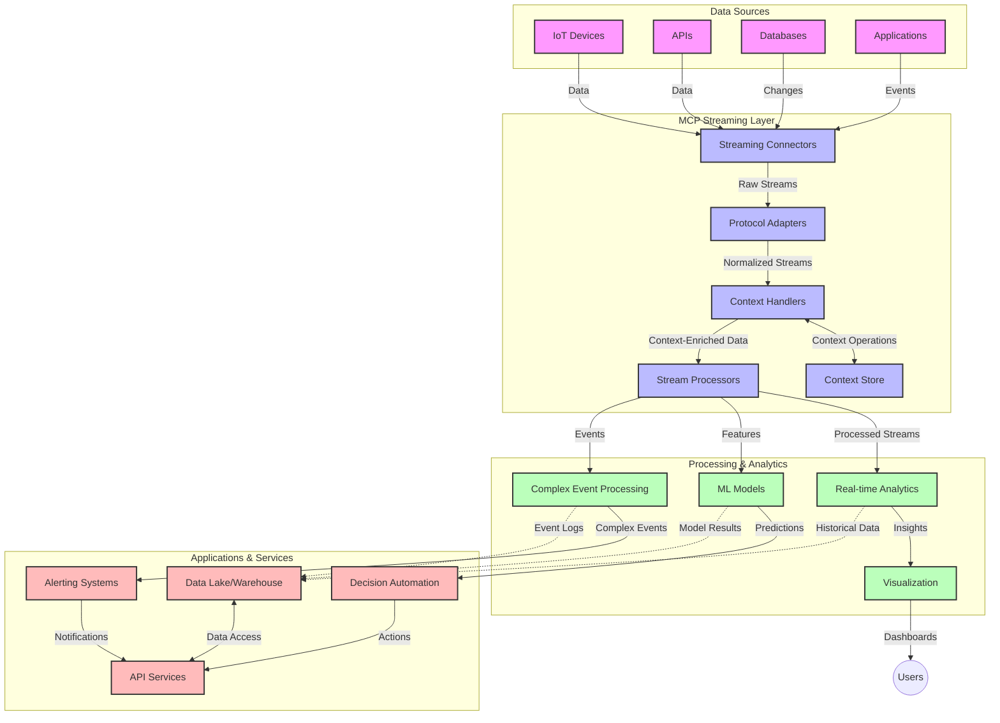

<!--
CO_OP_TRANSLATOR_METADATA:
{
  "original_hash": "68c518dbff8a3b127ed2aa934054c56c",
  "translation_date": "2025-06-11T17:29:19+00:00",
  "source_file": "05-AdvancedTopics/mcp-realtimestreaming/README.md",
  "language_code": "sk"
}
-->
# Model Context Protocol pre prúdové streamovanie dát v reálnom čase

## Prehľad

Prúdové streamovanie dát v reálnom čase je dnes nevyhnutné vo svete orientovanom na dáta, kde podniky a aplikácie potrebujú okamžitý prístup k informáciám na rýchle rozhodovanie. Model Context Protocol (MCP) predstavuje významný pokrok v optimalizácii týchto procesov streamovania v reálnom čase, zlepšuje efektivitu spracovania dát, zachováva kontextuálnu integritu a zvyšuje celkový výkon systému.

Tento modul skúma, ako MCP mení prúdové streamovanie dát v reálnom čase poskytovaním štandardizovaného prístupu k správe kontextu naprieč AI modelmi, streamovacími platformami a aplikáciami.

## Úvod do prúdového streamovania dát v reálnom čase

Prúdové streamovanie dát v reálnom čase je technologický prístup, ktorý umožňuje nepretržitý prenos, spracovanie a analýzu dát hneď, ako sú generované, čo umožňuje systémom okamžite reagovať na nové informácie. Na rozdiel od tradičného dávkového spracovania, ktoré pracuje so statickými dátovými súbormi, streamovanie spracováva dáta v pohybe, poskytujúc poznatky a akcie s minimálnou latenciou.

### Kľúčové pojmy prúdového streamovania dát v reálnom čase:

- **Neprerušený tok dát**: Dáta sa spracovávajú ako neustály, nikdy nekončiaci tok udalostí alebo záznamov.
- **Nízka latencia spracovania**: Systémy sú navrhnuté tak, aby minimalizovali čas medzi generovaním dát a ich spracovaním.
- **Škálovateľnosť**: Streamovacia architektúra musí zvládať variabilné objemy a rýchlosti dát.
- **Odolnosť voči chybám**: Systémy musia byť odolné voči zlyhaniam, aby zabezpečili nepřerušovaný tok dát.
- **Spracovanie so stavom**: Udržiavanie kontextu naprieč udalosťami je kľúčové pre zmysluplnú analýzu.

### Model Context Protocol a prúdové streamovanie v reálnom čase

Model Context Protocol (MCP) rieši niekoľko zásadných výziev v prostredí prúdového streamovania:

1. **Kontextová kontinuita**: MCP štandardizuje spôsob udržiavania kontextu naprieč distribuovanými streamovacími komponentmi, zabezpečujúc, že AI modely a spracovateľské uzly majú prístup k relevantnému historickému a environmentálnemu kontextu.

2. **Efektívna správa stavu**: Poskytovaním štruktúrovaných mechanizmov pre prenos kontextu MCP znižuje režijné náklady správy stavu v streamovacích pipeline.

3. **Interoperabilita**: MCP vytvára spoločný jazyk pre zdieľanie kontextu medzi rôznymi streamovacími technológiami a AI modelmi, umožňujúc flexibilnejšie a rozšíriteľnejšie architektúry.

4. **Optimalizovaný kontext pre streamovanie**: Implementácie MCP môžu uprednostniť, ktoré prvky kontextu sú najrelevantnejšie pre rozhodovanie v reálnom čase, čím optimalizujú výkon aj presnosť.

5. **Adaptívne spracovanie**: Vďaka správnemu manažmentu kontextu cez MCP môžu streamovacie systémy dynamicky upravovať spracovanie podľa meniacich sa podmienok a vzorcov v dátach.

V moderných aplikáciách od IoT senzorových sietí až po finančné obchodné platformy integrácia MCP so streamovacími technológiami umožňuje inteligentnejšie, kontextovo uvedomelé spracovanie, ktoré vie adekvátne reagovať na komplexné a vyvíjajúce sa situácie v reálnom čase.

## Ciele učenia

Na konci tejto lekcie budete schopní:

- Pochopiť základy prúdového streamovania dát v reálnom čase a jeho výzvy
- Vysvetliť, ako Model Context Protocol (MCP) zlepšuje prúdové streamovanie dát v reálnom čase
- Implementovať riešenia streamovania založené na MCP pomocou populárnych frameworkov ako Kafka a Pulsar
- Navrhovať a nasadzovať odolné, vysoko výkonné streamovacie architektúry s MCP
- Aplikovať koncepty MCP v prípadoch použitia IoT, finančného obchodovania a AI-riadenej analytiky
- Hodnotiť vznikajúce trendy a budúce inovácie v technológiách streamovania založených na MCP

### Definícia a význam

Prúdové streamovanie dát v reálnom čase zahŕňa nepretržitú generáciu, spracovanie a doručovanie dát s minimálnou latenciou. Na rozdiel od dávkového spracovania, kde sa dáta zhromažďujú a spracovávajú v skupinách, streamovanie spracováva dáta priebežne, hneď ako prichádzajú, čo umožňuje okamžité poznatky a akcie.

Kľúčové charakteristiky prúdového streamovania dát:

- **Nízka latencia**: Spracovanie a analýza dát v milisekundách až sekundách
- **Neprerušený tok**: Nepretržité toky dát z rôznych zdrojov
- **Okamžité spracovanie**: Analýza dát pri ich príchode, nie v dávkach
- **Architektúra riadená udalosťami**: Reakcia na udalosti v čase, keď nastanú

### Výzvy v tradičnom streamovaní dát

Tradičné prístupy k streamovaniu dát čelia niekoľkým obmedzeniam:

1. **Strata kontextu**: Problémy s udržiavaním kontextu naprieč distribuovanými systémami
2. **Problémy so škálovateľnosťou**: Výzvy pri škálovaní na vysoké objemy a rýchlosti dát
3. **Komplexnosť integrácie**: Problémy s interoperabilitou medzi rôznymi systémami
4. **Manažment latencie**: Vyvažovanie priepustnosti so spracovacím časom
5. **Konzistencia dát**: Zabezpečenie presnosti a úplnosti dát v rámci toku

## Pochopenie Model Context Protocol (MCP)

### Čo je MCP?

Model Context Protocol (MCP) je štandardizovaný komunikačný protokol navrhnutý na efektívnu interakciu medzi AI modelmi a aplikáciami. V kontexte prúdového streamovania dát MCP poskytuje rámec pre:

- Zachovanie kontextu počas celého dátového pipeline
- Štandardizáciu formátov výmeny dát
- Optimalizáciu prenosu veľkých dátových súborov
- Zlepšenie komunikácie model-model a model-aplikácia

### Hlavné komponenty a architektúra

Architektúra MCP pre prúdové streamovanie pozostáva z niekoľkých kľúčových komponentov:

1. **Context Handlers**: Spravujú a udržiavajú kontextuálne informácie naprieč streamovacím pipeline
2. **Stream Processors**: Spracovávajú prichádzajúce dátové toky pomocou techník vedomých kontextu
3. **Protocol Adapters**: Konvertujú medzi rôznymi streamovacími protokolmi pri zachovaní kontextu
4. **Context Store**: Efektívne ukladá a načítava kontextuálne informácie
5. **Streaming Connectors**: Pripájajú sa k rôznym streamovacím platformám (Kafka, Pulsar, Kinesis, atď.)



### Ako MCP zlepšuje spracovanie dát v reálnom čase

MCP rieši tradičné výzvy streamovania cez:

- **Kontextovú integritu**: Udržiavanie vzťahov medzi dátovými bodmi naprieč celým pipeline
- **Optimalizovaný prenos**: Znižovanie redundancie v dátovej výmene inteligentným manažmentom kontextu
- **Štandardizované rozhrania**: Poskytovanie konzistentných API pre streamovacie komponenty
- **Zníženie latencie**: Minimalizovanie režijných nákladov spracovania efektívnym manažmentom kontextu
- **Zvýšená škálovateľnosť**: Podpora horizontálneho škálovania pri zachovaní kontextu

## Integrácia a implementácia

Systémy prúdového streamovania dát v reálnom čase vyžadujú starostlivý architektonický návrh a implementáciu, aby sa zachoval výkon aj kontextuálna integrita. Model Context Protocol ponúka štandardizovaný prístup k integrácii AI modelov a streamovacích technológií, čo umožňuje sofistikovanejšie, kontextovo vedomé spracovateľské pipeline.

### Prehľad integrácie MCP v streamovacích architektúrach

Implementácia MCP v prostredí prúdového streamovania zahŕňa niekoľko dôležitých aspektov:

1. **Serializácia a prenos kontextu**: MCP poskytuje efektívne mechanizmy na kódovanie kontextuálnych informácií v rámci dátových paketov streamu, zabezpečujúc, že podstatný kontext putuje s dátami celým spracovateľským pipeline. To zahŕňa štandardizované formáty serializácie optimalizované pre prenos v streamoch.

2. **Spracovanie so stavom**: MCP umožňuje inteligentnejšie spracovanie so stavom tým, že udržiava konzistentnú reprezentáciu kontextu naprieč spracovateľskými uzlami. Toto je obzvlášť cenné v distribuovaných streamovacích architektúrach, kde je správa stavu tradične náročná.

3. **Čas udalosti vs. čas spracovania**: Implementácie MCP v streamovacích systémoch musia riešiť bežný problém rozlíšenia, kedy sa udalosti stali a kedy sú spracované. Protokol môže obsahovať časový kontext, ktorý zachováva sémantiku času udalosti.

4. **Manažment spätného tlaku (backpressure)**: Štandardizáciou správy kontextu MCP pomáha riadiť spätný tlak v streamovacích systémoch, umožňujúc komponentom komunikovať svoje spracovateľské kapacity a prispôsobovať tok dát.

5. **Oknovanie a agregácia kontextu**: MCP podporuje sofistikovanejšie operácie oknovaní tým, že poskytuje štruktúrované reprezentácie časového a vzťahového kontextu, čo umožňuje zmysluplnejšie agregácie naprieč prúdmi udalostí.

6. **Presne raz spracovanie (exactly-once processing)**: V streamovacích systémoch vyžadujúcich presne raz sémantiku môže MCP začleniť spracovateľské metadáta na sledovanie a overovanie stavu spracovania naprieč distribuovanými komponentmi.

Implementácia MCP v rôznych streamovacích technológiách vytvára jednotný prístup k správe kontextu, znižuje potrebu vlastného integračného kódu a zároveň zlepšuje schopnosť systému udržiavať zmysluplný kontext počas prúdenia dát pipeline.

### MCP v rôznych frameworkoch pre prúdové streamovanie dát

MCP je možné integrovať s populárnymi streamovacími frameworkmi vrátane:

#### Integrácia Apache Kafka

```python
from mcp_streaming import MCPKafkaConnector

# Initialize MCP Kafka connector
connector = MCPKafkaConnector(
    bootstrap_servers='localhost:9092',
    context_preservation=True
)

# Create a context-aware consumer
consumer = connector.create_consumer('input-topic')

# Process streaming data with context
for message in consumer:
    context = message.get_context()
    data = message.get_value()
    
    # Process with context awareness
    result = process_with_context(data, context)
    
    # Produce output with preserved context
    connector.produce('output-topic', result, context=context)
```

#### Implementácia Apache Pulsar

```python
from mcp_streaming import MCPPulsarClient

# Initialize MCP Pulsar client
client = MCPPulsarClient('pulsar://localhost:6650')

# Subscribe with context awareness
consumer = client.subscribe('input-topic', 'subscription-name', 
                           context_enabled=True)

# Process messages with context preservation
while True:
    message = consumer.receive()
    context = message.get_context()
    
    # Process with context
    result = process_with_context(message.data(), context)
    
    # Acknowledge the message
    consumer.acknowledge(message)
    
    # Send result with preserved context
    producer = client.create_producer('output-topic')
    producer.send(result, context=context)
```

### Najlepšie postupy pre nasadenie

Pri implementácii MCP pre prúdové streamovanie:

1. **Navrhujte pre odolnosť voči chybám**:
   - Implementujte správne spracovanie chýb
   - Používajte dead-letter queues pre neúspešné správy
   - Navrhujte idempotentné procesory

2. **Optimalizujte výkon**:
   - Konfigurujte vhodné veľkosti bufferov
   - Používajte dávkovanie tam, kde je to vhodné
   - Implementujte mechanizmy spätného tlaku

3. **Monitorujte a sledujte**:
   - Sledujte metriky spracovania streamu
   - Monitorujte šírenie kontextu
   - Nastavte upozornenia na anomálie

4. **Zabezpečte svoje streamy**:
   - Implementujte šifrovanie pre citlivé dáta
   - Používajte autentifikáciu a autorizáciu
   - Aplikujte správne prístupové kontroly

### MCP v IoT a edge computingu

MCP zlepšuje streamovanie IoT tým, že:

- Zachováva kontext zariadení naprieč spracovateľským pipeline
- Umožňuje efektívne streamovanie dát z edge do cloudu
- Podporuje analýzy v reálnom čase na IoT dátových tokoch
- Uľahčuje komunikáciu zariadenie-zariadenie s kontextom

Príklad: Siete senzorov inteligentného mesta  
```
Sensors → Edge Gateways → MCP Stream Processors → Real-time Analytics → Automated Responses
```

### Úloha vo finančných transakciách a vysokofrekvenčnom obchodovaní

MCP prináša významné výhody pre streamovanie finančných dát:

- Extrémne nízke latencie spracovania pre obchodné rozhodnutia
- Udržiavanie kontextu transakcií počas spracovania
- Podpora komplexného spracovania udalostí s kontextovým uvedomením
- Zabezpečenie konzistencie dát naprieč distribuovanými obchodnými systémami

### Zlepšenie AI-riadenej dátovej analytiky

MCP otvára nové možnosti pre streamovaciu analytiku:

- Tréning a inferencia modelov v reálnom čase
- Neustále učenie zo streamovaných dát
- Kontextovo vedomá extrakcia vlastností
- Pipeline s viacerými modelmi a zachovaným kontextom

## Budúce trendy a inovácie

### Vývoj MCP v prostrediach reálneho času

Do budúcnosti očakávame, že MCP bude reagovať na:

- **Integráciu kvantových počítačov**: Príprava na kvantové streamovacie systémy
- **Edge-native spracovanie**: Presun viac kontextovo vedomého spracovania na edge zariadenia
- **Autonómne riadenie streamov**: Samooptimalizujúce sa streamovacie pipeline
- **Federované streamovanie**: Distribuované spracovanie pri zachovaní súkromia

### Potenciálne technologické pokroky

Vznikajúce technológie, ktoré ovplyvnia budúcnosť MCP streamovania:

1. **AI-optimalizované streamovacie protokoly**: Špeciálne protokoly navrhnuté pre AI pracovné zaťaženia
2. **Integrácia neuromorfných počítačov**: Mozgom inšpirované počítače pre spracovanie streamov
3. **Serverless streamovanie**: Event-driven, škálovateľné streamovanie bez správy infraštruktúry
4. **Distribuované úložiská kontextu**: Globálne distribuované, no vysoko konzistentné spravovanie kontextu

## Praktické cvičenia

### Cvičenie 1: Nastavenie základného MCP streamovacieho pipeline

V tomto cvičení sa naučíte:

- Konfigurovať základné MCP streamovacie prostredie
- Implementovať context handlery pre spracovanie streamu
- Testovať a overiť zachovanie kontextu

### Cvičenie 2: Vytvorenie dashboardu pre analýzu v reálnom čase

Vytvorte kompletnú aplikáciu, ktorá:

- Prijíma streamované dáta pomocou MCP
- Spracováva tok pri zachovaní kontextu
- Vizualizuje výsledky v reálnom čase

### Cvičenie 3: Implementácia komplexného spracovania udalostí s MCP

Pokročilé cvičenie pokrývajúce:

- Detekciu vzorcov v prúdoch
- Kontextovú koreláciu naprieč viacerými tokmi
- Generovanie komplexných udalostí so zachovaným kontextom

## Ďalšie zdroje

- [Model Context Protocol Specification](https://github.com/microsoft/model-context-protocol) - Oficiálna špecifikácia a dokumentácia MCP
- [Apache Kafka Documentation](https://kafka.apache.org/documentation/) - Naučte sa o Kafka pre spracovanie streamov
- [Apache Pulsar](https://pulsar.apache.org/) - Jednotná messaging a streamovacia platforma
- [Streaming Systems: The What, Where, When, and How of Large-Scale Data Processing](https://www.oreilly.com/library/view/streaming-systems/9781491983867/) - Komplexná kniha o streamovacích architektúrach
- [Microsoft Azure Event Hubs](https://learn.microsoft.com/en-us/azure/event-hubs/event-hubs-about) - Spravovaná služ

**Vyhlásenie o zodpovednosti**:  
Tento dokument bol preložený pomocou AI prekladateľskej služby [Co-op Translator](https://github.com/Azure/co-op-translator). Aj keď sa snažíme o presnosť, majte prosím na pamäti, že automatické preklady môžu obsahovať chyby alebo nepresnosti. Originálny dokument v jeho pôvodnom jazyku by mal byť považovaný za autoritatívny zdroj. Pre dôležité informácie sa odporúča profesionálny ľudský preklad. Nie sme zodpovední za akékoľvek nedorozumenia alebo nesprávne interpretácie vyplývajúce z použitia tohto prekladu.